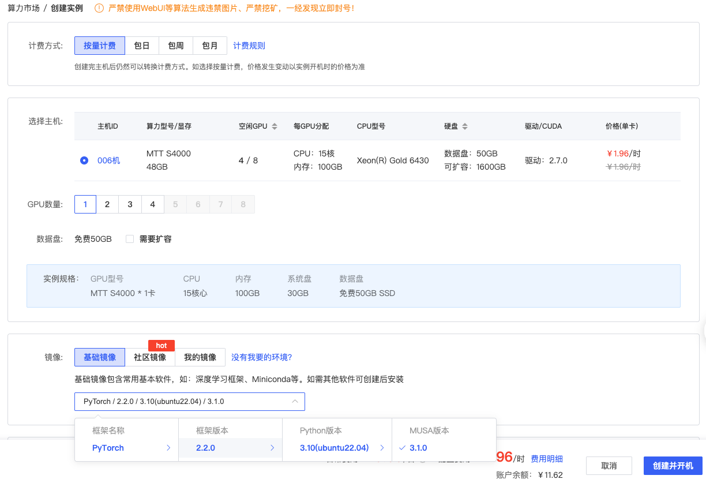

# AutoDL MTT S4000 部署大模型：vLLM-MUSA 编译、模型服务与性能测试


最近在 AutoDL 上租了一张摩尔线程 MTT S4000 48GB的GPU卡，顺手把 vLLM-MUSA 的安装过程记了下来。AutoDL 给到的实例本身就是容器，所以没必要再套一层 Docker，直接在当前环境里编译就行。后面还会用 ModelScope 下载一个小模型，部署模型服务，再跑一轮 Benchmark。

下面的命令都在这张卡上实际跑过。MUSA 的版本依赖比较严格，最好按顺序来，尤其不要随手升级 Torch。

## 一、我用的环境

创建实例时选择 MTT S4000 48GB，基础镜像使用 `PyTorch 2.2.0 / Python 3.10 / MUSA 3.1.0`：



| 组件 | 版本或配置 |
|---|---|
| GPU | 1 × MTT S4000 48GB |
| 操作系统 | Ubuntu 22.04 x86_64 |
| Python | 3.10 |
| 驱动 | 2.7.0 |
| MUSA Toolkit | 3.1.0 |
| PyTorch | 2.2.0 摩尔线程定制版 |
| Torch-MUSA | 1.3.0+81caf0a |
| vLLM-MUSA | 0.4.2+musa |
| Transformers | 4.40.2 |
| Ray | 2.9.3 |
| Triton | 2.2.0 |
| 模型 | Qwen2.5-0.5B-Instruct |

AutoDL 这个 S4000 镜像预装的是 Driver 2.7、MUSA 3.1 和 PyTorch 2.2，后面的安装都沿用这组版本。不要往里面装 S5000、MUSA 5.x 或 PyTorch 2.9 的包，版本对不上时 `torch_musa` 会直接导入失败。

这里有个绕不开的限制：`mthreads-gmi` 看到的 Driver 2.7.0 来自 AutoDL 的物理宿主机，不是容器里的普通软件包。容器里虽然是 `root`，但换不了宿主机的 `mtgpu` 内核模块，也没法重启物理服务器。因此别在这里硬装 Driver 5.x、MUSA Toolkit 5.x 或 Torch-MUSA 2.9。用户态库升了、宿主机驱动没升，最后往往是新环境没装成，旧环境也不能用了。

Qwen3.5 需要新版摩尔线程驱动和配套软件栈。如果有云平台提供 S4000 + 最新驱动的实例，欢迎评论告诉我，我租一台继续测试。眼前这套 Driver 2.7 环境用 Qwen2.5 更合适。

## 二、先看看原始环境

### 2.1 GPU、驱动和 Toolkit

```bash
mthreads-gmi
musa_version_query
command -v mcc
mcc --version
```

我这台机器的关键信息是：

```text
Name: MTT S4000
Driver Version: 2.7.0
musa_toolkits: 3.1.0
/usr/local/musa/bin/mcc
```

如果你看到的版本和这里差得比较大，后面的包版本也要跟着调整，不能直接照搬。

### 2.2 先确认原装 Torch-MUSA 还能用

先确认当前 Python：

```bash
command -v python
python --version
```

这里用的是：

```text
/root/miniconda3/bin/python
Python 3.10.x
```

运行 MUSA 矩阵乘法：

```bash
python - <<'PY'
import torch
import torch_musa

print("Torch:", torch.__version__)
print("Torch 路径:", torch.__file__)
print("Torch-MUSA:", torch_musa.__version__)
print("MUSA 可用:", torch.musa.is_available())
print("GPU:", torch.musa.get_device_name(0))

x = torch.randn(256, 256, device="musa", dtype=torch.float16)
y = x @ x
print("矩阵乘:", y.shape, y.dtype, y.device)
PY
```

我的输出如下：

```text
Torch: 2.2.0
Torch 路径: /root/miniconda3/lib/python3.10/site-packages/torch/__init__.py
Torch-MUSA: 1.3.0+81caf0a
MUSA 可用: True
GPU: MTT S4000
矩阵乘: torch.Size([256, 256]) torch.float16 musa:0
```

下面几种输出说明基础环境已经被改坏了：

```text
torch 2.2.0+cu121
libmusa_kernels.so: undefined symbol
ModuleNotFoundError: No module named 'torch'
```

最常见的原因是装了公开 PyPI 的 `torch==2.2.0`。那个包是 NVIDIA CUDA 构建，和镜像自带的摩尔线程版本不是一回事。遇到这种情况，重置实例通常比继续修包省时间。

## 三、拉取 vLLM-MUSA 源码

下面假设 `/root/vLLM_musa` 还不存在：

```bash
cd /root

git clone \
  --branch main \
  --single-branch \
  https://github.com/MooreThreads/vLLM_musa.git

cd /root/vLLM_musa
git branch --show-current
git log -1 --oneline
```

我测试时，`main` 正好指向 `5b191fb`：

```shell
# git log -1 --oneline
5b191fb (HEAD -> main, origin/main) update deps version (#2)
```

直接使用 `main` 就能跑。这里记下提交号，只是方便以后对照；如果哪天 `main` 更新了，想复现这次的环境，再切回这个提交即可。

仓库里虽然有现成脚本，但这里不要执行：

```bash
bash build_musa.sh
```

脚本会继续安装 `requirements-build.txt` 和 `requirements-musa.txt`。这两个文件都写了 `torch==2.2.0`，pip 很可能去公共源下载 CUDA 版，然后覆盖原装的 MUSA Torch。

## 四、单独建一个 Python 环境

### 4.1 创建虚拟环境

用 Miniconda 建一个虚拟环境，同时继承镜像里已经装好的 Torch-MUSA：

```bash
mkdir -p /root/venvs

/root/miniconda3/bin/python -m venv \
  --system-site-packages \
  /root/venvs/vllm-musa

source /root/venvs/vllm-musa/bin/activate

command -v python
```

此时 `python` 应该指向：

```text
/root/venvs/vllm-musa/bin/python
```

重新登录服务器后，记得先激活它：

```bash
source /root/venvs/vllm-musa/bin/activate
```

### 4.2 把几个关键版本锁住

constraints 的作用很简单：普通依赖照常解析，但 Torch、Transformers、Ray 和 Triton 不要乱升级。

```bash
cat >/root/vllm-musa-constraints.txt <<'EOF'
torch==2.2.0a0+git8ac9b20
transformers==4.40.2
tokenizers==0.19.1
ray==2.9.3
triton==2.2.0
EOF
```

### 4.3 安装依赖

```bash
cd /root/vLLM_musa

python -m pip install \
  -r requirements-common.txt \
  ray==2.9.3 \
  triton==2.2.0 \
  -c /root/vllm-musa-constraints.txt
```

`requirements-build.txt` 和 `requirements-musa.txt` 不用再装。

装完先让 pip 自查一下：

```bash
python -m pip check
```

没有冲突时会显示：

```text
No broken requirements found.
```

然后再跑一次 MUSA，并顺便把关键版本打印出来：

```bash
python - <<'PY'
import torch
import torch_musa
import transformers
import ray
import triton

print("Torch:", torch.__version__, torch.__file__)
print("Torch-MUSA:", torch_musa.__version__)
print("Transformers:", transformers.__version__)
print("Ray:", ray.__version__)
print("Triton:", triton.__version__)
print("MUSA:", torch.musa.is_available())

x = torch.randn(256, 256, device="musa", dtype=torch.float16)
print("矩阵乘:", (x @ x).shape)
PY
```

我这里得到的是：

```text
Torch: 2.2.0 /root/miniconda3/lib/python3.10/site-packages/torch/__init__.py
Torch-MUSA: 1.3.0+81caf0a
Transformers: 4.40.2
Ray: 2.9.3
Triton: 2.2.0
MUSA: True
矩阵乘: torch.Size([256, 256])
```

## 五、开始编译

进入源码目录，设好编译参数：

```bash
cd /root/vLLM_musa
source /root/venvs/vllm-musa/bin/activate

export LD_PRELOAD=/usr/lib/x86_64-linux-gnu/libstdc++.so.6
export VLLM_TARGET_DEVICE=musa
export CMAKE_BUILD_TYPE=Release
export VERBOSE=1
export VLLM_ATTENTION_BACKEND=FLASH_ATTN
export MAX_JOBS=15

python setup.py bdist_wheel
```

编译日志里会有不少 `warning`，不必看到黄色文字就停。最后没有 `error` 或 `Traceback`，而且 `dist` 目录里有 wheel，就算编完了：

```bash
# ls -lh /root/vLLM_musa/dist/*.whl
-rw-r--r-- 1 root root 2.1M Jul 20 11:47 /root/vLLM_musa/dist/vllm-0.4.2+musa-cp310-cp310-linux_x86_64.whl
```

文件名是：

```text
vllm-0.4.2+musa-cp310-cp310-linux_x86_64.whl
```

安装这个 wheel。这里加 `--no-deps`，避免 pip 又去动刚才配好的依赖：

```bash
python -m pip install \
  /root/vLLM_musa/dist/vllm-0.4.2+musa-cp310-cp310-linux_x86_64.whl \
  --no-deps
```

最后导入一下 vLLM 和自定义算子：

```bash
python - <<'PY'
import torch
import torch_musa
import vllm
import vllm_C

print("vLLM:", vllm.__version__)
print("自定义算子:", vllm_C.__file__)
print("MUSA:", torch.musa.is_available())
print("GPU:", torch.musa.get_device_name(0))
PY
```

我的输出是：

```text
vLLM: 0.4.2
自定义算子: /root/venvs/vllm-musa/lib/python3.10/site-packages/vllm_C.cpython-310-x86_64-linux-gnu.so
MUSA: True
GPU: MTT S4000
```

## 六、从 ModelScope 下载模型

安装 ModelScope：

```bash
python -m pip install \
  modelscope==1.15.0 \
  -c /root/vllm-musa-constraints.txt
```

我用 Python API 下载，省得再处理 CLI 的额外依赖：

```bash
mkdir -p /root/autodl-tmp

python - <<'PY'
from modelscope.hub.snapshot_download import snapshot_download

path = snapshot_download(
    "Qwen/Qwen2.5-0.5B-Instruct",
    local_dir="/root/autodl-tmp/Qwen2.5-0.5B-Instruct",
)

print("模型目录:", path)
PY
```

下载完看一下 `config.json` 是否存在：

```bash
test -f /root/autodl-tmp/Qwen2.5-0.5B-Instruct/config.json \
  && echo "模型下载成功"
```

## 七、部署 Qwen2.5 模型服务

这里明确指定 FP16。S4000 硬件支持 BF16，但这版 vLLM-MUSA 的 BF16 路径有兼容和数值正确性问题，`--dtype auto` 也可能跟着模型配置选到 BF16。

```bash
cd /root/vLLM_musa
source /root/venvs/vllm-musa/bin/activate

export LD_PRELOAD=/usr/lib/x86_64-linux-gnu/libstdc++.so.6
export MUSA_VISIBLE_DEVICES=0
export VLLM_TARGET_DEVICE=musa
export VLLM_ATTENTION_BACKEND=FLASH_ATTN

nohup python -m vllm.entrypoints.openai.api_server \
  --model /root/autodl-tmp/Qwen2.5-0.5B-Instruct \
  --served-model-name Qwen2.5-0.5B-Instruct \
  --device musa \
  --dtype float16 \
  --enforce-eager \
  --max-model-len 2048 \
  --gpu-memory-utilization 0.8 \
  --host 0.0.0.0 \
  --port 8000 \
  > /root/autodl-tmp/vllm-server.log 2>&1 &

echo "服务进程 PID: $!"
```

第一次启动会分配 KV Cache，等一两分钟很正常。日志这样看：

```bash
tail -f /root/autodl-tmp/vllm-server.log
```

看到下面这行，服务就起来了：

```text
Uvicorn running on http://0.0.0.0:8000
```

这时按 `Ctrl+C` 退出 `tail` 即可，不会停掉后台服务。

### 停止和重新启动

先查看服务进程：

```bash
ps -ef | grep '[v]llm.entrypoints.openai.api_server'
```

把 `<PID>` 换成查到的进程号即可停止服务：

```bash
kill <PID>
```

重新启动时不需要再次安装或编译，重新执行本节前面的启动命令即可。

## 八、发一个请求试试

### 8.1 先看8000端口

`ss` 命令由 `iproute2` 软件包提供。镜像里没有这个命令时，先安装：

```bash
apt-get update
apt-get install -y iproute2
```

检查 8000 端口是否正在监听：

```bash
ss -lntp | grep ':8000'
```

正常情况下会看到 `LISTEN`、`0.0.0.0:8000` 和对应的 Python 进程。没有任何输出，说明服务没有监听 8000 端口，可以检查启动日志：

```bash
tail -n 100 /root/autodl-tmp/vllm-server.log
```

最后再请求一次健康检查，确认服务能够响应：

```bash
curl -i http://127.0.0.1:8000/health
```

### 8.2 调一次 Chat Completions

```bash
curl http://127.0.0.1:8000/v1/chat/completions \
  -H 'Content-Type: application/json' \
  -d '{
    "model": "Qwen2.5-0.5B-Instruct",
    "messages": [
      {"role": "user", "content": "你好，请用一句话介绍摩尔线程。"}
    ],
    "max_tokens": 64,
    "temperature": 0
  }'
```

返回的 JSON 里能看到 `choices` 和生成文本，说明模型、vLLM 和接口都通了。

## 九、跑 Benchmark

仓库自带了 `benchmark_serving.py`，可以直接压刚才启动的服务。

### 9.1 补一个 aiohttp

脚本会导入 `aiohttp`，而 `requirements-common.txt` 没写这个包，手动补上：

```bash
source /root/venvs/vllm-musa/bin/activate

python -m pip install \
  aiohttp \
  -c /root/vllm-musa-constraints.txt
```

### 9.2 先跑10个请求

测试文本直接用仓库里的 `benchmarks/sonnet.txt`：

```bash
cd /root/vLLM_musa
source /root/venvs/vllm-musa/bin/activate

mkdir -p /root/autodl-tmp/benchmark-results

export LD_PRELOAD=/usr/lib/x86_64-linux-gnu/libstdc++.so.6

python benchmarks/benchmark_serving.py \
  --backend vllm \
  --base-url http://127.0.0.1:8000 \
  --endpoint /v1/completions \
  --dataset-name sonnet \
  --dataset-path /root/vLLM_musa/benchmarks/sonnet.txt \
  --model Qwen2.5-0.5B-Instruct \
  --tokenizer /root/autodl-tmp/Qwen2.5-0.5B-Instruct \
  --num-prompts 10 \
  --sonnet-input-len 256 \
  --sonnet-output-len 64 \
  --sonnet-prefix-len 100 \
  --request-rate inf \
  --save-result \
  --result-dir /root/autodl-tmp/benchmark-results
```

`--request-rate inf` 会尽快把10个请求一起发出去，可以观察连续批处理时的吞吐。

### 9.3 我跑出来的结果

```text
Successful requests:               10
Benchmark duration:                1.40 s
Request throughput:                7.13 req/s
Input token throughput:            1761.86 tok/s
Output token throughput:           302.32 tok/s
Mean TTFT:                         110.76 ms
Median TTFT:                       104.33 ms
P99 TTFT:                          137.02 ms
Mean TPOT:                         23.94 ms
Median TPOT:                       21.21 ms
P99 TPOT:                          36.92 ms
```

这些指标分别表示：

| 指标 | 含义 | 本次结果 |
|---|---|---:|
| Successful requests | 成功完成的请求数 | 10 |
| Benchmark duration | 整轮测试花费的时间 | 1.40 秒 |
| Request throughput | 服务每秒完成的请求数 | 7.13 req/s |
| Input token throughput | 服务每秒处理的输入 Token 总数 | 1761.86 tok/s |
| Output token throughput | 服务每秒生成的输出 Token 总数，也就是聚合 TPS | 302.32 tok/s |
| Mean TTFT | 请求发出到收到第一个 Token 的平均时间 | 110.76 ms |
| Median TTFT | 一半请求的首 Token 延迟不超过这个值 | 104.33 ms |
| P99 TTFT | 约 99% 请求的首 Token 延迟不超过这个值 | 137.02 ms |
| Mean TPOT | 生成阶段每个输出 Token 的平均耗时 | 23.94 ms/token |
| Median TPOT | TPOT 的中位数 | 21.21 ms/token |
| P99 TPOT | 约 99% Token 的生成间隔不超过这个值 | 36.92 ms/token |

看整张卡在这轮并发测试中的总生成能力，用 `Output token throughput`：

```text
聚合 TPS = 302.32 Token/s
```

看单个请求的平均生成速度，可以用 Mean TPOT 粗略换算：

```text
单请求生成速度 ≈ 1000 ÷ Mean TPOT
                 ≈ 1000 ÷ 23.94
                 ≈ 41.8 Token/s
```

`302.32 Token/s` 和 `41.8 Token/s` 不是一回事。前者是多个并发请求加在一起的总吞吐，后者是单个请求在生成阶段的平均速度。

这次只发了10个请求，整轮测试也只有1.4秒，适合检查流程是否跑通，不能当成正式性能结论。尤其是 P99，样本只有10个时参考价值不大。需要认真比较性能时，可以把请求数增加到100或1000，并分别测试不同的请求速率、输入长度和输出长度。

原始结果在这里：

```bash
ls -lh /root/autodl-tmp/benchmark-results
```

想加压，把 `--num-prompts 10` 改成 `100` 再跑一次。看结果时别只盯着请求数，TTFT、TPOT、输出吞吐和成功率要放在一起看。

## 十、踩过的几个坑

### 10.1 `libmusa_kernels.so: undefined symbol`

一般是摩尔线程定制版 Torch 被公共 PyPI 的 CUDA Torch 覆盖了。

先看当前到底导入了哪个 Torch：

```bash
python - <<'PY'
import torch
print(torch.__version__)
print(torch.__file__)
PY
```

如果显示 `2.2.0+cu121`，重置AutoDL实例通常最省事。别再执行 `pip install torch==2.2.0`，那会重复安装同一个CUDA包。

### 10.2 `GLIBCXX_3.4.30 not found`

这是Conda自带的 `libstdc++.so.6` 太旧。

换成系统库：

```bash
export LD_PRELOAD=/usr/lib/x86_64-linux-gnu/libstdc++.so.6
```

编译、启动服务和运行 Benchmark 时都可以保留该环境变量。

### 10.3 BF16 启动报 `Invalid device id`

S4000 硬件支持 BF16，但当前 `main` 分支编译出的 vLLM-MUSA 0.4.2 在 BF16 能力检查中错误调用 CUDA API。绕过检查后，实测完整推理还可能输出重复的无意义 token。因此当前组合应使用：

```bash
--dtype float16
```

### 10.4 `No module named aiohttp`

Benchmark少了 `aiohttp`，补装即可：

```bash
source /root/venvs/vllm-musa/bin/activate
python -m pip install aiohttp -c /root/vllm-musa-constraints.txt
```

### 10.5 服务没响应

依次看进程、日志和GPU：

```bash
ps -ef | grep '[v]llm.entrypoints.openai.api_server'
tail -n 150 /root/autodl-tmp/vllm-server.log
mthreads-gmi
```

## 参考资料

- [MooreThreads/vLLM_musa](https://github.com/MooreThreads/vLLM_musa)
- [摩尔线程 MTT Benchmarks 文档](https://docs.mthreads.com/mtt/mtt-doc-online/benchmarks/)
- [MTT S4000 产品规格](https://docs.mthreads.com/s4000/s4000-doc-online/product_specifications/)
