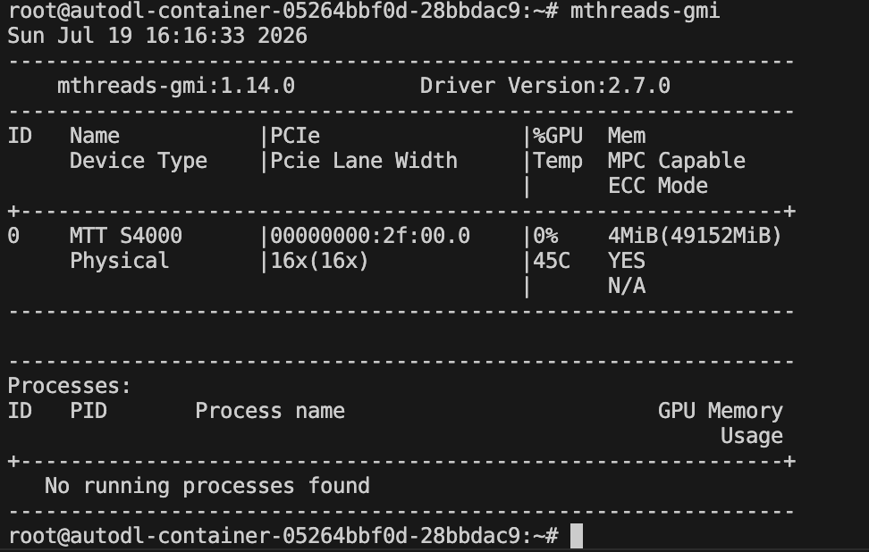
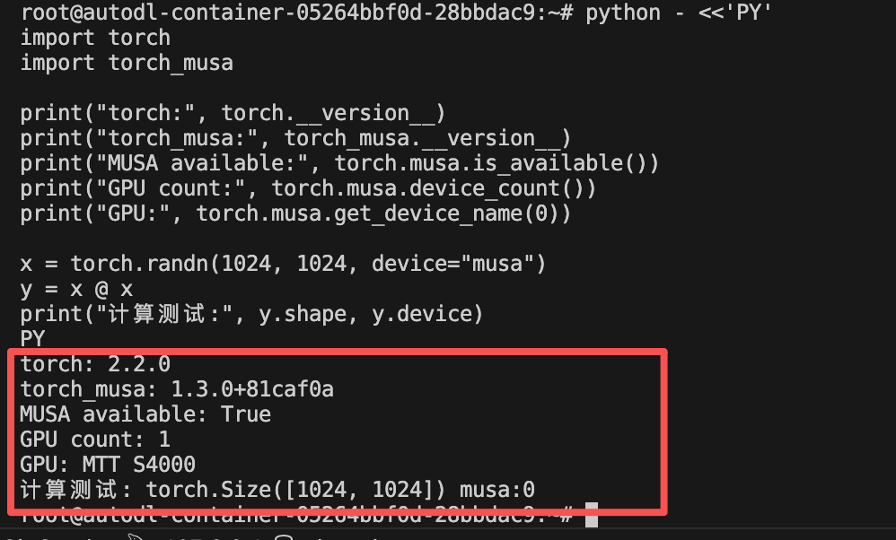

# AutoDL MTT S4000 部署 vLLM-MUSA 与 Benchmarks 实战

本文记录如何在 AutoDL 的 MTT S4000 实例上，不使用 Docker，编译安装 vLLM-MUSA、通过 ModelScope 下载模型、启动 OpenAI 兼容 API，并完成在线 Benchmarks 性能测试。

本文所有关键步骤均在一张 MTT S4000 48GB 上实际验证。

## 零基础快速部署

如果你只想先把服务运行起来，可以严格按照本节操作。每个代码框执行完且没有报错，再执行下一个。命令前面的说明文字不要复制。

### 第 0 步：确认当前是正确的 S4000 镜像

```bash
mthreads-gmi
musa_version_query
command -v python
```

应当看到以下关键信息：

```text
GPU：MTT S4000
Driver Version：2.7.0
MUSA Toolkit：3.1.0
Python：/root/miniconda3/bin/python
```

接着验证镜像自带的 Torch-MUSA：

```bash
python - <<'PY'
import torch
import torch_musa

print("Torch:", torch.__version__)
print("Torch 路径:", torch.__file__)
print("Torch-MUSA:", torch_musa.__version__)
print("MUSA 可用:", torch.musa.is_available())
print("GPU:", torch.musa.get_device_name(0))

x = torch.randn(256, 256, device="musa", dtype=torch.float16)
print("矩阵乘测试:", (x @ x).shape)
PY
```

必须看到：

```text
MUSA 可用: True
GPU: MTT S4000
矩阵乘测试: torch.Size([256, 256])
```

如果这里已经报错，特别是 Torch 显示为 `2.2.0+cu121`，不要继续安装。说明环境中的摩尔线程定制版 Torch 已被覆盖，应先重置 AutoDL 实例。

### 第 1 步：下载固定版本的 vLLM-MUSA

以下命令假设 `/root/vLLM_musa` 还不存在：

```bash
cd /root

git clone \
  --branch main \
  --single-branch \
  https://github.com/MooreThreads/vLLM_musa.git

cd /root/vLLM_musa

git switch -c legacy-v0.4.2 \
  5b191fb9840e276101d151482b5a871c72effbc0

git log -1 --oneline
```

最后一条命令应显示以 `5b191fb` 开头的提交。

### 第 2 步：创建专用 Python 环境

不要直接修改 AutoDL 的 Miniconda 基础环境。创建一个继承原装 Torch-MUSA 的专用环境：

```bash
mkdir -p /root/venvs

/root/miniconda3/bin/python -m venv \
  --system-site-packages \
  /root/venvs/vllm-musa

source /root/venvs/vllm-musa/bin/activate

command -v python
```

预期输出：

```text
/root/venvs/vllm-musa/bin/python
```

以后重新登录服务器，都要先执行：

```bash
source /root/venvs/vllm-musa/bin/activate
```

### 第 3 步：锁定依赖版本

创建版本约束文件，保护摩尔线程定制版 Torch：

```bash
cat >/root/vllm-musa-constraints.txt <<'EOF'
torch==2.2.0a0+git8ac9b20
transformers==4.40.2
tokenizers==0.19.1
ray==2.9.3
triton==2.2.0
EOF
```

安装经过实测的依赖组合：

```bash
cd /root/vLLM_musa

python -m pip install \
  -r requirements-common.txt \
  ray==2.9.3 \
  triton==2.2.0 \
  -c /root/vllm-musa-constraints.txt
```

检查依赖是否完整：

```bash
python -m pip check
```

正常输出：

```text
No broken requirements found.
```

再次检查 Torch 没有被覆盖：

```bash
python - <<'PY'
import torch
import torch_musa
import transformers
import ray
import triton

print("Torch:", torch.__version__)
print("Torch-MUSA:", torch_musa.__version__)
print("Transformers:", transformers.__version__)
print("Ray:", ray.__version__)
print("Triton:", triton.__version__)
print("MUSA:", torch.musa.is_available())

x = torch.randn(256, 256, device="musa", dtype=torch.float16)
print("矩阵乘测试:", (x @ x).shape)
PY
```

如果 Torch 变成 `+cu121`，立即停止，不要编译。

### 第 4 步：编译 vLLM-MUSA

```bash
cd /root/vLLM_musa

source /root/venvs/vllm-musa/bin/activate

export LD_PRELOAD=/usr/lib/x86_64-linux-gnu/libstdc++.so.6
export VLLM_TARGET_DEVICE=musa
export CMAKE_BUILD_TYPE=Release
export VERBOSE=1
export VLLM_ATTENTION_BACKEND=FLASH_ATTN
export MAX_JOBS=15

python setup.py bdist_wheel
```

编译期间会出现一些 `warning`，只要最后生成 wheel 且没有 `error` 或 `Traceback`，就表示编译成功。检查文件：

```bash
ls -lh /root/vLLM_musa/dist/*.whl
```

安装刚编译的 wheel：

```bash
python -m pip install \
  /root/vLLM_musa/dist/vllm-0.4.2+musa-cp310-cp310-linux_x86_64.whl \
  --no-deps
```

验证 vLLM 和自定义算子：

```bash
python - <<'PY'
import vllm
import vllm_C
import torch
import torch_musa

print("vLLM:", vllm.__version__)
print("自定义算子:", vllm_C.__file__)
print("GPU:", torch.musa.get_device_name(0))
PY
```

### 第 5 步：通过 ModelScope 下载模型

```bash
python -m pip install \
  modelscope==1.15.0 \
  -c /root/vllm-musa-constraints.txt
```

```bash
mkdir -p /root/autodl-tmp

python - <<'PY'
from modelscope.hub.snapshot_download import snapshot_download

path = snapshot_download(
    "Qwen/Qwen2.5-0.5B-Instruct",
    local_dir="/root/autodl-tmp/Qwen2.5-0.5B-Instruct",
)
print("模型目录:", path)
PY
```

确认模型文件存在：

```bash
test -f /root/autodl-tmp/Qwen2.5-0.5B-Instruct/config.json \
  && echo "模型下载成功"
```

### 第 6 步：启动 vLLM 服务

当前旧软件栈使用 FP16。不要改为 BF16，也不要使用 `--dtype auto`：

```bash
cd /root/vLLM_musa

source /root/venvs/vllm-musa/bin/activate

export LD_PRELOAD=/usr/lib/x86_64-linux-gnu/libstdc++.so.6
export MUSA_VISIBLE_DEVICES=0
export VLLM_TARGET_DEVICE=musa
export VLLM_ATTENTION_BACKEND=FLASH_ATTN

nohup python -m vllm.entrypoints.openai.api_server \
  --model /root/autodl-tmp/Qwen2.5-0.5B-Instruct \
  --served-model-name Qwen2.5-0.5B-Instruct \
  --device musa \
  --dtype float16 \
  --enforce-eager \
  --max-model-len 2048 \
  --gpu-memory-utilization 0.8 \
  --host 0.0.0.0 \
  --port 8000 \
  > /root/autodl-tmp/vllm-server.log 2>&1 &

echo "服务进程 PID: $!"
```

首次启动大约需要一到两分钟。查看启动日志：

```bash
tail -f /root/autodl-tmp/vllm-server.log
```

看到下面这行后，按 `Ctrl+C` 退出日志查看；这只会退出 `tail`，不会停止 vLLM：

```text
Uvicorn running on http://0.0.0.0:8000
```

### 第 7 步：验证服务

查看健康状态：

```bash
curl -i http://127.0.0.1:8000/health
```

测试文本生成：

```bash
curl http://127.0.0.1:8000/v1/chat/completions \
  -H 'Content-Type: application/json' \
  -d '{
    "model": "Qwen2.5-0.5B-Instruct",
    "messages": [
      {"role": "user", "content": "你好，请用一句话介绍摩尔线程。"}
    ],
    "max_tokens": 64,
    "temperature": 0
  }'
```

如果返回 JSON 且 `choices` 中包含生成文本，部署完成。

### 第 8 步：常用管理命令

查看服务进程：

```bash
ps -ef | grep '[v]llm.entrypoints.openai.api_server'
```

查看 GPU：

```bash
mthreads-gmi
```

查看最后100行日志：

```bash
tail -n 100 /root/autodl-tmp/vllm-server.log
```

停止服务时，把 `<PID>` 换成进程列表中的实际数字：

```bash
kill <PID>
```

下面的章节会解释每条命令的作用，并介绍推理、Benchmark 和常见故障处理。

## 一、测试环境

| 组件 | 版本或配置 |
|---|---|
| GPU | 1 × MTT S4000 48GB |
| 操作系统 | Ubuntu 22.04 x86_64 |
| Python | 3.10 |
| MT GPU 驱动 | 2.7.0 |
| MUSA Toolkit | 3.1.0 |
| PyTorch | 2.2.0a0+git8ac9b20 |
| Torch-MUSA | 1.3.0+81caf0a |
| vLLM-MUSA | 0.4.2+musa |
| Transformers | 4.40.2 |
| Triton | 2.2.0 |
| Ray | 2.9.3 |
| 测试模型 | Qwen2.5-0.5B-Instruct |

摩尔线程旧版 vLLM-MUSA 仓库基于 vLLM 0.4.2，要求 PyTorch 不低于 2.2.0、Torch-MUSA 不低于 1.3.0，与 AutoDL 的这套 S4000 基础环境匹配。源码参见 [MooreThreads/vLLM_musa](https://github.com/MooreThreads/vLLM_musa)。

## 二、检查基础环境

### 2.1 检查 GPU 和驱动

```bash
mthreads-gmi
```



正常输出应包含：

```text
Driver Version: 2.7.0
Name: MTT S4000
```

### 2.2 检查 MUSA Toolkit

```bash
musa_version_query
```

本环境的关键版本为：

```text
musa_toolkits: 3.1.0
mcc: 3.1.0
mudnn: 2.7.0
```

驱动 2.7.0 与 MUSA Toolkit 3.1.0 属于同一代软件栈，版本关系可参考 [MUSA SDK rc3.1.0 发布说明](https://docs.mthreads.com/musa-sdk/musa-sdk-doc-online/history_version/rc3.1.0/releasenote/)。

### 2.3 检查 Torch-MUSA

```bash
command -v python

python - <<'PY'
import torch
import torch_musa

print("torch:", torch.__version__)
print("torch_musa:", torch_musa.__version__)
print("MUSA available:", torch.musa.is_available())
print("GPU count:", torch.musa.device_count())
print("GPU:", torch.musa.get_device_name(0))

x = torch.randn(1024, 1024, device="musa")
y = x @ x
print("计算测试:", y.shape, y.device)
PY
```

AutoDL 镜像默认的 `python` 通常位于 `/root/miniconda3/bin/python`。系统 Python `/usr/bin/python3` 也可能装有一套 Torch-MUSA，但后续创建虚拟环境、安装依赖、编译和启动服务必须始终使用同一个 Python，不能混用两套 `site-packages`。

正常结果类似：



```text
torch: 2.2.0
torch_musa: 1.3.0+81caf0a
MUSA available: True
GPU count: 1
GPU: MTT S4000
计算测试: torch.Size([1024, 1024]) musa:0
```

继续检查 MUSA 编译器：

```bash
# command -v mcc
/usr/local/musa/bin/mcc
# mcc --version
clang version 14.0.0 (git@sh-code.mthreads.com:sw/mtcc.git baf70da0ba9f1a95a844726d8b2c28a1365b886a)
Target: x86_64-unknown-linux-gnu
Thread model: posix
InstalledDir: /usr/local/musa/bin
```

## 三、必须注意的版本陷阱

不要在当前环境中执行：

```bash
pip install vllm
pip install torch==2.2.0
pip install --upgrade torch
pip install --upgrade torch_musa
```

公开 PyPI 上的 `torch==2.2.0` 是 CUDA 构建。安装后会把 AutoDL 预装的摩尔线程定制版 Torch 替换为 `torch 2.2.0+cu121`，导致 Torch-MUSA 报错：

```text
libmusa_kernels.so: undefined symbol
```

摩尔线程当前私有 PyPI 提供的则是面向 MUSA 5.2.0 和 S5000 的新版软件包，也不适用于当前 S4000、驱动 2.7.0 环境。

## 四、获取匹配的 vLLM-MUSA 源码

```bash
cd /root
git clone https://github.com/MooreThreads/vLLM_musa.git
cd vLLM_musa

git switch -c legacy-v0.4.2 5b191fb9840e276101d151482b5a871c72effbc0
```

这里固定到本文实测提交，避免上游 `main` 后续变化导致依赖和编译步骤失效。

检查分支：

```bash
# git status --short --branch
## legacy-v0.4.2...origin/main
```

预期结果：

```text
## legacy-v0.4.2...origin/main
```

检查依赖说明：

```bash
grep -A10 '^## 依赖' README_vllm_musa.md
```

应该看到：

```text
musa_toolkit >= dev3.0.0
pytorch >= v2.2.0
torch_musa >= v1.3.0
triton >= v2.2.0
ray >= 2.9
vllm v0.4.2
```

## 五、安全安装依赖

### 5.1 不要直接运行原始 build_musa.sh

仓库中的脚本会执行：

```bash
pip install -r requirements-build.txt
pip install -r requirements-musa.txt
```

而 `requirements-musa.txt` 包含：

```text
torch == 2.2.0
```

这会让 pip 用 CUDA 版 Torch 覆盖现有 MUSA 定制版。因此只使用脚本中的编译参数，不执行它的依赖安装部分。

### 5.2 创建隔离环境

```bash
/root/miniconda3/bin/python -m venv \
  --system-site-packages \
  /root/venvs/vllm-musa

source /root/venvs/vllm-musa/bin/activate

command -v python
```

预期 Python 路径为：

```text
/root/venvs/vllm-musa/bin/python
```

这个虚拟环境继承 AutoDL 原装的 Torch-MUSA，但新安装的普通 Python 依赖只写入虚拟环境，不直接修改 Miniconda 基础环境。

### 5.3 安装锁定版本的依赖

先确认虚拟环境继承的 Torch-MUSA 可以完成实际计算。不要只依赖版本字符串，因为同一镜像中 `torch.__version__` 可能显示为 `2.2.0` 或带 Git 后缀的完整版本：

```bash
python - <<'PY'
import torch
import torch_musa

assert torch_musa.__version__.startswith("1.3.0"), torch_musa.__version__
assert torch.musa.is_available(), "MUSA 不可用"

x = torch.randn(256, 256, device="musa", dtype=torch.float16)
y = x @ x

print("Torch:", torch.__version__, torch.__file__)
print("Torch-MUSA:", torch_musa.__version__, torch_musa.__file__)
print("GPU:", torch.musa.get_device_name(0))
print("矩阵乘:", y.shape, y.dtype, y.device)
PY
```

创建 constraints 文件。它的作用是允许 pip 正常安装 `huggingface_hub`、`starlette`、`msgpack` 等必要的传递依赖，同时禁止解析器把 MUSA 定制版 Torch 替换成 CUDA 版：

```bash
cat >/root/vllm-musa-constraints.txt <<'EOF'
torch==2.2.0a0+git8ac9b20
transformers==4.40.2
tokenizers==0.19.1
ray==2.9.3
triton==2.2.0
EOF
```

在 constraints 保护下，一次性安装通用依赖、Ray 和 Triton：

```bash
cd /root/vLLM_musa

python -m pip install \
  -r requirements-common.txt \
  ray==2.9.3 \
  triton==2.2.0 \
  -c /root/vllm-musa-constraints.txt
```

完成后检查依赖和 MUSA；任何一项失败都不要继续编译：

```bash
python -m pip check

python - <<'PY'
import torch
import torch_musa
import transformers
import ray
import triton

print("torch:", torch.__version__)
print("torch_musa:", torch_musa.__version__)
print("transformers:", transformers.__version__)
print("ray:", ray.__version__)
print("triton:", triton.__version__)
print("MUSA:", torch.musa.is_available())

assert torch_musa.__version__.startswith("1.3.0"), \
    f"torch_musa 版本异常: {torch_musa.__version__}"
assert torch.musa.is_available(), "MUSA 不可用"

x = torch.randn(256, 256, device="musa", dtype=torch.float16)
print("矩阵乘:", (x @ x).shape)
PY
```

> 不要安装 `requirements-build.txt` 或 `requirements-musa.txt`。这两个文件都包含 `torch==2.2.0`，没有 constraints 保护时会从公开 PyPI 安装 CUDA 版 Torch。

## 六、编译并安装 vLLM-MUSA

设置编译参数：

```bash
cd /root/vLLM_musa

source /root/venvs/vllm-musa/bin/activate

export LD_PRELOAD=/usr/lib/x86_64-linux-gnu/libstdc++.so.6
export VLLM_TARGET_DEVICE=musa
export CMAKE_BUILD_TYPE=Release
export VERBOSE=1
export VLLM_ATTENTION_BACKEND=FLASH_ATTN
export MAX_JOBS=15
```

清理旧构建结果并编译：

```bash
rm -rf build dist vllm.egg-info
python setup.py bdist_wheel
```

成功后生成：

```text
dist/vllm-0.4.2+musa-cp310-cp310-linux_x86_64.whl
```

安装 Wheel，并禁止解析依赖：

```bash
python -m pip install \
  dist/vllm-0.4.2+musa-cp310-cp310-linux_x86_64.whl \
  --no-deps
```

验证安装：

```bash
python - <<'PY'
import torch
import torch_musa
import vllm
import vllm_C

print("vLLM:", vllm.__version__)
print("Torch:", torch.__version__)
print("Torch-MUSA:", torch_musa.__version__)
print("MUSA:", torch.musa.is_available())
print("GPU:", torch.musa.get_device_name(0))
print("自定义算子:", vllm_C.__file__)
PY
```

实测结果：

```text
vLLM: 0.4.2
Torch: 2.2.0
Torch-MUSA: 1.3.0+81caf0a
MUSA: True
GPU: MTT S4000
```

## 七、通过 ModelScope 下载模型

安装 ModelScope：

```bash
source /root/venvs/vllm-musa/bin/activate

python -m pip install \
  modelscope==1.15.0 \
  -c /root/vllm-musa-constraints.txt
```

ModelScope CLI 可能因为缺少 OpenCV 报错：

```text
ModuleNotFoundError: No module named 'cv2'
```

不必为此安装 OpenCV，直接使用 Python API 下载：

```bash
python - <<'PY'
from modelscope.hub.snapshot_download import snapshot_download

path = snapshot_download(
    "Qwen/Qwen2.5-0.5B-Instruct",
    local_dir="/root/autodl-tmp/Qwen2.5-0.5B-Instruct",
)

print(path)
PY
```

模型保存在 AutoDL 数据盘：

```text
/root/autodl-tmp/Qwen2.5-0.5B-Instruct
```

## 八、进行真实推理测试

```bash
source /root/venvs/vllm-musa/bin/activate

export LD_PRELOAD=/usr/lib/x86_64-linux-gnu/libstdc++.so.6
export VLLM_TARGET_DEVICE=musa
export VLLM_ATTENTION_BACKEND=FLASH_ATTN
```

运行：

```bash
python - <<'PY'
from vllm import LLM, SamplingParams

model = "/root/autodl-tmp/Qwen2.5-0.5B-Instruct"

llm = LLM(
    model=model,
    device="musa",
    dtype="float16",
    trust_remote_code=True,
    enforce_eager=True,
    max_model_len=512,
    gpu_memory_utilization=0.5,
)

outputs = llm.generate(
    ["你好，请用一句话介绍摩尔线程。"],
    SamplingParams(max_tokens=32, temperature=0),
)

print(outputs[0].outputs[0].text)
PY
```

必须显式指定：

```python
dtype="float16"
```

Qwen2.5 配置默认使用 BF16，但这版 vLLM-MUSA 的 BF16 能力检查仍会调用 `torch.cuda.get_device_capability()`，在 MUSA 设备上可能报：

```text
AssertionError: Invalid device id
```

指定 FP16 后可以正常运行。

## 九、启动 OpenAI 兼容 API

后台启动服务：

```bash
source /root/venvs/vllm-musa/bin/activate

export LD_PRELOAD=/usr/lib/x86_64-linux-gnu/libstdc++.so.6
export VLLM_TARGET_DEVICE=musa
export VLLM_ATTENTION_BACKEND=FLASH_ATTN

nohup python -m vllm.entrypoints.openai.api_server \
  --model /root/autodl-tmp/Qwen2.5-0.5B-Instruct \
  --served-model-name Qwen2.5-0.5B-Instruct \
  --device musa \
  --dtype float16 \
  --enforce-eager \
  --max-model-len 2048 \
  --gpu-memory-utilization 0.8 \
  --host 0.0.0.0 \
  --port 8000 \
  > /root/autodl-tmp/vllm-server.log 2>&1 &
```

记录进程号：

```bash
echo $!
```

首次启动需要加载模型和初始化 KV Cache，实测约需一到两分钟。

检查模型列表：

```bash
curl -sS http://127.0.0.1:8000/v1/models
```

发送聊天请求：

```bash
curl http://127.0.0.1:8000/v1/chat/completions \
  -H "Content-Type: application/json" \
  -d '{
    "model": "Qwen2.5-0.5B-Instruct",
    "messages": [
      {
        "role": "user",
        "content": "你好，请用一句话介绍摩尔线程。"
      }
    ],
    "max_tokens": 64,
    "temperature": 0
  }'
```

查看日志：

```bash
tail -f /root/autodl-tmp/vllm-server.log
```

查看进程：

```bash
ps -ef | grep '[v]llm.entrypoints.openai.api_server'
```

## 十、Benchmarks 性能测试

摩尔线程官方文档提供了 MTT 推理引擎测试、vLLM 官方脚本测试和 llmperf 测试。当前部署的是 vLLM-MUSA，不是 MTT 后端，因此不使用 `mttransformer.perf_test`，而是对已经启动的 OpenAI API 服务进行在线压测。参考 [摩尔线程 Benchmarks 测试文档](https://docs.mthreads.com/mtt/mtt-doc-online/benchmarks/)。

### 10.1 修复 Conda 的 libstdc++ 冲突

运行 Benchmark 时可能出现：

```text
libstdc++.so.6: version `GLIBCXX_3.4.30' not found
```

原因是 Conda 自带的 `libstdc++.so.6` 太旧。先确认系统库包含所需符号：

```bash
strings /usr/lib/x86_64-linux-gnu/libstdc++.so.6 | \
grep GLIBCXX_3.4.30
```

然后优先加载系统库：

```bash
export LD_PRELOAD=/usr/lib/x86_64-linux-gnu/libstdc++.so.6
```

### 10.2 运行 10 请求测试

仓库自带 `benchmarks/sonnet.txt`，不需要额外下载 ShareGPT 数据集。

Benchmark 脚本还需要 `aiohttp`，它不在仓库的 `requirements-common.txt` 中，需要单独安装：

```bash
source /root/venvs/vllm-musa/bin/activate

python -m pip install \
  aiohttp \
  -c /root/vllm-musa-constraints.txt
```

```bash
cd /root/vLLM_musa

source /root/venvs/vllm-musa/bin/activate

mkdir -p /root/autodl-tmp/benchmark-results

export LD_PRELOAD=/usr/lib/x86_64-linux-gnu/libstdc++.so.6

python benchmarks/benchmark_serving.py \
  --backend vllm \
  --base-url http://127.0.0.1:8000 \
  --endpoint /v1/completions \
  --dataset-name sonnet \
  --dataset-path /root/vLLM_musa/benchmarks/sonnet.txt \
  --model Qwen2.5-0.5B-Instruct \
  --tokenizer /root/autodl-tmp/Qwen2.5-0.5B-Instruct \
  --num-prompts 10 \
  --sonnet-input-len 256 \
  --sonnet-output-len 64 \
  --sonnet-prefix-len 100 \
  --request-rate inf \
  --save-result \
  --result-dir /root/autodl-tmp/benchmark-results
```

`--request-rate inf` 表示所有请求同时发出，用于观察服务的最大批处理吞吐。

### 10.3 运行 100 请求测试

将上一条命令中的：

```text
--num-prompts 10
```

改为：

```text
--num-prompts 100
```

其他参数保持不变。

### 10.4 实测结果

测试配置：

```text
模型：Qwen2.5-0.5B-Instruct
GPU：1 × MTT S4000 48GB
输入长度：256 tokens
目标输出长度：64 tokens
请求模式：全部同时发送
精度：FP16
```

10 请求结果：

| 指标 | 结果 |
|---|---:|
| 成功请求 | 10/10 |
| 测试时长 | 1.41 秒 |
| 请求吞吐 | 7.10 req/s |
| 输入吞吐 | 1,754.10 tok/s |
| 输出吞吐 | 300.99 tok/s |
| 平均 TTFT | 113.66 ms |
| 中位 TTFT | 107.27 ms |
| P99 TTFT | 139.81 ms |
| 平均 TPOT | 23.88 ms |
| 中位 TPOT | 21.23 ms |
| P99 TPOT | 36.84 ms |

按平均 TPOT 估算单请求 Decode 速度：

```text
1000 / 23.88 ≈ 41.9 token/s
```

100 请求结果：

| 指标 | 结果 |
|---|---:|
| 成功请求 | 100/100 |
| 测试时长 | 3.36 秒 |
| 请求吞吐 | 29.78 req/s |
| 输入吞吐 | 7,397.15 tok/s |
| 输出吞吐 | 976.84 tok/s |
| 平均 TTFT | 708.82 ms |
| 中位 TTFT | 742.28 ms |
| P99 TTFT | 1,205.86 ms |
| 平均 TPOT | 113.93 ms |
| 中位 TPOT | 51.91 ms |
| P99 TPOT | 728.73 ms |

100 个请求同时进入服务时，总吞吐明显提高，但单请求延迟和尾延迟也随之上升。这是连续批处理在高并发场景下的正常权衡。

结果文件保存在：

```text
/root/autodl-tmp/benchmark-results/
```

查看最新结果：

```bash
python -m json.tool \
  "$(ls -t /root/autodl-tmp/benchmark-results/*.json | head -1)"
```

### 10.5 指标解释

| 指标 | 含义 | 趋势 |
|---|---|---|
| Request throughput | 每秒完成的请求数 | 越高越好 |
| Input token throughput | 每秒处理的输入 Token 数 | 越高越好 |
| Output token throughput | 每秒生成的 Token 总数 | 越高越好 |
| TTFT | 从提交请求到收到第一个 Token 的时间 | 越低越好 |
| TPOT | 除首 Token 外，每生成一个 Token 的平均耗时 | 越低越好 |
| P99 TTFT/TPOT | 99% 请求的尾延迟上界 | 越低、越稳定越好 |

## 十一、检查端口与停止服务

AutoDL 精简系统可能没有 `ss` 命令。最直接的端口检查方式是：

```bash
curl -sS http://127.0.0.1:8000/v1/models
# curl -sS http://127.0.0.1:8000/v1/models|jq
{
  "object": "list",
  "data": [
    {
      "id": "Qwen2.5-0.5B-Instruct",
      "object": "model",
      "created": 1784303665,
      "owned_by": "vllm",
      "root": "Qwen2.5-0.5B-Instruct",
      "parent": null,
      "permission": [
        {
          "id": "modelperm-a0ecee0295104e709be6e24f1a285c35",
          "object": "model_permission",
          "created": 1784303665,
          "allow_create_engine": false,
          "allow_sampling": true,
          "allow_logprobs": true,
          "allow_search_indices": false,
          "allow_view": true,
          "allow_fine_tuning": false,
          "organization": "*",
          "group": null,
          "is_blocking": false
        }
      ]
    }
  ]
}
```

也可以使用 Python：

```bash
python - <<'PY'
import socket

sock = socket.socket()
sock.settimeout(2)
result = sock.connect_ex(("127.0.0.1", 8000))
sock.close()

print("8000 端口已开启" if result == 0 else "8000 端口未开启")
PY
```

停止服务：

```bash
ps -ef | grep '[v]llm.entrypoints.openai.api_server'
kill <PID>
```

## 十二、总结

在 AutoDL 的 MTT S4000 上部署 vLLM-MUSA，关键不是某一条模型启动命令，而是严格维护匹配的软件栈：

```text
Driver 2.7.0
MUSA Toolkit 3.1.0
Torch 2.2.0 摩尔线程定制版
Torch-MUSA 1.3.0
vLLM-MUSA 0.4.2
```

最重要的原则是：

> 不要让 pip 重新安装 Torch，也不要直接运行旧仓库未经修改的 `build_musa.sh`。

保留 AutoDL 原装 Torch-MUSA，在继承原装运行时的隔离虚拟环境中，通过 constraints 锁定 Torch、Transformers、Ray 和 Triton，再编译 MUSA 自定义算子，即可完成模型推理、OpenAI API 部署和在线性能测试。
