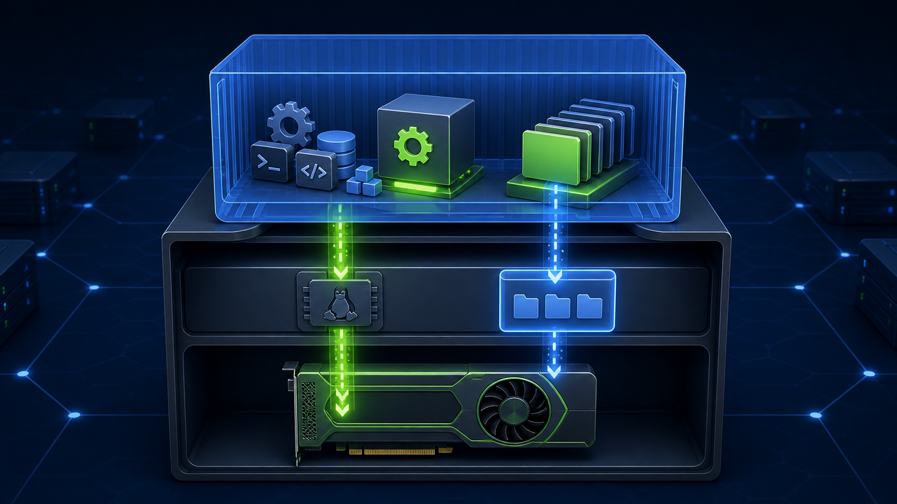
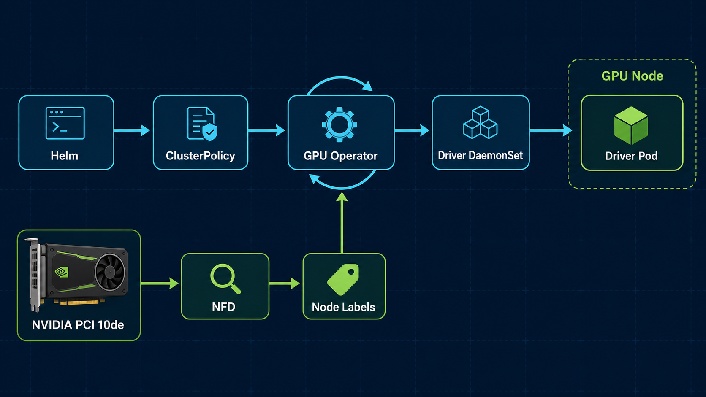
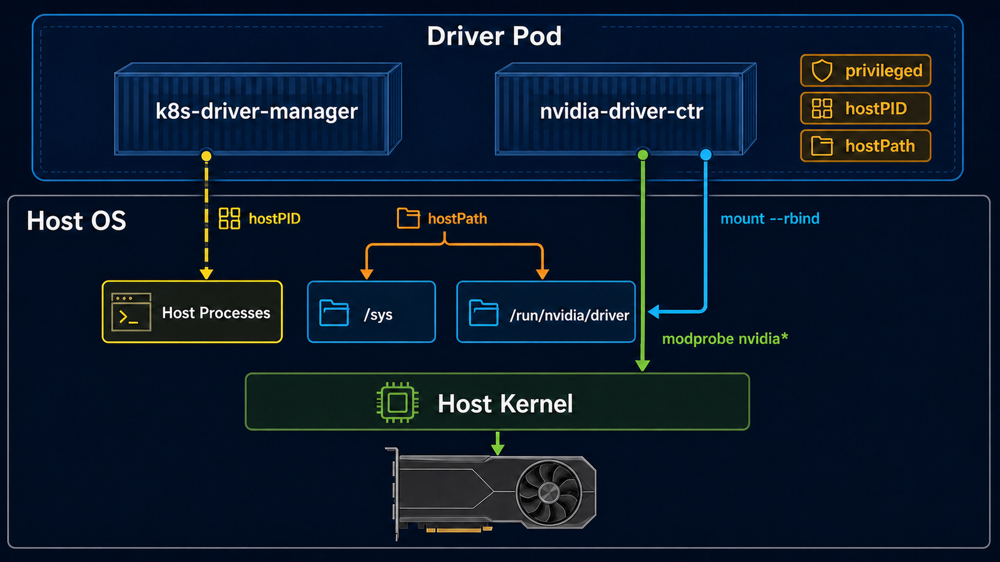
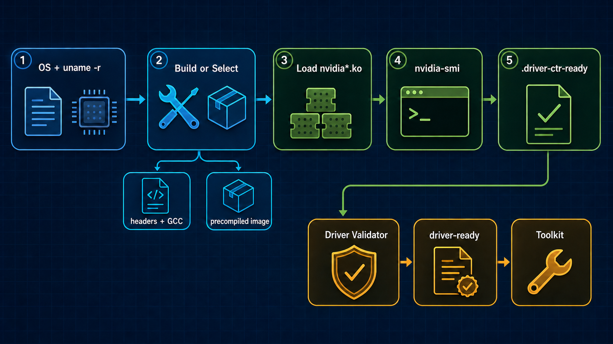

# GPU Operator 进阶：一个容器如何把 NVIDIA 驱动装进宿主机？



[上一篇](NVIDIA%20Device%20Plugin%20与%20GPU%20Operator：Kubernetes%20如何管理%20GPU.md)安装 GPU Operator 时，宿主机已经有 NVIDIA Driver 和 NVIDIA Container Toolkit，因此 Helm 参数里明确关闭了这两项：

```bash
--set driver.enabled=false
--set toolkit.enabled=false
```

这种装法容易理解：Operator 只接管 Device Plugin、GFD、DCGM Exporter 和 Validator，不碰节点底层。

但 GPU Operator 默认还能做一件看起来很反常的事：启动一个 Kubernetes Pod，然后由这个 Pod 给宿主机安装 NVIDIA 驱动。

容器不是应该和宿主机隔离吗？驱动为什么不会随着 Pod 删除而消失？内核模块究竟装在容器里还是宿主机里？驱动、Container Toolkit 和 Device Plugin 又按什么顺序启动？

这篇不重复 Helm 入门和整卡调度，而是沿着当前稳定版 GPU Operator v26.3.3 的控制器源码、Driver DaemonSet 清单和 Driver Container 启动流程，把这条链路拆开。

> **实验边界**
>
> 当前两台 RTX 3080 Ti 节点已经预装 Driver 570.153.02 和 Container Toolkit 1.19.1，上一篇也按 `driver.enabled=false`、`toolkit.enabled=false` 完成了验证。本文没有在这两台节点上直接切换到容器化驱动，以免覆盖正在工作的宿主机驱动。
>
> 截至 2026 年 8 月，NVIDIA 将 v26.3.x 标为 `Supported`，v25.10.x 标为 `Deprecated`，v25.3.x 及以下已经 `End of Support`。本文固定使用 v26.3.3；这不代表上一篇的现有集群已经升级。
>
> 安装命令是供干净且可回滚的 GPU 节点使用的实验方案。GPU Operator 版本固定为 v26.3.3，但 Driver 仍必须按 NVIDIA Platform Support、Component Matrix 和目标 GPU、操作系统、内核选择，不能只照抄一个驱动版本号。

## 1. 先说结论：驱动容器不是普通业务容器

GPU Operator 管理驱动时，并不是让 CUDA 程序隔着一个 Driver Pod 调用 GPU。真正发生的是：

1. Operator 找到带 NVIDIA PCI 设备的节点；
2. Operator 为这些节点创建 `nvidia-driver-daemonset`；
3. Driver Pod 以特权模式运行，针对宿主机正在运行的内核准备并加载 NVIDIA 内核模块；
4. Driver Container 把自己的驱动用户态文件系统暴露到宿主机 `/run/nvidia/driver`；
5. Container Toolkit 根据这个路径配置 CDI 与容器注入链路；
6. Device Plugin 最后才向 kubelet 注册 `nvidia.com/gpu`。

这里有两个关键事实。

第一，容器有独立的文件系统和进程视图，但没有独立的 Linux 内核。Driver Pod 里执行的模块加载操作，作用对象仍是宿主机内核。

第二，GPU Operator 的“容器化驱动”通常不会像 `apt install nvidia-driver-*` 那样，把完整驱动安装进宿主机的 `/usr`。内核模块进入宿主机内核，驱动用户态文件则通过 `/run/nvidia/driver` 提供给后续组件。它更像一个随节点运行的驱动安装器和生命周期管理器。

因此，内核模块不会仅仅因为容器的 mount namespace 消失就自动消失。Driver Manager 会在真正的驱动升级、配置变化或卸载流程中协调客户端并主动卸载模块；如果只是 Driver Pod 被删除，且 Driver 版本和配置没有变化，v26.3 会复用节点上已经存在的内核模块，避免再次卸载和编译。Operator 仍会重建 Pod，重新暴露 Driver Root 并恢复校验状态。

## 2. Helm、ClusterPolicy、Controller 和 Operand 是四层关系

GPU Operator 不是一条很长的安装脚本。它使用 Kubernetes Operator 的控制循环管理 GPU 软件栈。

| 层级 | 负责什么 |
| --- | --- |
| Helm Chart | 安装 CRD、Operator Deployment、RBAC，并根据 values 创建 `ClusterPolicy` |
| `ClusterPolicy` | 保存整个集群希望使用的 Driver、Toolkit、Device Plugin、监控和校验配置 |
| GPU Operator Controller | 持续比较期望状态和实际状态，创建或更新各组件的 DaemonSet、Service、ConfigMap 等对象 |
| Operand | 真正运行在节点上的 Driver、Toolkit、Device Plugin、GFD、DCGM Exporter、Validator 等 Pod |

安装后可以从 Helm、ClusterPolicy 和 Operand 三个观察点查看状态：

```bash
helm get values gpu-operator -n gpu-operator

kubectl get clusterpolicy cluster-policy -o yaml

kubectl get daemonset -n gpu-operator
```

在 v26.3.3 的 `ClusterPolicy` 控制器中，主要协调步骤仍按下面的顺序执行。下面省略了末尾与沙箱、vGPU、VFIO、Kata 和机密计算相关的可选状态：

```text
pre-requisites
  -> state-operator-metrics
  -> state-driver
  -> state-container-toolkit
  -> state-operator-validation
  -> state-device-plugin
  -> state-mps-control-daemon
  -> state-dcgm
  -> state-dcgm-exporter
  -> gpu-feature-discovery
  -> state-mig-manager
  -> state-node-status-exporter
  -> ...
```

控制器会创建或更新每个状态对应的 Kubernetes 对象，再检查 DaemonSet 等资源是否就绪。任意关键状态没有完成时，`ClusterPolicy` 会保持 `notReady`，控制器稍后继续协调。

这也是为什么不应该直接修改 `nvidia-driver-daemonset`：它是 Operator 根据 `ClusterPolicy` 生成的实际状态，下次协调可能被改回去。长期配置应保存在 Helm values、GitOps 清单或 `ClusterPolicy` 中。

查看控制器正在处理哪个状态：

```bash
kubectl logs -n gpu-operator deployment/gpu-operator \
  | grep -E 'ClusterPolicy step completed|state-driver|state-container-toolkit'
```

## 3. 没有驱动，Driver Pod 是怎么找到 GPU 节点的

这条链路里有一个“先有鸡还是先有蛋”的问题。

Driver 还没装时，Device Plugin 无法调用 NVML，也不能向 kubelet 注册 `nvidia.com/gpu`。如果 Driver Pod 依赖 `nvidia.com/gpu` 才能调度，它永远启动不了。

GPU Operator 用 PCI 发现绕过了这个问题。

NFD 不需要 CUDA，也不需要 NVIDIA 用户态驱动。它从 PCI 设备读取 NVIDIA 厂商 ID `10de`，生成类似下面的标签：

```text
feature.node.kubernetes.io/pci-10de.present=true
feature.node.kubernetes.io/pci-0300_10de.present=true
```

GPU Operator 看到这些标签后，再给节点补上自己的状态标签：

```text
nvidia.com/gpu.present=true
nvidia.com/gpu.deploy.driver=true
nvidia.com/gpu.deploy.container-toolkit=true
nvidia.com/gpu.deploy.device-plugin=true
```

Driver DaemonSet 使用的选择条件是 `nvidia.com/gpu.deploy.driver=true`，不是 `nvidia.com/gpu` 扩展资源。Driver Pod 自身也不申请 GPU，不依赖 NVIDIA runtime，使用默认的低层 OCI runtime（通常为 `runc`）即可启动。因此它可以在 NVIDIA runtime 和 Device Plugin 都不存在时先运行起来。

查看节点发现链路：

```bash
kubectl get nodes \
  -o custom-columns=NAME:.metadata.name,PCI-NVIDIA:.metadata.labels.feature\.node\.kubernetes\.io/pci-10de\.present,GPU-PRESENT:.metadata.labels.nvidia\.com/gpu\.present,DEPLOY-DRIVER:.metadata.labels.nvidia\.com/gpu\.deploy\.driver
```

这几个字段回答的是不同问题：

- `pci-10de.present`：节点上能否看到 NVIDIA PCI 设备；
- `gpu.present`：Operator 是否把它识别为 GPU 节点；
- `gpu.deploy.driver`：该节点是否应该运行 Driver Operand；
- `nvidia.com/gpu`：Driver、Toolkit 和 Device Plugin 链路完成后，kubelet 最终上报的可调度资源。



*图 1：Helm 提交期望状态，NFD 提供 PCI 发现结果，GPU Operator 持续协调并为匹配节点创建 Driver Pod。*

## 4. 拆开 Driver DaemonSet 看它为什么能碰宿主机

GPU Operator v26.3.3 的 Driver DaemonSet 不是普通 DaemonSet。几个关键字段决定了它有能力管理宿主机驱动。

### 4.1 每个 GPU 节点运行一个 Driver Pod

DaemonSet 的 `nodeSelector` 匹配：

```yaml
nvidia.com/gpu.deploy.driver: "true"
```

它还使用 `system-node-critical` 优先级，使 Driver Pod 作为节点关键组件获得更高的调度优先级。

### 4.2 Driver Pod 共享宿主机 PID 命名空间

清单中设置了：

```yaml
hostPID: true
```

这让驱动生命周期组件能看到宿主机进程。升级或卸载模块之前，Driver Manager 需要判断哪些进程仍在使用 `/dev/nvidia*`，否则模块很可能因为仍有客户端而无法卸载。

### 4.3 initContainer 和主容器都是 privileged

Driver Pod 至少包含两个核心部分：

| 容器 | 作用 |
| --- | --- |
| `k8s-driver-manager` initContainer | 在 Driver Pod 重建或升级前协调旧驱动客户端、旧模块和节点状态 |
| `nvidia-driver-ctr` | 准备驱动文件，编译或选择内核模块，加载模块并执行 `nvidia-smi` 就绪检查 |

两者都需要 `privileged: true`。原因不是“安装软件需要 root”这么简单，而是加载内核模块、访问宿主机 sysfs、处理设备和挂载传播本身就越过了普通容器的隔离边界。

Driver Pod 因此拥有接近节点管理员的权限。`gpu-operator` 命名空间、Operator ServiceAccount、镜像来源和镜像签名，都应按节点级基础设施组件的标准保护，而不是按普通应用命名空间对待。

### 4.4 hostPath 和挂载传播把两边接起来

v26.3.3 的 Driver Pod 会使用这些关键宿主机路径：

| 宿主机路径 | 在驱动链路中的作用 |
| --- | --- |
| `/run/nvidia` | 保存驱动根目录、校验标记等运行时状态，并使用双向挂载传播 |
| `/` | 以只读 `/host` 提供给 Driver Manager，用于观察宿主机文件系统 |
| `/sys` 及部分 sysfs 路径 | 访问内核、固件和设备相关状态 |
| `/var/log`、`/dev/log` | 写入或转发驱动与 Fabric Manager 日志 |
| `/run/mellanox/drivers` | 启用 GPUDirect RDMA 等场景时与网络驱动栈衔接 |

一个容易写错的细节是：v26.3.3 的 Driver DaemonSet 并不是简单把宿主机 `/lib/modules` 挂进容器，然后执行一次 `apt install`。实际清单和启动流程要复杂得多。



*图 2：Driver Pod 没有自己的内核。`hostPID` 用来观察宿主机进程，`hostPath` 连接宿主机路径，`privileged` 使模块加载最终作用于宿主机内核。用户态驱动则通过 `/run/nvidia/driver` 暴露。*

可以直接检查集群实际生成的 PodSpec，不必靠猜：

```bash
kubectl get daemonset nvidia-driver-daemonset \
  -n gpu-operator \
  -o jsonpath='{.spec.template.spec.hostPID}{"\n"}'

kubectl get daemonset nvidia-driver-daemonset \
  -n gpu-operator \
  -o jsonpath='{range .spec.template.spec.initContainers[*]}init {.name}{" privileged="}{.securityContext.privileged}{"\n"}{end}{range .spec.template.spec.containers[*]}container {.name}{" privileged="}{.securityContext.privileged}{"\n"}{end}'

kubectl get daemonset nvidia-driver-daemonset \
  -n gpu-operator \
  -o jsonpath='{range .spec.template.spec.volumes[*]}{.name}{"\t"}{.hostPath.path}{"\n"}{end}'
```

### 4.5 v26.3.3 仍使用 `OnDelete` 更新 Driver Pod

Driver DaemonSet 还设置了：

```yaml
updateStrategy:
  type: OnDelete
```

原因是驱动更新不能只靠 DaemonSet 自动滚动。旧模块还在宿主机内核里，GPU 客户端也可能仍在运行，必须先由 Driver Upgrade Controller 或 Driver Manager 协调客户端、节点和模块，再删除并重建 Driver Pod。这里要和“相同配置下删除 Pod”区分：后者在 v26.3 可以走模块复用快路径，真正换 Driver 版本时仍必须卸载旧模块。

## 5. Driver Container 启动时到底做了什么

把控制器和 DaemonSet 放到一边，Driver Container 的主线可以压缩成五步。

### 5.1 识别宿主机环境

Driver Container 会读取宿主机操作系统信息，并以宿主机正在运行的内核版本为目标。驱动能否加载，首先取决于下面这组组合是否匹配：

```text
GPU 型号
+ Driver 分支/版本
+ Linux 发行版
+ uname -r
+ 内核模块类型（auto/open/proprietary）
```

这也是为什么只看 CUDA 版本不够。CUDA 应用镜像、Driver 用户态组件和宿主机内核模块处在不同层，不能拿一个 CUDA 镜像标签代替驱动兼容性判断。

### 5.2 准备与当前内核匹配的构建条件

传统 Driver Container 会在节点启动阶段准备与 `uname -r` 对应的 kernel headers、GCC 和发行版软件包，再构建或链接 NVIDIA 内核模块。

它依赖软件源中仍然存在当前内核对应的包。如果节点运行的是已经从普通仓库下架的旧内核，常见报错是：

```text
Could not resolve Linux kernel version
```

这类问题靠重启 Driver Pod 不会自动消失。要么升级到受支持的内核，要么给 Driver Container 配置包含旧内核包的归档仓库，要么改用有精确匹配镜像的预编译驱动。

### 5.3 选择并加载 NVIDIA 内核模块

现代 GPU Operator 通过 `driver.kernelModuleType` 选择模块类型：

```text
auto         由支持该能力的 Driver Container 根据 GPU 和驱动分支选择
open         NVIDIA Open GPU Kernel Modules
proprietary  NVIDIA 专有内核模块
```

并不是所有旧驱动分支都支持 `auto`。实际取值必须同时核对 GPU Operator 版本与 Driver Container 的支持范围。

安装阶段最终要把 `nvidia`、`nvidia_uvm`、`nvidia_modeset` 等模块加载进宿主机正在运行的内核。启用显示栈、GPUDirect RDMA、GDS 或其他能力时，还可能涉及 `nvidia_drm`、`nvidia_peermem`、`nvidia_fs` 等模块，但它们不是所有 Kubernetes GPU 节点的固定必选项。

这里不要笼统写成“GPU Operator 使用 DKMS 安装驱动”。Ubuntu Driver Container 的实现使用 NVIDIA Driver Container 自己的安装和内核模块构建流程；其中可能包含类似内核更新钩子的机制，但不等于在宿主机软件包系统里完成一次标准 DKMS 安装。

### 5.4 把驱动用户态文件暴露到 `/run/nvidia/driver`

内核模块只是驱动的一半。CUDA 容器还需要 `libcuda.so`、NVML 等用户态库和工具。

Driver Container 安装完成后，会把自己的根文件系统递归绑定到 `/run/nvidia/driver`。Driver DaemonSet 对 `/run/nvidia` 使用双向挂载传播，因此宿主机和后续 Operand 都能从下面的路径看到驱动用户态文件：

```text
/run/nvidia/driver
```

这解释了容器化驱动最容易误解的地方：

- 内核模块加载在宿主机内核中；
- 用户态驱动文件主要留在 Driver Container 文件系统中；
- `/run/nvidia/driver` 把这套文件系统作为“驱动根目录”分享给 Toolkit、Validator 和 GPU 工作负载；
- 它不是把所有文件永久复制进宿主机 `/usr`。

因此，使用容器化驱动时，不应该只用宿主机 `/usr/bin/nvidia-smi` 是否存在来判断安装成功。更可靠的做法是在 Driver Container 里运行 `nvidia-smi`，再到宿主机检查模块和 `/proc` 状态。

### 5.5 通过 startupProbe 建立驱动就绪标记

v26.3.3 的 Driver DaemonSet 挂载专用 `startup-probe.sh`。探针验证 `nvidia-smi`，成功后写入：

```text
/run/nvidia/validations/.driver-ctr-ready
```

Driver Validator 随后会区分两种情况：先检查宿主机预装驱动；没有宿主机驱动时，再等待上面的容器化驱动标记。验证通过后，它会生成：

```text
/run/nvidia/validations/driver-ready
```

这个文件不只是一个空标志，还记录 `IS_HOST_DRIVER`、`NVIDIA_DRIVER_ROOT`、`DRIVER_ROOT_CTR_PATH` 等环境信息。Toolkit 启动前读取这份契约，就能同时兼容“宿主机驱动根目录为 `/`”和“容器化驱动根目录为 `/run/nvidia/driver`”两种模式。

v26.3.3 仍部署 `nvidia-operator-validator` DaemonSet，但 Validator 可执行程序已经随 `gpu-operator` 镜像发布，不再使用旧的独立 Validator 镜像。Pod 名称和校验链路仍然存在，不要把“镜像合并”误解成“Validator 被删除”。

后续组件的 initContainer 会等待对应依赖通过。这样 Toolkit、Device Plugin 和 DCGM Exporter 不会在驱动不可用时被误判为就绪。



*图 3：Operator 在 Pod 启动前决定使用传统还是预编译 Driver 镜像；Driver Container 完成模块准备和加载后，`nvidia-smi` 建立 `.driver-ctr-ready`，Validator 再生成下游读取的 `driver-ready` 契约。*

## 6. 传统 Driver Container 和预编译 Driver Container

GPU Operator 管理驱动时有两条主要路径。

| 对比项 | 传统 Driver Container | 预编译 Driver Container |
| --- | --- | --- |
| `driver.usePrecompiled` | `false` | `true` |
| `driver.version` | 完整驱动版本，如 `580.x.y` | 驱动分支，如 `580` |
| 节点启动时构建 | 需要针对当前内核准备并构建模块 | 模块已经针对指定内核构建好 |
| 对外部仓库依赖 | 通常需要获取 headers、GCC 和 OS 包 | 不需要现场下载这些构建依赖 |
| 镜像匹配粒度 | Driver 版本 + OS | Driver 分支 + 完整内核版本/变体 + OS |
| 优点 | 对支持范围内的内核更灵活 | 启动更快、行为更可预测，适合受限网络 |
| 代价 | 软件源、旧内核和现场编译更容易失败 | 必须有精确匹配的镜像，支持范围有限 |

预编译镜像标签遵循类似下面的结构：

```text
<driver-branch>-<linux-kernel-version>-<os-tag>
```

例如官方文档给出的形式：

```text
525-5.15.0-69-generic-ubuntu22.04
```

启用方式为：

```bash
--set driver.usePrecompiled=true
--set driver.version=REPLACE_WITH_SUPPORTED_DRIVER_BRANCH
```

预编译不等于“任意节点都不用管内核”。正好相反，它把内核匹配从节点启动时的编译问题，变成镜像发布时的精确匹配问题。节点升级内核后，如果仓库没有带对应标签的镜像，Driver Pod 仍然起不来。

v26.3 文档将官方预编译驱动限制在 x86_64、列出的操作系统和内核变体，并只支持最近发布的 LTSB Driver 分支；它仍不支持 vGPU 和 GPUDirect Storage。生产使用前必须先查支持表和 NGC 镜像标签。

## 7. Driver 装好以后，Toolkit 还要做什么

Driver 和 NVIDIA Container Toolkit 经常被混成一件事，实际上两者分工不同。

| 层 | 解决的问题 |
| --- | --- |
| NVIDIA Driver | Linux 内核如何控制 GPU，用户态程序如何通过 Driver API 访问它 |
| NVIDIA Container Toolkit | containerd、CRI-O 或 Docker 启动容器时，如何注入指定 GPU、设备节点和驱动用户态库 |
| Device Plugin | Kubernetes 如何发现可分配 GPU，并把设备选择结果交给容器启动链路 |

Toolkit DaemonSet 会先等待 Driver Validator 通过，再以特权模式和 hostPath 配置节点上的 GPU 容器注入链路。使用 GPU Operator 管理的容器化驱动时，它把驱动根目录指向：

```text
/run/nvidia/driver
```

在 v26.3.3 清单里，宿主机驱动根目录在 Toolkit Container 内的挂载点仍是 `/driver-root`。Toolkit 还会把自己的二进制安装到宿主机默认的 `/usr/local/nvidia`，并生成 CDI 规范文件。

v26.3.3 默认启用 CDI，默认不启用 NRI：

```yaml
cdi:
  enabled: true
  nriPluginEnabled: false
```

标准业务 Pod 通过 Device Plugin 申请 GPU 时，containerd 或 CRI-O 使用原生 CDI 支持注入设备。绕过 Kubernetes 资源分配、直接使用 `NVIDIA_VISIBLE_DEVICES` 的 GPU 管理容器，在这个默认模式下仍需要 `runtimeClassName: nvidia`。

如果显式启用 NRI Plugin，Toolkit 会在每个 GPU 节点运行 NRI Plugin，不再创建 `nvidia` RuntimeClass，也不再修改 containerd 的 `config.toml`。NRI 当前仍受上游实现成熟度和容器运行时版本限制，因此本文实验保持默认的 `CDI=true、NRI=false`。

Toolkit 不是 CUDA Toolkit，也不负责构建 `nvidia` 内核模块。它解决的是“容器启动时怎么把已经可用的 GPU 和驱动库放进去”。

整条启动依赖可以这样记：

```text
NFD 发现 PCI 设备
  -> Driver 安装并加载模块
  -> Driver Validator
  -> Toolkit 配置 CDI 与容器注入链路
  -> Toolkit Validator
  -> Device Plugin 注册 nvidia.com/gpu
  -> CUDA Validator
  -> 业务 Pod
```

如果大量 Operand 都卡在 `Init`，不要逐个重启。它们很可能都在等同一个上游就绪文件，应先从 Driver 和 Toolkit 往下查。

## 8. 在独立的干净实验集群里安装驱动

下面的流程只适用于全新的独立实验集群：这个集群没有现有 GPU Operator Release，所有 GPU 节点都准备交给 Operator 管理 Driver 和 Toolkit。

不要在上一篇的现有 `gpu-operator` Release 上直接执行本节的 Helm 命令。`driver.enabled=true` 是 `ClusterPolicy` 的集群级配置，默认会影响所有匹配的 GPU 节点，不会自动只作用于“新加的干净节点”。`helm upgrade` 还可能把未写入新 values 文件的 DaoCloud 镜像、CDI 和其他现有配置恢复成 Chart 默认值。

v26.3.3 的 `NVIDIADriver` CRD 能在新安装中按节点、Driver 类型、Driver 版本和操作系统生成不同的 Driver DaemonSet；使用预编译驱动时，还会按内核版本拆分 DaemonSet。但它与 `ClusterPolicy` 驱动管理互斥，也不支持从已有 `ClusterPolicy` 原地切换。当前两节点实验集群不能靠打开一个 Helm 开关安全迁移到该模式。

Chart 默认仍使用 `ClusterPolicy` 管 Driver，即 `driver.nvidiaDriverCRD.enabled=false`。如果新安装时启用该 CRD，Chart 默认还会创建一个匹配所有 GPU 节点的 `default` CR；准备自己划分节点池时，应从安装开始设置 `driver.nvidiaDriverCRD.deployDefaultCR=false`，避免选择器重叠。

如果只需在同一集群混合“宿主机预装 Driver”和“Operator 管理 Driver”，可以继续使用 `ClusterPolicy`：先给预装驱动节点设置 `nvidia.com/gpu.deploy.driver=false`，再启用集群级 `driver.enabled=true`，并确认其他目标节点的部署标签和 Driver DaemonSet 实际匹配结果。若还需要多个 Driver 类型、版本或多种 GPU 节点操作系统，再从新安装开始设计 `NVIDIADriver` CR；已有 `ClusterPolicy` 安装仍不支持原地切换到该模式。这个混合模式不在本文实验范围内。

### 8.1 准备安全的实验节点

推荐条件：

- 使用 NVIDIA Platform Support 明确列出的 GPU、操作系统和 Kubernetes 组合；
- GPU 节点使用相同操作系统版本；
- 节点已安装并配置 Kubernetes 与 containerd，但没有安装 NVIDIA Driver 和 Container Toolkit；
- 节点或云盘可以快照回滚；
- GPU 工作负载已迁走，并安排维护窗口；
- 软件源能够提供与 `uname -r` 精确匹配的 headers，或已经确认存在预编译 Driver Container；
- 镜像仓库、软件包仓库、代理和证书链已经验证。

先记录基线：

```bash
cat /etc/os-release
uname -r
lspci -nn | grep -i nvidia
lsmod | grep -E '^(nvidia|nouveau)'
command -v nvidia-smi
```

理想的干净节点应能从 PCI 看到 NVIDIA 设备，但没有已经加载的 `nvidia*` 模块，也没有正在工作的宿主机 Driver。若 `nouveau` 已占用 GPU，应按目标操作系统和 NVIDIA 官方指南处理后再继续。

### 8.2 先选版本，不要先敲 Helm

至少核对四项：

1. GPU Operator Platform Support；
2. GPU Operator Component Matrix；
3. 目标 GPU 支持的 Driver 分支；
4. 目标内核是否有 headers 或预编译镜像。

v26.3.3 的 Component Matrix 将 580.126.20 标为默认 Driver、580.173.02 标为推荐 Driver。这两个数字只能说明它们进入了当前支持矩阵，不能代替目标 GPU、操作系统和内核的兼容性检查，所以下面的 values 仍保留 Driver 占位符。

将版本选择和配置保存到 values 文件，而不是只留一条不可追踪的命令：

```yaml
cdi:
  enabled: true
  nriPluginEnabled: false

driver:
  enabled: true
  version: "REPLACE_WITH_SUPPORTED_DRIVER_VERSION"
  kernelModuleType: auto
  usePrecompiled: false

toolkit:
  enabled: true
```

下面固定使用当前稳定版 v26.3.3。Driver 版本仍需替换为支持矩阵中的真实值，再在独立实验集群执行：

```bash
GPU_OPERATOR_VERSION='v26.3.3'

helm install gpu-operator nvidia/gpu-operator \
  --namespace gpu-operator \
  --create-namespace \
  --version "$GPU_OPERATOR_VERSION" \
  -f values-driver-managed.yaml
```

如果使用预编译驱动，values 应改为驱动分支，并确认仓库存在目标内核的镜像：

```yaml
driver:
  enabled: true
  version: "REPLACE_WITH_SUPPORTED_DRIVER_BRANCH"
  kernelModuleType: auto
  usePrecompiled: true
```

这里固定的是 GPU Operator Chart，不是 Driver。Driver、GPU、内核和操作系统仍然是一个组合，不能因为 Chart 使用 v26.3.3 就跳过 Component Matrix。

### 8.3 指定驱动版本、Driver 镜像源和 OS 软件源

“驱动从哪里下载”至少涉及三层，不能用一个 `repository` 概括：

| 配置 | 控制什么 | 不控制什么 |
| --- | --- | --- |
| Helm 仓库与 Chart `--version` | 从哪里取得 GPU Operator Chart，以及安装哪个 Operator 版本 | NVIDIA Driver 版本 |
| `driver.repository`、`driver.image`、`driver.version` | kubelet 拉取哪个 Driver Container 镜像 | Driver Container 内部的 apt、dnf、yum 或 zypper 软件源 |
| `driver.repoConfig.configMapName` | 向 Driver Container 的包管理器追加哪些 OS 软件源定义 | Driver Container 镜像地址和 NVIDIA Driver 版本 |

标准 Data Center Driver 的安装载荷来自 Driver Container 镜像。`driver.version` 不是让 Pod 到某个 URL 下载 `.run` 驱动包，而是参与选择 Driver Container 的镜像标签。传统 Driver Container 启动后还需要下载与宿主机内核匹配的 OS 软件包，所以“镜像源可访问”与“驱动能够完成构建”是两个独立条件。

#### 8.3.1 指定传统 Driver Container 的版本和镜像仓库

可直接访问 NVIDIA NGC 时，v26.3.3 默认的镜像位置是 `nvcr.io/nvidia/driver`。下面把它改成企业私有镜像仓库，并以支持矩阵中的 580.173.02 为例。它只是配置格式示例，实际部署仍要核对目标 GPU、OS 和内核：

```yaml
driver:
  enabled: true
  usePrecompiled: false
  kernelModuleType: auto

  repository: registry.example.com/mirror/nvidia
  image: driver
  version: "580.173.02"
  imagePullPolicy: IfNotPresent
  imagePullSecrets:
    - registry-cred
```

这几个字段组合成 Driver 镜像：

```text
<repository>/<image>:<driver-version>-<os-tag>
```

例如 Ubuntu 22.04 节点最终使用的传统 Driver 镜像类似：

```text
registry.example.com/mirror/nvidia/driver:580.173.02-ubuntu22.04
```

`repository` 写镜像仓库和子路径，不带 `https://`，也不包含镜像名与标签；`image` 通常保持 `driver`；`version` 只写完整 Driver 版本，不要再拼 `-ubuntu22.04`。Operator 会根据节点 OS 选择后缀。

使用私有镜像仓库时，应先把对应 OS 标签的镜像完整同步进去，并把拉取凭据 Secret 创建在 `gpu-operator` 命名空间。v26.3.3 的 `driver.imagePullSecrets` 是字符串数组，因此写 `- registry-cred`，不是 `- name: registry-cred`。

`driver.certConfig` 不能让 containerd 信任私有镜像仓库。私有 Registry 的 CA 和代理要配置到每个节点的操作系统与 containerd；`imagePullSecrets` 只解决认证。完全离线时还必须同步 Operator、Driver Manager、Toolkit、Device Plugin、NFD、DCGM 等所有启用组件的镜像，不能只同步 `driver`。

预编译 Driver Container 的写法不同：`version` 必须写 Driver 分支，而不是完整版本号。

```yaml
driver:
  enabled: true
  repository: registry.example.com/mirror/nvidia
  image: driver
  version: "580"
  usePrecompiled: true
  imagePullSecrets:
    - registry-cred
```

它的最终标签还包含完整内核版本和 OS，例如：

```text
580-<uname-r>-ubuntu22.04
```

因此，同一集群存在多个内核版本时，私有仓库必须同步每个实际内核与 OS 组合的精确镜像。仓库缺少任意一个标签，对应节点就会 `ImagePullBackOff`。

#### 8.3.2 指定 kernel headers 和 GCC 的软件包源

传统 Driver Container 仍要通过 apt、dnf、yum 或 zypper 获取构建依赖。先准备与节点发行版匹配的软件源文件，再把它放进 `gpu-operator` 命名空间的 ConfigMap。

以下是 Ubuntu 22.04 x86_64 节点的结构示例，内部镜像的真实路径应按企业仓库布局填写；ARM64 节点应把架构改为 `arm64` 或按仓库策略移除架构限制：

```yaml
apiVersion: v1
kind: ConfigMap
metadata:
  name: driver-os-repos
  namespace: gpu-operator
data:
  custom-repo.list: |
    deb [arch=amd64] https://packages.example.com/ubuntu jammy main universe
    deb [arch=amd64] https://packages.example.com/ubuntu jammy-updates main universe
    deb [arch=amd64] https://packages.example.com/ubuntu jammy-security main universe
```

然后在 GPU Operator values 中引用：

```yaml
driver:
  repoConfig:
    configMapName: driver-os-repos
```

Operator 会根据节点 OS 把 ConfigMap 中的文件挂到相应的软件源目录。Ubuntu 使用 `.list` 或 `.sources` 文件；RHEL、CentOS、Rocky 和 RHCOS 使用 `.repo` 文件。其他发行版必须先按当前 Platform Support 或对应合作伙伴文档确认支持路径。内部仓库至少要包含与 `uname -r` 精确匹配的内核 headers、image/modules 或 kernel-devel/kernel-core，以及与内核构建相匹配的 GCC 等依赖。

`repoConfig` 是向包管理器追加仓库定义，并不天然屏蔽 Driver Container 原有的软件源。严格离线或要求来源可审计时，还要通过仓库优先级、禁用默认源或网络策略，确保它只访问允许的内部地址。

如果内部 HTTPS 软件仓库使用企业 CA，再创建一个包含 `.crt` 或目标发行版所需证书格式的 ConfigMap，并配置：

```yaml
driver:
  certConfig:
    name: driver-repo-ca
```

这个 CA 只供 Driver Container 访问 OS 软件包仓库使用，不负责私有镜像仓库证书，也不是 Secure Boot 的内核模块签名证书。需要经过 HTTP/HTTPS 代理访问软件源时，则通过 `driver.env` 同时传入大写和小写的 `HTTP_PROXY`、`HTTPS_PROXY` 与 `NO_PROXY`；节点拉取容器镜像所用的代理仍要单独配置到 containerd。

预编译 Driver Container 不在节点上现场下载这些构建包，通常不需要 `repoConfig`，但仍要确保精确匹配的预编译镜像已经进入可访问的 Registry。

#### 8.3.3 验证最终使用的版本和地址

先看 `ClusterPolicy` 保存的期望值：

```bash
kubectl get clusterpolicy cluster-policy \
  -o jsonpath='{.spec.driver.repository}{"/"}{.spec.driver.image}{":"}{.spec.driver.version}{"\n"}'
```

再看 Operator 生成的 Driver DaemonSet。这里看到的才是包含 OS 标签的最终镜像：

```bash
kubectl get daemonset nvidia-driver-daemonset \
  -n gpu-operator \
  -o jsonpath='{range .spec.template.spec.containers[?(@.name=="nvidia-driver-ctr")]}{.image}{"\n"}{end}'
```

如果使用 `NVIDIADriver` CRD，字段改为 `spec.repository`、`spec.image`、`spec.version` 和 `spec.imagePullSecrets`，OS 软件源引用则是 `spec.repoConfig.name`，不要照搬 `ClusterPolicy` values 的 `configMapName`。

对已有集群修改 `driver.version` 会触发真实的驱动升级流程；修改 `repository` 或 `repoConfig` 引用也会改变 Driver Pod 模板。若只更新同名 ConfigMap 的内容，`subPath` 挂载不会在现有 Driver Pod 中自动刷新，`OnDelete` Driver DaemonSet 也不会仅因此重建 Pod，仍需在维护窗口有计划地重建对应 Driver Pod。它们都应进入完整 values/GitOps 配置，不能当成无损的普通 Helm 参数更新。升级前先阅读第 11 节。若 `driver.enabled=false`，这些配置不会接管或升级宿主机预装 Driver。

### 8.4 观察 Driver Pod，而不是只等 Helm

```bash
kubectl get clusterpolicy cluster-policy -w

kubectl get pods -n gpu-operator -o wide -w
```

另开终端查看 Driver 日志：

```bash
kubectl get pods -n gpu-operator \
  -l app=nvidia-driver-daemonset

DRIVER_POD=$(kubectl get pods -n gpu-operator \
  -l app=nvidia-driver-daemonset \
  -o jsonpath='{.items[0].metadata.name}')

kubectl logs -n gpu-operator \
  "$DRIVER_POD" \
  -c nvidia-driver-ctr \
  --follow
```

如果 Pod 卡在 initContainer：

```bash
kubectl logs -n gpu-operator \
  "$DRIVER_POD" \
  -c k8s-driver-manager
```

日志里至少要能回答：识别到了什么 OS 和内核、选择了什么 Driver 与模块类型、headers 是否找到、模块是否成功加载、`nvidia-smi` 是否通过；若失败，原因是什么。

## 9. 驱动安装后怎样做分层验收

不要只看 `ClusterPolicy=ready`。从内核到 Kubernetes 逐层验证，出问题时才能知道断在哪。

### 9.1 Driver Pod 层

```bash
kubectl get daemonset nvidia-driver-daemonset \
  -n gpu-operator

DRIVER_POD=$(kubectl get pods -n gpu-operator \
  -l app=nvidia-driver-daemonset \
  -o jsonpath='{.items[0].metadata.name}')

kubectl exec -n gpu-operator \
  "$DRIVER_POD" \
  -c nvidia-driver-ctr \
  -- nvidia-smi
```

### 9.2 宿主机内核层

在对应节点执行：

```bash
uname -r
lsmod | grep '^nvidia'
cat /proc/driver/nvidia/version
ls -l /dev/nvidia*
```

这里验证的是模块确实加载进了宿主机内核，而不是 Driver Container 里恰好放着一个 `nvidia-smi` 二进制文件。

### 9.3 容器化驱动根目录

```bash
find /run/nvidia/driver -maxdepth 2 \
  -type d \
  | head -n 30
```

这个路径存在且内容完整，是 Toolkit 获得用户态驱动文件的必要条件之一。

### 9.4 Toolkit 与容器运行时层

先从 Kubernetes 控制面检查 DaemonSet、日志和当前注入模式：

```bash
kubectl get daemonset nvidia-container-toolkit-daemonset \
  -n gpu-operator

kubectl logs -n gpu-operator \
  daemonset/nvidia-container-toolkit-daemonset \
  -c nvidia-container-toolkit-ctr

kubectl get clusterpolicy cluster-policy \
  -o jsonpath='{.spec.cdi.enabled}{"\t"}{.spec.cdi.nriPluginEnabled}{"\n"}'
```

再到对应 GPU 节点检查 CDI 规范文件和 containerd 实际配置：

```bash
find /var/run/cdi -maxdepth 1 -type f -print

containerd config dump | grep -A 12 -B 3 nvidia
```

在本文的默认 `CDI=true、NRI=false` 模式下，应同时检查 CDI 规范文件和 NVIDIA runtime 配置。若显式启用 NRI，则“不修改 containerd 配置”反而是预期行为，不能再用 `config.toml` 中是否出现 NVIDIA 条目判断 Toolkit 成败。

### 9.5 Kubernetes 资源层

```bash
kubectl get nodes \
  -o custom-columns=NAME:.metadata.name,GPU-CAPACITY:.status.capacity.nvidia\.com/gpu,GPU-ALLOCATABLE:.status.allocatable.nvidia\.com/gpu

kubectl get pods -n gpu-operator \
  -l app=nvidia-cuda-validator \
  -o wide
```

最后再运行 CUDA 工作负载。只有 Driver、Toolkit、Device Plugin、资源上报和实际 CUDA 计算均正常，才算完成。

## 10. 常见故障应该从哪一层排查

| 现象 | 更可能的层 | 先检查什么 |
| --- | --- | --- |
| Driver Pod `ImagePullBackOff` | 镜像分发 | 仓库地址、镜像标签、代理、证书和拉取凭据 |
| `Could not resolve Linux kernel version` | 内核构建依赖 | `uname -r`、headers/kernel-devel 是否仍在软件源中 |
| `k8s-driver-manager` init 失败 | 旧驱动或客户端 | 是否还有 GPU Pod/宿主进程占用设备，旧模块能否卸载 |
| Driver Container 的 `nvidia-smi` 失败 | 驱动/内核/GPU | Driver 日志、`lsmod`、`/proc/driver/nvidia/version`、`dmesg` |
| `modprobe` 报签名或权限问题 | 启动安全策略 | Secure Boot、内核 lockdown 与所用 Operator 版本的平台限制 |
| Driver Ready，但 Toolkit 卡住 | 容器运行时 | Toolkit 日志、containerd socket、配置路径、CDI/runtime 模式 |
| Toolkit Ready，但没有 `nvidia.com/gpu` | Device Plugin | Device Plugin 日志、NVML、kubelet plugin socket |
| 多个 Operand 同时卡在 `Init` | 上游校验 | Driver、Toolkit 和 `/run/nvidia/validations`，不要逐个重启下游 |

官方排障文档建议先查看 `nvidia-driver-ctr` 或 `k8s-driver-manager` 日志，再检查内核 `dmesg`。重点过滤：

```bash
sudo dmesg | grep -i NVRM
sudo dmesg | grep -i Xid
```

`dmesg` 能看到模块加载、固件、PCI 和 GPU 初始化错误，是 Driver Pod 日志之外最重要的证据。

针对本文所分析的 v26.3.3，官方排障文档仍明确指出 GPU Operator 不支持启用 EFI Secure Boot 的系统，建议关闭后再安装。不要把 `driver.certConfig` 当作内核模块签名配置；它用于 Driver Container 访问私有软件仓库时的证书配置。

## 11. 为什么驱动升级不是换个镜像这么简单

Driver DaemonSet 换镜像以后，旧内核模块不会自动变成新版本。官方给出的升级顺序是：

1. 停止所有 Driver 客户端；
2. 卸载旧 NVIDIA 内核模块；
3. 启动新版 Driver Pod；
4. 安装并加载新版模块；
5. 重新启用 Toolkit、Device Plugin 和业务工作负载。

GPU Operator 的 Upgrade Controller 用节点标签跟踪这个过程，并可按策略执行封锁节点（cordon）、等待任务结束、驱逐 GPU Pod、清空节点（drain）、重建 Driver Pod、校验和解除封锁（uncordon）。

驱动升级是维护动作，不应只设置 `autoUpgrade: true` 和 `maxParallelUpgrades: 1` 就直接执行。变更前还要明确：

- `maxParallelUpgrades` 与 `maxUnavailable` 允许多少节点同时不可用；
- `waitForCompletion` 要等待哪些任务，以及超时后如何处理；
- `gpuPodDeletion` 是否允许强制删除，以及能否接受 `emptyDir` 数据丢失；
- 是否启用 `drain`。它可能驱逐节点上的非 GPU 工作负载，只应在 GPU Pod 删除不足以完成升级时使用；
- PodDisruptionBudget、任务检查点、容量冗余和失败回退是否已准备好。

并行数设为 1 只能限制一次处理一个节点，不能自动保证业务无中断。

监控每个节点的升级状态：

```bash
kubectl get node -l nvidia.com/gpu.present \
  -o jsonpath='{range .items[*]}{.metadata.name}{"\t"}{.metadata.labels.nvidia\.com/gpu-driver-upgrade-state}{"\n"}{end}'
```

需要特别区分两种模式：

- `driver.enabled=true`：Operator 管理容器化驱动的生命周期，可以使用 Driver Upgrade Controller；
- `driver.enabled=false`：驱动预装在宿主机，Operator 不负责升级、降级或恢复它。

所以在上一篇的两台 RTX 3080 Ti 环境里，即使执行 `helm upgrade` 或 `helm rollback`，宿主机上的 570.153.02 驱动也不会跟着变化。

驱动回退同样需要客户端停止、模块卸载和重新校验，不能把 Helm rollback 当成无损的内核驱动回滚按钮。

## 12. 生产环境到底选哪种驱动方式

| 方式 | 更适合的场景 | 主要代价 |
| --- | --- | --- |
| 宿主机预装 Driver | 现有镜像体系成熟、GPU 节点 OS 不同、驱动由节点运维平台统一管理 | Operator 看得到驱动，但不管理其生命周期 |
| 传统 Driver Container | GPU 节点 OS 统一，希望在 GPU 节点扩缩容时自动部署和维护驱动 | 依赖 headers、GCC、软件源和现场构建，启动时间更长 |
| 预编译 Driver Container | 内核版本固定、网络受限、希望减少现场编译和节点初始化耗时的波动 | 镜像必须精确匹配，支持组合与功能有限 |
| `NVIDIADriver` CRD | 新集群需要按节点选择多个 Driver 版本、类型或 OS | API 仍为 `v1alpha1`，与 `ClusterPolicy` 驱动管理互斥，不能原地切换 |

没有一种方案永远最好。

大规模、同构、自动扩缩的 GPU 节点池很适合容器化驱动；内核和 OS 变化频繁、节点镜像已有严格发布流程的环境，宿主机预装可能更可控；内核固定且离线要求高的集群，预编译 Driver Container 更容易实现可重复部署。

真正应该避免的是混用职责：既让节点镜像系统升级宿主机驱动，又让 GPU Operator 在同一节点管理容器化驱动，却没有明确维护窗口、版本源和回滚责任。

## 13. 总结

GPU Operator 能从 Pod 里安装驱动，不是因为它绕过了 Linux 的隔离规则，而是因为 Driver Pod 被明确授予了节点级权限：它共享宿主机内核和 PID 视图，通过 privileged、hostPath 与挂载传播管理内核模块和驱动文件。

整条链路的核心不是一条 Helm 命令，而是一个持续协调过程：NFD 先用 PCI 标签发现 GPU，Operator 再创建 Driver DaemonSet；Driver Container 为宿主机内核准备并加载模块，把用户态文件暴露到 `/run/nvidia/driver`；Toolkit 配置 CDI 与容器注入链路；Device Plugin 最后才注册 `nvidia.com/gpu`。

传统 Driver Container 解决灵活适配，预编译 Driver Container 提高可重复性，并减少离线环境中的现场构建依赖。两种方式都必须匹配 GPU、Driver、OS 和内核，也都不能把驱动升级理解成普通 Pod 滚动发布。

下一步真正动手时，应使用可快照回滚的干净 GPU 节点，完整记录安装前后的 `uname -r`、Driver Pod 日志、`lsmod`、`/proc/driver/nvidia/version`、`/run/nvidia/driver`、containerd 配置和 `nvidia.com/gpu`。这样才能看到 Operator 管理的是哪一层，而不只是看到最后一个 `ready`。

## 14. 官方资料与源码

- GPU Operator v26.3 安装与当前补丁版本：<https://docs.nvidia.com/datacenter/cloud-native/gpu-operator/26.3/getting-started.html>
- GPU Operator v26.3 Release Notes：<https://docs.nvidia.com/datacenter/cloud-native/gpu-operator/26.3/release-notes.html>
- GPU Operator v26.3 Platform Support 与生命周期：<https://docs.nvidia.com/datacenter/cloud-native/gpu-operator/26.3/platform-support.html>
- GPU Operator v26.3 预编译驱动：<https://docs.nvidia.com/datacenter/cloud-native/gpu-operator/26.3/precompiled-drivers.html>
- GPU Operator v26.3 Driver 升级：<https://docs.nvidia.com/datacenter/cloud-native/gpu-operator/26.3/gpu-driver-upgrades.html>
- GPU Operator v26.3 `NVIDIADriver` CRD：<https://docs.nvidia.com/datacenter/cloud-native/gpu-operator/26.3/gpu-driver-configuration.html>
- GPU Operator v26.3 CDI 与 NRI：<https://docs.nvidia.com/datacenter/cloud-native/gpu-operator/26.3/cdi.html>
- GPU Operator v26.3 离线环境、私有镜像仓库与本地软件包仓库：<https://docs.nvidia.com/datacenter/cloud-native/gpu-operator/26.3/install-gpu-operator-air-gapped.html>
- GPU Operator v26.3 旧内核软件源配置：<https://docs.nvidia.com/datacenter/cloud-native/gpu-operator/26.3/install-gpu-operator-outdated-kernels.html>
- GPU Operator v26.3 HTTP/HTTPS 代理配置：<https://docs.nvidia.com/datacenter/cloud-native/gpu-operator/26.3/install-gpu-operator-proxy.html>
- GPU Operator v26.3 排障：<https://docs.nvidia.com/datacenter/cloud-native/gpu-operator/26.3/troubleshooting.html>
- NVIDIA Container Toolkit v1.19.1 架构：<https://docs.nvidia.com/datacenter/cloud-native/container-toolkit/1.19.1/arch-overview.html>
- GPU Operator v26.3.3 默认 values：<https://github.com/NVIDIA/gpu-operator/blob/v26.3.3/deployments/gpu-operator/values.yaml>
- GPU Operator v26.3.3 `ClusterPolicy` 状态机源码：<https://github.com/NVIDIA/gpu-operator/blob/v26.3.3/controllers/state_manager.go>
- GPU Operator v26.3.3 Driver DaemonSet：<https://github.com/NVIDIA/gpu-operator/blob/v26.3.3/assets/state-driver/0500_daemonset.yaml>
- GPU Operator v26.3.3 Validator：<https://github.com/NVIDIA/gpu-operator/blob/v26.3.3/cmd/nvidia-validator/main.go>
- GPU Operator v26.3.3 Toolkit 等待脚本：<https://github.com/NVIDIA/gpu-operator/blob/v26.3.3/assets/state-container-toolkit/0400_configmap.yaml>
- NVIDIA Driver Container 传统 Ubuntu 构建流程参考（固定历史提交）：<https://github.com/NVIDIA/gpu-driver-container/blob/94078eae807f9709cca4756b3a8a736b002a99a6/ubuntu22.04/nvidia-driver>
- 部署前核对最新版 GPU Operator 文档：<https://docs.nvidia.com/datacenter/cloud-native/gpu-operator/latest/>
