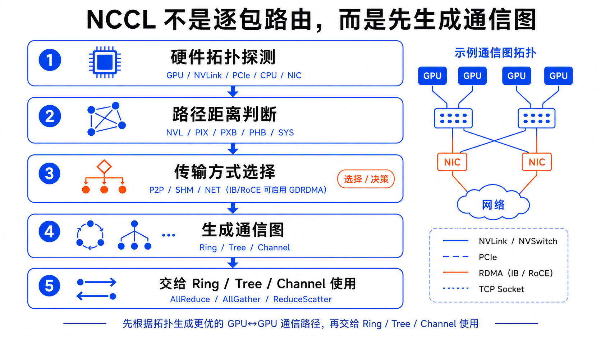
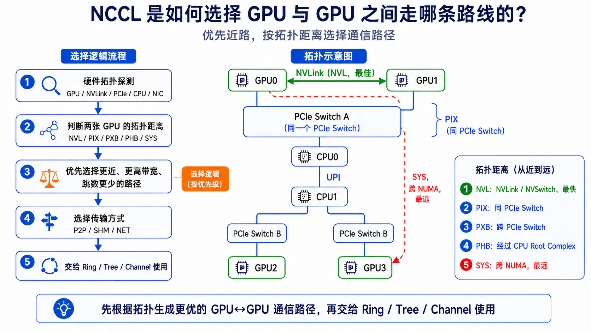
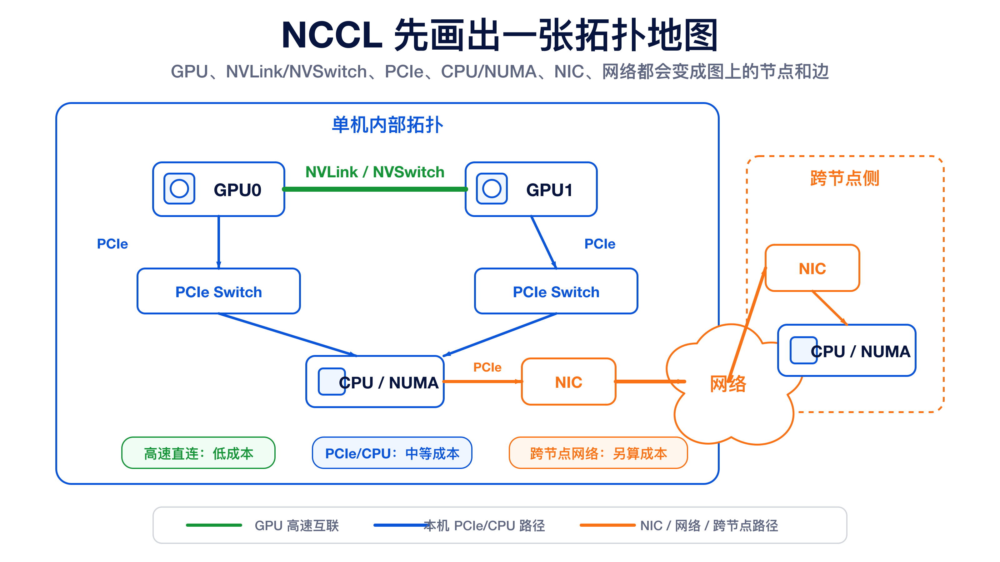
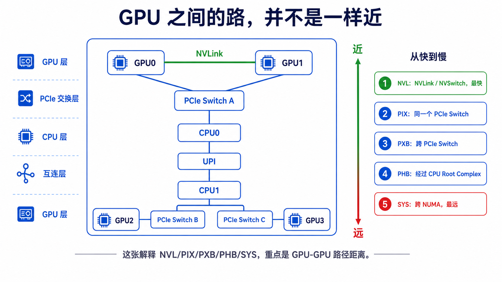
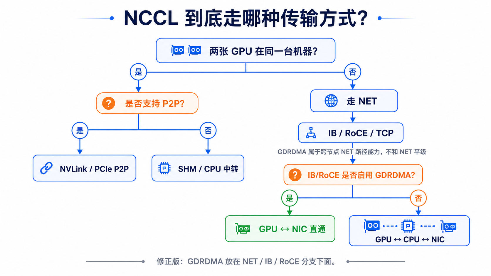
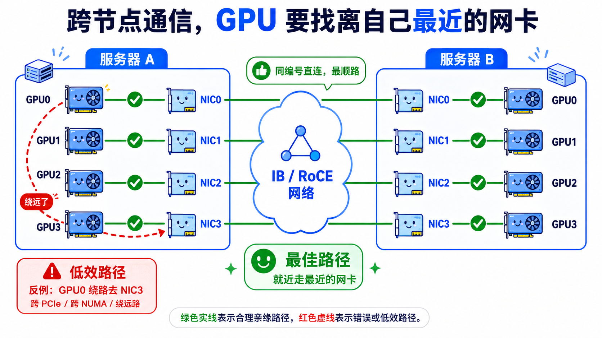
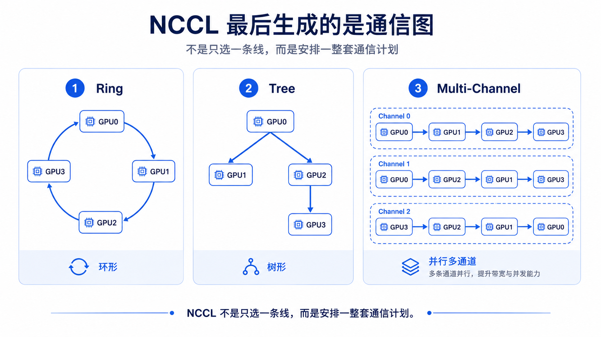
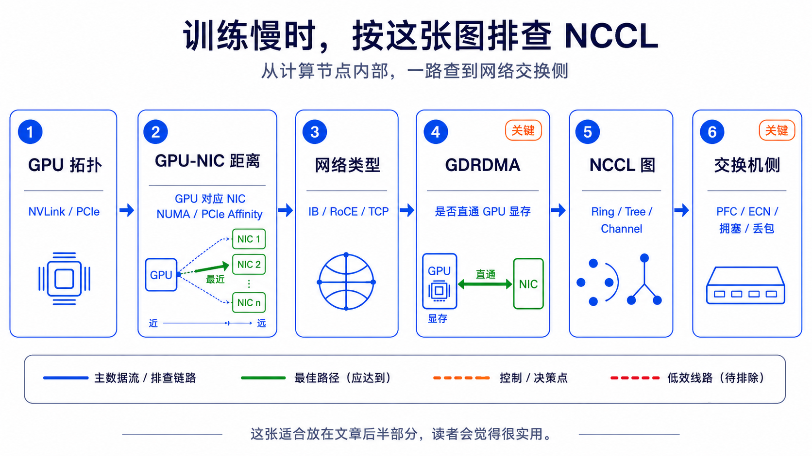

# GPU 之间不靠缘分：NCCL 是怎么安排路线的？


如果你把一台 AI 服务器想象成一座城市，那么 GPU 就是城市里的几个超级工厂。

训练大模型时，每个工厂都在高速生产，但它们不能各干各的。反向传播算完梯度之后，大家必须频繁同步结果：你算的梯度要给我，我算的梯度也要给你，最后所有 GPU 都拿到一致的数据，下一轮训练才能继续。

问题来了：

**GPU 和 GPU 之间到底怎么走？**

是走 NVLink？

走 PCIe？

绕一下 CPU？

还是出服务器，通过网卡去另一台机器？

这件事，就是 NCCL 背后最重要、也最容易被忽略的一部分。

NCCL 不只是一个“通信库”，它更像 GPU 集群里的地下交通调度系统。它要看清楚整座城市的道路，判断哪里是高速路，哪里是小巷，哪里要换乘，最后给 AllReduce、AllGather、ReduceScatter 这些通信操作安排一套尽可能快的路线。

这篇文章就聊清楚一件事：

**NCCL 是如何决定 GPU 和 GPU 之间走哪条路的。**

---

## 先说结论：NCCL 不是逐包路由，而是先画通信图

很多人会下意识地把 NCCL 想成网络设备：

> 数据从 GPU0 发到 GPU7，是不是像 IP 包一样，一跳一跳查路由表？

不是。

NCCL 的思路更接近这样：

1. 初始化时，先探测整台机器和整个集群的拓扑。
2. 判断 GPU、CPU、PCIe Switch、NVLink、NVSwitch、NIC 之间的距离和带宽。
3. 为某个 collective 操作生成通信图，比如 ring、tree 或多条 channel。
4. 真正通信时，数据按这个图被切成 chunk，在不同通道上流水传输。

所以，NCCL 选的不是“每一个数据包该怎么转发”，而是：

**这次 collective 通信应该让哪些 GPU 先和谁通信、走什么传输方式、开几条并行通道。**

这也是为什么同样是 8 张 GPU，不同机器上 NCCL 的行为可能完全不同。

一台机器有 NVSwitch，NCCL 的路线会非常舒服；

另一台机器只有 PCIe，并且跨 NUMA，NCCL 就得精打细算，尽量别让所有流量挤到最慢的那条路上。





---

## 第一步：NCCL 先摸清硬件拓扑

NCCL 初始化 communicator 时，会尽量了解这些信息：

- 机器里有几张 GPU
- GPU 之间有没有 NVLink 或 NVSwitch
- GPU 分别挂在哪些 PCIe Switch 下
- PCIe Switch 最后连到哪个 CPU Root Complex
- GPU 和网卡的距离远不远
- 网卡是 IB、RoCE 还是普通 TCP 网络
- 是否支持 GPUDirect RDMA
- 多机训练时，每个 rank 分布在哪台机器、哪张 GPU 上

你可以把这一步理解成 NCCL 在画一张地图。

但这张地图不是给人看的机房布线图，而是一张 **通信代价图**：GPU、NVLink/NVSwitch、PCIe、CPU/NUMA、NIC、网络，都会变成图上的节点和边。

极简地画出来，大概是这样：

```text
GPU0 -- NVLink/NVSwitch -- GPU1
 |                         |
PCIe                      PCIe
 |                         |
CPU/NUMA-0              CPU/NUMA-1
 |                         |
NIC0      -- 网络 --      NIC1
```



图里的每一条边，都不是简单的“能不能连通”，而是在告诉 NCCL：这条路大概有多近、多快、要不要绕 CPU、会不会跨 NUMA、能不能直接访问 GPU 显存。

每一条边都有成本：

- 带宽高不高
- 延迟低不低
- 是否需要经过 CPU
- 是否跨 NUMA
- 是否可以 P2P
- 是否可以 GDRDMA

NCCL 后续所有选路，都建立在这张拓扑图上。

---

## 第二步：判断 GPU 之间的“距离”

在单机内，GPU 与 GPU 的关系并不平等。

有些 GPU 离得很近，像隔壁工位；

有些 GPU 中间隔着 PCIe Switch，像要过一个路口；

有些 GPU 还要绕过 CPU 或跨 NUMA，像横穿半座城市。

如果是多路 CPU 服务器，中间还可能经过 CPU 间互连，比如 Intel 的 UPI/QPI，或者 AMD 的 Infinity Fabric。对 NCCL 来说，这通常意味着路径更远、代价更高。

常见距离可以粗略理解为：

```text
NVL  ：GPU 之间有 NVLink / NVSwitch，最快的一类
PIX  ：同一个 PCIe Switch 下，距离较近
PXB  ：跨多个 PCIe Switch
PHB  ：需要经过 PCIe Host Bridge / CPU Root Complex
SYS  ：跨 NUMA 或更远的系统级路径
```

你在机器上执行：

```bash
nvidia-smi topo -m
```

通常也能看到类似的拓扑关系。

这张表对理解 NCCL 非常重要。因为 NCCL 不会把所有 GPU-GPU 路径都当成一样快。

它会优先考虑更近、更宽、更直接的路径。

大体上，单机内的优先级可以这样看：

```text
NVLink / NVSwitch
  > PCIe P2P
    > Shared Memory / CPU 中转
```

当然，真实选择还会受消息大小、collective 类型、算法、环境变量、驱动能力等因素影响，但大方向就是：

**能走高速直连，就不要绕远路。**



---

## 第三步：选择传输方式

NCCL 内部有几类典型传输方式。

### 1. P2P：GPU 之间直接通信

如果两张 GPU 之间支持 Peer-to-Peer，NCCL 会尽量直接使用。

这可能走 NVLink，也可能走 PCIe P2P。

在 NVLink 或 NVSwitch 机器上，这通常是单机通信的黄金路线。数据可以在 GPU 显存之间高效搬运，不需要 CPU 频繁参与。

### 2. SHM：共享内存中转

如果 GPU 之间不能直接 P2P，NCCL 可能使用主机共享内存做中转。

这条路一般不如 P2P 理想，因为数据需要通过 CPU 内存绕一下。

但它仍然比完全走网络栈更适合单机内某些场景。

### 3. NET：跨节点网络通信

只要通信跨机器，就要走网卡。

这时 NCCL 会进入 NET 路径，常见后端包括：

- InfiniBand
- RoCE
- TCP Socket
- NCCL Net Plugin

AI 集群里常见的是 IB 或 RoCE。

如果支持 GPUDirect RDMA，网卡可以直接读写 GPU 显存，减少 CPU 内存中转。这样跨节点路径就更接近：

```text
GPU -> NIC -> 网络 -> NIC -> GPU
```

如果不支持，则可能变成：

```text
GPU -> CPU 内存 -> NIC -> 网络 -> NIC -> CPU 内存 -> GPU
```

这两条路径看起来只多了“CPU 内存”几个字，但性能差异可能非常明显。



---

## 多机时，NCCL 还要考虑 GPU 和 NIC 的亲缘关系

跨节点训练时，GPU 不是随便找一张网卡就发数据。

NCCL 会关心：

**这张 GPU 离哪张 NIC 最近？**

比如一台服务器有 8 张 GPU、8 张网卡。

理想情况下，每张 GPU 都能找到离自己比较近的 NIC：

```text
GPU0 -> NIC0
GPU1 -> NIC1
GPU2 -> NIC2
GPU3 -> NIC3
...
```

这就是很多 AI 服务器和集群网络设计里会强调的 GPU-NIC affinity。

如果 GPU0 明明离 NIC0 最近，却被迫绕到 NIC7 出口，数据就可能跨 PCIe、跨 CPU、跨 NUMA，路径变长，延迟变高，带宽也可能受影响。

在 RoCE 或 IB 集群里，多 rail 设计也很常见。

NCCL 会尽量利用多张网卡，把通信流量摊开，而不是所有数据都挤到一张网卡上。

所以，在多机训练里，NCCL 的选路不是只看“网络通不通”，而是看：

```text
GPU 到 NIC 的路径是否近
NIC 到对端 NIC 的网络是否快
对端 NIC 到对端 GPU 的路径是否近
```

这三段任何一段别扭，整体性能都会掉。



---

## 第四步：NCCL 生成 ring、tree 和 channel

有了拓扑之后，NCCL 还要把 collective 操作安排成具体通信图。

最经典的是 Ring AllReduce。

假设有 4 张 GPU，一个最简单的 ring 可以是：

```text
GPU0 -> GPU1 -> GPU2 -> GPU3 -> GPU0
```

但真实机器上，NCCL 不一定只建一条 ring。

它可能建多条 channel：

```text
Channel 0: GPU0 -> GPU1 -> GPU2 -> GPU3
Channel 1: GPU0 -> GPU2 -> GPU1 -> GPU3
Channel 2: GPU3 -> GPU2 -> GPU1 -> GPU0
```

数据会被切成多个 chunk，在多个 channel 上并行流动。

这样做有两个目的：

- 提高并行度，把多条链路都用起来
- 避免某一条慢链路成为唯一瓶颈

除了 ring，NCCL 也会使用 tree 等算法。

Tree 更像广播树或归约树，某些消息大小和拓扑下会比 ring 更合适。

你可以把它理解成：

```text
Ring：像环线地铁，大家按顺序传
Tree：像树状分发，数据逐层汇聚或扩散
Channel：像多条车道，同一批货拆开并行跑
```

因此，NCCL 选路的最终产物不是一句“GPU0 到 GPU1 走 NVLink”，而是一整套通信计划：

```text
使用什么算法
开几条 channel
每条 channel 的 rank 顺序是什么
每一跳使用 P2P、SHM 还是 NET
跨节点时用哪张网卡
```



---

## 一个直观例子：8 卡 NVSwitch 机器

如果一台 8 卡服务器内部有 NVSwitch，GPU 之间基本像接入同一个高速交换网络。

NCCL 看到的世界大概是：

```text
GPU0 \
GPU1  \
GPU2   \
GPU3 --- NVSwitch --- GPU4
GPU5   /
GPU6  /
GPU7 /
```

这种机器上，单机内 GPU-GPU 通信非常舒服。

NCCL 可以更积极地使用 NVLink/NVSwitch 路径，构造多条高带宽 channel。

所以你会看到 NVSwitch 机器做单机 8 卡训练时，AllReduce 性能通常很强。

它的关键不是“有 8 张 GPU”，而是“这 8 张 GPU 之间有非常好的内部高速路”。

---

## 另一个例子：普通 PCIe 8 卡机器

如果 8 张 GPU 挂在不同 PCIe Switch 和 CPU Root Complex 后面，情况就没那么轻松。

拓扑可能更接近：

```text
GPU0 GPU1 GPU2 GPU3
  \   |   |   /
   PCIe Switch A
        |
       CPU0
        |
      UPI/QPI
        |
       CPU1
        |
   PCIe Switch B
  /   |   |   \
GPU4 GPU5 GPU6 GPU7
```

这时 GPU0 到 GPU1 可能很近；

GPU0 到 GPU7 可能就要跨 CPU、跨 NUMA。

如果 ring 排得不好，通信可能频繁跨越最慢路径。

NCCL 的工作，就是尽量根据拓扑安排通信顺序，让近的 GPU 多走近路，让慢路径不要被无意义地反复打爆。

这也是为什么同样是 8 卡，训练性能可能差很多。

GPU 型号一样，不代表 GPU 之间的路一样。

---

## 排障时，怎么知道 NCCL 实际走了哪条路？

如果你想看 NCCL 到底怎么选，可以从三个层面入手。

### 1. 看硬件拓扑

```bash
nvidia-smi topo -m
```

重点看：

- GPU-GPU 之间是 NVLink、PIX、PXB、PHB 还是 SYS
- GPU 到 NIC 的距离
- NIC 是否分布在不同 NUMA 或 PCIe 域下

### 2. 打开 NCCL 日志

常用方式：

```bash
NCCL_DEBUG=INFO \
NCCL_DEBUG_SUBSYS=INIT,GRAPH,NET \
torchrun ...
```

你可以重点观察：

- NCCL 找到了哪些 NIC
- 是否启用了 IB/RoCE
- 是否使用 GDRDMA
- channel 是怎么排的
- rank 顺序是什么
- 是否出现 fallback 到 socket 或 shared memory 的迹象

### 3. 导出 NCCL 拓扑

可以设置：

```bash
NCCL_TOPO_DUMP_FILE=/tmp/nccl_topo.xml
```

这会把 NCCL 看到的拓扑导出来，适合深入分析。

如果你怀疑 NCCL 识别的拓扑和真实硬件不一致，这个文件很有价值。

---

## 几个常见环境变量

NCCL 有很多环境变量可以影响选路和传输方式。这里只列几个排障时经常遇到的。

### NCCL_DEBUG

控制日志级别。

```bash
NCCL_DEBUG=INFO
```

排查通信性能时，基本第一步就是打开它。

### NCCL_DEBUG_SUBSYS

控制看哪些子系统日志。

```bash
NCCL_DEBUG_SUBSYS=INIT,GRAPH,NET
```

如果你关心选路和网卡，`GRAPH`、`NET` 很有用。

### NCCL_P2P_LEVEL

控制 GPU-GPU P2P 在多远的拓扑距离内允许使用。

比如你可以用它限制或放开某些 P2P 路径。

### NCCL_NET_GDR_LEVEL

控制 GPU 和 NIC 之间在什么距离内启用 GPUDirect RDMA。

如果 GDRDMA 没生效，跨节点性能经常会差一截。

### NCCL_SOCKET_IFNAME / NCCL_IB_HCA

用于限制 NCCL 使用哪些网卡接口。

在多网卡、多 rail、管理网和业务网混在一起的机器上，这类变量非常关键。

否则 NCCL 可能选到你不想用的网口，比如管理网口。

---

## 一个非常实用的判断框架

当你遇到 NCCL 性能不符合预期时，不要一上来就怀疑框架或模型。

可以按这个顺序看：

```text
第一层：GPU 之间有没有高速互联？
第二层：GPU 到 NIC 的距离是否合理？
第三层：跨节点是否走 IB/RoCE，而不是 TCP？
第四层：GPUDirect RDMA 是否生效？
第五层：NCCL channel / ring / tree 排得是否符合拓扑？
第六层：交换机侧是否有拥塞、PFC、ECN、丢包或流控问题？
```



这几层从服务器内部一直延伸到数据中心网络。

很多 NCCL 问题，看起来是“训练慢”，本质却可能是：

- GPU 挂载位置不合理
- NIC 亲缘关系不对
- RoCE 配置不完整
- NCCL 选到了错误网卡
- 跨 NUMA 访问太多
- 网络出现拥塞或丢包

所以，理解 NCCL 选路，其实是在理解整个 AI 集群的数据流。

---

## 最后总结

NCCL 选择 GPU-GPU 路线，可以浓缩成一句话：

**先看拓扑，再选传输，再生成通信图。**

再展开一点：

```text
拓扑探测：GPU、PCIe、NVLink、NVSwitch、CPU、NIC
距离判断：NVL、PIX、PXB、PHB、SYS
传输选择：P2P、SHM、NET；NET 路径中再判断 GDRDMA
图生成：ring、tree、channel
运行执行：chunk 化、流水化、并行传输
```

NCCL 厉害的地方，不只是能把数据从 A 搬到 B。

真正厉害的是，它知道在复杂的 GPU 服务器和多机网络里，哪条路更像高速公路，哪条路只是绕行小路。

对 AI 集群来说，算力很重要，但算力之间的路同样重要。

GPU 再快，如果数据堵在路上，也只能原地等车。

理解 NCCL 的选路机制，就是理解大模型训练背后那张看不见、但每天都在决定性能上限的交通图。
