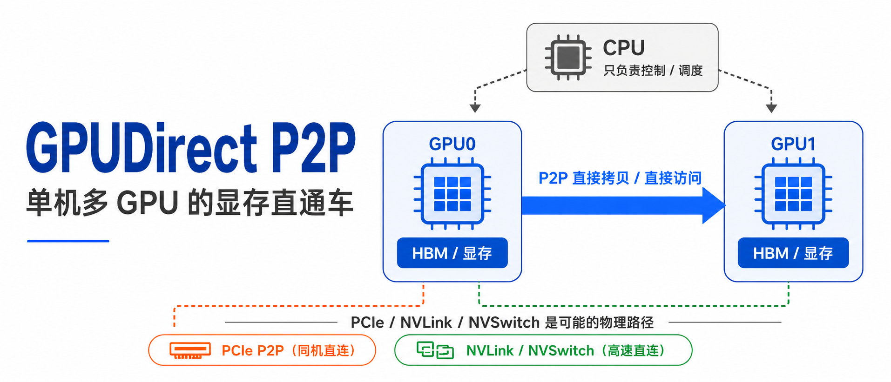
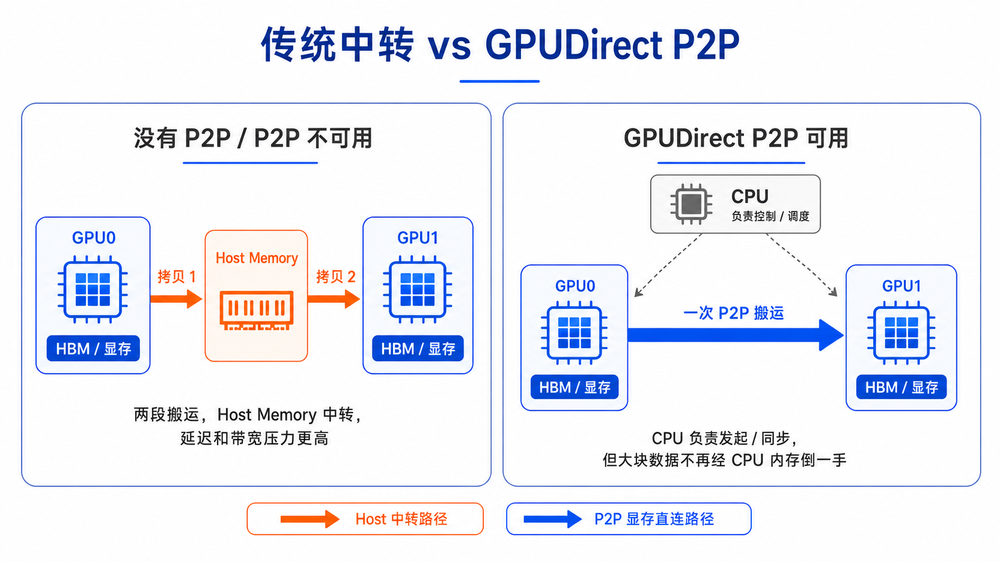
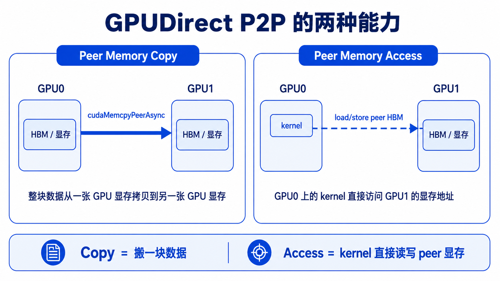
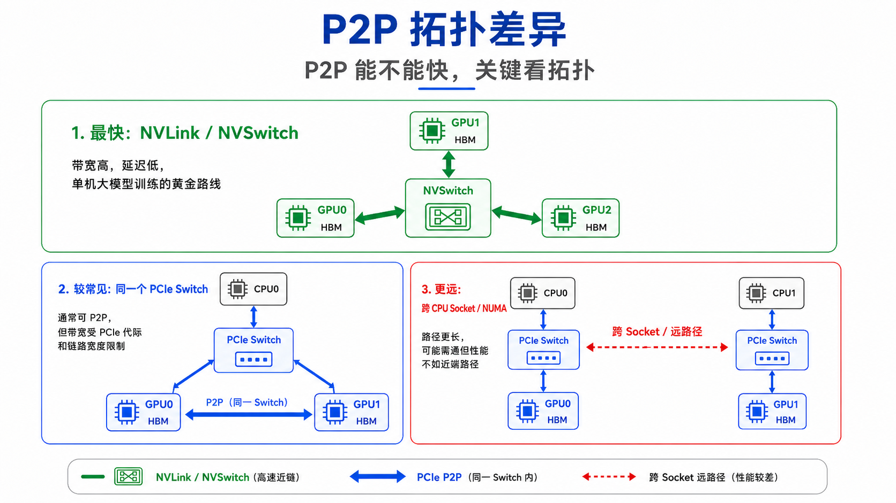
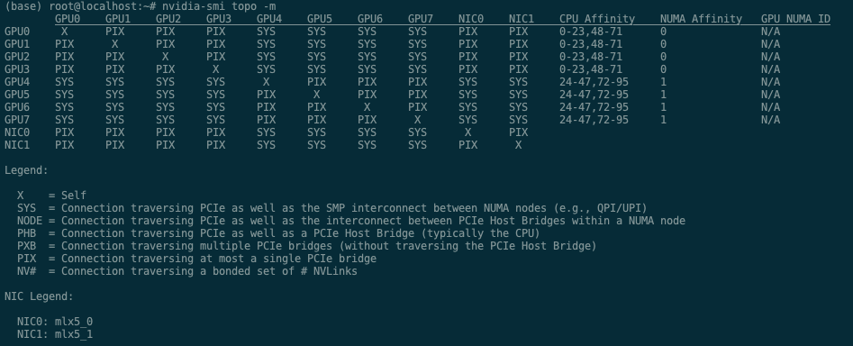
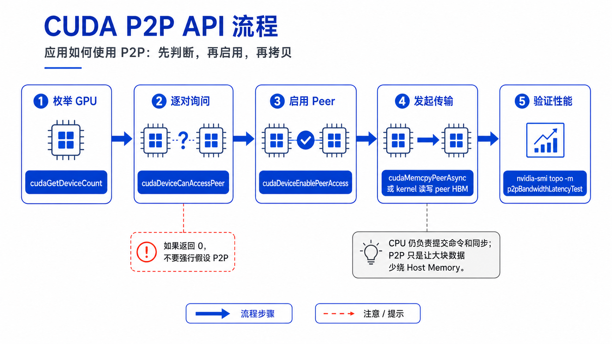
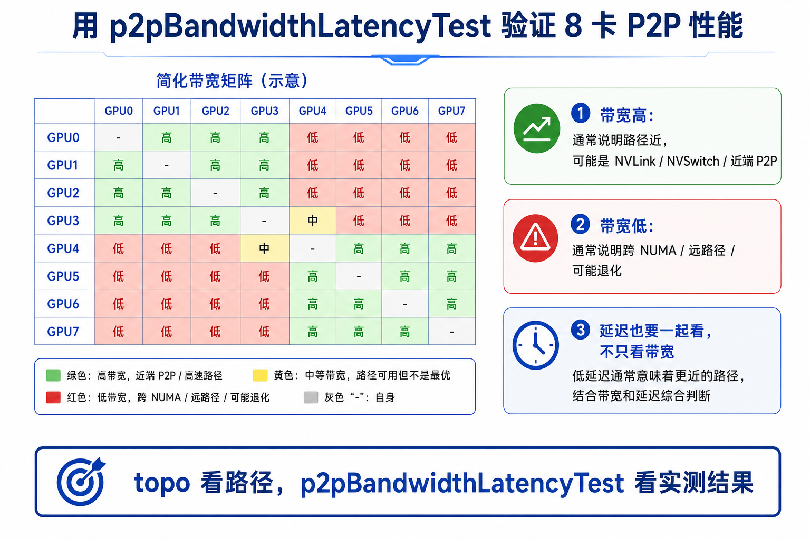
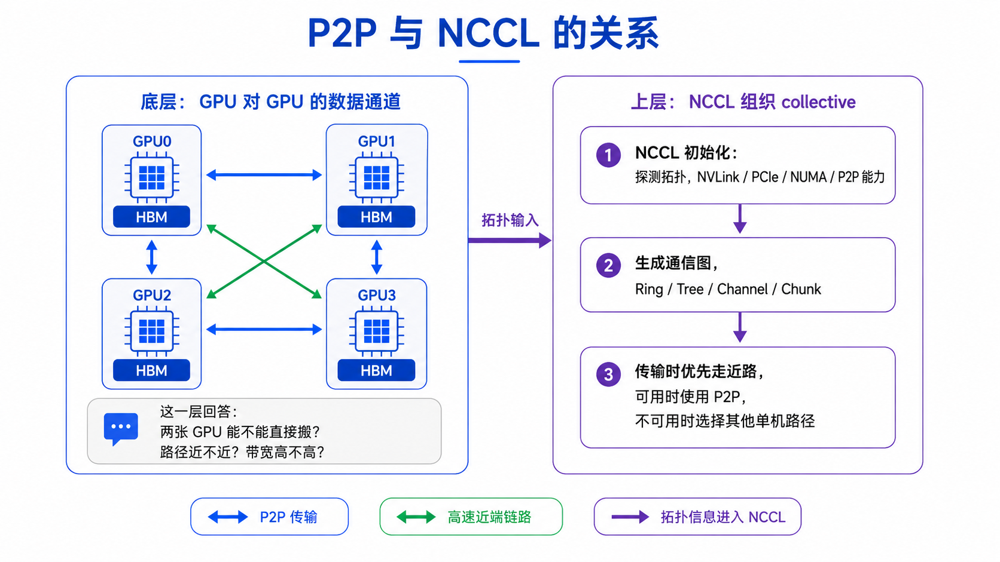

# GPUDirect P2P：单机多 GPU 的显存直通车



训练大模型时，一台服务器里往往不止一张 GPU，而是 4 张、8 张，甚至更多张 GPU。

这些 GPU 不能只顾自己算。反向传播之后要同步梯度，张量并行要交换中间结果，MoE 要把 token 分发给不同专家，流水线并行也要在相邻 stage 之间传递激活值。

问题来了：

**GPU0 的显存数据，要怎么送到 GPU1 的显存？**

最容易想到的路径是：

```text
GPU0 显存 -> CPU 内存 -> GPU1 显存
```

这当然能工作，但不够理想。原因是大块数据要先被搬到 Host Memory，再从 Host Memory 搬到另一张 GPU，相当于绕了一圈。

GPUDirect P2P 要解决的，就是这个绕路问题。

一句话：

> GPUDirect P2P 让同一台服务器内的 GPU 可以直接访问或拷贝另一张 GPU 的显存，尽量避免通过 CPU 内存中转。

---

## 一、传统中转 vs GPUDirect P2P：路径差在哪？

先用一张图对比两条路径：左边是没有 P2P 时的 Host Memory 中转，右边是 GPUDirect P2P 可用时的显存直连。



假设 GPU0 上有一块张量，要交给 GPU1。

如果 GPU0 和 GPU1 之间不能直接 P2P，常见路径会变成：

```text
GPU0 HBM -> PCIe -> CPU/Host Memory -> PCIe -> GPU1 HBM
```

这里有两个问题：

1. **多了一次搬运**

   原本只是 GPU0 到 GPU1 的数据交换，现在变成从 GPU0 到 Host，再从 Host 到 GPU1。

2. **CPU 内存路径被卷入**

   CPU 不一定亲自“算”这些数据，但 Host Memory、PCIe Root Complex、NUMA 路径都会参与，延迟和带宽都可能变差。

所以，P2P 的核心不是“CPU 完全消失”，而是：

```text
CPU 仍负责发起命令、提交任务、完成同步
但大块数据不再把 CPU 内存当中转仓库
```

这点很关键。GPUDirect P2P 并不是让 CPU 从流程里消失，而是让 CPU 不再当大数据搬运的中间站。

---

## 二、GPUDirect P2P 到底是什么？

这里的 P2P 指 Peer-to-Peer：

```text
GPUDirect Peer-to-Peer
```

它关注的是**同一台服务器内部**的 GPU 与 GPU 通信。

更具体地说，它包含两类能力：

```text
1. Peer Memory Copy
   GPU0 显存里的数据直接拷贝到 GPU1 显存

2. Peer Memory Access
   一个 GPU 上的 kernel 可以访问另一个 GPU 的显存地址
```

这两种能力可以这样区分：



`Copy` 更像“搬一块数据”，比如用 `cudaMemcpyPeerAsync` 把 GPU0 上的一段显存拷贝到 GPU1；`Access` 更像“远程读写”，GPU0 上的 kernel 可以通过 load/store 访问 GPU1 的 peer 显存地址。

从开发者角度看，它不是某一种单独线缆，也不是只等于 NVLink。

它更像一个能力层：

```text
只要硬件拓扑、驱动、CUDA Runtime 都允许
GPU A 就可以把 GPU B 当成 peer
然后通过合适的物理路径交换数据
```

这个物理路径可能是：

```text
PCIe
NVLink
NVSwitch
```

所以不要把这几个词混在一起：

| 名词 | 它是什么 |
|---|---|
| GPUDirect P2P | 单机内 GPU-GPU 直接访问/拷贝显存的能力 |
| PCIe | GPU 之间可能使用的一种物理通路 |
| NVLink | GPU 之间更高速的专用互联 |
| NVSwitch | 多 GPU 间的 NVLink 交换网络 |

可以这样记：

```text
GPUDirect P2P 解决“能不能显存直通”
NVLink/NVSwitch 解决“这条直通路够不够宽、够不够快”
```

简单记：P2P 从 Fermi 架构，也就是 Compute Capability 2.0 开始支持。今天常见的训练卡，比如 V100、A100/A800、H100/H800、H200、B200/GB200，通常都具备这项基础能力。

**支持 P2P，不等于任意两张 GPU 之间都能跑出一样的 P2P 性能。**

工程上想验证一对 GPU 支不支持 P2P，直接看三件事就行：

```text
1. cudaDeviceCanAccessPeer()
   看这个方向能不能启用 P2P

2. nvidia-smi topo -m
   看两张 GPU 之间路径近不近

3. p2pBandwidthLatencyTest
   看实际带宽和延迟表现
```

其中 `cudaDeviceCanAccessPeer()` 是“支持不支持”的判断，`nvidia-smi topo -m` 和 `p2pBandwidthLatencyTest` 是“路径好不好、跑得快不快”的判断。

还有一个容易被误解的上限：没有 NVSwitch 的系统里，限制不是“整台机器最多只能有 8 张 GPU”，而是**每张 GPU 最多启用 8 个 peer connection**。这里的 peer connection，可以简单理解成“一张 GPU 和另一张 GPU 之间打开的一条 P2P 访问关系”。

所以 8 卡机器一般没问题，因为一张 GPU 最多只需要连另外 7 张 GPU；如果一台机器里 GPU 更多，又没有 NVSwitch，就要留意这个上限。有 NVSwitch 的机器不受这个 8 peer connection 限制。

---

## 三、P2P 快不快，关键看拓扑

同样是 GPU0 到 GPU1，路径可能差很多。



### 1. NVLink / NVSwitch：最舒服的路径

如果 GPU 之间有 NVLink，或者通过 NVSwitch 组成全互联，P2P 通常会非常高效。

这类机器常见于：

```text
DGX
HGX
高端 8 卡 AI 服务器
```

在这种拓扑里，GPU-GPU 通信可以走专门的高速互联，不需要挤普通 PCIe 路径。对 AllReduce、AllGather、ReduceScatter、张量并行通信来说，这类链路非常重要。

### 2. 同一个 PCIe Switch：可以 P2P，但带宽受 PCIe 限制

有些服务器没有 NVLink/NVSwitch，但 GPU 挂在同一个 PCIe Switch 下面。

这种情况下，GPU 之间可能仍然可以 P2P：

```text
GPU0 -> PCIe Switch -> GPU1
```

它比 Host Memory 中转更直接，但带宽和延迟会受 PCIe 代际、链路宽度、Switch 设计影响。

比如 PCIe Gen4 x16 和 PCIe Gen5 x16，本身上限就不一样。

### 3. 跨 CPU Socket / NUMA：路径更远，性能可能明显下降

多路 CPU 服务器里，GPU0 可能挂在 CPU0 下，GPU1 可能挂在 CPU1 下。

这时路径可能变成：

```text
GPU0 -> PCIe -> CPU0 Root Complex -> CPU 间互联 -> CPU1 Root Complex -> PCIe -> GPU1
```

即使软件层面显示“可达”，这条路也比近端 GPU 路径更远。

所以单机多卡训练里，经常会关心：

```bash
nvidia-smi topo -m
```

这条命令能看到 GPU 之间的拓扑距离。常见标记可以粗略这样理解：

| 标记 | 粗略含义 |
|---|---|
| `NV#` | GPU 之间有 NVLink |
| `PIX` | 经过同一个 PCIe Switch |
| `PXB` | 跨多个 PCIe Switch |
| `PHB` | 经过 PCIe Host Bridge / Root Complex |
| `SYS` | 跨 NUMA 或系统级路径，更远 |

看这类表时，不要只看“通不通”，还要看“近不近”。

比如下面这台 8 GPU PCIe 服务器，`nvidia-smi topo -m` 会显示一种很典型的“双 NUMA 分组”：



可以看到，GPU0-GPU3 之间多为 `PIX`，GPU4-GPU7 之间也多为 `PIX`，说明组内路径相对近；但 GPU0-GPU3 与 GPU4-GPU7 之间多为 `SYS`，说明跨了 NUMA / 系统级路径，通信通常会更远、更慢。

图里的 NIC 列先不用展开，本章只关注单机内 GPU-GPU 的 P2P 路径。后面讲跨节点通信时，再把 GPU 和网卡的距离单独拿出来看。

---

## 四、应用怎么启用和验证 P2P？

从 CUDA Runtime API 角度看，典型流程是：



核心步骤可以简化成三步：

```text
第一步：先问 CUDA
GPU0 能不能直接访问 GPU1？
对应 API：cudaDeviceCanAccessPeer()

第二步：如果可以，就打开这条 peer 访问权限
让 GPU0 获得访问 GPU1 显存的能力
对应 API：cudaDeviceEnablePeerAccess()

第三步：开始传数据或直接访问
整块拷贝：cudaMemcpyPeerAsync()
直接访问：kernel load/store peer HBM
```

这里要注意方向：`GPU0 -> GPU1` 和 `GPU1 -> GPU0` 是两个方向。打开 `GPU0` 访问 `GPU1`，不等于自动打开 `GPU1` 访问 `GPU0`。如果程序需要双向访问，通常两个方向都要分别启用。

但实际工程里不要只看 API 返回成功，还要验证真实性能。常用办法有两个。

先用：

```bash
nvidia-smi topo -m
```

看拓扑距离。

再用 CUDA Samples 里的：

```text
p2pBandwidthLatencyTest
```

看 GPU-GPU 之间的实际带宽和延迟矩阵。



图里的“高 / 中 / 低”是为了说明读法，并不是固定带宽标准。真实数值会受到 GPU 型号、PCIe 代际、NVLink/NVSwitch、链路宽度、NUMA 拓扑和测试参数影响。

这类测试很有价值，因为它能直接告诉你：

```text
哪两张 GPU 之间 P2P 带宽高
哪两张 GPU 之间延迟低
哪些路径可能退化成了慢路径
```

---

## 五、P2P 和 NCCL 是什么关系？

NCCL 不是 GPUDirect P2P 本身。

NCCL 是上层通信库，负责把这些 collective 操作组织起来：

```text
AllReduce
AllGather
ReduceScatter
Broadcast
All-to-All 相关通信
```

而 GPUDirect P2P 是底层能力之一。



可以这样理解：

```text
P2P 回答：两张 GPU 能不能直接传数据？路径近不近？
NCCL 回答：一组 GPU 做 collective 通信时，应该按什么图、什么通道、什么顺序传？
```

NCCL 初始化时会探测拓扑，包括：

```text
GPU 数量
GPU 之间的 PCIe / NVLink / NVSwitch 关系
CPU / NUMA 距离
GPU 和网卡距离
P2P 能力
```

然后 NCCL 会为不同 collective 生成通信图，比如 ring、tree、channel。

在单机内，如果 GPU 之间 P2P 路径好，NCCL 通常会优先利用这些近路。如果 P2P 不可用或路径不理想，它会选择其他单机通信路径。

所以看 NCCL 性能时，P2P 是非常重要的一层，但不是全部。

---

## 六、几个常见误区

### 误区一：GPUDirect P2P 就是 NVLink

不是。P2P 是“GPU 显存能不能直接访问/拷贝”的能力；NVLink/NVSwitch 是可能承载这条路径的高速物理互联。

没有 NVLink 的机器，也可能通过 PCIe P2P 通信，只是性能会更依赖 PCIe 和 NUMA 拓扑。

### 误区二：支持 P2P 的 GPU，就一定很快

不一定。支持 P2P 只是前提，真正体验主要看 GPU 之间的路径：同一个 PCIe Switch、跨多个 Switch、跨 CPU Socket / NUMA，性能可能差很多。

### 误区三：有 P2P，CPU 就完全不参与

不准确。CPU 仍然负责程序控制、API 调用、任务提交和同步；P2P 优化的是大块数据路径，让 GPU 数据尽量少绕 Host Memory。

### 误区四：P2P 是跨服务器通信

本文只讲单机内 GPU-GPU 通信。跨服务器的 GPU、网卡和网络通信属于 GPUDirect RDMA，会放到后续章节单独讲。

---

## 七、这一章应该怎么记？

如果只记三句话：

```text
1. GPUDirect P2P = 单机内 GPU 显存之间尽量直接访问/拷贝。
2. 它不是 NVLink 本身；NVLink/NVSwitch 是让 P2P 更快的高速物理路径。
3. 真正能不能用、能不能快，要看 cudaDeviceCanAccessPeer、nvidia-smi topo -m 和实测带宽/延迟。
```

如果用一张最简单的路径图总结：

```text
传统路径：
GPU0 HBM -> Host Memory -> GPU1 HBM

P2P 路径：
GPU0 HBM -> GPU1 HBM

高性能 P2P 路径：
GPU0 HBM -> NVLink/NVSwitch -> GPU1 HBM
```

在 AI 集群里，这一章对应的是**节点内部 scale-up 通信**。

如果继续走出服务器，进入节点间通信，就会涉及网卡、RoCE/IB、NCCL NET，以及 GPUDirect RDMA。

---

## 参考资料

- [NVIDIA CUDA C Programming Guide：Multi-GPU Systems](https://docs.nvidia.com/cuda/cuda-programming-guide/03-advanced/multi-gpu-systems.html)
- [NVIDIA CUDA C Programming Guide 8.0 Archive：Peer-to-Peer Memory Access](https://docs.nvidia.com/cuda/archive/8.0/cuda-c-programming-guide/index.html#peer-to-peer-memory-access)
- [NVIDIA GPUDirect 技术总览](https://developer.nvidia.com/gpudirect)
- [NVIDIA CUDA Samples：p2pBandwidthLatencyTest](https://github.com/NVIDIA/cuda-samples/tree/master/cpp/5_Domain_Specific/p2pBandwidthLatencyTest)
- [NVIDIA CUDA GPUs：Compute Capability 查询](https://developer.nvidia.com/cuda-gpus)
