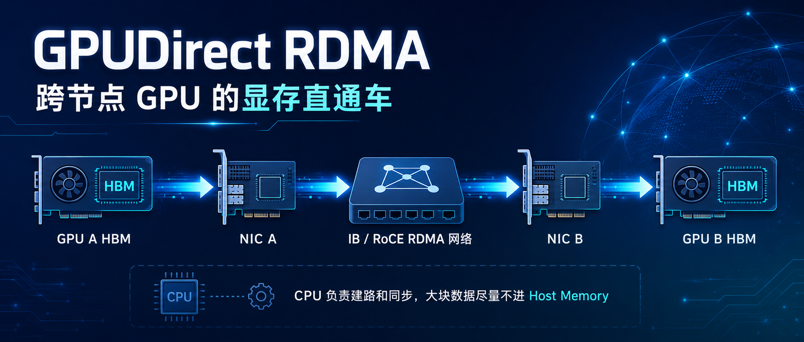
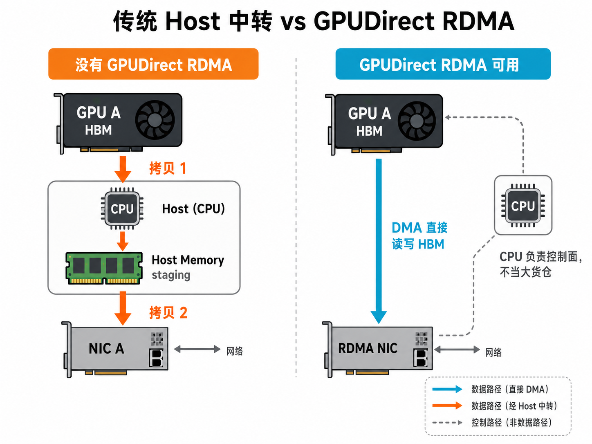
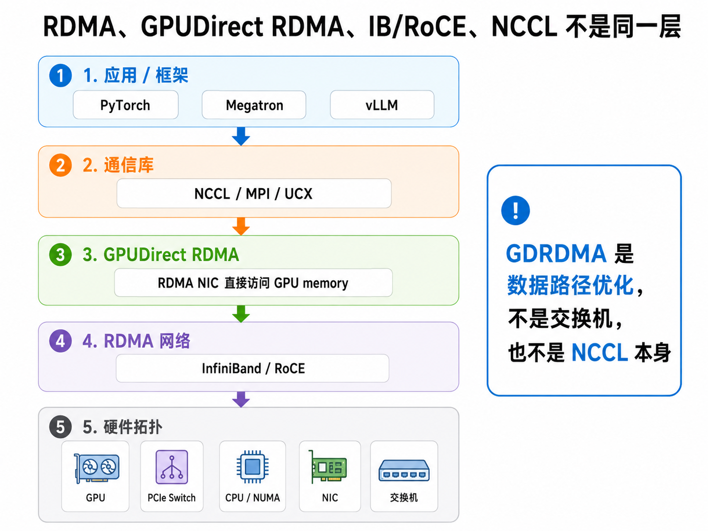
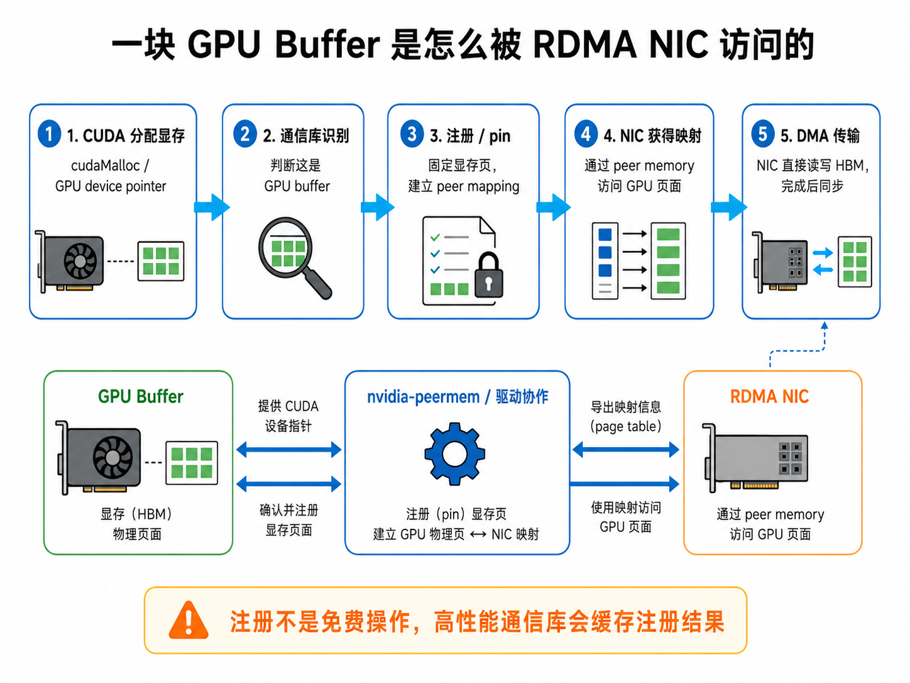
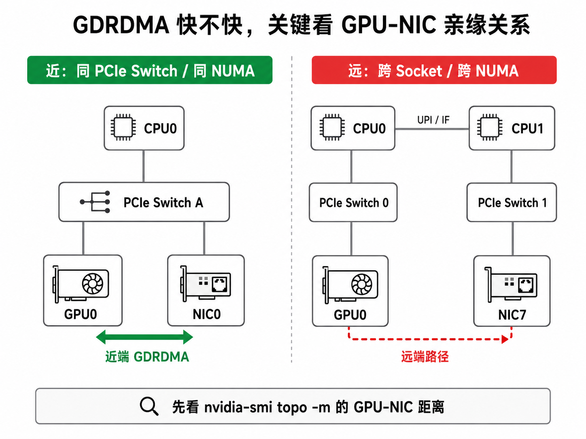
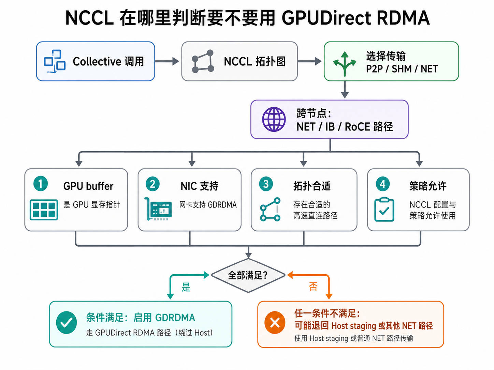
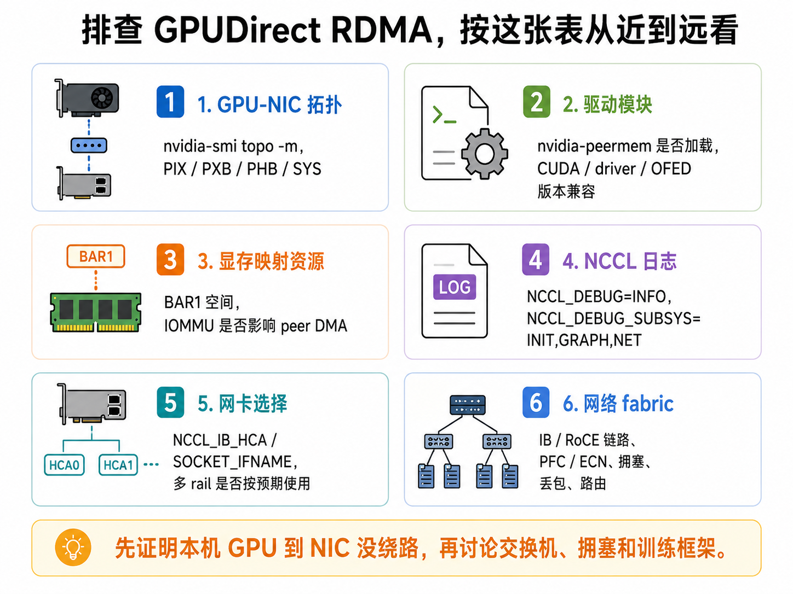

# GPUDirect RDMA：跨节点 GPU 的显存直通车



上一篇讲 GPUDirect P2P，关注的是同一台服务器里的 GPU 之间怎么传数据：

**GPU0 的显存数据，怎么送到 GPU1 的显存？**

如果两张 GPU 在同一台机器里，路径可能走 PCIe P2P、NVLink 或 NVSwitch。

但大模型训练通常不会只停在一台机器里。

一旦进入多机训练，问题就变成：

**节点 A 的 GPU 显存数据，怎么送到节点 B 的 GPU 显存？**

最容易想到的路径，是把 CPU 内存当中转站：

```text
GPU A 显存 -> CPU 内存 -> 网卡 -> 网络 -> 网卡 -> CPU 内存 -> GPU B 显存
```

这当然能工作，但每次跨节点通信都会多绕一次 Host Memory，PCIe 和内存带宽也会被卷进来。

GPUDirect RDMA 要解决的，就是这个跨节点通信里的绕路问题。

一句话：

> GPUDirect RDMA 让支持 RDMA 的网卡可以直接读写 GPU 显存，让跨节点 GPU 通信尽量避免通过 CPU 内存中转。

---

## 一、传统中转 vs GPUDirect RDMA：路径差在哪？

先看最直观的对比。



假设节点 A 上的 GPU0 有一块梯度，要发给节点 B 上的 GPU0。

如果没有 GPUDirect RDMA，常见路径是：

```text
发送端：
GPU HBM -> PCIe -> Host Memory -> PCIe -> NIC

网络中：
NIC -> IB / RoCE 网络 -> 对端 NIC

接收端：
NIC -> PCIe -> Host Memory -> PCIe -> GPU HBM
```

问题不在于 CPU 会不会亲自计算这些数据。

CPU 通常不会逐字节处理梯度。

问题在于，数据路径绕了一圈：

```text
Host Memory 变成了中转仓库
GPU 和 NIC 之间的数据不能直接走
```

有了 GPUDirect RDMA，理想路径会接近：

```text
发送端：
GPU HBM -> PCIe -> RDMA NIC

网络中：
NIC -> IB / RoCE 网络 -> 对端 NIC

接收端：
RDMA NIC -> PCIe -> GPU HBM
```

也就是：

```text
GPU HBM -> NIC -> 网络 -> NIC -> GPU HBM
```

CPU 仍然在场。

它负责创建队列、注册内存、提交通信请求、处理同步和错误。

但大块数据不再把 CPU 内存当作必经中转站。

这点和 GPUDirect P2P 很像：

```text
P2P 优化的是单机内 GPU-GPU 路径
RDMA 优化的是跨节点 GPU-NIC-GPU 路径
```

---

## 二、先把几个词分清楚

GPUDirect RDMA 这几个字里，容易混进很多概念：

```text
RDMA
InfiniBand
RoCE
GPUDirect
NCCL
GDRDMA
nvidia-peermem
```

它们不是同一层东西。

其中 `GDRDMA` 可以简单理解成 GPUDirect RDMA 的常见缩写，后面会混用这两个说法。



可以这样理解。

### 1. RDMA 是一种网络内存访问能力

RDMA 的全称是 Remote Direct Memory Access。

它的核心思想是：

```text
一台机器的网卡，可以直接读写另一台机器上的一块内存
```

这类操作尽量绕开传统 TCP/IP 栈里的多次拷贝和内核路径，降低 CPU 开销和延迟。

AI 集群里常见的 RDMA 承载方式是：

```text
InfiniBand
RoCE
```

InfiniBand 是专门的高性能互联网络。

RoCE 是 RDMA over Converged Ethernet，也就是在以太网上承载 RDMA。

所以不要把 RDMA 直接等同于某一种线缆或交换机。

RDMA 是能力，IB/RoCE 是常见承载方式。

RDMA 自己还有一整套队列、内存注册、QP、CQ、verbs、可靠传输和拥塞控制等机制。这里先不展开，后面有时间可以单独开一章讲 RDMA 本身，这篇先把它放在 GPUDirect RDMA 的语境里理解。

### 2. GPUDirect RDMA 让 GPU 显存进入 RDMA 数据路径

普通 RDMA 访问的是主机内存。

GPUDirect RDMA 进一步让 RDMA NIC 直接访问 GPU 显存。

也就是：

```text
普通 RDMA：
NIC <-> Host Memory

GPUDirect RDMA：
NIC <-> GPU HBM
```

严格说，网卡并不是“神奇地连到显存颗粒上”。

它仍然通过 PCIe 和 GPU 交互。

NVIDIA GPU 驱动会把 GPU 显存相关页面通过 BAR 映射等机制暴露给支持的对等 PCIe 设备，RDMA NIC 才能发起 DMA 读写。

### 3. NCCL 是上层通信库

NCCL 不是 GPUDirect RDMA 本身。

NCCL 更像 GPU 集群里的通信调度系统。

如果你想进一步了解 NCCL 本身，可以回看前面几篇 NCCL 章节，比如 Ring AllReduce、Tree AllReduce、ReduceScatter / AllGather，以及 NCCL 是怎么给 GPU 安排通信路线的；这里先重点看它如何用到底层的 GPUDirect RDMA 路径。

它负责组织：

```text
AllReduce
AllGather
ReduceScatter
Broadcast
All-to-All / send-recv
```

跨节点时，NCCL 会进入 NET 路径。

如果底层是 IB/RoCE，并且 GPU-NIC 拓扑、驱动和环境变量都允许，NCCL 就可能使用 GPUDirect RDMA。

所以可以这样记：

```text
RDMA 回答：网卡能不能直接访问远端内存？
GPUDirect RDMA 回答：网卡能不能直接访问 GPU 显存？
NCCL 回答：多张 GPU 做 collective 时，应该怎么组织这些传输？
```

---

## 三、一块 GPU Buffer 是怎么被网卡直接访问的？

从应用视角看，我们只是把一个 GPU tensor 交给通信库。

但底下会发生一串事情。



可以简化成五步。

### 第一步：CUDA 分配 GPU 显存

比如框架里有一个 CUDA tensor，它背后是一段 GPU device memory。

从 CUDA 层看，可能类似：

```text
cudaMalloc()
```

或者由 PyTorch、TensorFlow、JAX 等框架间接管理。

### 第二步：通信库识别这是 GPU 指针

NCCL、MPI、UCX 这类通信库需要知道：

```text
这个 buffer 在 CPU 内存里？
还是在 GPU 显存里？
```

如果它是 GPU buffer，通信库才会走 CUDA-aware / GPU-aware 的路径。

### 第三步：注册和固定 GPU 显存

要让网卡直接访问 GPU 显存，驱动需要把相关 GPU 页面固定下来，并建立可供对等 PCIe 设备使用的映射。

这一步可以简单理解成：

```text
告诉系统：这块 GPU 显存接下来要被网卡访问
请把访问它所需的映射关系准备好
```

这里会涉及 GPU BAR space。

BAR 可以粗略理解成 PCIe 设备暴露出来的一段地址窗口，其他 PCIe 设备可以通过这个窗口访问它的资源。

GPUDirect RDMA 就会消耗这类映射资源。

### 第四步：RDMA NIC 获得可访问的映射

NVIDIA 驱动提供的 `nvidia-peermem` 模块，可以让 Mellanox / NVIDIA InfiniBand HCA 这类 RDMA 网卡通过 peer memory 机制访问 GPU 显存。

从 CUDA 11.4 开始，`nvidia-peermem` 作为 NVIDIA GPU 驱动包提供的内核模块出现。

很多排障现场都会先看它：

```bash
lsmod | grep nvidia_peermem
```

如果没有加载，常见做法是：

```bash
modprobe nvidia-peermem
```

注意模块文件名里是连字符，`lsmod` 里通常会显示成下划线。

### 第五步：NIC 直接 DMA 读写 GPU HBM

当映射和队列都准备好后，网卡的 DMA engine 就可以直接搬数据。

发送时，网卡可以从 GPU 显存读数据。

接收时，网卡可以把网络上收到的数据写入 GPU 显存。

但这里还有一个重要细节：

**同步和内存可见性仍然要认真处理。**

网卡写完 GPU 显存，不代表某个正在运行的 GPU kernel 立刻就能按预期顺序看到这次写入。

真实通信库会通过 CUDA stream、event、任务提交和完成队列等机制保证顺序。

对普通训练用户来说，不需要手写这些细节；但排障时要知道：

```text
GDRDMA 是独立的数据路径
不是“写进显存后所有 GPU 代码自动无条件立刻感知”
```

---

## 四、GDRDMA 快不快，关键看 GPU-NIC 亲缘关系

和 GPUDirect P2P 一样，GPUDirect RDMA 也不是“支持了就一定快”。

它最怕的是：

```text
GPU 和 NIC 离得太远
```



### 1. 最理想：GPU 和 NIC 在近端 PCIe 路径上

比如 GPU0 和 NIC0 挂在同一个 PCIe Switch 下，或者至少在同一个 CPU / NUMA 域内。

这时路径类似：

```text
GPU0 -> PCIe Switch -> NIC0
```

对多机训练来说，这就是比较舒服的出口。

如果一台服务器有 8 张 GPU 和 8 张 NIC，工程上经常会希望形成类似映射：

```text
GPU0 -> NIC0
GPU1 -> NIC1
GPU2 -> NIC2
...
```

这就是常说的 GPU-NIC affinity。

### 2. 可以工作但更慢：经过 CPU Root Complex

如果 GPU 和 NIC 不在同一个 PCIe Switch 下，但还在同一个 CPU / NUMA 域内，路径可能经过 CPU Root Complex。

这不一定不能用。

但延迟和带宽可能不如近端路径。

尤其是某些平台上，peer-to-peer read 的性能会比较受限。

### 3. 最别扭：跨 CPU Socket / 跨 NUMA

如果 GPU 在 CPU0 这一侧，NIC 在 CPU1 这一侧，路径可能变成：

```text
GPU -> PCIe -> CPU0 -> UPI / Infinity Fabric -> CPU1 -> PCIe -> NIC
```

这就明显远了。

即使某些系统里能跑，性能也可能很差，甚至稳定性不如预期。

所以不要只问：

```text
这台机器有几张网卡？
```

更应该问：

```text
每张 GPU 离哪张 NIC 最近？
NCCL 真的用了那张近端 NIC 吗？
```

---

## 五、怎么在机器上看 GPU-NIC 距离？

第一条命令仍然是老朋友：

```bash
nvidia-smi topo -m
```

在 GPUDirect P2P 文章里，我们主要看 GPU 和 GPU 之间的距离。

讲 GPUDirect RDMA 时，要重点看 GPU 和 NIC 之间的距离。

常见标记可以粗略这样理解：

| 标记 | 粗略含义 |
|---|---|
| `PIX` | GPU 和 NIC 经过同一个 PCIe Switch，通常比较近 |
| `PXB` | 中间跨多个 PCIe Switch |
| `PHB` | 需要经过 PCIe Host Bridge / CPU Root Complex |
| `SYS` | 跨 NUMA 或系统级路径，更远 |

比如你看到：

```text
        GPU0  GPU1  mlx5_0  mlx5_1
GPU0     X    NV#    PIX     SYS
GPU1    NV#    X     SYS     PIX
```

可以粗略读成：

```text
GPU0 更适合走 mlx5_0
GPU1 更适合走 mlx5_1
```

如果你发现所有 GPU 到所有 NIC 都是 `SYS`，那就要小心了。

这通常意味着：

```text
GPU-NIC 路径跨 NUMA
或者硬件插槽/拓扑设计不适合高性能 GDRDMA
```

还可以看 PCIe 树：

```bash
lspci -t
```

它能帮助你看 GPU 和 NIC 最后挂在哪个 Root Complex 或 PCIe Switch 下面。

---

## 六、NCCL 是怎么用 GPUDirect RDMA 的？

跨节点训练时，NCCL 大体会经历这样的判断：



可以简化成几层。

### 第一层：这次通信跨不跨节点？

如果是单机内通信，NCCL 主要考虑：

```text
P2P
SHM
NVLink / NVSwitch / PCIe
```

如果跨节点，就要进入 NET 路径。

### 第二层：NET 路径用什么后端？

常见可能是：

```text
IB / RoCE
TCP Socket
NCCL Net Plugin
```

AI 集群里，如果你期望走高性能训练网络，通常希望 NCCL 走 IB/RoCE，而不是普通 TCP。

### 第三层：GPU buffer 能不能走 GDRDMA？

NCCL 会结合：

```text
buffer 类型
GPU-NIC 拓扑距离
网卡和驱动能力
环境变量策略
```

如果条件合适，就启用 GPUDirect RDMA。

如果条件不合适，就可能退回 Host staging 或其他路径。

所以看 NCCL 跨节点性能时，不要只看“IB 已经启用了”。

还要继续问：

```text
IB/RoCE 已启用
那 GDRDMA 是否也启用了？
GPU 到 NIC 的路径是否合理？
```

---

## 七、几个非常常用的 NCCL 环境变量

排查 GDRDMA 时，下面几个变量很常见。

### 1. NCCL_DEBUG

打开 NCCL 日志：

```bash
NCCL_DEBUG=INFO
```

### 2. NCCL_DEBUG_SUBSYS

只看初始化、拓扑图和网络相关信息：

```bash
NCCL_DEBUG_SUBSYS=INIT,GRAPH,NET
```

组合起来：

```bash
NCCL_DEBUG=INFO \
NCCL_DEBUG_SUBSYS=INIT,GRAPH,NET \
torchrun ...
```

完整的 benchmark 命令放到后面的验证部分。这里先记住：看 GDRDMA，`INIT`、`GRAPH`、`NET` 这三类日志最有用。

### 3. NCCL_IB_HCA

限制 NCCL 使用哪些 RDMA HCA：

```bash
NCCL_IB_HCA==mlx5_0,=mlx5_1
```

这里要注意，前一个 `=` 是 shell 赋值，后一个 `=` 是 NCCL 的精确匹配前缀。

否则 `mlx5_1` 这种写法可能同时匹配到 `mlx5_10`、`mlx5_11` 等名字。

多网卡机器里，这个变量很关键。

否则 NCCL 可能选到你不想用的 HCA。

### 4. NCCL_NET_GDR_LEVEL

这个变量控制 GPU 和 NIC 在多远的拓扑距离内允许使用 GPUDirect RDMA。

常见值可以按拓扑距离理解：

| 值 | 含义 |
|---|---|
| `LOC` | 不使用 GPUDirect RDMA |
| `PIX` | GPU 和 NIC 在同一个 PCIe Switch 下才使用 |
| `PXB` | 允许跨多个 PCIe Switch |
| `PHB` | 允许同 NUMA 内经过 CPU Root Complex |
| `SYS` | 允许跨 NUMA / 系统级路径 |

这个变量很有用，但不要乱开。

比如你为了“强制启用 GDRDMA”，直接设置：

```bash
NCCL_NET_GDR_LEVEL=SYS
```

它可能确实让 NCCL 更激进地用 GDRDMA。

但如果 GPU-NIC 路径跨 Socket、跨 NUMA，实际性能不一定更好。

很多时候更合理的思路是：

```text
先看拓扑
再判断应该允许到 PIX、PXB 还是 PHB
最后用 benchmark 验证
```

### 5. NCCL_NET_GDR_READ

这个变量控制发送方向是否让 NIC 直接从 GPU 显存读数据。

为什么还要单独提？

因为在某些 PCIe 平台上，网卡直接读 GPU 显存不一定比先写到 CPU 内存再发更快。

NCCL 文档里也提醒过：在一些平台上，直接从 GPU 显存读数据可能略慢。

所以不要把 GDRDMA 简化成：

```text
只要能直接读写 GPU 显存，就一定所有方向都更快
```

真实通信库会根据平台和默认策略做取舍。

---

## 八、IB / RoCE 和 GPUDirect RDMA 是什么关系？

GPUDirect RDMA 解决的是服务器内部这一段：

```text
GPU HBM <-> RDMA NIC
```

IB / RoCE 解决的是服务器之间这一段：

```text
NIC <-> 网络 <-> NIC
```

它们是连续路径上的不同部分，可以拆成三段：

```text
第一段：本机 GPU -> 本机 NIC
第二段：本机 NIC -> 网络 -> 对端 NIC
第三段：对端 NIC -> 对端 GPU
```

GPUDirect RDMA 主要优化第一段和第三段。

IB/RoCE 网络质量决定第二段。

所以，即使 GDRDMA 已经生效，跨节点通信仍然可能慢。

原因可能在网络 fabric：

```text
链路速率不一致
交换机拥塞
RoCE PFC / ECN / DCQCN 配置不完整
路由或 adaptive routing 不理想
多 rail 没有按预期分流
网络有丢包或 pause storm
```

反过来也一样。

即使网络是 400G / 800G，如果 GPU 到 NIC 的本机路径很远，GDRDMA 没生效，训练通信也可能吃不满。

所以这里抓住一个判断就够了：GDRDMA 解决“GPU 数据怎么高效出入网卡”，IB/RoCE fabric 解决“网卡之间怎么高效跨网络”。两段都顺，跨节点通信才顺。

---

## 九、怎么验证 GPUDirect RDMA 是否正常？

排查时不要一上来就改一堆环境变量。

按从近到远的顺序看。



### 1. 看 GPU-NIC 拓扑

```bash
nvidia-smi topo -m
lspci -t
```

重点看：

```text
每张 GPU 离哪张 NIC 最近
是不是大量 GPU-NIC 路径都是 SYS
多 rail 是否有清晰的一一映射
```

### 2. 看 nvidia-peermem 是否加载

```bash
lsmod | grep nvidia_peermem
```

如果没加载：

```bash
modprobe nvidia-peermem
```

如果系统里还残留旧的 `nv_peer_mem`，也要注意冲突。

传统 GPUDirect RDMA 路径常看 `nvidia-peermem`；较新的 DMA-BUF 路径下，NCCL 可能不再依赖它。

### 3. 注意容器里的 RDMA 设备

大模型训练通常跑在 Docker 或 Kubernetes 容器里。

这里要注意：`nvidia-peermem` 是宿主机内核模块，应该在宿主机侧加载和排障；容器默认不能直接 `modprobe`，即使特权容器能执行，本质上也是在操作宿主机内核。

容器里还要能访问 RDMA 设备，例如：

```text
/dev/infiniband/*
```

否则 NCCL、UCX、MPI 这类库可能看不到 mlx5 HCA。

Docker 场景下，通常需要映射 `/dev/infiniband`，并配置合适的 `memlock`。

Kubernetes 场景下，通常通过 RDMA device plugin 来暴露设备。

所以排障时不要只看容器内的命令输出，也要同时看宿主机模块、容器设备映射和 NCCL 日志。

### 4. 看 BAR1 使用情况

```bash
nvidia-smi -q
```

找到类似：

```text
BAR1 Memory Usage
```

BAR1 是 GDRDMA 映射会消耗的重要资源之一。

如果出现 BAR 空间不足、注册失败、性能异常，BAR1 是值得看的地方。

另外，IOMMU、虚拟化和 BIOS 相关配置也可能影响 peer DMA。遇到“理论上支持、实际却跑不起来”的情况时，这类平台配置也要一起查。

### 5. 打开 NCCL 日志

使用 `nccl-tests` 的 `all_reduce_perf` 时，可以这样打开日志：

```bash
NCCL_DEBUG=INFO \
NCCL_DEBUG_SUBSYS=INIT,GRAPH,NET \
all_reduce_perf -b 8 -e 4G -f 2 -g 8
```

真实命令要按你的机器、容器和 GPU 数调整。

重点看：

```text
NET/IB 是否启用
使用了哪些 mlx5 设备
是否走了预期网卡
是否出现 GDR / GDRDMA 相关日志
是否 fallback 到 Socket
```

### 6. 做对照实验

为了判断 GDRDMA 的影响，可以做对照。

比如先用上面的默认命令跑一次，再临时禁用 GDRDMA 跑一次：

```bash
NCCL_NET_GDR_LEVEL=LOC \
NCCL_DEBUG=INFO \
NCCL_DEBUG_SUBSYS=INIT,GRAPH,NET \
all_reduce_perf -b 8 -e 4G -f 2 -g 8
```

如果禁用后跨节点带宽明显下降，说明 GDRDMA 对这台机器确实有帮助。

如果差异很小，甚至启用后更慢，就要回头看：

```text
GPU-NIC 拓扑是否太远
NCCL 是否选错 HCA
网卡 direct read 是否适合当前平台
网络 fabric 是否已经是瓶颈
```

有些 `perftest` 构建也支持用 GPU 显存做 RDMA benchmark，比如带 `--use_cuda` 之类参数的 `ib_write_bw`。

但不同发行版和编译选项差异较大，实际以你环境里的工具帮助信息为准。

---

## 十、几个常见误区

### 误区一：GPUDirect RDMA 就是 RDMA 网络

不是。RDMA / IB / RoCE 解决的是网卡和网络这一层，GPUDirect RDMA 解决的是 GPU 显存怎么进入 RDMA 数据路径。

### 误区二：有 IB / RoCE，就一定启用了 GDRDMA

不一定。NCCL 日志里看到 `NET/IB`，只能说明网络后端走了 IB / RoCE；还要继续看 GDR / DMA-BUF 等信息，或者做对照实验确认。

### 误区三：CPU 完全不参与

不准确。前面说过，CPU 仍然负责控制面；GPUDirect RDMA 优化的是大块数据路径，不是让 CPU 从系统里消失。

### 误区四：`NCCL_NET_GDR_LEVEL=SYS` 一定更快

不一定。`SYS` 只是放宽使用 GDRDMA 的拓扑距离，硬件路径绕远时，强行打开不一定有收益。

### 误区五：多网卡机器天然就能吃满带宽

也不一定。

多网卡只是提供了可能性。

真正要跑好，还要看：

```text
GPU-NIC 映射是否合理
NCCL 是否用了正确 HCA
rank 是否分布合理
rail 是否设计清楚
交换机是否有足够带宽和合理路由
```

### 误区六：GDRDMA 可以解决所有跨节点慢的问题

也不行。GDRDMA 只优化 GPU-NIC 这一段；网络 fabric、rail 规划、流控和路由仍然要单独排查。

---

## 十一、这一章应该怎么记？

如果只记三句话：

```text
1. GPUDirect RDMA = RDMA NIC 直接读写 GPU 显存，减少 Host Memory 中转。
2. 它不是 IB/RoCE 本身，也不是 NCCL 本身，而是 GPU-NIC 数据路径能力。
3. 真正能不能快，要看 GPU-NIC 拓扑、nvidia-peermem / DMA-BUF、BAR/IOMMU、NCCL 选路和网络 fabric。
```

这就是 GPUDirect RDMA 在 AI 集群里的位置：

**它不是整条高速公路，但它是 GPU 走出服务器时最关键的匝道。**

---

## 参考资料

- [NVIDIA GPUDirect 技术总览](https://developer.nvidia.com/gpudirect)
- [NVIDIA CUDA GPUDirect RDMA 文档](https://docs.nvidia.com/cuda/gpudirect-rdma/index.html)
- [NVIDIA NCCL 环境变量文档：NCCL_NET_GDR_LEVEL / NCCL_NET_GDR_READ](https://docs.nvidia.com/deeplearning/nccl/user-guide/docs/env.html#nccl-net-gdr-level-formerly-nccl-ib-gdr-level)
- [NVIDIA NCCL 环境变量文档：NCCL_IB_HCA](https://docs.nvidia.com/deeplearning/nccl/user-guide/docs/env.html#nccl-ib-hca)
- [NVIDIA NCCL Tests](https://github.com/NVIDIA/nccl-tests)
