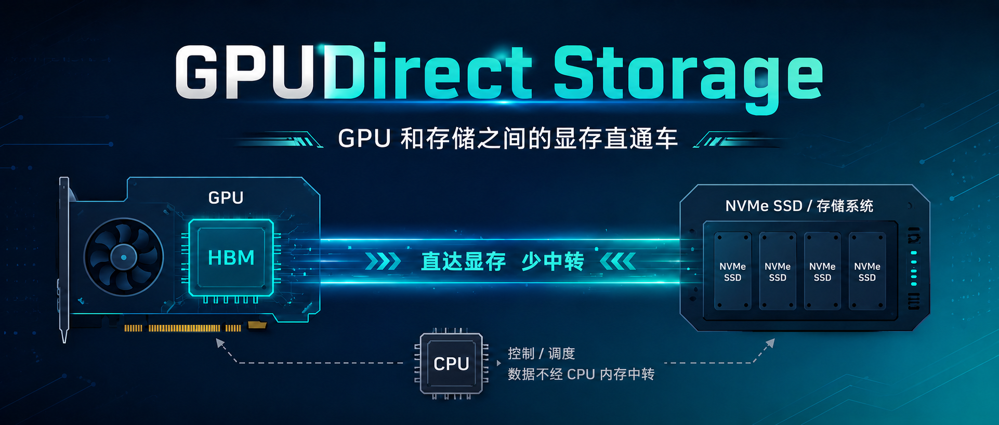
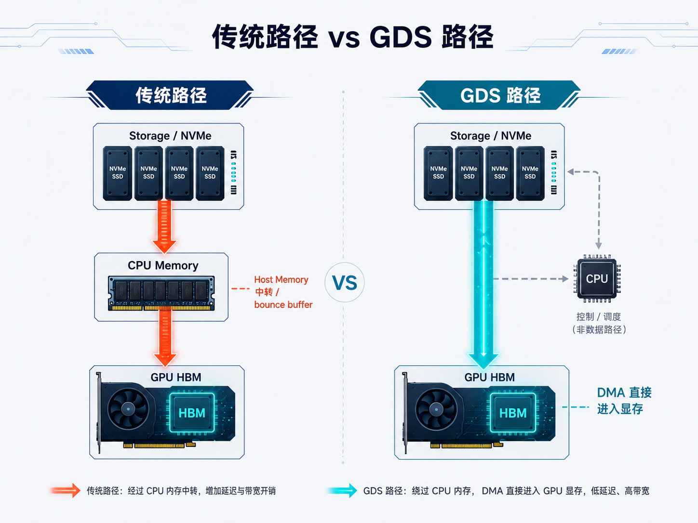
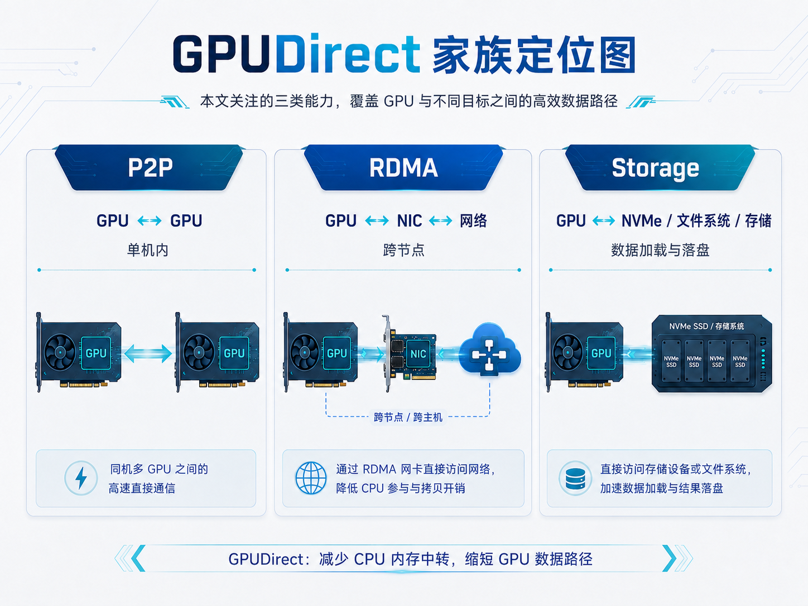
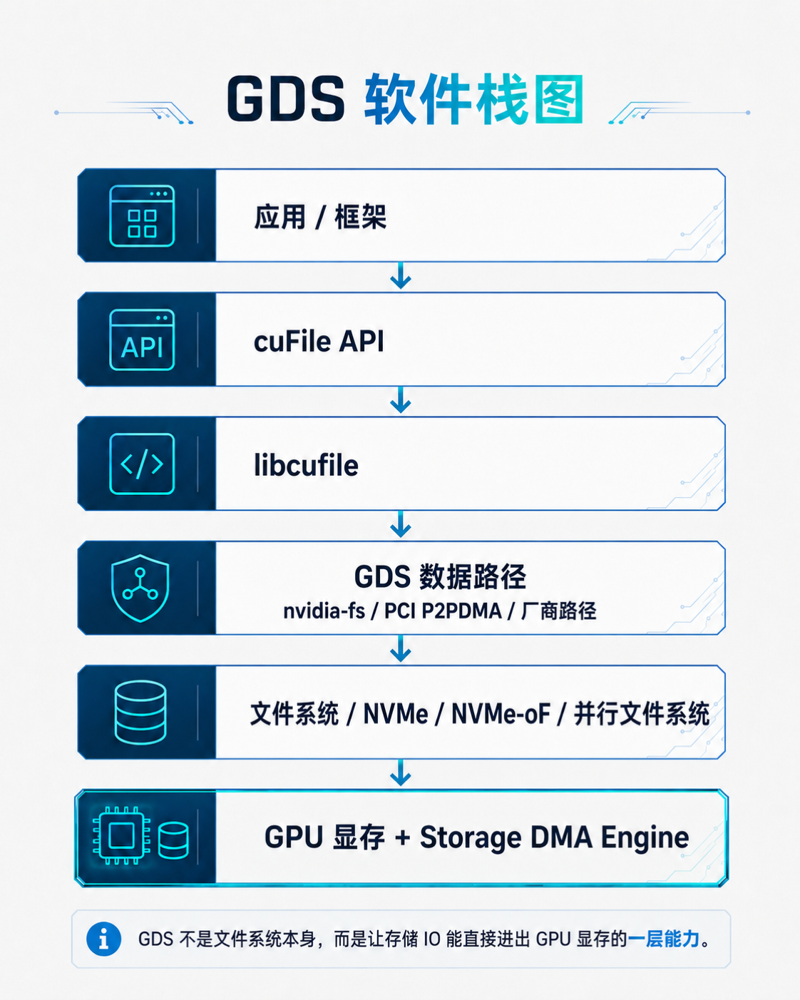
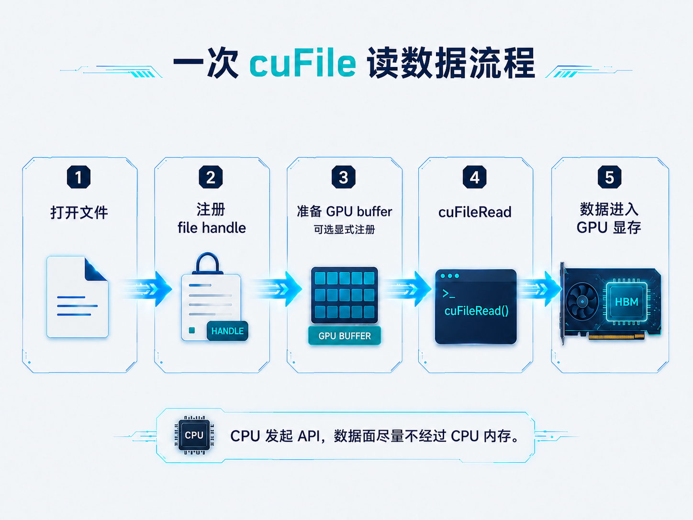
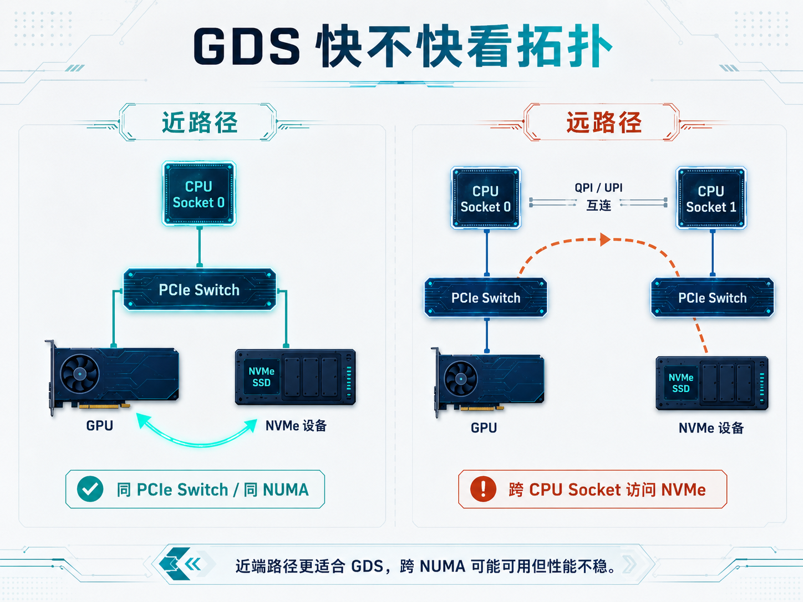
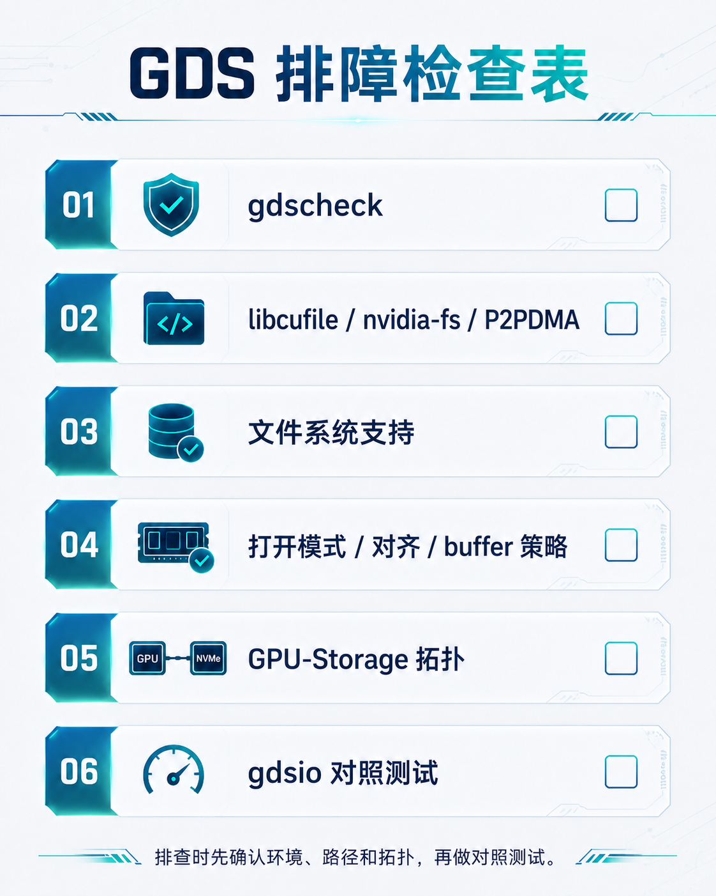

# GPUDirect Storage：GPU 和存储之间的显存直通车



前两篇讲了 GPUDirect P2P 和 GPUDirect RDMA。

P2P 解决的是：

**同一台服务器里，GPU0 的显存数据，怎么送到 GPU1 的显存？**

RDMA 解决的是：

**跨节点时，节点 A 的 GPU 显存数据，怎么送到节点 B 的 GPU 显存？**

但大模型系统里，还有一条路径每天都在疯狂跑：

**存储里的数据，怎么送到 GPU 显存？**

训练时，样本、tokenized 数据、embedding table、checkpoint，要从存储进入 GPU。

推理时，模型权重、KV cache 落盘、RAG 索引、离线批处理数据，也会不断和存储交互。

最容易想到的路径是：

```text
Storage / NVMe -> CPU Memory -> GPU 显存
```

这当然能工作。

但它有一个老问题：数据要先进入 CPU 内存，再拷贝到 GPU 显存。CPU 不一定亲自处理这些字节，但 Host Memory、PCIe、NUMA 路径、内存带宽都会被卷进来。

GPUDirect Storage 要解决的，就是这段绕路。

一句话总结：

> GPUDirect Storage，简称 GDS，是 NVIDIA 在 CUDA 生态中提供的一套 GPU 显存与存储之间的直接 IO 能力。应用通常通过 cuFile API 使用它，让存储数据尽量通过 DMA 直接进出 GPU 显存，减少 CPU 内存中转。

官方文档里常说的 bounce buffer，可以简单理解成“为了中转而临时借用的一块 CPU 内存缓冲区”。

本文主要讲基于文件系统的 `cuFile` 路径。

当前 GDS 还包括面向 S3 兼容对象存储的 `cuObject`，这篇先不展开。

文中的“GPU 显存”泛指 GPU device memory；配图里的 HBM，是 AI 训练 GPU 上常见的一种显存实现。

---

## 一、传统路径 vs GDS 路径：差在哪？

先看最直观的对比。



假设 GPU 要读取一批训练样本，数据在本机 NVMe 或后端存储系统里。

没有 GPUDirect Storage 时，常见路径会是：

```text
Storage / NVMe -> PCIe -> CPU Memory -> PCIe -> GPU 显存
```

如果是写 checkpoint，方向反过来：

```text
GPU 显存 -> PCIe -> CPU Memory -> PCIe -> Storage / NVMe
```

这条路径的问题不是“CPU 会不会计算这些数据”。

很多时候 CPU 只是发起 IO、管理页缓存、提交拷贝、做同步。

真正的问题是：

```text
CPU Memory 成了数据中转站
```

于是大块数据要多走一段：

```text
Storage -> Host Memory
Host Memory -> GPU 显存
```

有了 GPUDirect Storage，理想路径会变成：

```text
Storage / NVMe -> GPU 显存
```

或者写入时：

```text
GPU 显存 -> Storage / NVMe
```

CPU 仍然在场。

它负责打开文件、注册 file handle、按需显式注册 buffer、发起 `cuFileRead` / `cuFileWrite`、处理完成和错误。

但大块数据路径尽量不再把 CPU 内存当中转仓库。

所以 GDS 的核心不是：

```text
CPU 完全消失
```

而是：

```text
CPU 负责控制面
数据面尽量直接在 Storage 和 GPU 显存之间搬
```

这点和前两篇非常像：

```text
P2P：GPU ↔ GPU，少绕 Host Memory
RDMA：GPU ↔ NIC，少绕 Host Memory
Storage：GPU ↔ Storage，少绕 Host Memory
```

---

## 二、把 GPUDirect 家族放在一张图里

GPUDirect 不是单一技术，而是一组围绕 GPU 显存数据路径的能力。

下面列的不是全部 GPUDirect 技术，而是这个系列重点关注的三类能力。



可以这样记：

| 名称 | 关注的问题 | 典型路径 |
|---|---|---|
| GPUDirect P2P | 单机内 GPU 和 GPU 怎么直接交换显存数据 | GPU 显存 ↔ GPU 显存 |
| GPUDirect RDMA | 跨节点通信时，网卡怎么直接读写 GPU 显存 | GPU 显存 ↔ RDMA NIC ↔ 网络 |
| GPUDirect Storage | 存储 IO 怎么直接进出 GPU 显存 | GPU 显存 ↔ NVMe / 文件系统 / 存储 |

如果把 AI 集群的数据流分成几类：

```text
单机内通信：P2P
跨节点通信：RDMA
数据加载和落盘：Storage
```

GDS 对应的就是第三类。

它不是用来替代 NCCL 的，也不是用来替代 IB/RoCE 网络的。

它更像是在回答另一个问题：

```text
GPU 计算得很快，存储喂数据和写结果时，能不能少绕一点？
```

---

## 三、GDS 在系统里处在哪一层？

GPUDirect Storage 里容易混在一起的词也不少：

```text
GDS
cuFile
libcufile
nvidia-fs
NVMe
NVMe-oF
Lustre / WekaFS / NFS / BeeGFS ...
```

它们不是同一层东西。



可以先用三层来理解。

### 第一层：应用调用 cuFile

最上面是训练框架、数据加载器、checkpoint 系统、向量检索程序，或者自研 CUDA 应用。

`cuFile` 是应用使用 GDS 的主要 API 层。

你可以把它理解成：

```text
面向 GPU buffer 的文件 IO 入口
```

应用真正关心的是：

```text
我要把文件里的数据读到 GPU buffer
我要把 GPU buffer 写回文件
```

至于底下到底能不能绕开 CPU 内存，不应该让应用自己去硬猜，而是交给 cuFile、驱动和文件系统一起判断。

### 第二层：libcufile 选择并接上 GDS 路径

`libcufile` 是用户态库，应用链接或加载它之后，才能调用 cuFile API。

它会结合文件系统、配置和硬件能力，选择实际的数据路径。

不少 GDS 路径仍然会涉及 `nvidia-fs` 内核模块，也就是常见的 `nvidia-fs.ko` / `nvidia_fs`。

但 `nvidia-fs` 不是所有 GDS IO 的必经层。

从 CUDA 12.8 开始，满足平台和内核条件的本地 NVMe，可以通过 Linux PCI P2PDMA 路径工作，不再依赖 `nvidia-fs.ko`。部分分布式文件系统或用户态文件系统也可能使用厂商自己的实现。

这一层大致负责：

```text
识别这是 GPU buffer
判断文件和挂载点是否适合走 GDS
建立必要的映射和注册状态
在 nvidia-fs / PCI P2PDMA / 厂商路径之间选择
条件不满足时决定是否退回 compatibility mode
```

这里不用先背一堆 API 名字。下一节用一次读取流程把这些动作串起来。

### 第三层：文件系统和存储设备决定底层能不能直通

GDS 不是文件系统本身，也不是 NVMe SSD 本身。

它需要底层存储和文件系统配合。

这个底层可能是本地 NVMe，也可能是 NVMe-oF、并行文件系统，或者支持 GDS 的网络文件系统 / 用户态文件系统。

真正能不能走直通，取决于：

```text
CUDA / driver / libcufile 版本
文件系统是否支持
存储设备或存储网络是否支持
GPU 和存储设备的 PCIe / NUMA 拓扑
IO 对齐、buffer 注册和运行时配置
```

所以不要把 GDS 简化成：

```text
装了 CUDA，就一定所有文件都能直通 GPU
```

更准确的说法是：

```text
CUDA / cuFile 提供入口
libcufile 选择 nvidia-fs / PCI P2PDMA / 厂商数据路径
文件系统、存储设备和拓扑决定这条路能不能真的跑顺
```

工程上最后还是要看 `gdscheck`、日志和实测。

---

## 四、一次 GDS 读取大概发生了什么？

从开发者视角看，一次 GDS 读取大致可以这样理解。



流程可以先简化成五步：

```text
1. 应用打开文件
2. 把文件交给 cuFile 注册
3. 准备一块可复用的 GPU 显存 buffer，可选显式注册
4. 调用 cuFileRead 发起读取
5. 条件满足时，数据进入 GPU 显存
```

从语义上看，这仍然像一次文件读取。

只是目标地址不再是普通 CPU 内存，而是 GPU 显存地址。

其中 `cuFileHandleRegister()` 是文件 IO 流程中的必要步骤，`cuFileBufRegister()` 则是可选的性能优化。

如果没有显式注册用户 buffer，cuFile 可以使用内部预注册的 GPU buffer 完成 IO，但可能多一次 GPU 内部拷贝。

如果文件系统、驱动、buffer、拓扑和运行时配置都满足要求，数据路径就可以尽量绕开 CPU bounce buffer，直接进入 GPU 显存。

如果条件不满足，cuFile 可能报错，也可能退回 compatibility mode，也就是重新通过 CPU 内存 staging 完成 IO。

CPU 仍然发起 API。

但大块数据搬运由靠近存储的 DMA engine 完成。

这也是为什么官方文档会强调：cuFile API 是 CPU 发起的，不是 GPU kernel 自己在 GPU 上调用文件 IO。

所以这一节只要记住：

```text
cuFile 把“读文件”这件事，改造成“读到 GPU 显存”这件事。
GDS 负责尽量让数据面少绕 CPU 内存。
```

---

## 五、GDS 快不快，关键也看拓扑

听起来只要有 GDS，就应该很快。

但这句话和 P2P / RDMA 一样，只说对了一半。

GDS 能不能快，仍然要看物理路径。



最理想的情况是：

```text
GPU 和 NVMe / 存储出口在同一个 PCIe Switch 下
或者至少在同一个 NUMA 域内
```

这时路径更短：

```text
NVMe -> PCIe Switch -> GPU
```

如果 GPU 在 CPU Socket 0 侧，而 NVMe 或存储网卡在 CPU Socket 1 侧，路径可能变成：

```text
NVMe / NIC -> PCIe -> CPU1 -> UPI / Infinity Fabric -> CPU0 -> PCIe -> GPU
```

这种跨 NUMA 路径可能仍然可用，但性能、延迟和稳定性都更依赖平台。

所以看 GDS，不要只问：

```text
这台机器有没有 NVMe？
```

更应该问：

```text
GPU 离哪块 NVMe 最近？
GPU 离哪个存储网卡最近？
文件系统实际走的是哪条路径？
```

如果是本地 NVMe，可以看：

```bash
nvidia-smi topo -m
lspci -t
numactl -H
```

如果是远端存储，比如 NVMe-oF、NFS over RDMA、Lustre、WekaFS 这类路径，还要继续看：

```text
存储网络用的是哪张 NIC
这张 NIC 离 GPU 近不近
是否走 RDMA
文件系统客户端是否支持 GDS
```

这时 GDS 和前一篇 GPUDirect RDMA 会在工程上交汇：

```text
GPU 显存 ↔ NIC / NVMe ↔ 存储系统
```

本机 GPU 到存储出口这一段，仍然离不开 PCIe / NUMA 亲缘关系。

---

## 六、GDS 适合哪些场景？

GDS 不是所有 IO 的万能加速器。

它更适合这几类场景。

### 1. 大块连续数据加载

比如训练数据已经被预处理成较大的 shard、bin、record 文件。

GPU 需要不断读取大块数据。

这类场景里，减少 Host Memory 中转会比较有意义。

### 2. checkpoint 保存和加载

大模型训练里，checkpoint 可能非常大。

如果 GPU 上的参数、优化器状态、激活重算相关数据要频繁落盘或恢复，GDS 可以减少 GPU 显存和存储之间的数据绕路。

当然，checkpoint 性能不只看 GDS，还要看并行写入策略、文件系统元数据压力、存储后端带宽和网络拥塞。

### 3. GPU 原生数据处理流水线

有些数据处理、科学计算、视频处理、推荐系统、向量检索流程，会尽量让数据从读入开始就进入 GPU。

这种 pipeline 里，如果 CPU 只是中转，就容易变成瓶颈。

GDS 的目标就是让 GPU 成为数据的 first touch 和 last touch，也就是数据第一次被真正处理、最后被写出时，都尽量在 GPU 侧完成。

### 4. 推理系统里的权重和索引加载

大型推理服务里，模型权重、adapter、embedding、索引文件、离线批处理数据，都可能很大。

GDS 不会让模型计算更快，但可能改善数据进入 GPU 前的 IO 路径。

不过这类场景还经常受缓存、预取、调度、内存容量、文件组织方式影响。

所以不能只看“用了 GDS 没用”，还要看整体数据流。

---

## 七、怎么验证 GPUDirect Storage 是否正常？

排查 GDS 时，建议按这张表从环境、路径、拓扑到 benchmark 一层层看。



### 1. 先用 gdscheck 检查环境

最常用的是：

```bash
/usr/local/cuda-<x>.<y>/gds/tools/gdscheck.py -p
```

它会输出当前 GDS release、驱动配置、文件系统支持能力、NVMe / NVMe-oF / RDMA 状态、cuFile 配置等信息。

这里要注意：`gdscheck` 检查的是环境具备哪些能力，不代表某一次实际 IO 已经走了 direct path。

重点看：

```text
GDS 版本
nvidia_fs 版本
NVMe / NVMeOF / 文件系统显示 supported / p2pdma / compat 中的哪些能力
是否启用了 compat mode
PCIe ACS 是否影响 P2P
RDMA 相关库和设备是否可用
```

其中 `compat` 不是“坏掉了”的意思。

它表示 cuFile 可以在条件不满足时使用兼容路径，通常会经过 CPU 内存 staging；不代表当前所有 IO 都正在走 compat。

要确认某一次 IO 的真实路径，还要结合 `cufile.log`、cuFile / GDS 运行时统计，以及 `gdsio` 对照测试。

### 2. 看 libcufile 和实际使用的数据路径

常见检查包括：

```bash
ldconfig -p | grep libcufile
lsmod | grep nvidia_fs
```

没有看到 `nvidia_fs`，不一定代表 GDS 失效。

如果本地 NVMe 使用的是 PCI P2PDMA 路径，CUDA 12.8 及更高版本可以不依赖这个模块，具体要结合 `gdscheck` 输出判断。

如果是容器里运行应用，要注意两件事：

```text
nvidia-fs 如果被使用，它是宿主机内核模块
PCI P2PDMA 依赖宿主机内核、GPU 驱动和运行时配置
libcufile 和 CUDA / driver / container 镜像版本要匹配
```

容器里能不能看到库，不等于宿主机内核路径一定正常。

宿主机、容器镜像、CUDA 版本、驱动版本、文件系统客户端版本要一起看。

### 3. 确认文件系统支持

GDS 很依赖文件系统能力。

同样是“能读文件”，下面几种情况完全不同：

```text
普通 POSIX buffered IO
O_DIRECT 直接 IO
支持 GDS 的本地 NVMe 文件系统
支持 GDS 的远端并行文件系统
不支持 GDS 但 cuFile 可以兼容 fallback 的路径
```

如果文件系统不支持，或者 mount / open flag / 文件属性不满足要求，cuFile 可能报错，也可能进入 compatibility mode。

所以不要只看应用能不能跑。

还要看：

```text
它到底是 direct path
还是 CPU staging fallback
```

### 4. 看打开模式、对齐和 buffer 策略

高性能 GDS 路径经常会遇到这些细节：

CUDA 12.2 以前，cuFile 只支持以 `O_DIRECT` 打开的文件；CUDA 12.2 及以后也支持非 `O_DIRECT` 文件描述符。

但想获得 direct path 的性能收益，仍然要关注文件系统是否真正支持高效的直接 IO。

```text
IO size 是否合适
file offset 是否对齐
buffer 地址是否对齐
是否频繁注册 / 反注册 GPU buffer
是否使用 O_DIRECT，以及当前文件系统如何处理这种打开方式
```

如果每次 IO 都做一次注册 / 反注册，或者 IO 太小，GDS 的优势可能被管理开销吃掉。

更合理的方式通常是：

```text
大块 IO
复用 GPU buffer
批量化或流水化读写
尽量减少频繁注册
```

### 5. 看 GPU-Storage 拓扑

本地 NVMe 场景看：

```bash
nvidia-smi topo -m
lspci -t
```

远端存储场景还要看：

```bash
ibstat
ibv_devinfo
```

以及文件系统客户端和 RDMA 设备状态。

如果 GPU 和 NVMe / NIC 之间跨 NUMA，或者 PCIe ACS 把 peer-to-peer 流量重定向到 CPU Root Complex，性能可能明显下降。

### 6. 用 gdsio 做对照测试

GDS 自带 benchmark 工具：

```bash
/usr/local/cuda-<x>.<y>/gds/tools/gdsio
```

实际参数要按环境调整。

排查时有价值的不是只跑一个数字，而是做对照：

```text
GDS direct path vs compatibility mode
GPU buffer vs CPU buffer
本地 NVMe vs 远端文件系统
近端 GPU-NVMe vs 远端 GPU-NVMe
不同 IO size / thread / batch 配置
```

如果 direct path 没有比 compat 好，要先别急着怀疑 GDS。

先回头看：

```text
IO 粒度是否太小
buffer 是否反复注册
拓扑是否跨 NUMA
文件系统是否真的支持
存储后端是否已经饱和
是否被 page cache / buffered IO 对照方式误导
```

---

## 八、GDS 和数据加载器是什么关系？

很多人第一次听 GDS，会把它和 PyTorch `DataLoader` 直接画等号。

这不准确。

PyTorch `DataLoader` 常见路径是：

```text
磁盘 -> CPU 进程读数据 -> CPU 预处理 -> pinned memory -> GPU
```

这里 CPU 做的事情很多：

```text
文件读取
解压
解码
数据增强
tokenization
batch 拼接
拷贝到 GPU
```

GDS 优化的是存储数据进出 GPU 显存的 IO 路径，不会自动替你完成解压、解码、tokenization、数据增强。

所以如果数据加载瓶颈在 CPU 预处理，而不是存储到 GPU 的搬运，单独上 GDS 不一定立刻见效。

更适合 GDS 的数据组织方式通常是：

```text
数据已经预处理好
GPU 端可以直接消费
IO 粒度较大
读取路径可预测
```

比如训练数据提前做成大 shard，或者把部分预处理逻辑迁移到 GPU pipeline。

这时 GDS 才更容易发挥价值。

---

## 九、几个常见误区

### 误区一：GDS 就是 NVMe SSD

不是。

NVMe 是存储设备或协议，GDS 是让存储 IO 能直接进出 GPU 显存的数据路径能力。

有 NVMe，不等于 GDS 一定生效。

### 误区二：用了 cuFile，就一定绕过 CPU 内存

不一定。

`cuFile` 是 API 层。

如果文件系统、驱动、拓扑、打开方式或配置不满足条件，它可能进入 compatibility mode，通过 CPU 内存 staging 完成 IO。

所以要先用 `gdscheck` 看环境能力，再用日志、运行时统计和 benchmark 确认实际路径。

### 误区三：GDS 让 CPU 完全不参与

不准确。

CPU 仍然负责控制面，包括 API 调用、文件打开、注册、提交、同步、错误处理。

GDS 优化的是大块数据路径，不是让 CPU 从系统里消失。

### 误区四：GDS 可以解决所有数据加载慢的问题

不行。

如果瓶颈在：

```text
小文件太多
元数据压力
数据解压 / 解码
Python 数据增强
远端存储拥塞
网络 fabric 拥塞
batch 组织不合理
```

GDS 只能解决其中一段，不会自动解决整个 pipeline。

### 误区五：跨 NUMA 路径只要能用就没事

也不一定。

GDS 和 P2P / RDMA 一样，真正性能很看拓扑。

近端 GPU-NVMe / GPU-NIC 路径通常更理想，跨 Socket / 跨 NUMA 可能性能不稳。

### 误区六：GDS 只用于读数据

不是。

GDS 既可以读，也可以写。

读数据时，它帮助数据进入 GPU 显存。

写 checkpoint 或结果落盘时，它帮助 GPU 显存里的数据写回存储。

---

## 十、这一章应该怎么记？

如果只记三句话：

```text
1. GPUDirect Storage = 存储 IO 和 GPU 显存之间尽量直接 DMA，减少 CPU bounce buffer 中转。
2. 它不是 NVMe 本身，也不是文件系统本身；文件 IO 通常通过 cuFile / libcufile 使用这条能力。
3. 真正能不能快，要看文件系统支持、nvidia-fs / PCI P2PDMA / 厂商路径、打开模式与对齐、GPU-Storage 拓扑和 gdsio 实测。
```

用一张最简单的路径图总结：

```text
传统读取：
Storage -> CPU Memory -> GPU 显存

GDS 读取：
Storage -> GPU 显存

传统写入：
GPU 显存 -> CPU Memory -> Storage

GDS 写入：
GPU 显存 -> Storage
```

在 AI 集群里，GDS 对应的是**数据进出 GPU 的存储路径优化**。

它不负责单机 GPU-GPU 通信，那是 P2P。

它不负责跨节点 GPU-GPU 通信，那是 RDMA / NCCL / 网络 fabric。

它负责的是：

**当 GPU 要吃数据、吐 checkpoint、读写大文件时，能不能少绕 CPU 内存这一圈。**

---

## 参考资料

- [NVIDIA GPUDirect Storage 文档入口](https://docs.nvidia.com/gpudirect-storage/)
- [NVIDIA GPUDirect Storage 官方页](https://developer.nvidia.com/gpudirect-storage)
- [NVIDIA GPUDirect Storage Overview Guide](https://docs.nvidia.com/gpudirect-storage/overview-guide/index.html)
- [NVIDIA GPUDirect Storage Design Guide](https://docs.nvidia.com/gpudirect-storage/design-guide/index.html)
- [NVIDIA GDS cuFile API Reference Guide](https://docs.nvidia.com/gpudirect-storage/api-reference-guide/index.html)
- [NVIDIA GPUDirect Storage Installation and Troubleshooting Guide](https://docs.nvidia.com/gpudirect-storage/troubleshooting-guide/index.html)
- [NVIDIA GPUDirect Storage Benchmarking and Configuration Guide](https://docs.nvidia.com/gpudirect-storage/configuration-guide/index.html)
- [NVIDIA GPUDirect Storage O_DIRECT Requirements Guide](https://docs.nvidia.com/gpudirect-storage/o-direct-guide/index.html)
- [NVIDIA GPUDirect Storage Best Practices Guide](https://docs.nvidia.com/gpudirect-storage/best-practices-guide/index.html)
- [NVIDIA GPUDirect Storage Release Notes](https://docs.nvidia.com/gpudirect-storage/release-notes/index.html)
