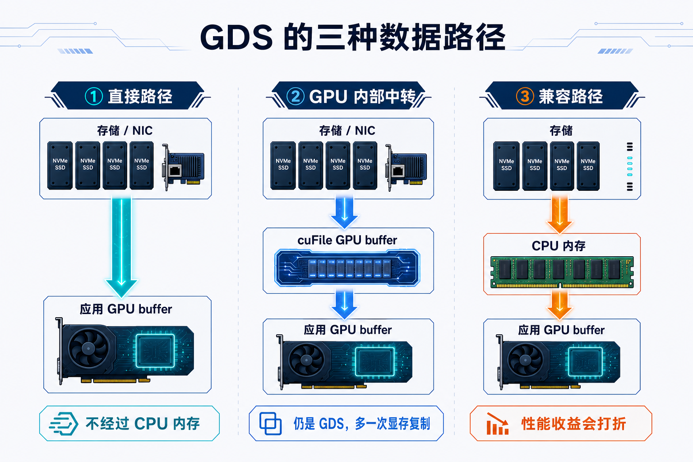

# GPUDirect Storage：GPU 和存储之间的显存直通车


前两篇讲了 GPUDirect P2P 和 GPUDirect RDMA。

P2P 关注的是：

**同一台服务器里，GPU 和 GPU 怎么更直接地交换显存数据？**

RDMA 关注的是：

**网卡怎么直接读写本机 GPU 显存，让跨节点数据少绕 CPU 内存？**

但大模型系统里，还有一条路径每天都在跑：

**存储里的数据，怎么送到 GPU 显存？**

训练时，数据集、模型参数和 checkpoint 要在存储与 GPU 之间移动。

推理时，模型权重、adapter、索引分片和离线数据也可能需要批量装载或落盘。

最容易想到的路径是：

```text
Storage -> CPU 内存 -> GPU 显存
```

这当然能工作。

问题在于，CPU 内存成了中转站。数据先进入主机内存，再被复制到 GPU 显存，主机内存带宽、PCIe 和 NUMA 路径都会被卷进来。

GPUDirect Storage，简称 GDS，就是为减少这段中转而设计的。

一句话总结：

> GDS 为存储与 GPU memory 提供直接 DMA 数据路径。应用通常通过 cuFile 使用它，让数据尽量绕开 CPU 内存中转。

这里的“直接”要加一个重要限定：

```text
不经过 CPU 内存
不等于每次都是单跳、零额外复制
```

cuFile 有时会使用内部 GPU buffer 做显存中转；条件不满足时，也可能经过 CPU 内存，或者直接返回错误。

官方文档里的 bounce buffer，更准确地说是“临时中转缓冲区”。它既可能在 CPU 内存里，也可能在 GPU 显存里，后文会把两者分开。

本文主要讲基于文件系统的 `cuFile` 路径。

当前 GDS 还包括面向 S3 兼容对象存储的 `cuObject`。它需要客户端、服务端和 RDMA 数据路径共同配合，并不是任意 S3 服务安装一个库就能自动直通，这篇先不展开。

文中的“GPU 显存”泛指 GPU memory；配图里的 HBM，是 AI 训练 GPU 上常见的一种显存实现。

---

## 一、传统路径和 GDS 到底差在哪？

先看三种最常见的数据路径。



先澄清一个容易混淆的地方：cuFile 每次都会负责检查条件、提交 I/O 和选择路径，但这不代表数据每次都要经过 cuFile 的内部 GPU buffer。

```text
应用 GPU buffer 已登记、已对齐，并且硬件路径支持直接访问
    -> 数据直接进入应用 GPU buffer

应用 GPU buffer 暂时不适合直接接收 DMA
    -> 数据先进入 cuFile 内部 GPU buffer，再复制给应用
```

### 路径一：直接进入应用 GPU buffer

```text
存储设备 / 客户端网卡
          |
          | DMA
          v
应用的 GPU buffer
```

这是最理想的情况。

数据不经过 CPU 内存，也不需要再从另一块显存复制到应用 buffer。

### 路径二：经过 cuFile 的内部 GPU buffer

```text
存储设备 / 客户端网卡
          |
          | DMA
          v
cuFile 内部 GPU buffer
          |
          | GPU 内部复制
          v
应用的 GPU buffer
```

没有提前登记应用 buffer、I/O 没有对齐，或者受到 BAR 空间和拓扑限制时，cuFile 可能使用这种路径。

为什么有时还要在显存里转一次？因为存储设备不能随意写入任意一块应用显存。只有完成登记和映射、并满足访问条件的 GPU buffer，才能安全地接收 DMA 数据。cuFile 的内部 GPU buffer 已经提前准备好，可以把它理解成一个“显存中转站”：应用 buffer 可以直接接收时就不经过它；不能直接接收时，数据才先到这里，再复制到应用真正需要的位置。

它仍然可以绕开 CPU 内存，因此仍属于 GDS 路径；只是多了一次 GPU 内部复制。

### 路径三：经过 CPU 内存的兼容路径

```text
存储
  |
  v
CPU 内存 / Page Cache
  |
  v
应用的 GPU buffer
```

直接 GDS 路径不可用时，cuFile 可能在配置允许、文件系统也支持的情况下使用兼容路径。

这时应用仍可能正常运行，但 GDS 的性能收益会打折。

需要特别注意：

```text
条件不满足时
可能进入兼容路径
也可能直接返回错误
```

不能假设 cuFile 一定会“无感回退”。

### 到底能快多少？

没有一个放之四海而皆准的倍数。

GDS 省掉的是 CPU 内存中转，但最终性能仍取决于：

```text
存储本身有多快
I/O 大小和并发度
文件系统是否真正支持
GPU 与 NVMe / NIC 的 PCIe 拓扑
后端是否已经饱和
```

NVIDIA 官方资料里的性能数字都对应特定硬件和测试方法，不能直接当成生产环境承诺。

与其记一个“提升多少倍”，不如在同一台机器、同一份数据和同一组参数下，用 `gdsio` 对比 GDS 路径与 CPU 中转路径。

---

## 二、把 GPUDirect 家族放在一张图里

GPUDirect 不是单一技术，而是一组围绕 GPU 显存数据路径的能力。

下面列的不是全部技术，而是这个系列重点关注的三类。


| 名称 | 关注的问题 | 典型路径 |
|---|---|---|
| GPUDirect P2P | 单机内 GPU 之间怎么交换显存数据 | GPU 显存 ↔ GPU 显存 |
| GPUDirect RDMA | RDMA 网卡怎么直接读写本机 GPU 显存 | GPU 显存 ↔ RDMA NIC ↔ 网络 |
| GPUDirect Storage | 存储 I/O 怎么直接进出 GPU 显存 | GPU 显存 ↔ 存储设备 / 存储系统 |

可以这样记：

```text
单机 GPU 通信：P2P
跨节点数据通信：RDMA
数据加载和落盘：Storage
```

GDS 不是用来替代 NCCL、IB 或 RoCE 的。

它回答的是另一个问题：

```text
GPU 算得很快
存储喂数据和写结果时
能不能少绕一点？
```

---

## 三、GDS 在系统里处在哪一层？

GDS 里经常会遇到这些词：

```text
cuFile
libcufile
nvidia-fs
PCI P2PDMA
NVMe / NVMe-oF
Lustre / BeeGFS / WekaFS / NFS ...
```

它们不是同一层的东西。


小白可以先把它理解成三层。

### 第一层：cuFile 提供统一入口

应用只需要表达一件事：

```text
把文件数据读到 GPU buffer
或者把 GPU buffer 写回文件
```

这就是 cuFile 的主要作用。

### 第二层：libcufile 负责选择路径

`libcufile` 更像一个“路径调度器”。

它会结合文件系统、驱动、配置和硬件拓扑，在几类概念路径之间选择或组合：

```text
nvidia-fs 路径
Linux PCI P2PDMA 路径
文件系统厂商自己的路径
经过 CPU 内存的兼容路径
```

`nvidia-fs` 仍然是很多 GDS 环境的重要组件，但不是所有 GDS I/O 都必须经过它。

这些路径也不是完全互斥的。有些厂商文件系统会结合 `nvidia-fs` 的内核回调，有些则使用自己的用户态或 RDMA 实现。

从 CUDA 12.8 开始，一部分满足支持条件的本地 NVMe 环境可以使用 Linux PCI P2PDMA，不再依赖 `nvidia-fs.ko`。

但这不是“所有 NVMe 自动支持”。GPU、驱动、内核、文件系统、PCIe 拓扑和运行时配置必须同时满足要求，RAID、多路径等场景还可能有限制。

### 第三层：文件系统和存储决定路能不能走通

底层可能是本地 NVMe，也可能是 NVMe-oF、NFS over RDMA、并行文件系统或厂商用户态文件系统。

真正能不能走 GDS direct path，取决于：

```text
CUDA、驱动和 libcufile 版本
文件系统和存储设备是否支持
远端存储网络是否支持 RDMA / GDS
GPU 与 NVMe / NIC 的 PCIe 拓扑
I/O 对齐和运行时配置
```

所以更准确的关系是：

```text
cuFile 提供入口
libcufile 选择路径
文件系统、设备、网络和拓扑决定路径能否成立
```

装了 CUDA，不等于所有文件都能直通 GPU。

---

## 四、一次 GDS 读取大概发生了什么？

从开发者视角看，一次读取可以先简化成五步。


```text
1. 打开文件
2. 把文件交给 cuFile
3. 准备接收数据的 GPU buffer
4. 提交读取请求
5. 检查完成状态和错误
```

CPU 仍然负责打开文件、提交请求、处理完成状态和错误。

GDS 所说的“直接”，主要是指大块数据尽量不经过 CPU 内存，而不是 CPU 从流程里消失。

### 使用前的初始化

应用最好在任何其他 cuFile 操作之前主动初始化一次。

如果省略，cuFile 会在第一次登记文件、登记 buffer 或提交 I/O 时尝试自动初始化。但自动初始化仍然可能失败，也可能让第一次操作变慢。

所以“可以自动初始化”不等于“不会报错”。

### 文件登记是必须的

应用需要先把已经打开的文件交给 cuFile，让它检查并记录文件打开方式、挂载点和底层存储能力。

但“登记成功”不代表后面每一次 I/O 都一定走最直接的路径。

### GPU buffer 登记是可选的

应用可以提前把一块 GPU buffer 交给 cuFile，建立 DMA 访问所需的映射。

这更适合：

```text
会被重复使用的 buffer
地址、文件偏移和 I/O 大小比较规整
登记成本可以被后续多次 I/O 摊薄
```

如果 buffer 只使用一次、非常大、经常做未对齐 I/O，或者 GPU 的 BAR 空间比较紧张，不提前登记反而可能更合适。

没有登记也不表示 GDS 失效。cuFile 可以使用自己的内部 GPU buffer，只是可能多一次显存内部复制。

登记也不等于“这块显存不能再使用”。更准确地说，它占用了映射资源；相关 I/O 完成前，应用不能释放、取消登记或提前复用这块 buffer。

不再使用时，要先等相关 I/O 全部完成，再取消登记，最后释放显存。

### 同步和异步有什么区别？

同步方式会等 I/O 完成后再返回。这里被阻塞的是提交请求的 CPU 线程，不是让整块 GPU 停止工作。

同步 I/O 也不会自动和 CUDA stream 里的 GPU 任务建立先后关系。读取完成前不能让 GPU 提前消费这块 buffer，写入完成前也不能修改它；这些依赖仍要由应用明确保证。

异步方式则让应用有机会把“上一批计算”和“下一批读取”做成流水线。

但异步不等于自动重叠。

同一个 CUDA stream 里的 I/O 和计算仍然按顺序执行。要真正重叠，通常需要：

```text
不同的 CUDA stream
两组或多组 GPU buffer
明确的完成事件和依赖关系
```

例如：

```text
Stream 0：计算 Batch N
Stream 1：读取 Batch N+1
```

异步 checkpoint 也是同样的道理：写入完成前，那块 GPU buffer 不能被下一轮训练修改或复用。

---

## 五、GDS 快不快，关键看拓扑

听起来只要有 GDS，就应该很快。

但 GDS 能不能快，仍然要看物理路径。


最理想的情况通常是：

```text
GPU 与 NVMe / 存储 NIC
位于同一个 PCIe Switch 或 Root Port 下
```

“位于同一个 NUMA 域”只能说明它们可能比较近，不能证明一定支持 P2P，也不能代替 PCIe 拓扑检查。

跨 Root Port、跨 CPU Socket 的路径可能仍然可用，也可能性能下降，甚至无法建立直接路径。

这里还有一个很容易误解的点：

```text
经过 CPU Root Complex
不等于数据进入 CPU 内存
```

它可能只是 PCIe 流量经过 CPU 的互连结构，并没有落进 CPU DRAM。

在常见的 x86-64 GDS 部署中，通常建议禁用 PCIe ACS 和 IOMMU；否则 P2P 直接路径可能被阻断，或者性能明显下降。Grace Hopper 等平台可能有不同要求，最终仍要以平台文档和实测结果为准。

### 远端存储怎么理解？

| 方案 | 小白版理解 |
|---|---|
| NVMe-oF over RDMA | 在支持条件满足时，客户端 RDMA NIC 可以直接与本机 GPU memory 交换数据。不是远端 SSD 的 DMA 地址“直接指向”另一台机器的 GPU。 |
| NFS over RDMA | 服务端需要提供受支持的 NFS/RDMA 服务；客户端需要具备 GDS-enabled NFS/RDMA 路径。普通 NFS over TCP 不能形成 NIC 到 GPU 的直接数据路径。 |
| Lustre、BeeGFS、WekaFS 等 | 是否支持不能只看文件系统名字，还要看具体产品、客户端、内核、CUDA 和厂商版本矩阵。 |

所以，选型时不要只问：

```text
这个协议或文件系统“支持 GDS”吗？
```

更应该问：

```text
当前版本组合是否经过验证？
客户端是否真的走 RDMA / GDS？
GPU 与存储 NIC 的 PCIe 路径是否合适？
本次 I/O 是 direct、GPU 中转、CPU 兼容，还是失败？
```

支持矩阵变化很快，部署时要同时检查 NVIDIA 和文件系统厂商的当前文档。

还有一个存量集群容易忽略的版本变化：从 GDS v1.15 开始，NVIDIA 移除了对 Pascal 和 Volta 架构的正式支持。使用 Tesla V100 等 Volta GPU 的环境，在升级 CUDA / GDS 前需要先核对支持矩阵，不能只看 CUDA 程序是否还能运行。

---

## 六、什么场景更适合 GDS？

判断一个场景是否适合 GDS，关键不是“数据是不是放在 NVMe 上”，而是看两件事：

```text
数据最终是不是由 GPU 消费或产生？
I/O 能不能整理成较大的、可并发的读写？
```

### 1. 已经预处理好的大块训练数据

如果训练数据已经整理成较大的 shard、bin、record 或 NumPy 文件，而且 GPU 可以直接消费，GDS 就比较容易发挥作用。

如果读取的是大量小文件，还要在 CPU 上完成解压、tokenization、数据增强和 batch 拼接，那么瓶颈往往不在最后一次内存拷贝，单独使用 GDS 的收益可能有限。

### 2. 显式支持 GDS 的 checkpoint

模型参数和优化器状态通常很大。

如果这些 Tensor 原本就在 GPU 上，而且 checkpoint 实现能把它们直接交给 cuFile/GDS，就有机会减少 CPU 内存中转。

但要特别注意：

```text
安装了 GDS
不等于普通保存和加载会自动使用 GDS
```

checkpoint 框架必须显式集成 GDS。

异步保存时，写入完成前也不能复用原来的 GPU buffer，否则可能得到不一致的 checkpoint。

### 3. GPU 原生的数据处理流水线

科学计算、视频处理、离线推理和数据分析等流程，如果数据读入后主要在 GPU 上处理，结果最后也从 GPU 写出，GDS 就可以帮助 GPU 成为数据的 first touch 和 last touch。

```text
存储 -> GPU 数据处理 -> GPU 计算 -> 存储
```

这种端到端 GPU pipeline，通常比“只改最后一次拷贝”更容易获得整体收益。

### 4. 权重、adapter 和索引的批量装载

推理服务可能需要批量装载模型权重、adapter、embedding shard 或索引分片。

只要软件能把这些大块数据直接读入 GPU buffer，GDS 就可能改善装载路径。

这里强调的是“批量装载、转储和恢复”。

在线 embedding lookup、RAG 随机查找和细粒度 KV cache 访问是否受益，还取决于缓存、请求合并和文件布局，不能只凭“数据在 NVMe 上”判断。

### 哪些问题不是 GDS 擅长解决的？

```text
小文件和元数据操作太多
CPU 解压、解码或 tokenization 很慢
Python 数据增强成为瓶颈
远端存储或网络已经饱和
batch 组织和预取策略不合理
应用本身没有使用 GDS
```

GDS 优化的是存储与 GPU memory 之间的数据路径，不会自动优化整个数据处理流程。

---

## 七、怎么确认 GDS 真的在工作？

对初次接触 GDS 的读者，排查可以先收敛成三步：

```text
先看环境支持
再看设备拓扑
最后做同条件 A/B 测试
```


### 第一步：检查环境能力

最常用的工具是：

```bash
/usr/local/cuda-<x>.<y>/gds/tools/gdscheck.py -p
```

重点看：

```text
当前 GDS 和 libcufile 版本
本地 NVMe / NVMe-oF / 文件系统是否受支持
可以使用 nvidia-fs、PCI P2PDMA，还是只能兼容路径
PCIe ACS、IOMMU 和 RDMA 环境是否有明显问题
```

但要注意：

> `gdscheck` 只能说明环境具备哪些能力，不能证明某一次应用 I/O 已经走了 direct path。

### 第二步：检查 GPU 与存储出口的拓扑

```bash
nvidia-smi topo -m
lspci -t
```

本地 NVMe 场景，要看 GPU 和目标 NVMe 的 PCIe 路径。

远端存储场景，要看 GPU 和存储 NIC 是否位于较近的 PCIe 层级。

注意，`nvidia-smi topo -m` 更擅长展示 GPU、CPU 和 NIC 的关系；NVMe 仍要结合 `lspci -t` 和系统信息判断。

### 第三步：用 gdsio 做同条件对照

GDS 自带 benchmark 工具：

```bash
/usr/local/cuda-<x>.<y>/gds/tools/gdsio
```

有价值的不是只跑一个数字，而是在相同条件下做对照：

```text
Storage -> GPU 的 GDS 路径
Storage -> CPU -> GPU 的传统基线

同一个文件和挂载点
同一块 GPU
相同 I/O size
相同线程数和读写方向
```

下面是一组最小示例。**测试文件会被创建或覆盖，请务必换成专用测试路径，不要指向业务数据。**

先创建一个 1 GiB 测试文件：

```bash
/usr/local/cuda-<x>.<y>/gds/tools/gdsio \
  -f /mnt/gds/gdsio-testfile -d 0 -w 4 \
  -s 1G -i 1M -x 0 -I 1
```

测试 Storage 到 GPU 的 GDS 路径：

```bash
/usr/local/cuda-<x>.<y>/gds/tools/gdsio \
  -f /mnt/gds/gdsio-testfile -d 0 -w 4 \
  -s 1G -i 1M -x 0 -I 0
```

再测试 Storage 经过 CPU 到 GPU 的传统基线：

```bash
/usr/local/cuda-<x>.<y>/gds/tools/gdsio \
  -f /mnt/gds/gdsio-testfile -d 0 -w 4 \
  -s 1G -i 1M -x 2 -I 0
```

这里先记最常用的几组：

```text
-x 0：Storage <-> GPU（GDS 路径，目标是直接到 GPU）
-x 1：Storage <-> CPU（纯 CPU 基线，不涉及 GPU）
-x 2：Storage <-> CPU <-> GPU
-I 0：读
-I 1：写
```

做 GDS 与传统中转路径的 A/B 对照，比较 `-x 0` 和 `-x 2` 通常就够了。

如果还想测试异步和批量模式，`-x 5` 表示异步流，`-x 6` 表示批量模式，具体参数可以查看 `gdsio -h`。不同版本的工具能力可能有变化，应以本机帮助信息为准。

如果工具显示环境支持，但应用表现仍然异常，再查看 `cufile.log`、运行时统计和应用返回值。

不要仅凭“API 调用成功”就判断已经走了 direct path。

测试时再顺手记住两点：4 KiB 对齐通常更容易走高效路径，小而零碎的 I/O 更容易被管理开销吃掉。CUDA 12.2 以后，cuFile 虽然可以接受非 `O_DIRECT` 文件描述符，但这不代表每次 I/O 都会走 direct path。

---

## 八、最后再澄清三个常见误区

### 误区一：装了 NVMe 和 CUDA，GDS 就一定生效

不一定。

文件系统、设备、驱动、拓扑、对齐和运行时配置要同时满足要求。

### 误区二：用了 cuFile，就一定绕过 CPU 内存

不一定。

一次 I/O 可能直接进入应用 GPU buffer，也可能经过内部 GPU buffer、CPU 兼容路径，或者返回错误。

### 误区三：GDS 能解决所有数据加载慢的问题

不能。

它不负责解码、tokenization、数据增强、小文件元数据和网络拥塞。

---

## 九、总结

如果只记三句话：

```text
1. GDS 的目标，是减少存储与 GPU memory 之间的 CPU 内存中转。
2. 实际可能是直接路径、GPU 内部中转、CPU 兼容路径，或者直接报错。
3. 真正能不能用、能快多少，要看支持矩阵、PCIe 拓扑、日志和 gdsio 对照测试。
```

**GDS 优化的不是 GPU 计算，而是 GPU 显存与存储之间搬数据的路径。**

---

## 参考资料

- [NVIDIA GPUDirect Storage 文档入口](https://docs.nvidia.com/gpudirect-storage/)
- [NVIDIA GPUDirect Storage Overview Guide](https://docs.nvidia.com/gpudirect-storage/overview-guide/index.html)
- [NVIDIA GPUDirect Storage Design Guide](https://docs.nvidia.com/gpudirect-storage/design-guide/index.html)
- [NVIDIA GDS cuFile API Reference Guide](https://docs.nvidia.com/gpudirect-storage/api-reference-guide/index.html)
- [NVIDIA GPUDirect Storage Installation and Troubleshooting Guide](https://docs.nvidia.com/gpudirect-storage/troubleshooting-guide/index.html)
- [NVIDIA GPUDirect Storage Benchmarking and Configuration Guide](https://docs.nvidia.com/gpudirect-storage/configuration-guide/index.html)
- [NVIDIA GPUDirect Storage Best Practices Guide](https://docs.nvidia.com/gpudirect-storage/best-practices-guide/index.html)
- [NVIDIA GPUDirect Storage Release Notes / Support Matrix](https://docs.nvidia.com/gpudirect-storage/release-notes/index.html)
- [NVIDIA cuObject 文档](https://docs.nvidia.com/gpudirect-storage/cuobject/)
- [Linux PCI P2PDMA 文档](https://docs.kernel.org/driver-api/pci/p2pdma.html)
