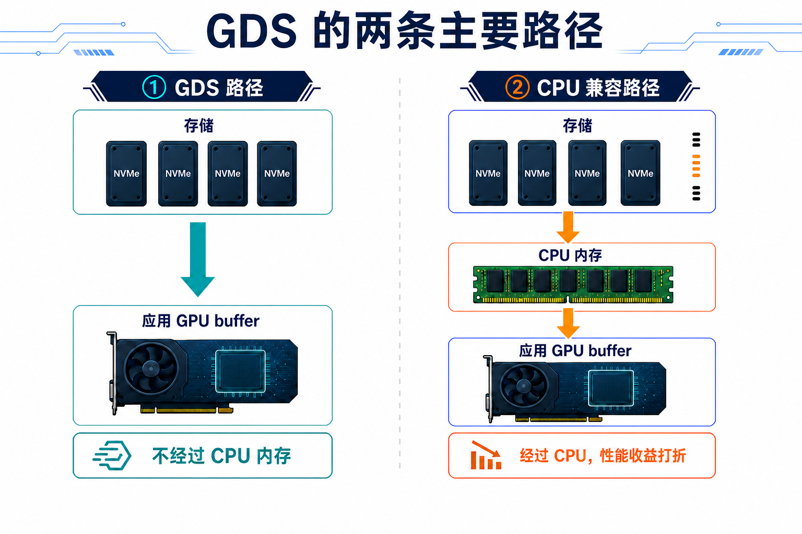
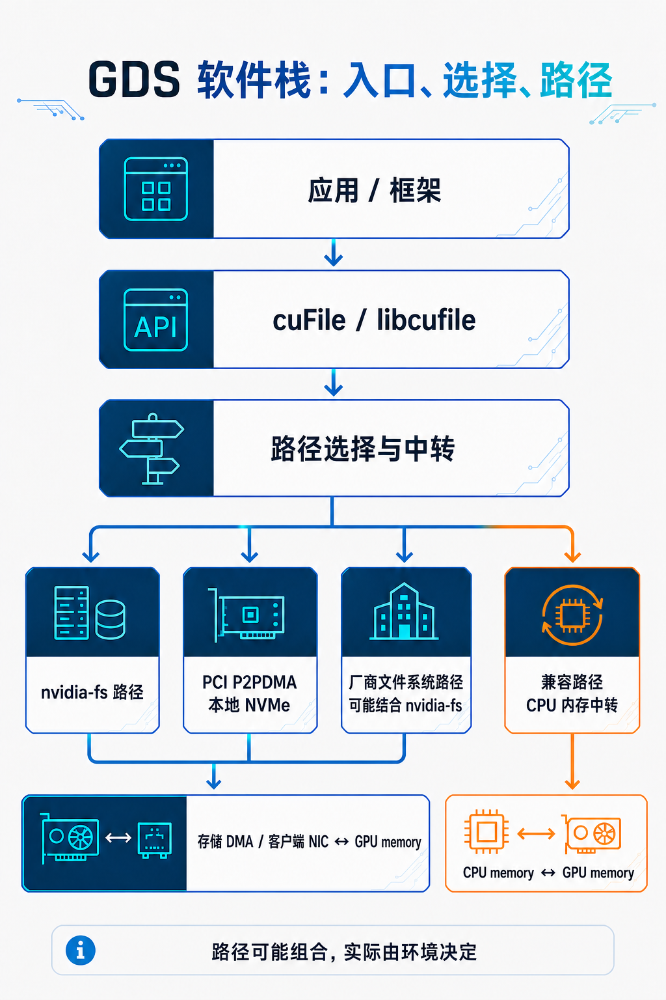
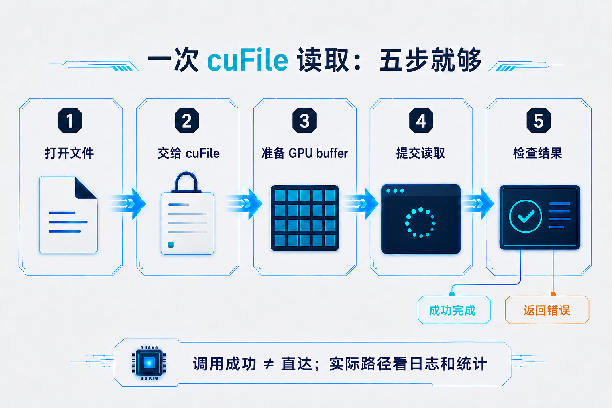
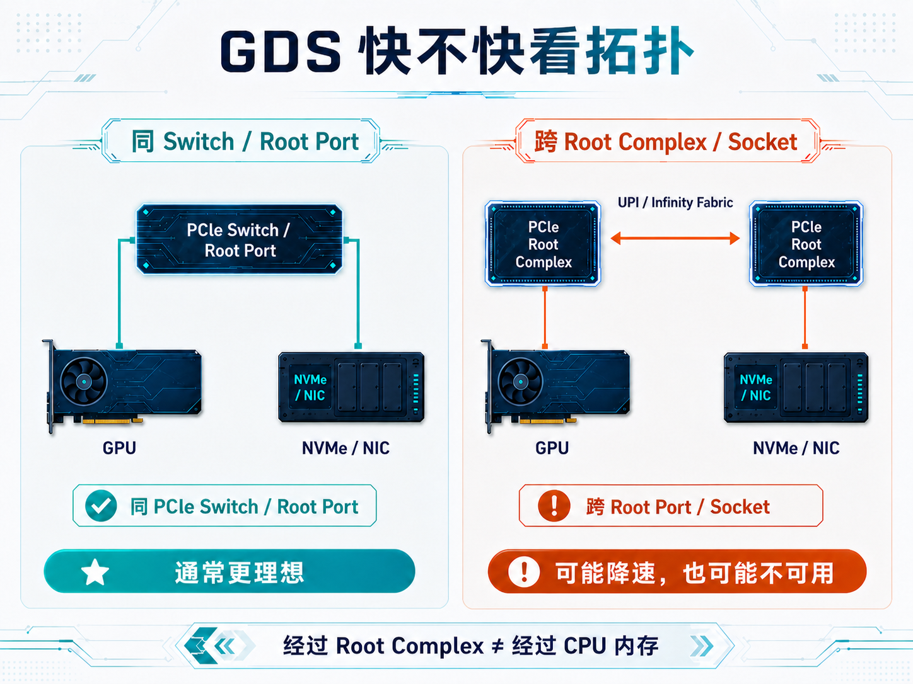

# GPUDirect Storage：GPU 和存储之间的显存直通车


前两篇讲了 GPUDirect P2P 和 GPUDirect RDMA。

GPUDirect P2P 关注的是：

**同一台服务器里，GPU 和 GPU 怎么更直接地交换显存数据？**

GPUDirect RDMA 关注的是：

**网卡怎么直接读写本机 GPU 显存，让跨节点数据少绕 CPU 内存？**

但大模型系统里，还有一条路径每天都在跑：

**存储里的数据，怎么送到 GPU 显存？**

训练时，数据集、模型参数和 checkpoint 要在存储与 GPU 之间移动。

推理时，模型权重、索引分片和离线数据也可能需要批量装载或落盘。

今天要介绍的 GPUDirect Storage（GDS），就是用来优化存储与 GPU 显存之间的数据传输。传统方式通常要先经过 CPU 内存中转，而 GDS 的目标，就是尽量减少这一步。

两者到底有什么区别，下面结合数据路径来看。

---

## 一、传统路径和 GDS 到底差在哪？

把存储里的数据送进 GPU 显存，主要有两种走法。



### 传统方式：先经过 CPU 内存

```text
存储 -> CPU 内存 -> GPU 显存
```

可以把 CPU 内存理解成一个中转仓库。数据先从存储搬到仓库，再从仓库搬进 GPU 显存。

这条路能用，但多了一次中转，也会占用 CPU 内存带宽。

### GDS 方式：尽量绕开 CPU 内存

```text
存储 -> GPU 显存
```

GDS 的目标，是让大块数据尽量直接进入 GPU 显存，少经过一次 CPU 内存中转。

CPU 并没有消失。它仍然负责启动和管理 I/O，只是不再充当搬运大块数据的“中转仓库”。

实际环境不满足条件时，数据也可能退回 CPU 中转路径，或者直接报错。因此，使用了 GDS 不代表每次都一定直达。

---

## 二、把 GPUDirect 家族放在一张图里

GPUDirect 不是单一技术，而是一组围绕 GPU 显存数据路径的能力。

下面列的不是全部技术，而是这个系列重点关注的三类。


| 名称 | 关注的问题 | 典型路径 |
|---|---|---|
| GPUDirect P2P | 单机内 GPU 之间怎么交换显存数据 | GPU 显存 ↔ GPU 显存 |
| GPUDirect RDMA | RDMA 网卡怎么直接读写本机 GPU 显存 | GPU 显存 ↔ RDMA NIC ↔ 网络 |
| GPUDirect Storage | 存储 I/O 怎么直接进出 GPU 显存 | GPU 显存 ↔ 存储设备 / 存储系统 |

可以这样记：

```text
单机 GPU 通信：P2P
跨节点数据通信：RDMA
数据加载和落盘：Storage
```

GDS 不是用来替代 NCCL、InfiniBand 或 RoCE 的。它解决的是存储与 GPU 之间的数据搬运问题：当 GPU 读取数据或写回结果时，能不能尽量绕开 CPU 内存，缩短传输路径？

---

## 三、GDS 在系统里处在哪一层？

GDS 里经常会遇到这些词：

```text
cuFile
libcufile
nvidia-fs
PCI P2PDMA
NVMe / NVMe-oF
Lustre / BeeGFS / WekaFS / NFS ...
```

它们不是同一层的东西。



可以先把它理解成三层。

### 第一层：cuFile 提供统一入口

应用只需要表达一件事：

```text
把文件数据读到 GPU buffer
或者把 GPU buffer 写回文件
```

这就是 cuFile 的主要作用。

### 第二层：libcufile 负责选择路径

`libcufile` 更像一个“路径调度器”。

它会结合文件系统、驱动、配置和硬件拓扑，在几类概念路径之间选择或组合：

```text
nvidia-fs 路径
Linux PCI P2PDMA 路径
文件系统厂商自己的路径
经过 CPU 内存的兼容路径
```

`nvidia-fs` 仍然是很多 GDS 环境的重要组件，但不是所有 GDS I/O 都必须经过它。

这些路径也不是完全互斥的。有些厂商文件系统会结合 `nvidia-fs` 的内核回调，有些则使用自己的用户态或 RDMA 实现。

从 CUDA 12.8 开始，在部分满足支持条件的系统中，本地 NVMe 设备可以通过 Linux PCI P2PDMA 与 GPU 传输数据，不再依赖 `nvidia-fs.ko`。

但并不是有 NVMe 设备就能使用这条路径，还要看 GPU、驱动、Linux 内核、文件系统和 PCIe 连接是否支持。RAID 或多路径配置也可能受到限制。

### 第三层：文件系统和存储决定路能不能走通

GDS 面对的存储来源不只有本机 NVMe。数据也可能来自 NVMe-oF、NFS over RDMA、并行文件系统，或者厂商提供的用户态存储客户端。

真正能不能走 GDS direct path，取决于：

```text
CUDA、驱动和 libcufile 版本
文件系统和存储设备是否支持
远端存储网络是否支持 RDMA / GDS
GPU 与 NVMe / NIC 的 PCIe 拓扑
I/O 对齐和运行时配置
```

可以把它理解为：应用通过 cuFile 发起读写请求，libcufile 根据当前环境选择传输路径，而文件系统、存储设备、网络和硬件拓扑共同决定这条路径是否可用。

装了 CUDA，不等于所有文件都能直通 GPU。

---

## 四、一次 GDS 读取大概发生了什么？

一次 GDS 读取可以简单理解为五步。



```text
1. 打开文件
2. 把文件交给 cuFile
3. 准备接收数据的 GPU buffer
4. 提交读取请求
5. 检查完成状态和错误
```

CPU 仍然负责打开文件、提交请求、处理完成状态和错误。

GDS 所说的“直接”，主要是指大块数据尽量不经过 CPU 内存，而不是 CPU 从流程里消失。

需要注意的是，读取完成前，GPU 不能提前使用或复用这块显存。cuFile 调用成功也不代表数据一定走了直接路径，实际情况还要通过日志和测试确认。

---

## 五、GDS 快不快，先看硬件连接

GDS 的效果不仅取决于软件，也取决于 GPU 与存储设备之间的 PCIe 连接。



本地 NVMe 场景中，比较理想的情况是：

```text
GPU 与 NVMe
位于同一个 PCIe Switch 或 Root Port 下
```

设备靠得越近，数据路径通常越短。跨 Root Port 或跨 CPU Socket 时，性能可能下降，直接路径也可能不可用。同属一个 NUMA 域只能作为参考，不能代替 PCIe 拓扑检查。

在常见的 x86-64 GDS 部署中，通常建议禁用 PCIe ACS 和 IOMMU；否则 P2P 直接路径可能被阻断，或者性能明显下降。Grace Hopper 等平台可能有不同要求，最终仍要以平台文档和实测结果为准。

远端存储场景还要检查 GPU 与存储网卡的距离，以及客户端是否真正使用受支持的 RDMA/GDS 路径。不能只看 NVMe-oF、NFS、Lustre 或其他协议和文件系统的名称，还要核对 NVIDIA 与存储厂商的版本支持情况。

还有一个存量集群容易忽略的版本变化：从 GDS v1.15 开始，NVIDIA 移除了对 Pascal 和 Volta 架构的正式支持。使用 Tesla V100 等 Volta GPU 的环境，在升级 CUDA / GDS 前需要先核对支持矩阵，不能只看 CUDA 程序是否还能运行。

---

## 六、什么场景更适合 GDS？

GDS 更适合同时具备以下特点的场景：

```text
数据块比较大，可以批量或并发读写
数据读入后主要由 GPU 使用，或者本来就由 GPU 产生
应用或框架已经接入 GDS
```

常见例子包括：

```text
预处理好的大块训练数据
已经接入 GDS 的 checkpoint 工具
模型权重和索引的批量装载
主要在 GPU 上处理的数据流水线
```

如果工作负载以大量小文件为主，主要时间花在 CPU 解压、解码或 tokenization 上，或者存储和网络已经饱和，GDS 的帮助通常有限。

还要注意，安装 GDS 不代表现有应用会自动使用它。GDS 优化的是存储与 GPU 显存之间的数据路径，不会自动解决整个数据处理流程中的所有瓶颈。

---

## 七、怎么确认 GDS 真的在工作？

对初次接触 GDS 的读者，排查可以先收敛成三步：

```text
先看环境支持
再看设备拓扑
最后做同条件 A/B 测试
```


### 第一步：检查环境能力

最常用的工具是：

```bash
/usr/local/cuda-<x>.<y>/gds/tools/gdscheck.py -p
```

重点看：

```text
当前 GDS 和 libcufile 版本
本地 NVMe / NVMe-oF / 文件系统是否受支持
可以使用 nvidia-fs、PCI P2PDMA，还是只能兼容路径
PCIe ACS、IOMMU 和 RDMA 环境是否有明显问题
```

但要注意：

> `gdscheck` 只能说明环境具备哪些能力，不能证明某一次应用 I/O 已经走了 direct path。

### 第二步：检查 GPU 与存储出口的拓扑

```bash
nvidia-smi topo -m
lspci -t
```

本地 NVMe 场景，要看 GPU 和目标 NVMe 的 PCIe 路径。

远端存储场景，要看 GPU 和存储 NIC 是否位于较近的 PCIe 层级。

注意，`nvidia-smi topo -m` 更擅长展示 GPU、CPU 和 NIC 的关系；NVMe 仍要结合 `lspci -t` 和系统信息判断。

### 第三步：用 gdsio 做同条件对照

GDS 自带 benchmark 工具：

```bash
/usr/local/cuda-<x>.<y>/gds/tools/gdsio
```

有价值的不是只跑一个数字，而是在相同条件下做对照：

```text
Storage -> GPU 的 GDS 路径
Storage -> CPU -> GPU 的传统基线

同一个文件和挂载点
同一块 GPU
相同 I/O size
相同线程数和读写方向
```

下面是一组最小示例。**测试文件会被创建或覆盖，请务必换成专用测试路径，不要指向业务数据。**

先创建一个 1 GiB 测试文件：

```bash
/usr/local/cuda-<x>.<y>/gds/tools/gdsio \
  -f /mnt/gds/gdsio-testfile -d 0 -w 4 \
  -s 1G -i 1M -x 0 -I 1
```

测试 Storage 到 GPU 的 GDS 路径：

```bash
/usr/local/cuda-<x>.<y>/gds/tools/gdsio \
  -f /mnt/gds/gdsio-testfile -d 0 -w 4 \
  -s 1G -i 1M -x 0 -I 0
```

再测试 Storage 经过 CPU 到 GPU 的传统基线：

```bash
/usr/local/cuda-<x>.<y>/gds/tools/gdsio \
  -f /mnt/gds/gdsio-testfile -d 0 -w 4 \
  -s 1G -i 1M -x 2 -I 0
```

这里先记最常用的几组：

```text
-x 0：Storage <-> GPU（GDS 路径，目标是直接到 GPU）
-x 1：Storage <-> CPU（纯 CPU 基线，不涉及 GPU）
-x 2：Storage <-> CPU <-> GPU
-I 0：读
-I 1：写
```

做 GDS 与传统中转路径的 A/B 对照，比较 `-x 0` 和 `-x 2` 通常就够了。

如果还想测试异步和批量模式，`-x 5` 表示异步流，`-x 6` 表示批量模式，具体参数可以查看 `gdsio -h`。不同版本的工具能力可能有变化，应以本机帮助信息为准。

如果工具显示环境支持，但应用表现仍然异常，再查看 `cufile.log`、运行时统计和应用返回值。

不要仅凭“API 调用成功”就判断已经走了 direct path。

测试时再顺手记住两点：4 KiB 对齐通常更容易走高效路径，小而零碎的 I/O 更容易被管理开销吃掉。CUDA 12.2 以后，cuFile 虽然可以接受非 `O_DIRECT` 文件描述符，但这不代表每次 I/O 都会走 direct path。

---

## 八、最后再澄清三个常见误区

### 误区一：装了 NVMe 和 CUDA，GDS 就一定生效

不一定。

文件系统、设备、驱动、拓扑、对齐和运行时配置要同时满足要求。

### 误区二：用了 cuFile，就一定绕过 CPU 内存

不一定。

一次 I/O 可能直接进入应用 GPU buffer，也可能经过内部 GPU buffer、CPU 兼容路径，或者返回错误。

### 误区三：GDS 能解决所有数据加载慢的问题

不能。

它不负责解码、tokenization、数据增强、小文件元数据和网络拥塞。

---

## 九、总结

如果只记三句话：

```text
1. GDS 的目标，是减少存储与 GPU memory 之间的 CPU 内存中转。
2. 实际可能是直接路径、GPU 内部中转、CPU 兼容路径，或者直接报错。
3. 真正能不能用、能快多少，要看支持矩阵、PCIe 拓扑、日志和 gdsio 对照测试。
```

**GDS 优化的不是 GPU 计算，而是 GPU 显存与存储之间搬数据的路径。**

---

## 参考资料

- [NVIDIA GPUDirect Storage 文档入口](https://docs.nvidia.com/gpudirect-storage/)
- [NVIDIA GPUDirect Storage Overview Guide](https://docs.nvidia.com/gpudirect-storage/overview-guide/index.html)
- [NVIDIA GPUDirect Storage Design Guide](https://docs.nvidia.com/gpudirect-storage/design-guide/index.html)
- [NVIDIA GDS cuFile API Reference Guide](https://docs.nvidia.com/gpudirect-storage/api-reference-guide/index.html)
- [NVIDIA GPUDirect Storage Installation and Troubleshooting Guide](https://docs.nvidia.com/gpudirect-storage/troubleshooting-guide/index.html)
- [NVIDIA GPUDirect Storage Benchmarking and Configuration Guide](https://docs.nvidia.com/gpudirect-storage/configuration-guide/index.html)
- [NVIDIA GPUDirect Storage Best Practices Guide](https://docs.nvidia.com/gpudirect-storage/best-practices-guide/index.html)
- [NVIDIA GPUDirect Storage Release Notes / Support Matrix](https://docs.nvidia.com/gpudirect-storage/release-notes/index.html)
- [NVIDIA cuObject 文档](https://docs.nvidia.com/gpudirect-storage/cuobject/)
- [Linux PCI P2PDMA 文档](https://docs.kernel.org/driver-api/pci/p2pdma.html)
