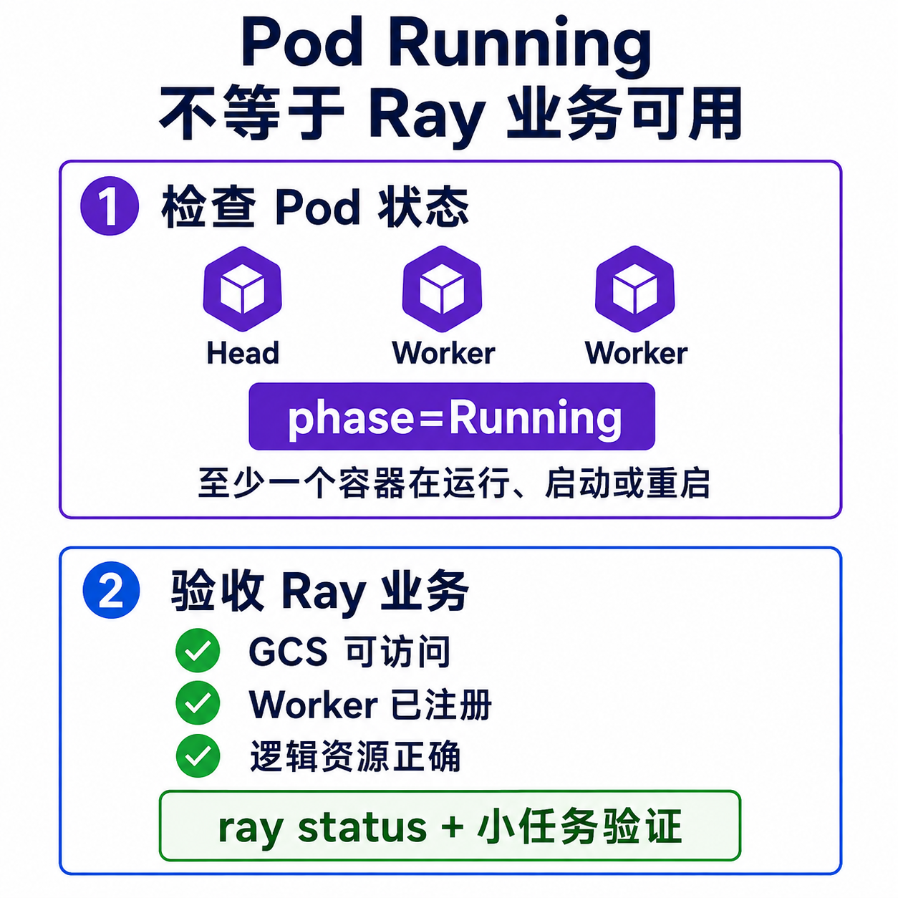
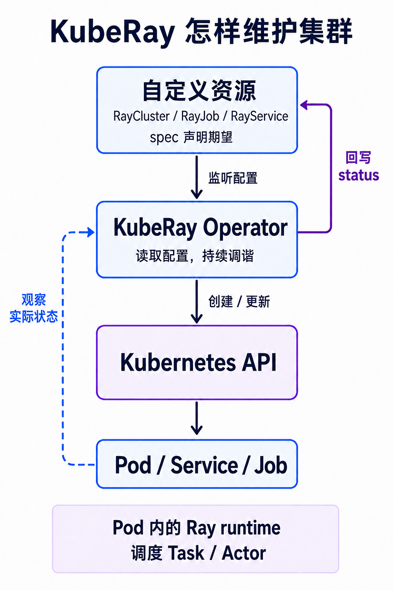
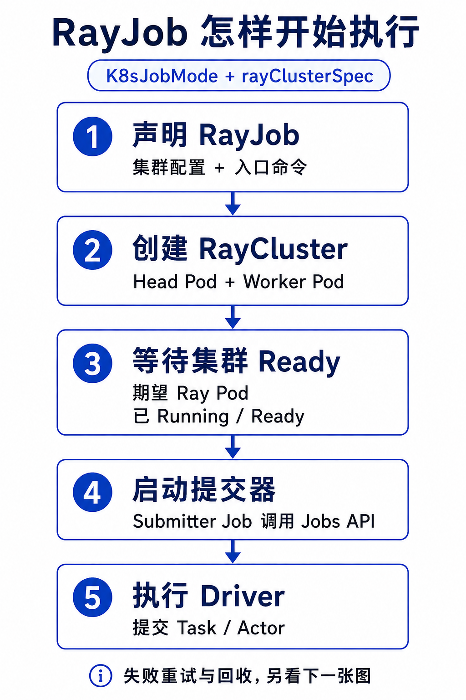
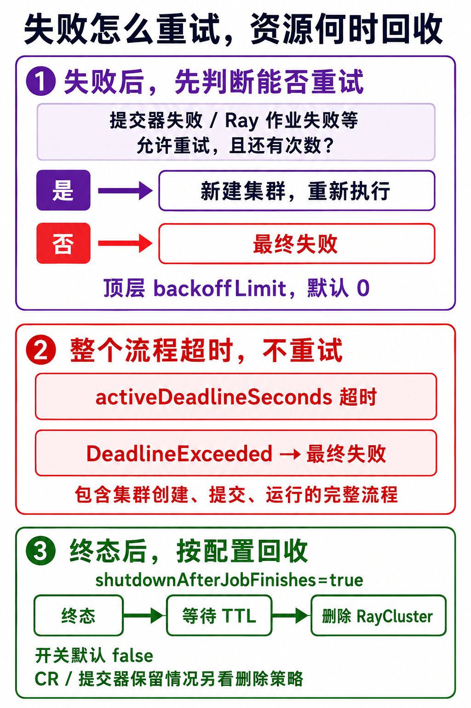

# Kubernetes 已经能跑 Pod，为什么还需要 KubeRay？

假设你在 Kubernetes 上启动了一个 Ray 集群，Head（控制节点）和两个 Worker（计算节点）的 Pod 都显示 `Running`。现在能提交训练任务了吗？

还得检查 Worker 有没有注册成功、Ray 看到了多少 CPU 和 GPU，以及程序能不能跑通。Pod 启动，只完成了其中一步。

任务结束后也有同样的问题。集群要不要删除，失败后要不要重试，在线服务怎么换到新版本？这些都需要有人管理。KubeRay 把这些操作做成 Kubernetes 中可声明、可追踪的流程。

## 1. Pod 跑起来，离任务跑通还有多远

Ray 用来运行分布式程序。一个远程函数可以作为 Task 执行，需要保存状态的计算单元可以写成 Actor。Ray 负责把它们放到有资源的计算节点上运行。

例如批量处理图片，可以把不同批次交给多个 Task 并行执行；需要反复使用已加载模型的对象，可以写成 Actor。程序要怎样拆分，仍需要开发者设计，部署一套 Ray 集群不会自动改写业务代码。

Kubernetes 负责更外面的一层，把 Pod 调度到机器上、重启失败的容器。它能判断容器状态，却不理解一个 Ray Task 要等哪些资源。

KubeRay Operator 管理 Ray 集群、作业和服务的生命周期，让部署 Ray 所需的 Kubernetes 资源按配置创建和维护。

这里有两个容易混淆的 Node。Kubernetes Node 是承载 Pod 的机器；Ray Node 是注册到 Ray 集群的逻辑节点，在 KubeRay 中通常对应一个 Pod。

`Running` 是 Pod 的粗粒度阶段，连所有容器都就绪也不保证。Pod `Ready` 是另一项条件；它又不能直接说明 Ray 已看到预期的 Worker、GPU，或者应用结果正确。排查时要逐层确认。

KubeRay 的 `Ready` 也不等于业务验收。在本文使用的 v1.6.2 中，它主要检查期望数量的 Ray Pod 是否 Running、Ready。Worker 注册数和逻辑资源要用 `ray status` 看，再用一个小任务确认执行链路。

## 2. Operator 平时在做什么

你提交一份 RayCluster 配置，写明需要一个 Head、几个 Worker、什么镜像和资源。Operator 读取配置，通过 Kubernetes API 创建相应的 Pod 和 Service，再把实际状态写回对象。

它会持续检查配置和现状。假如一个受控 Worker Pod 被删除，而期望数量没变，Operator 会补建 Worker。

Worker 启动后，由 Ray 进程向 Head 上的 GCS 注册。GCS 是 Ray 的全局控制服务。具体哪个 Task 跑在哪个 Worker，仍由 Ray runtime 决定。

普通 Deployment、StatefulSet 也能拉起 Ray 容器，但建集群、提交作业和回收之间的顺序与状态要自己维护。KubeRay 将这些操作统一到 Ray 对象上，减少自写运维脚本。

## 3. 先选对对象

| 你要做什么 | 使用的对象 |
| --- | --- |
| 保留一个集群，反复开发、调试或共享计算 | `RayCluster` |
| 跑完一次训练、评估、批推理或 ETL | `RayJob` |
| 持续提供 Ray Serve 在线服务 | `RayService` |

RayCluster 的生命周期独立于某一次程序。RayJob 则把建集群、提交作业、跟踪结果和回收串起来。

RayService 还负责 Serve 应用的健康检查和升级。按默认升级策略，集群配置更新通常会创建新集群，等新集群与应用健康后，再切换稳定 Service 的流量。

自动扩缩容组件（Autoscaler）管理的副本数字段等有例外，单独修改它们既不触发这类升级，也不会同步到已有 RayCluster。仅更新 Serve 应用配置通常可以在原集群内完成。

换集群期间需要容纳新旧两套资源。GPU 池没有余量，新集群就可能一直等卡，升级也会卡住。

## 4. 一次 RayJob 怎样执行和收尾

以默认 `K8sJobMode`、由 `rayClusterSpec` 创建专属集群的方式为例，Operator 先建 RayCluster，等它 Ready 后创建 submitter Job。这个 Kubernetes Job 调用 Ray Jobs API，启动执行入口程序的 Driver；Driver 再提交 Task 或 Actor。

失败后的动作要显式配置。顶层 `backoffLimit` 控制整次 RayJob 的重试，默认是 0。提交器失败、Ray 作业失败等都可能触发顶层重试，重试会新建专属集群。`submitterConfig.backoffLimit` 只管提交器自己的重试。

`activeDeadlineSeconds` 覆盖建集群、提交和运行阶段；超时形成的 `DeadlineExceeded` 不会重试。

作业完成也不等于自动删集群。`shutdownAfterJobFinishes` 默认是 `false`。本文清单将它设为 `true`，配合 `ttlSecondsAfterFinished`，在终态后等待指定时间再回收专属 RayCluster。自定义删除策略可以改变行为；RayJob 和 submitter Job 是否保留，还要看删除策略与 Operator 配置。

资源补回来了，程序状态不一定能恢复。Task、Actor 的重试由 Ray 的配置处理；Checkpoint、外部写入的去重和幂等仍要应用负责，尤其要考虑整个入口程序重复执行的情况。

例如程序已经向数据库写入一半结果，再次执行时就需要识别已完成记录。否则新集群虽然正常，业务数据仍可能重复。Head 故障也不能只靠补建 Pod 来找回 Driver 的内存状态。

## 5. GPU 要在两层都声明

Worker Pod 用 `nvidia.com/gpu` 申请设备，Ray Task 用 `num_gpus` 声明计算需求。这两层配置要对得上。

例如一个 Worker 申请一张 GPU，任务声明 `@ray.remote(num_gpus=1)`。Kubernetes 给 Pod 分配设备，KubeRay 默认根据主 Ray 容器的 GPU limit 推导逻辑容量，Ray 再按任务需求分配逻辑 GPU，并设置 `CUDA_VISIBLE_DEVICES`。

只给 Pod 配 GPU，却不给任务写 `num_gpus`，Ray 就无法按 GPU 需求约束这些任务的并发。反过来，Ray 没有可用逻辑 GPU，声明需要 GPU 的任务就会等待。

还有一个常见误区。两个 Worker 各有一张 GPU，不代表单个 Task 能请求两张。一个 Task 必须放进同一个 Ray Node，不能把不同 Pod 的卡拼起来使用。

启用自动扩缩容后，Ray Autoscaler 根据任务的逻辑资源需求调整 Worker 数量，KubeRay 创建对应的 Pod。机器容量不够时，还需要节点 Autoscaler 或人工补充机器。增加 Worker 数量不会凭空增加物理 GPU。

## 6. 从一个小实验开始

本文使用 KubeRay v1.6.2 和 Ray 2.57.0。[CPU RayJob 清单](https://github.com/lijiawang/ai-idc-network-learning/blob/main/examples/kuberay/rayjob-cpu-smoke.yaml)已在两节点 Kubernetes 环境执行成功，并验证了终态后的集群回收。

运行清单前，需要先安装 Operator 和对应 CRD（自定义资源定义）。提交 RayJob 配置不会自动安装控制器。示例使用了镜像代理，换到自己的环境时，要确认镜像能够拉取。

[双 GPU 清单](https://github.com/lijiawang/ai-idc-network-learning/blob/main/examples/kuberay/rayjob-two-gpu.yaml)尚未实机执行。它固定两个各占一张 GPU 的 Worker，强制放到不同 Kubernetes Node，再并发运行两个单 GPU Task。清单只检查 GPU 调度和跨节点放置，不验证 CUDA 算子或 NCCL 性能。

运行 GPU 实验前，确认节点有空闲 GPU，驱动、Device Plugin 和镜像兼容。无论做实验还是上线，都不要把 Ray Dashboard 直接暴露到公网。

可以先跑 CPU 清单，依次观察 RayJob 状态、submitter 日志和最终输出，再看集群是否按配置回收。详细排障、升级例外和版本约束放在[技术版](https://github.com/lijiawang/ai-idc-network-learning/blob/main/%E4%B8%80%E6%96%87%E6%90%9E%E6%87%82%20KubeRay%EF%BC%9AKubernetes%20%E5%B7%B2%E7%BB%8F%E8%83%BD%E8%B7%91%20Pod%EF%BC%8C%E4%B8%BA%E4%BB%80%E4%B9%88%E8%BF%98%E9%9C%80%E8%A6%81%20Ray%20Operator%EF%BC%9F.md)。

参考资料

- [KubeRay 概览](https://docs.ray.io/en/latest/cluster/kubernetes/index.html)
- [RayJob 配置与执行](https://docs.ray.io/en/latest/cluster/kubernetes/getting-started/rayjob-quick-start.html)
- [RayService 配置与升级](https://docs.ray.io/en/latest/cluster/kubernetes/user-guides/rayservice.html)
- [KubeRay GPU 配置](https://docs.ray.io/en/latest/cluster/kubernetes/user-guides/gpu.html)
