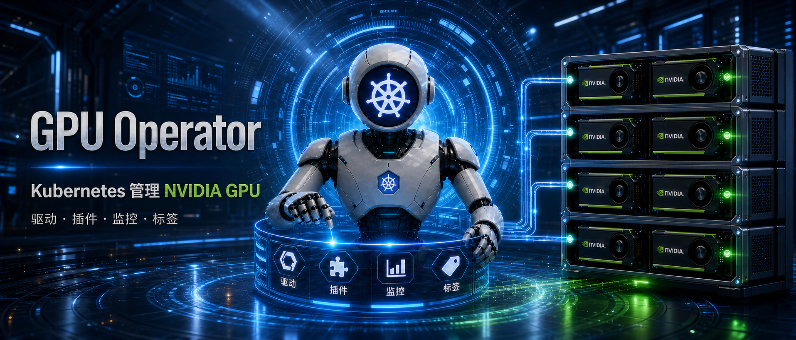
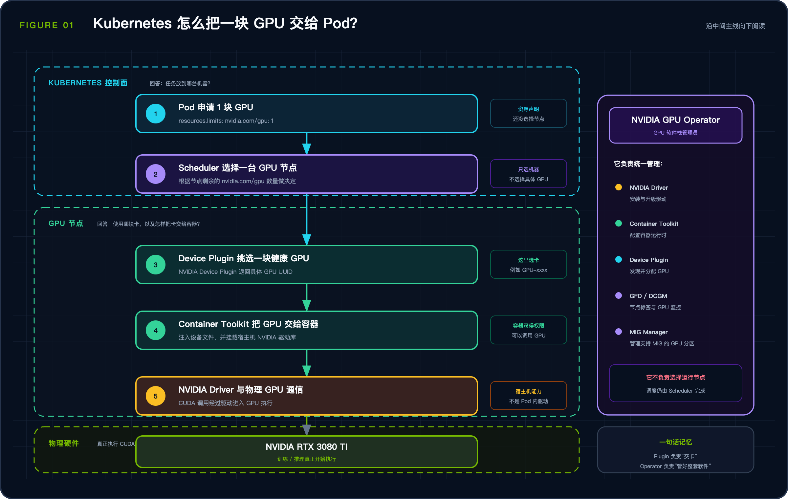
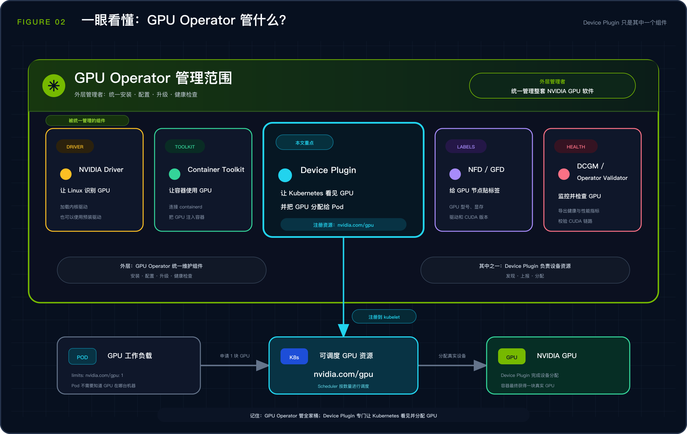
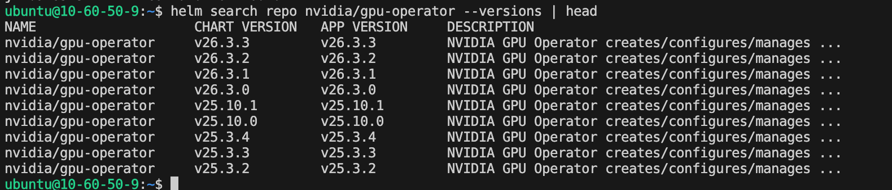
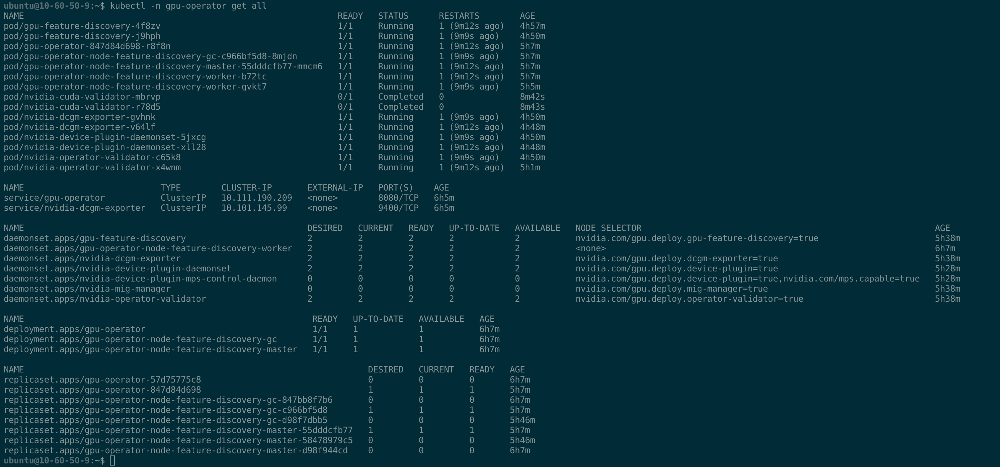
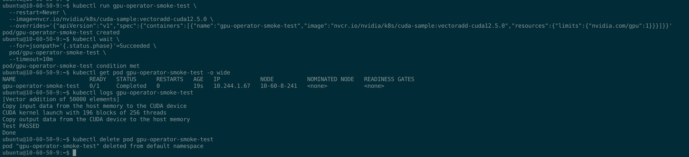

# GPU Operator 到底管什么？Kubernetes 管理 NVIDIA GPU 实战



上一篇用两台 RTX 3080 Ti 跑通了 Kubernetes 整卡调度。当时的做法很直接：宿主机装驱动和 NVIDIA Container Toolkit，集群里单独部署 NVIDIA Device Plugin，Pod 通过 `nvidia.com/gpu` 申请显卡。

这套方案能跑任务，但 GPU 节点上的东西比较散。驱动和运行时在宿主机，Device Plugin 是一份单独的 YAML，节点标签、监控和 CUDA 校验还要另外处理。节点只有两台时问题不大，节点一多，组件版本和运行状态就不好管了。

这篇仍使用原来的两台机器，改由 GPU Operator 统一管理 Device Plugin。宿主机已有的驱动和 Container Toolkit 保留，不让 Operator 重装。

## 1. 为什么要装 GPU Operator

Device Plugin 的核心工作，是发现节点上的 GPU，向 kubelet 注册 `nvidia.com/gpu`，并在 Pod 启动时分配设备。它不会替你安装驱动，也不负责部署监控、维护节点标签或检查 CUDA 链路。

GPU Operator 管的范围要大得多。它读取 `ClusterPolicy`，根据配置部署 Driver、Container Toolkit、Device Plugin、NFD、GFD、DCGM Exporter、Operator Validator 等组件，并持续检查它们的状态。



*图 1：GPU Operator 管理的是节点上的 GPU 软件栈。*

它不是新的 GPU Scheduler。安装前后，Pod 申请 GPU 的写法没有变化：

```yaml
resources:
  limits:
    nvidia.com/gpu: 1
```

默认 Scheduler 仍然只看节点上还有多少个可分配的 `nvidia.com/gpu`，不会因为安装了 Operator 就按显存、温度或实时利用率调度。

## 2. GPU Operator 里都有哪些组件

安装完成后，`gpu-operator` 命名空间里会出现不少 Pod。把它们放到一起看，各自的职责并不复杂。

| 组件 | 在集群里做什么 |
| --- | --- |
| NVIDIA Driver | 让 Linux 能驱动 GPU。本文使用宿主机已经安装的 570.153.02 |
| NVIDIA Container Toolkit | 让 containerd 创建的容器能访问 GPU。本文保留宿主机上的 1.19.1 |
| NVIDIA Device Plugin | 向 kubelet 注册 `nvidia.com/gpu`，跟踪设备健康状态并分配 GPU |
| Node Feature Discovery（NFD） | 发现 CPU、内核、PCI 设备等通用节点特征，生成 `feature.node.kubernetes.io/*` 标签 |
| GPU Feature Discovery（GFD） | 读取 GPU 型号、数量、显存、计算能力和驱动版本，生成 `nvidia.com/*` 标签 |
| DCGM / DCGM Exporter | 读取 GPU 健康和性能数据，并以 Prometheus 指标暴露 |
| MIG Manager | 根据节点标签配置 MIG，仅在支持 MIG 的 GPU 节点上启用 |
| Operator Validator | 负责执行 Driver、Toolkit、Device Plugin 和 CUDA 工作负载的校验 |

NFD 和 GFD 很容易混淆。NFD 先从 PCI 设备里发现 NVIDIA 厂商 ID `10de`，GPU Operator 据此判断哪些节点需要部署 GPU 组件；GFD 再读取 NVIDIA GPU 的详细信息，写入 `nvidia.com/gpu.product`、`nvidia.com/gpu.memory` 等标签。

Device Plugin 仍然是 NVIDIA 的 Kubernetes Device Plugin，只是它的 DaemonSet 改由 Operator 创建和维护。



*图 2：GPU Operator 是外层管理者；Device Plugin 是其管理的组件之一，负责把 GPU 资源注册给 kubelet。*

## 3. 本次环境和安装取舍

两台节点的配置如下：

| 项目 | 配置 |
| --- | --- |
| 节点 | `10-60-50-9`、`10-60-8-241` |
| GPU | 每台一张 NVIDIA GeForce RTX 3080 Ti，12 GB |
| Kubernetes | v1.36.2 |
| containerd | 2.2.1 |
| NVIDIA Driver | 570.153.02 |
| NVIDIA Container Toolkit | 1.19.1 |
| 原 Device Plugin | v0.17.1，独立 DaemonSet |

驱动和 Toolkit 已经工作正常，没有必要为了 Operator 再装一次。因此 Helm 安装时关闭这两个组件：

```bash
--set driver.enabled=false
--set toolkit.enabled=false
--set cdi.enabled=false
```

CDI（Container Device Interface）是容器运行时读取设备描述并向容器注入 GPU 的开放规范。GPU Operator v25.3 开启 `cdi.enabled` 后会启用 CDI 设备注入能力。本环境的 containerd 已沿用上一篇配置好的 `nvidia` runtime，且这次不测试 CDI，因此显式关闭它，保持原有的 GPU 注入路径不变。

RTX 3080 Ti 属于消费级 GPU，不支持 MIG，也不在 GPU Operator 官方的数据中心 GPU 支持列表中。再加上这里使用的是 Kubernetes v1.36.2，这套组合更适合作为兼容性实验，不能当成 NVIDIA 官方支持的生产基线。

## 4. 版本选择：为什么最终没有使用 v26.3.3

本文测试时，Helm 仓库中的最新稳定版本为 v26.3.3。它在这套 RTX 3080 Ti 与 570.153.02 驱动组合上无法通过 CUDA Validator，因此实验最终使用 v25.3.4。

这只是本次环境的实测结果，不代表 v25.3.4 更适合所有生产环境。

先添加 NVIDIA Helm 仓库并查看版本：

```bash
helm repo add nvidia https://helm.ngc.nvidia.com/nvidia
helm repo update
helm search repo nvidia/gpu-operator --versions | head
```



*图 3：Helm 仓库中能查到 v26.3.3，本文最后使用 v25.3.4。*

我最开始测试的是 v26.3.3。Operator、NFD、GFD、DCGM Exporter 和 Device Plugin 都能启动，但 Operator Validator 中的 CUDA Validator 运行到 GPU 计算时失败：

```text
Failed to allocate device vector A
(error code forward compatibility was attempted on non supported HW)
```

Device Plugin 已经成功注册 GPU，问题出在 CUDA Validator 所用 CUDA 运行时与 RTX 3080 Ti、570.153.02 驱动组合的兼容性上。

这个报错对应 CUDA 的 forward compatibility（前向兼容）机制。它面向的场景是：基于较新 CUDA Toolkit 构建的应用或容器，需要运行在较旧、且处于不同主版本分支的宿主机 NVIDIA Linux GPU 驱动上；CUDA 会通过兼容库尝试桥接这个版本差。NVIDIA 将这条路径限定在数据中心 GPU、部分 NGC Server Ready RTX SKU 和 Jetson；RTX 3080 Ti 不在支持范围。因此，v26.3.3 的 CUDA Validator 在本环境进入这条兼容路径后直接失败。

期间也试过给 v26 Operator 单独换用 v25 的校验镜像，结果其中的 `driver-validation` 又以退出码 127 失败。因此没有继续采用混用组件版本的方案。完整的 v25.3.4 组件组合则通过了本环境的 CUDA 校验；这说明它适合本次实验，不代表它对所有 GPU、驱动组合都更合适。

换成完整的 v25.3.4 后，两台节点的 CUDA Validator 都能通过。因此本文使用的版本固定为：

```text
GPU Operator Helm Chart：v25.3.4
GPU Operator Controller：v25.3.4
NVIDIA Device Plugin：v0.17.4
```

生产环境应按照 NVIDIA Platform Support 和 Release Notes 选择 GPU、操作系统、Kubernetes、驱动与 Operator 的受支持组合，不要直接照搬这里的版本。

## 5. 安装 GPU Operator

### 5.1 删除原来独立部署的 Device Plugin

GPU Operator 会部署自己的 Device Plugin。安装之前要先停掉 GPU 工作负载，并删除旧 DaemonSet，不能让两套插件同时向 kubelet 注册同一种资源。

先备份当前状态和旧 YAML：

```bash
kubectl get nodes \
  -o custom-columns=NAME:.metadata.name,GPU:.status.allocatable.nvidia\\.com/gpu

kubectl get pods -A -o wide

kubectl -n kube-system get daemonset nvidia-device-plugin-daemonset -o yaml \
  > ~/nvidia-device-plugin-daemonset-before-gpu-operator.yaml
```

停止测试工作负载，然后删除旧 Device Plugin：

```bash
kubectl scale deployment/gpu-test --replicas=0

kubectl delete daemonset \
  -n kube-system \
  nvidia-device-plugin-daemonset
```

再查一次：

```bash
kubectl -n kube-system get daemonset nvidia-device-plugin-daemonset
```

这里应返回 `NotFound`。旧插件删除后，节点上的 `nvidia.com/gpu` 可能会短暂消失，等 Operator 管理的新插件注册后会恢复。

### 5.2 使用 DaoCloud 镜像

实际安装时，官方镜像仓库在这两台云主机上多次超时。为避开镜像拉取超时，Helm 参数中直接替换镜像仓库地址：

```text
Operator、Device Plugin、GFD：
m.daocloud.io/nvcr.io/nvidia

Operator Validator（包括 CUDA Validator）：
m.daocloud.io/nvcr.io/nvidia/cloud-native

Node Feature Discovery：
m.daocloud.io/registry.k8s.io/nfd/node-feature-discovery
```

这里只替换仓库前缀，镜像名称和版本仍由 v25.3.4 的 Helm Chart 决定。

### 5.3 执行 Helm 安装

这条命令的核心是保留宿主机已有的 Driver 和 Container Toolkit，同时把 Device Plugin、NFD/GFD、监控和校验组件交给 GPU Operator。

本次实际使用的完整命令如下：

```bash
helm install gpu-operator nvidia/gpu-operator \
  --namespace gpu-operator \
  --create-namespace \
  --version v25.3.4 \
  --set driver.enabled=false \
  --set toolkit.enabled=false \
  --set cdi.enabled=false \
  --set devicePlugin.enabled=true \
  --set operator.repository=m.daocloud.io/nvcr.io/nvidia \
  --set validator.repository=m.daocloud.io/nvcr.io/nvidia/cloud-native \
  --set devicePlugin.repository=m.daocloud.io/nvcr.io/nvidia \
  --set gfd.repository=m.daocloud.io/nvcr.io/nvidia \
  --set node-feature-discovery.image.repository=m.daocloud.io/registry.k8s.io/nfd/node-feature-discovery
```

`devicePlugin.enabled=true` 虽然是默认值，这里仍然显式写出来，避免看命令时误以为 Device Plugin 还在集群外单独维护。

安装后查看 Helm 状态：

```bash
helm list -n gpu-operator
helm status gpu-operator -n gpu-operator
helm get values gpu-operator -n gpu-operator
```

安装完成后的 Helm 状态如下：

```text
NAME: gpu-operator
NAMESPACE: gpu-operator
STATUS: deployed
CHART: gpu-operator-v25.3.4
```

再确认 Pod 使用的镜像：

```bash
kubectl get pods -n gpu-operator \
  -o jsonpath='{range .items[*]}{.metadata.name}{"\n"}{range .spec.initContainers[*]}{"  init: "}{.image}{"\n"}{end}{range .spec.containers[*]}{"  container: "}{.image}{"\n"}{end}{end}'
```

输出应显示：Operator、Device Plugin 和 GFD 使用 NVIDIA 的 DaoCloud 前缀；Operator Validator 与 NFD 分别使用前面设置的对应仓库。

如果 Operator 已经安装，只需要修改镜像仓库，可以保留现有值执行：

```bash
helm upgrade gpu-operator nvidia/gpu-operator \
  --namespace gpu-operator \
  --version v25.3.4 \
  --reuse-values \
  --set operator.repository=m.daocloud.io/nvcr.io/nvidia \
  --set validator.repository=m.daocloud.io/nvcr.io/nvidia/cloud-native \
  --set devicePlugin.repository=m.daocloud.io/nvcr.io/nvidia \
  --set gfd.repository=m.daocloud.io/nvcr.io/nvidia \
  --set node-feature-discovery.image.repository=m.daocloud.io/registry.k8s.io/nfd/node-feature-discovery
```

如果首次安装失败，需要回到独立部署方案，先卸载未完成的 GPU Operator，确认 Operator 管理的 Device Plugin 已停止，再恢复第 5.1 节备份的 YAML：

```bash
kubectl apply -f ~/nvidia-device-plugin-daemonset-before-gpu-operator.yaml
```

## 6. 检查安装结果

先看 `gpu-operator` 命名空间里的全部资源：

```bash
kubectl -n gpu-operator get all
```



*图 4：两个节点上的 Device Plugin、GFD、DCGM Exporter 和 Operator Validator 都已就绪；CUDA Validator 已完成校验。*

截图里的 MIG Manager 和 MPS Control Daemon 的期望副本数为 `0`，不是安装失败。RTX 3080 Ti 不支持 MIG，这次也没有开启 MPS。

接着看 `ClusterPolicy`：

```bash
kubectl get clusterpolicy cluster-policy \
  -o jsonpath='{.status.state}{"\n"}'
```

输出为：

```text
ready
```

再检查 Device Plugin 注册的 GPU 数量：

```bash
kubectl get nodes \
  -o custom-columns=NAME:.metadata.name,GPU-CAPACITY:.status.capacity.nvidia\\.com/gpu,GPU-ALLOCATABLE:.status.allocatable.nvidia\\.com/gpu
```

两个节点均上报 1 块 GPU：

```text
NAME          GPU-CAPACITY   GPU-ALLOCATABLE
10-60-50-9    1              1
10-60-8-241   1              1
```

CUDA Validator 也已通过，日志显示：

```bash
kubectl get pods -n gpu-operator -l app=nvidia-cuda-validator -o wide
kubectl logs -n gpu-operator <nvidia-cuda-validator-pod>
```

```text
cuda workload validation is successful
```

CUDA Validator 通过以后，我又手动跑了一次 `vectoradd`，确认普通 Pod 确实能申请 GPU：

```bash
kubectl run gpu-operator-smoke-test \
  --restart=Never \
  --image=nvcr.io/nvidia/k8s/cuda-sample:vectoradd-cuda12.5.0 \
  --overrides='{"apiVersion":"v1","spec":{"containers":[{"name":"gpu-operator-smoke-test","image":"nvcr.io/nvidia/k8s/cuda-sample:vectoradd-cuda12.5.0","resources":{"limits":{"nvidia.com/gpu":1}}}]}}'

kubectl wait \
  --for=jsonpath='{.status.phase}'=Succeeded \
  pod/gpu-operator-smoke-test \
  --timeout=10m

kubectl get pod gpu-operator-smoke-test -o wide
kubectl logs gpu-operator-smoke-test
kubectl delete pod gpu-operator-smoke-test
```



*图 5：测试 Pod 被调度到 `10-60-8-241`，CUDA vector-add 返回 `Test PASSED`。*

到这里，Helm 状态为 `deployed`，`ClusterPolicy` 为 `ready`，两台节点都重新上报 `nvidia.com/gpu=1`，实际 CUDA Pod 也能运行。

## 7. `ClusterPolicy` 卡在 notReady 时怎么看

这次最耗时间的不是 Helm 命令，而是镜像拉取和 CUDA Validator。`ClusterPolicy=notReady` 只表示整条链路里还有组件没通过，单看这个状态找不到原因。

我排查时主要看下面几项：

```bash
# 先看整体状态和 Device Plugin 日志
kubectl get pods -n gpu-operator -o wide
kubectl describe clusterpolicy cluster-policy
kubectl logs -n gpu-operator daemonset/nvidia-device-plugin-daemonset

# 取 CUDA Validator Pod 名
kubectl get pods -n gpu-operator -l app=nvidia-cuda-validator -o wide

# 用上一步显示的 Pod 名查看完整日志
kubectl logs -n gpu-operator <nvidia-cuda-validator-pod> --all-containers
```

实际遇到过三类问题：

- NFD 为 `ImagePullBackOff`：`registry.k8s.io` 跳转到 `*.docker.pkg.dev` 后超时；
- GFD 或 Device Plugin 为 `ImagePullBackOff`：访问 `nvcr.io` 时 TLS 握手超时；
- CUDA Validator 报 `forward compatibility was attempted on non supported HW`：镜像已经启动，GPU 也已注册，但 CUDA 校验与 GPU、驱动组合不兼容。

前两类问题在切换到 DaoCloud 镜像仓库后解决。第三类不能靠重启 Pod 解决，最后换成完整的 v25.3.4 组件组合才通过。

如果宿主机上的 `nvidia-smi` 本身就失败，应先修驱动。驱动没有正常工作时，后续的 Device Plugin、Operator Validator 等 Kubernetes 组件也无法绕过这个问题。

## 8. 装上 Operator 后，调度没有变

GPU Operator 管理的是 GPU 软件栈，不是训练任务队列。默认情况下，`nvidia.com/gpu: 1` 仍然表示申请一整块 GPU，不能写成 `0.5`。这两台机器各一张卡，因此最多同时满足两个单卡 Pod。

Time-Slicing 和 MPS 由 Device Plugin 的共享配置控制。Time-Slicing 不提供显存隔离，MIG 的隔离更完整，但 RTX 3080 Ti 不支持。

训练排队、配额、Gang Scheduling、多租户公平共享，以及对 NVLink、NUMA 和网络拓扑的感知，都不属于 GPU Operator 的职责。这些能力需要 Kueue、Volcano 或其他调度扩展。

## 9. 收尾

这次没有重装驱动，也没有改变 Pod 申请 GPU 的 YAML。变化发生在 Kubernetes：旧 Device Plugin 被删除，新的 Device Plugin、NFD/GFD、DCGM Exporter 和 Operator Validator 由 GPU Operator 统一维护。

能够跑通，主要依赖三个决策：

- 设置 `driver.enabled=false` 和 `toolkit.enabled=false`，不改动宿主机已经验证可用的驱动和 Container Toolkit；
- 选用 v25.3.4，而不是本环境 CUDA Validator 无法通过的 v26.3.3；
- 将镜像仓库替换为 DaoCloud，避开官方仓库拉取超时。

这些选择都和具体的 GPU、驱动与网络环境有关。换到另一套集群时，仍应先小范围验证，再决定版本和镜像策略。

## 10. 官方参考资料

- Kubernetes Device Plugins：<https://kubernetes.io/docs/concepts/extend-kubernetes/compute-storage-net/device-plugins/>
- Kubernetes GPU 调度：<https://kubernetes.io/docs/tasks/manage-gpus/scheduling-gpus/>
- NVIDIA Kubernetes Device Plugin：<https://github.com/NVIDIA/k8s-device-plugin>
- NVIDIA GPU Operator：<https://docs.nvidia.com/datacenter/cloud-native/gpu-operator/latest/>
- NVIDIA GPU Operator 安装指南：<https://docs.nvidia.com/datacenter/cloud-native/gpu-operator/latest/getting-started.html>
- NVIDIA GPU Operator Platform Support：<https://docs.nvidia.com/datacenter/cloud-native/gpu-operator/latest/platform-support.html>
- NVIDIA Container Toolkit：<https://docs.nvidia.com/datacenter/cloud-native/container-toolkit/latest/>
- CUDA Forward Compatibility：<https://docs.nvidia.com/deploy/cuda-compatibility/forward-compatibility.html>
