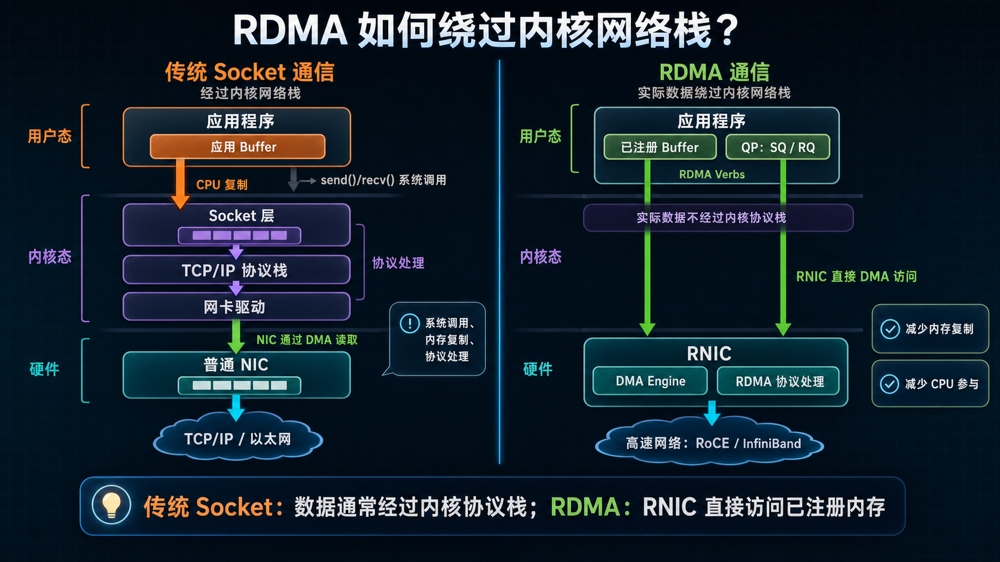
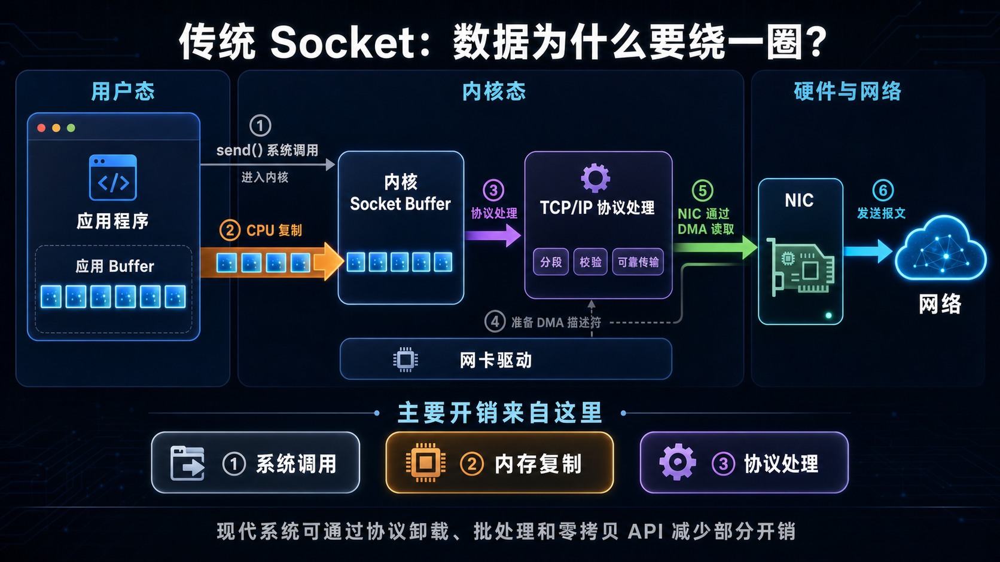
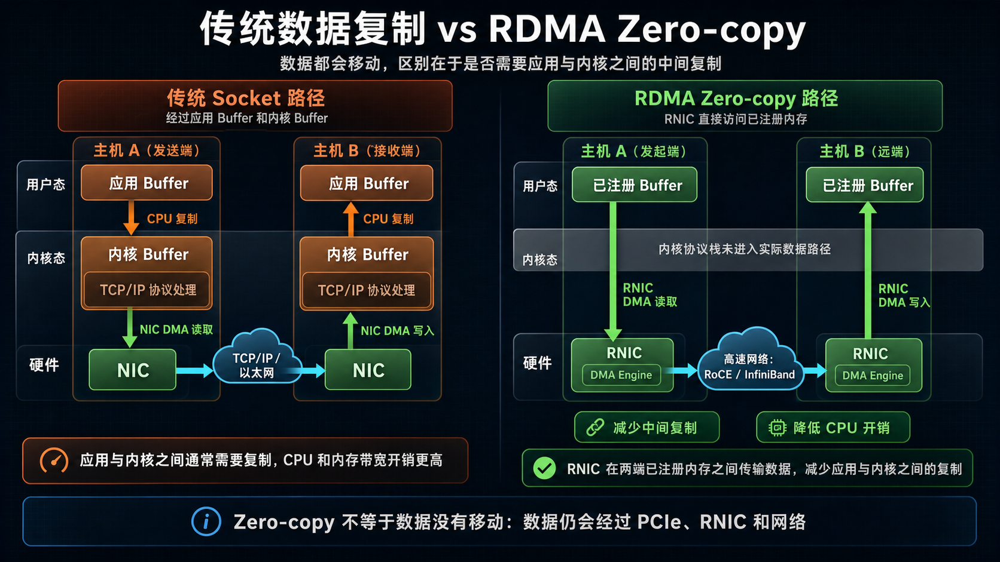
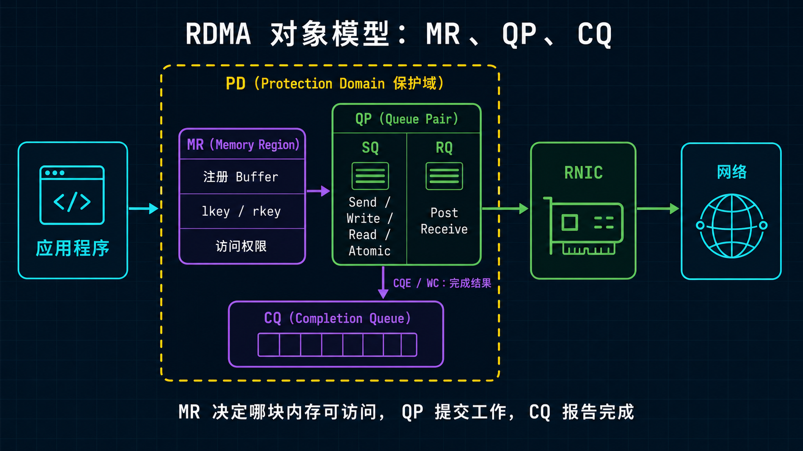
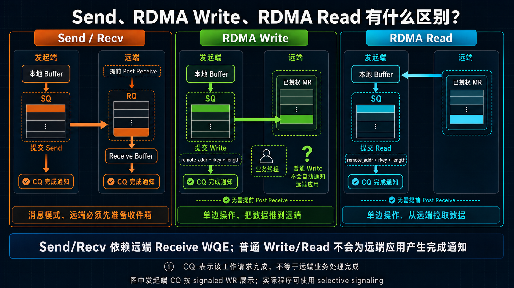
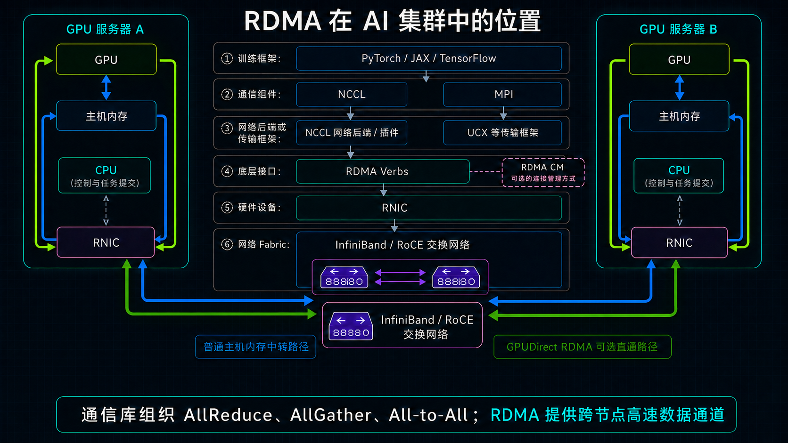

# RDMA 是什么：让数据跨主机直达内存的高速通道

> 阅读提示：第一次接触 RDMA，只要先看懂三件事：数据为什么能少绕路、MR/QP/CQ 分别做什么、Send/Write/Read 有什么区别。

大模型训练需要跨服务器同步数据，分布式存储也需要频繁读写其他机器上的数据。网络带宽越来越高后，瓶颈不一定在线缆上，还可能出现在服务器内部：

**数据已经到网卡了，为什么还要在内核、CPU 和多块缓冲区之间绕来绕去？**

先看最常见的传统 Socket 通信：

以发送为例，应用通过 `send()` 进入内核，数据通常需要从应用 Buffer 复制到内核 Socket Buffer，再由 TCP/IP 协议栈和网卡驱动处理。随后，NIC 通过 DMA 读取内核中的数据并发送到网络。主要开销来自系统调用、内存复制和协议处理，而不是 NIC 的 DMA 本身。

现代操作系统可以通过协议卸载、批处理和零拷贝 API 减少部分开销，因此不能简单理解为传统 TCP 一定很慢。

RDMA 把主体数据传输交给 RNIC。两端 RNIC 分别通过 DMA 访问各自主机的已注册内存，并通过网络完成传输，从而减少应用与内核之间的数据复制和 CPU 协议处理开销。

---

## 一、RDMA 到底是什么？

RDMA 的全称是 Remote Direct Memory Access，中文常译为“远程直接内存访问”。

先理解 DMA，再理解 RDMA：

- DMA：本机的设备（例如网卡或 SSD）可以直接读写本机内存，CPU 负责下达任务，不逐字节搬运数据。
- RDMA：支持 RDMA 的网卡通过网络，在两台主机的已注册内存之间传输数据；其中 Read、Write 等单边操作还可以直接访问远端已授权的内存区域。

RNIC（RDMA Network Interface Card）是一类支持 RDMA 的网卡；在 InfiniBand 文档中也常被称为 HCA。它属于 NIC（Network Interface Card，网卡）的一种：**所有 RNIC 都是 NIC，但不是所有 NIC 都支持 RDMA。**

| 对比项 | 普通 NIC | RNIC |
|---|---|---|
| 主要任务 | 收发普通网络报文 | 收发 RDMA 数据，并直接搬运已注册内存 |
| 数据传输方式 | 普通 TCP/UDP 通信通常由内核协议栈和 CPU 配合完成 | 队列处理、DMA、权限校验等可由网卡硬件完成 |
| 常见场景 | TCP/UDP、Web 与一般业务网络 | AI 集群、HPC、分布式存储 |

一张支持 RoCE 的以太网网卡，既可以像普通 NIC 一样处理 TCP/UDP，也可以开启 RDMA 功能，以 RNIC 的方式工作。

### RDMA 不是任意读取远程内存

“直接”不代表可以随意访问另一台机器。

比如，主机 A 想直接读写主机 B 的内存，主机 B 必须先把允许访问的内存范围注册为 MR（Memory Region）并设置权限。这里的“直接”，是指 RNIC 可以直接访问已授权的内存，减少数据传输过程中绕行的软件环节，而不是跳过权限控制。

---

## 二、RDMA 为什么快？

图中右侧以 RDMA Write 的方向为例；RDMA Read 的数据方向相反，但同样由两端 RNIC 通过 DMA 访问已注册内存。

结合上图，可以把 RDMA 的优势概括为三个关键词：

| 关键词 | 用大白话解释 |
|---|---|
| Zero-copy | 典型 RDMA 传输中，RNIC 可通过 DMA 直接访问已注册内存，无需在应用缓冲区与内核缓冲区之间复制数据 |
| Kernel bypass | 实际传输的数据通常不必每次都经过内核协议栈 |
| Transport offload | 队列处理、权限检查、报文分段与重组，以及部分可靠传输工作由 RNIC 完成 |

RDMA 也不是“零 CPU”：

- CPU 仍要创建资源、注册内存、建立连接、提交任务和处理异常。
- 应用还要从 CQ 查询完成结果。
- 为了极低延迟，应用有时会让一个 CPU 核持续轮询 CQ。

RDMA 能快多少取决于网卡、报文大小、NUMA 拓扑和网络状况，无法用固定倍数概括。它的核心优势是减少软件处理和数据复制，从而降低延迟和 CPU 开销，并让吞吐更接近链路线速。

---

## 三、先看懂 MR、QP 和 CQ

使用 RDMA 时，先记住三个核心对象：

| 对象 | 简单理解 | 主要作用 |
|---|---|---|
| MR | 已经登记并授权的内存 | 告诉 RNIC 哪块内存可以访问 |
| QP | 提交通信任务的队列 | 把 Send、Write、Read 等任务交给 RNIC |
| CQ | 保存完成结果的队列 | 告诉应用任务成功还是失败 |

### MR：允许 RNIC 访问的内存

应用不能直接把任意内存地址交给 RNIC，而要先把一段 Buffer 注册为 MR。注册时需要说明内存范围和访问权限。

注册完成后会得到 `lkey` 和 `rkey`：`lkey` 供本地 RNIC 使用，`rkey` 供对端执行 RDMA Read、Write 等远程访问时使用。

可以把 MR 理解成一块已经登记并授权的货架：地址、范围、权限和访问凭证都正确，RNIC 才允许访问。

### QP：提交任务的地方

QP 是 Queue Pair，由两个队列组成：

- SQ（Send Queue）：提交 Send、Write、Read 等主动任务。
- RQ（Receive Queue）：提前准备 Receive Buffer，主要供 Send/Recv 使用。

可以把 SQ 理解成待办队列，把 RQ 理解成提前准备好的收件箱。

### CQ：查看任务是否完成

RDMA 通常是异步执行的。应用把任务放进 QP 后，RNIC 在后台处理；任务完成后，应用从 CQ 中获取成功或失败结果。

    应用注册 MR
        -> 向 QP 提交任务
        -> RNIC 执行传输
        -> 应用从 CQ 查看结果

最重要的一点是：**任务已经提交，不等于任务已经完成。**

---

## 四、先分清 Send、Write 和 Read

初学 RDMA 最容易混淆的，是这三种操作看起来都像“传数据”，但它们决定了数据放在哪里、接收方要不要提前准备，以及谁会收到通知。

| 操作 | 可以怎么理解 | 接收方需要提前准备吗？ | 远端是否通常收到 CQ 通知？ |
|---|---|---:|---:|
| Send/Recv | 把数据放进对方提前准备的收件箱 | 是，需要 Post Receive | 是 |
| RDMA Write | 把数据推到对方授权的指定内存 | 不需要 | 否 |
| RDMA Read | 从对方授权的指定内存把数据拉回来 | 不需要 | 否 |
| Write with Immediate | Write 数据，同时附带一条通知 | 是，需要预投 Receive WQE 接收通知 | 是 |

### Send/Recv：双方都参与

接收方先准备一个 Receive Buffer，发送方再提交 Send。RNIC 会把数据放入这个提前准备的 Buffer。

它和普通消息通信最接近。关键点是：**接收方要先准备好收件箱。**

### RDMA Write：把数据推过去

Write 是典型的单边操作。发起方知道对方的远程地址和 rkey 后，可以把本地数据直接写进对方指定的 MR。

普通 Write 不要求远端为这次传输提前 Post Receive，也不会自动告诉远端业务线程“数据已经到了”。

因此，上层协议仍要约定如何通知对端，例如再发一条消息、使用 Write with Immediate，或更新双方约定的状态字段。

需要注意，Write with Immediate 的主体数据仍然直接写入远端指定的 MR；远端预投的 Receive WQE 用于接收携带 immediate data 的完成通知，并不承载这次 Write 的主体数据。

### RDMA Read：把数据拉回来

Read 的方向正好相反：

    远程已授权 MR -> 本地 Buffer

发起方同样需要远程地址和 rkey。完成结果出现在发起方的 CQ 中，远端应用通常不会因为这次 Read 收到通知。

### 还有 Atomic，但可以先略过

Atomic 用来原子更新远程内存中的小字段，例如计数器。它是进阶能力，第一次理解 RDMA 时优先掌握 Send、Write 和 Read 就足够了。

### 完成不等于业务已经处理

本地 CQ 显示成功，表示这次 RDMA 工作已经按传输语义完成，本地相关 Buffer 可以按规则复用。

它不等于远端业务线程已经知道、已经消费数据，或数据已经持久化到存储介质。业务层仍然需要自己的通知、顺序和错误处理协议。

---

## 五、常见连接类型与网络承载方式

### RC、UC、UD：QP 的传输类型

第一次接触 RDMA，重点理解 RC 就够了：

| 类型 | 入门理解 |
|---|---|
| RC（Reliable Connection） | 一对一，在同一 QP 的传输语义范围内可靠且有序；常用于 AI、HPC 和存储 |
| UC（Unreliable Connection） | 一对一，但不保证可靠交付；较少作为通用入门选择 |
| UD（Unreliable Datagram） | 类似不可靠数据报；适合小消息或控制面场景 |

RC 支持 Send/Recv、Read、Write 等常见能力，也是本文默认讨论的类型。

这里的“可靠”不等于永不失败：RNIC 会负责确认、重传和顺序控制；如果重试耗尽、对端失联或路径异常，工作请求仍会以错误完成，QP 也可能进入 Error 状态，需要上层重新建立通信状态。

> 进阶提示：RC 通常需要为通信对端维护连接状态。全互联规模扩大时，整个集群的连接关系可能按 O(N²) 增长，单个节点需要维护的对端状态也会随规模增加。部分 RNIC 和通信框架支持 **DC（Dynamically Connected）** 等可扩展传输机制，让发起端资源在多个目标之间复用，从而降低大规模通信中的 QP 和连接状态压力。DC 并不是所有设备都支持的通用传输类型，初学阶段先理解 RC 即可。

### InfiniBand、RoCE 和 iWARP：RDMA 的承载方式

RDMA 是一种通信能力，不等于某一种线缆或网络。

| 技术 | 底层网络 | 入门理解 |
|---|---|---|
| InfiniBand | 专用 InfiniBand Fabric | 原生为高性能 RDMA 设计的网络 |
| RoCE | 以太网 | 在以太网上承载 RDMA；RoCEv2 使用 IP/UDP 封装，可跨三层网络 |
| iWARP | TCP/IP 以太网 | 在 TCP/IP 体系上实现 RDMA，生态相对少见 |

RoCE 常见有两个版本：

| 版本 | 简单理解 |
|---|---|
| RoCEv1 | 直接运行在二层以太网上，不能像普通 IP 报文那样跨三层路由；适合在同一个二层网络内使用。 |
| RoCEv2 | 在 RDMA 报文外增加 IP/UDP 封装，可以通过三层 IP 网络路由；数据中心里更常见。 |

RoCEv2 使用 UDP/IP 封装，不等于应用在使用普通 UDP Socket。应用仍然通过 RDMA 接口提交任务，RNIC 负责 RDMA 传输语义。

RoCEv2 里的 PFC、ECN、DCQCN、QoS 映射和交换机配置，是网络工程主题，本文不展开；后续会单独写一篇配置与调优文章。

---

## 六、一条 RDMA 连接大致怎么跑起来？

不必一开始就记状态机细节，只要把下面的顺序串起来：

    准备并注册内存
        -> 创建 CQ 和 QP
        -> 双方交换连接信息
        -> 把 QP 置为可工作状态
        -> 接收方提前 Post Receive（Send/Recv 或 Write with Immediate 场景）
        -> 向 SQ 提交任务
        -> RNIC 执行
        -> 从 CQ 查看结果

双方通常通过 TCP、RDMA CM 或其他控制通道交换 QP 信息；单边 Read、Write 还需要交换远程地址和 rkey。

在 RC 模式下，QP 常见状态会从 RESET 进入 INIT、RTR、RTS。RTR（Ready to Receive）表示 QP 已具备接收能力，RTS（Ready to Send）表示 QP 已具备发送能力。初学时知道这两个缩写的含义即可，具体参数可在真正编写 Verbs 程序时再学习。

---

## 七、RDMA 在 AI 集群里处在什么位置？

在多机大模型训练中，使用者通常不会手写 Verbs；训练框架、集合通信库和传输框架会分层封装底层细节。

图中的线条分别表示：

- **蓝色双向线**：普通主机内存中转路径，数据经过 GPU、主机内存和 RNIC。
- **绿色双向线**：GPUDirect RDMA 直通路径，RNIC 直接读写 GPU 显存，不再使用主机内存中转。
- **灰色箭头或虚线**：软件调用、任务提交和控制关系，不表示主体数据经过 CPU 搬运。
- **紫色虚线**：RDMA CM 与 RDMA Verbs 的可选连接管理关系，不是数据传输的必经路径。

第一次看图时，只看中间的软件栈和服务器之间的网络路径即可：训练框架调用通信组件，通信组件或其网络后端通过 RDMA Verbs 使用 RNIC；RDMA 报文则由 InfiniBand 或 RoCE 网络承载。不同软件组合的实际分层可能有所不同，图中展示的是便于入门理解的常见关系。

> 实际能否使用 GPUDirect RDMA，取决于 GPU、RNIC、驱动、通信库和 PCIe 拓扑等条件。详见[《GPUDirect RDMA：跨节点 GPU 的显存直通车》](https://mp.weixin.qq.com/s/eaPt4jwbF833z8ovJDhkPA)。

---

## 八、怎么确认 RDMA 环境可用？

不要一上来就跑大模型训练。先确认设备、连通性和点对点性能，再扩大到多机业务。

### 1. 看设备和端口

常用命令：

    rdma link
    ibv_devices
    ibv_devinfo

重点确认设备是否存在、端口是否处于 Active 状态、链路类型和速率是否符合预期。

### 2. 测基本连通性

如果环境提供 rping 或示例程序，可以先验证 RDMA 连接管理和基本数据路径。

普通 ping 成功，只说明 IP 大致可达，不代表 RDMA QP 一定能建立。

### 3. 测点对点性能

perftest 常用工具包括：

    ib_write_bw
    ib_read_bw
    ib_send_bw
    ib_write_lat
    ib_read_lat
    ib_send_lat

分别测试 Write、Read、Send 的带宽与延迟，更容易发现问题在哪一种操作、哪一个方向。

---

## 九、总结

    1. RDMA 让 RNIC 在两台主机的已注册内存之间高速搬运数据。
    2. 它通过减少中间复制、内核参与和 CPU 协议处理来降低开销。
    3. MR 决定“哪块内存能访问”，QP 决定“任务从哪里提交”，CQ 告诉应用“任务是否完成”。
    4. Send/Recv 是双方参与的消息模式；Write/Read 是典型的远程内存访问。

RDMA 最值得记住的，不是某一条命令，而是它重新划分了工作：

**CPU 负责控制，RNIC 负责搬运，应用直接面对队列和内存。**

这正是它成为 AI 集群、HPC 和高性能存储网络重要底座的原因。

---

## 参考资料

- [IBTA：InfiniBand Architecture Specification](https://www.infinibandta.org/ibta-specification/)
- [Linux Kernel：Userspace verbs access](https://docs.kernel.org/infiniband/user_verbs.html)
- [Linux RDMA Core：用户态库与工具](https://github.com/linux-rdma/rdma-core)
- [rdma-core / libibverbs：ibv_reg_mr(3)](https://github.com/linux-rdma/rdma-core/blob/master/libibverbs/man/ibv_reg_mr.3)
- [NVIDIA：RDMA Aware Networks Programming User Manual](https://docs.nvidia.com/rdma-aware-networks-programming-user-manual-1-7.pdf)
- [【RDMA 学习笔记——基础篇】（1）RDMA 概述](https://blog.csdn.net/qq_54050349/article/details/161665483)
