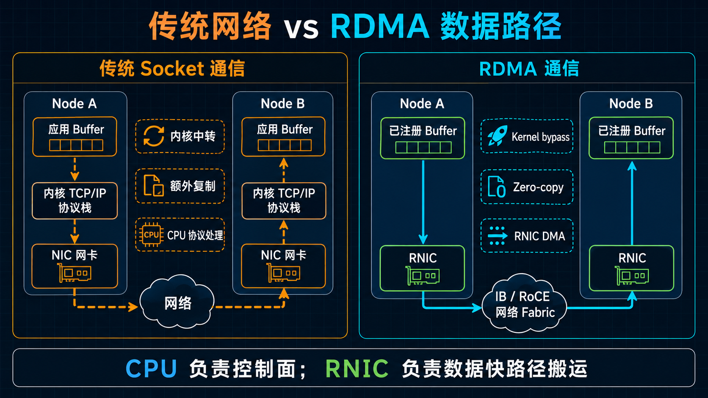
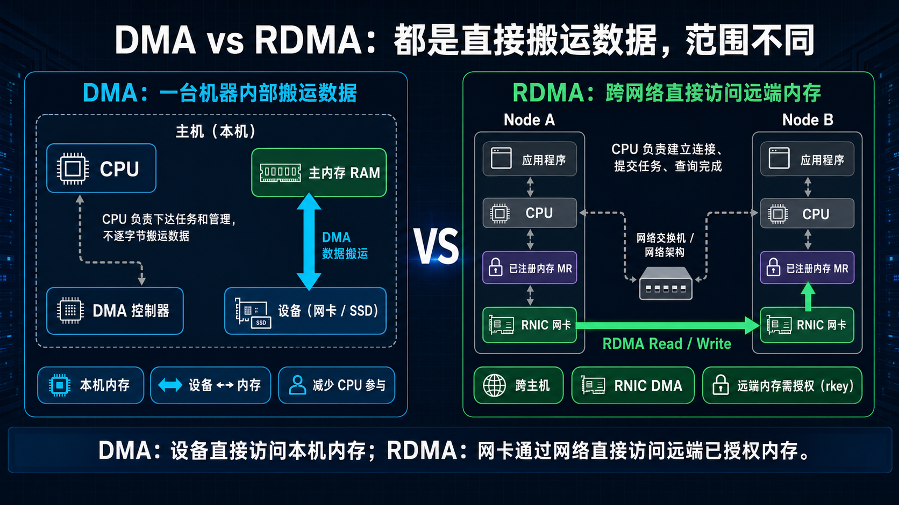
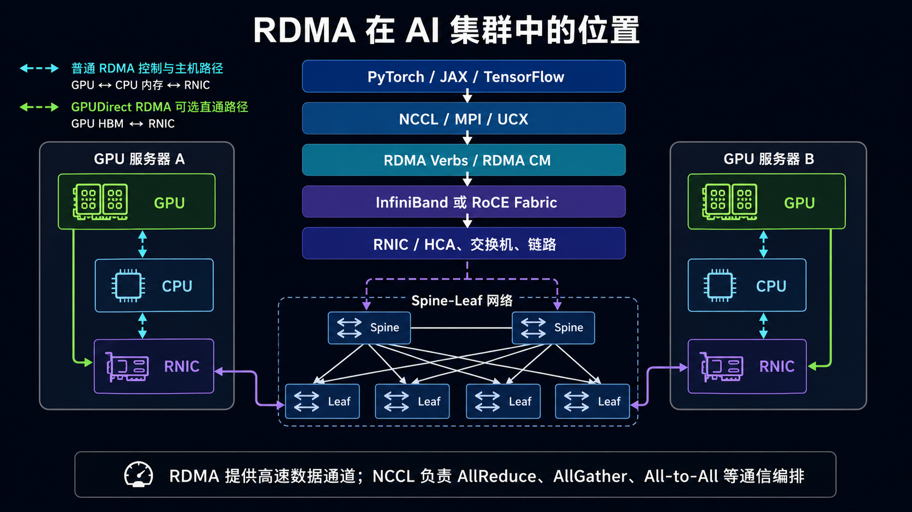

# RDMA 是什么：让数据跨主机直达内存的高速通道

> 阅读提示：第一次接触 RDMA，只要先看懂三件事：数据为什么能少绕路、MR/QP/CQ 分别做什么、Send/Write/Read 有什么区别。

大模型训练需要跨服务器同步数据，分布式存储也需要频繁读写其他机器上的数据。网络带宽越来越高后，瓶颈不一定在线缆上，还可能出现在服务器内部：

**数据已经到网卡了，为什么还要在内核、CPU 和多块缓冲区之间绕来绕去？**

传统 Socket 通信是最常见的网络编程方式。应用调用 send/recv 等接口把数据交给操作系统；内核处理 Socket 缓冲区和 TCP/IP 协议栈，再由网卡发送到网络。接收端则按相反方向处理数据。

传统 Socket 通信的概念路径大致是：

    发送端应用内存
        -> 内核协议栈
        -> 网卡
        -> 网络
        -> 对端网卡
        -> 对端内核协议栈
        -> 接收端应用内存

现代操作系统已经有不少优化，但内核处理、额外复制和上下文切换仍会占用 CPU 与内存带宽。

RDMA 的思路是：应用把任务交给支持 RDMA 的网卡，由网卡在两台主机已注册的内存之间搬运数据。这样可以缩短数据快路径，减少不必要的 CPU 参与。

---

## 一、RDMA 到底是什么？

RDMA 的全称是 Remote Direct Memory Access，中文常译为“远程直接内存访问”。

先理解 DMA，再理解 RDMA：

- DMA：本机的设备（例如网卡或 SSD）可以直接读写本机内存，CPU 负责下达任务，不逐字节搬运数据。
- RDMA：支持 RDMA 的网卡通过网络，在两台主机的已注册内存之间传输数据；其中 Read、Write 等单边操作还可以直接访问远端已授权的内存区域。

可以把它记成一句话：

    CPU 负责控制和协调
    RNIC 负责数据快路径上的搬运

RNIC（RDMA Network Interface Card）是一类支持 RDMA 的网卡；在 InfiniBand 文档中也常被称为 HCA。它属于 NIC（Network Interface Card，网卡）的一种：**所有 RNIC 都是 NIC，但不是所有 NIC 都支持 RDMA。**

| 对比项 | 普通 NIC | RNIC |
|---|---|---|
| 主要任务 | 收发普通网络报文 | 收发 RDMA 数据，并直接搬运已注册内存 |
| 数据快路径 | 普通 TCP/UDP 通信通常由内核协议栈和 CPU 配合完成 | 队列处理、DMA、权限校验等可由网卡硬件完成 |
| 常见场景 | TCP/UDP、Web 与一般业务网络 | AI 集群、HPC、分布式存储 |

一张支持 RoCE 的以太网网卡，既可以像普通 NIC 一样处理 TCP/UDP，也可以开启 RDMA 功能，以 RNIC 的方式工作。

### RDMA 不是任意读取远程内存

“直接”不代表可以随意访问另一台机器。

远端应用要先把一段内存注册为 MR（Memory Region），并设置访问权限；进行远程读写时，通信对端只能访问这段已授权的内存。对端通常还需要知道远程地址和 rkey（远程访问密钥）。

所以 RDMA 的直接，指的是**数据快路径直接**，不是跳过权限控制。

---

## 二、RDMA 为什么快？

RDMA 常和三个关键词一起出现：

| 关键词 | 用大白话解释 |
|---|---|
| Zero-copy | 典型 RDMA 数据快路径可直接 DMA 访问已注册内存，无需在应用缓冲区与内核缓冲区之间复制数据 |
| Kernel bypass | 数据快路径通常不必每次都经过内核协议栈 |
| Transport offload | 队列处理、权限检查、报文分段与重组，以及部分可靠传输工作由 RNIC 完成 |

传统网络和 RDMA 的概念路径可以这样对比：

    传统网络：应用 Buffer -> 内核 Buffer -> NIC -> 网络 -> 内核 Buffer -> 应用 Buffer
    RDMA：    已注册 Buffer -> RNIC -> 网络 -> RNIC -> 已注册 Buffer

这里的 Zero-copy 不是“数据没有移动”。数据仍要经过 PCIe、网卡和网络；它减少的是为经过软件协议栈而产生的中间复制。

RDMA 也不是“零 CPU”：

- CPU 仍要创建资源、注册内存、建立连接、提交任务和处理异常。
- 应用还要从 CQ 查询完成结果。
- 为了极低延迟，应用有时会让一个 CPU 核持续轮询 CQ。

更准确的说法是：**RDMA 把数据搬运和部分协议处理从 CPU 快路径转交给 RNIC。**

RDMA 到底快多少，没有一个脱离测试条件的固定答案。网卡速率、报文大小、操作类型、NUMA 拓扑、拥塞状况和测试方法都会影响结果。在经过良好调优的高性能网络中，RDMA 的优势通常体现在：小消息延迟更低、传输时 CPU 开销更小，大消息吞吐也更容易接近链路线速。

所以数字不是这里的重点。更重要的直觉是：**同样是把数据送到对端，缩短软件数据路径，可以显著降低延迟和 CPU 开销。**

---

## 三、先看懂 MR、QP 和 CQ

第一次接触 RDMA，不必一次记住所有缩写。先记住三个主角：

    MR：网卡被允许访问的那块内存
    QP：应用把通信任务交给网卡的工作队列
    CQ：应用查看“任务完成了吗”的回执队列

### 1. MR：Memory Region，注册内存

普通用户态指针不能直接交给 RNIC 做 DMA。应用要先把一段 Buffer 注册为 MR。

注册后，这段内存才有明确的地址范围、访问权限和访问密钥：

| 字段 | 作用 |
|---|---|
| lkey | 本地 RNIC 使用本地 Buffer 时的校验信息 |
| rkey | 对端执行 Read、Write 等远程访问时的校验信息 |

注册 MR 时还要指定访问权限。以 libibverbs 的常见 access flags 为例：

| 权限位 | 含义 |
|---|---|
| `IBV_ACCESS_LOCAL_WRITE` | 允许本地 RNIC 写入该 MR，例如将其作为 Receive 或 RDMA Read 的目标 Buffer |
| `IBV_ACCESS_REMOTE_WRITE` | 允许对端通过 RDMA Write 写入该 MR |
| `IBV_ACCESS_REMOTE_READ` | 允许对端通过 RDMA Read 读取该 MR |
| `IBV_ACCESS_REMOTE_ATOMIC` | 允许对端对该 MR 执行受支持的 Atomic 操作 |

访问权限应遵循最小授权原则：只开放业务实际需要的远程访问能力。例如，某块 MR 如果只需要被对端 Read，就不应同时开放 Remote Write。在常见 Verbs 注册规则中，启用 Remote Write 或 Remote Atomic 时还需要同时启用 Local Write。需要注意，CPU 对这段内存的读写权限由进程的内存映射权限决定，不由这些 MR access flags 决定。

进行单边操作时，对端通常需要 remote_addr、rkey 和长度。这里的 remote_addr 通常是远端进程注册 MR 时对应的虚拟地址，并不是把物理地址直接暴露给对端；RNIC 会结合 MR 信息完成地址转换和权限校验。初学时只要理解为：“远端把一块有权限的货架位置告诉了我”。

### 2. QP：Queue Pair，队列对

QP 是提交 RDMA 工作的地方，通常包含：

| 队列 | 作用 |
|---|---|
| SQ（Send Queue） | 应用把 Send、Write、Read 等主动任务放进这里 |
| RQ（Receive Queue） | 应用提前准备接收 Buffer，主要给 Send/Recv 使用 |

可以把 SQ 看成待办队列，RQ 看成提前摆好的收件箱。

### 3. CQ：Completion Queue，完成队列

RDMA 是异步的。应用提交任务后，RNIC 在后台执行；需要确认结果时，应用从 CQ 取回完成记录。

    应用提交任务
        -> RNIC 执行传输
        -> RNIC 写入完成结果
        -> 应用轮询或等待 CQ

最重要的一句是：**任务放进 QP，不等于任务已经完成；CQ 才是查看结果的地方。**

实际程序也可能使用 selective signaling，只让一部分发送任务产生 CQE，以减少完成队列和轮询压力。因此，不一定每个发送任务都会单独返回一条完成记录。

### 4. 三个对象如何配合？

    1. 应用注册 Buffer，得到 MR
    2. 应用向 QP 提交任务
    3. RNIC 根据任务访问 MR，并完成网络传输
    4. 应用从 CQ 获取成功或失败结果

PD、WR、WQE、CQE、SGE 等术语都很常见，但第一次阅读不必深究。它们分别是在描述资源隔离、工作请求和队列中的具体条目。

还有一个点值得先知道：传统 MR 注册通常需要锁定相关内存页，并建立供 RNIC 使用的地址转换信息，因此注册大块内存可能带来较高成本。部分 RNIC、驱动和内核支持 **ODP（On-Demand Paging）**，可以按需建立映射，减少预先锁定全部页面的压力；代价是首次访问等场景可能产生缺页与映射开销。初学时只要知道这个机制存在即可，不需要深究实现。

---

## 四、先分清 Send、Write 和 Read

初学 RDMA 最容易混淆的，是这三种操作看起来都像“传数据”，但它们决定了数据放在哪里、接收方要不要提前准备，以及谁会收到通知。

| 操作 | 可以怎么理解 | 接收方需要提前准备吗？ | 远端是否通常收到 CQ 通知？ |
|---|---|---:|---:|
| Send/Recv | 把数据放进对方提前准备的收件箱 | 是，需要 Post Receive | 是 |
| RDMA Write | 把数据推到对方授权的指定内存 | 不需要 | 否 |
| RDMA Read | 从对方授权的指定内存把数据拉回来 | 不需要 | 否 |
| Write with Immediate | Write 数据，同时附带一条通知 | 是，需要预投 Receive WQE 接收通知 | 是 |

### Send/Recv：双方都参与

接收方先准备一个 Receive Buffer，发送方再提交 Send。RNIC 会把数据放入这个提前准备的 Buffer。

它和普通消息通信最接近。关键点是：**接收方要先准备好收件箱。**

### RDMA Write：把数据推过去

Write 是典型的单边操作。发起方知道对方的远程地址和 rkey 后，可以把本地数据直接写进对方指定的 MR。

普通 Write 不要求远端为这次传输提前 Post Receive，也不会自动告诉远端业务线程“数据已经到了”。

因此，上层协议仍要约定如何通知对端，例如再发一条消息、使用 Write with Immediate，或更新双方约定的状态字段。

需要注意，Write with Immediate 的主体数据仍然直接写入远端指定的 MR；远端预投的 Receive WQE 用于接收携带 immediate data 的完成通知，并不承载这次 Write 的主体数据。

### RDMA Read：把数据拉回来

Read 的方向正好相反：

    远程已授权 MR -> 本地 Buffer

发起方同样需要远程地址和 rkey。完成结果出现在发起方的 CQ 中，远端应用通常不会因为这次 Read 收到通知。

### 还有 Atomic，但可以先略过

Atomic 用来原子更新远程内存中的小字段，例如计数器。它是进阶能力，第一次理解 RDMA 时优先掌握 Send、Write 和 Read 就足够了。

### 完成不等于业务已经处理

本地 CQ 显示成功，表示这次 RDMA 工作已经按传输语义完成，本地相关 Buffer 可以按规则复用。

它不等于远端业务线程已经知道、已经消费数据，或数据已经持久化到存储介质。业务层仍然需要自己的通知、顺序和错误处理协议。

---

## 五、常见连接类型与网络承载方式

### RC、UC、UD：QP 的传输类型

第一次接触 RDMA，重点理解 RC 就够了：

| 类型 | 入门理解 |
|---|---|
| RC（Reliable Connection） | 一对一，在同一 QP 的传输语义范围内可靠且有序；常用于 AI、HPC 和存储 |
| UC（Unreliable Connection） | 一对一，但不保证可靠交付；较少作为通用入门选择 |
| UD（Unreliable Datagram） | 类似不可靠数据报；适合小消息或控制面场景 |

RC 支持 Send/Recv、Read、Write 等常见能力，也是本文默认讨论的类型。

这里的“可靠”不等于永不失败：RNIC 会负责确认、重传和顺序控制；如果重试耗尽、对端失联或路径异常，工作请求仍会以错误完成，QP 也可能进入 Error 状态，需要上层重新建立通信状态。

> 进阶提示：RC 通常需要为通信对端维护连接状态。全互联规模扩大时，整个集群的连接关系可能按 O(N²) 增长，单个节点需要维护的对端状态也会随规模增加。部分 RNIC 和通信框架支持 **DC（Dynamically Connected）** 等可扩展传输机制，让发起端资源在多个目标之间复用，从而降低大规模通信中的 QP 和连接状态压力。DC 并不是所有设备都支持的通用传输类型，初学阶段先理解 RC 即可。

### InfiniBand、RoCE 和 iWARP：RDMA 的承载方式

RDMA 是一种通信能力，不等于某一种线缆或网络。

| 技术 | 底层网络 | 入门理解 |
|---|---|---|
| InfiniBand | 专用 InfiniBand Fabric | 原生为高性能 RDMA 设计的网络 |
| RoCE | 以太网 | 在以太网上承载 RDMA；RoCEv2 使用 IP/UDP 封装，可跨三层网络 |
| iWARP | TCP/IP 以太网 | 在 TCP/IP 体系上实现 RDMA，生态相对少见 |

先记住：**RDMA 是能力，RoCE 是让这项能力跑在以太网上的一种方式。**

RoCE 常见有两个版本：

| 版本 | 简单理解 |
|---|---|
| RoCEv1 | 直接运行在二层以太网上，不能像普通 IP 报文那样跨三层路由；适合在同一个二层网络内使用。 |
| RoCEv2 | 在 RDMA 报文外增加 IP/UDP 封装，可以通过三层 IP 网络路由；数据中心里更常见。 |

RoCEv2 使用 UDP/IP 封装，不等于应用在使用普通 UDP Socket。应用仍然通过 RDMA 接口提交任务，RNIC 负责 RDMA 传输语义。

RoCEv2 里的 PFC、ECN、DCQCN、QoS 映射和交换机配置，是网络工程主题，本文不展开；后续会单独写一篇配置与调优文章。

---

## 六、一条 RDMA 连接大致怎么跑起来？

不必一开始就记状态机细节，只要把下面的顺序串起来：

    准备并注册内存
        -> 创建 CQ 和 QP
        -> 双方交换连接信息
        -> 把 QP 置为可工作状态
        -> 接收方提前 Post Receive（Send/Recv 或 Write with Immediate 场景）
        -> 向 SQ 提交任务
        -> RNIC 执行
        -> 从 CQ 查看结果

双方通常通过 TCP、RDMA CM 或其他控制通道交换 QP 信息；单边 Read、Write 还需要交换远程地址和 rkey。

在 RC 模式下，QP 常见状态会从 RESET 进入 INIT、RTR、RTS。RTR（Ready to Receive）表示 QP 已具备接收能力，RTS（Ready to Send）表示 QP 已具备发送能力。初学时知道这两个缩写的含义即可，具体参数可在真正编写 Verbs 程序时再学习。

---

## 七、使用 RDMA 要付出什么成本？

RDMA 把部分成本从“每条消息都经过内核”换成了“提前准备与正确管理资源”：

- 传统内存注册需要锁定内存页，并建立供 RNIC 使用的地址转换和 DMA 映射；注册成本通常会随涉及的页面数量增加。因此，实际程序通常通过已注册 Buffer Pool（也常称为 MR Pool）复用内存，而不是每次传输都重新注册。
- QP 和 CQ 都会占用主机与网卡资源，连接数量不是越多越好。
- 忙轮询 CQ 延迟低，但会占用 CPU 核。
- CPU、内存和 RNIC 的 NUMA/PCIe 拓扑，以及网络是否拥塞，都会影响最终性能。

所以 RDMA 不是加上一张网卡就自动变快；应用的 Buffer、通知方式、队列设计和网络环境同样重要。

---

## 八、RDMA 在 AI 集群里处在什么位置？

在多机大模型训练中，使用者通常不会手写 Verbs；训练框架、集合通信库和传输框架会分层封装底层细节。

常见层次是：

    训练框架：PyTorch / JAX / TensorFlow
                    |
    通信组件：NCCL / MPI
                 |      \
    网络后端或传输框架：NCCL 网络后端 / UCX 等
                    |
    底层接口：RDMA Verbs
    （连接建立可选使用 RDMA CM）
                    |
    网络承载：InfiniBand / RoCE
                    |
    RNIC + 交换网络

第一次看图时，只看中间的软件栈和服务器之间的网络路径即可：训练框架调用通信组件，通信组件或其网络后端通过 RDMA Verbs 使用 RNIC；RDMA 报文则由 InfiniBand 或 RoCE 网络承载。不同软件组合的实际分层可能有所不同，图中展示的是便于入门理解的常见关系。

RDMA 提供高速数据通道；NCCL 等通信库则负责把 AllReduce、AllGather、All-to-All 等通信模式组织起来。

> 值得注意：在启用 **GPUDirect RDMA** 的 GPU 训练数据路径中，RDMA 搬运的数据起点和终点可以是 GPU 显存。RNIC 可以通过 PCIe 数据路径直接读写 GPU 显存，避免以 CPU 内存作为主要的数据中转缓冲区。实际能否使用这条路径，取决于 GPU、RNIC、驱动、通信库和 PCIe 拓扑等条件。详见[《GPUDirect RDMA：跨节点 GPU 的显存直通车》](https://mp.weixin.qq.com/s/eaPt4jwbF833z8ovJDhkPA)。

---

## 九、怎么确认 RDMA 环境可用？

不要一上来就跑大模型训练。先确认设备、连通性和点对点性能，再扩大到多机业务。

### 1. 看设备和端口

常用命令：

    rdma link
    ibv_devices
    ibv_devinfo

重点确认设备是否存在、端口是否处于 Active 状态、链路类型和速率是否符合预期。

### 2. 测基本连通性

如果环境提供 rping 或示例程序，可以先验证 RDMA 连接管理和基本数据路径。

普通 ping 成功，只说明 IP 大致可达，不代表 RDMA QP 一定能建立。

### 3. 测点对点性能

perftest 常用工具包括：

    ib_write_bw
    ib_read_bw
    ib_send_bw
    ib_write_lat
    ib_read_lat
    ib_send_lat

分别测试 Write、Read、Send 的带宽与延迟，更容易发现问题在哪一种操作、哪一个方向。

RoCEv2 网络配置、拥塞计数器和交换机侧验证会在后续文章中详细说明。

---

## 十、五个常见误区

### 1. RDMA 就是 InfiniBand

不是。InfiniBand、RoCE 和 iWARP 都可以提供 RDMA。

### 2. RDMA 完全不需要 CPU

不是。CPU 仍负责初始化、注册、连接、提交请求、同步和异常处理；RDMA 主要卸载的是数据快路径。

### 3. Zero-copy 意味着数据没有搬运

不是。数据仍会经过主机 I/O 和网络；Zero-copy 只是减少中间的额外复制。

### 4. 拿到 rkey 就能任意访问远端

不是。远端必须先注册内存并授予对应权限；rkey 也不替代完整的身份认证和网络隔离。

### 5. 普通 RDMA Write 会自动通知远端应用

不会。普通 Write 把数据写到远端 MR，但业务线程是否知道、何时处理，需要上层协议另行约定。

---

## 十一、总结

如果只记住四句话：

    1. RDMA 让 RNIC 在两台主机的已注册内存之间高速搬运数据。
    2. 它通过减少中间复制、内核快路径和 CPU 协议处理来降低开销。
    3. MR 决定“哪块内存能访问”，QP 决定“任务从哪里提交”，CQ 告诉应用“任务是否完成”。
    4. Send/Recv 是双方参与的消息模式；Write/Read 是典型的远程内存访问。

RDMA 最值得记住的，不是某一条命令，而是它重新划分了工作：

**CPU 负责控制，RNIC 负责搬运，应用直接面对队列和内存。**

这正是它成为 AI 集群、HPC 和高性能存储网络重要底座的原因。

---

## 参考资料

- [IBTA：InfiniBand Architecture Specification](https://www.infinibandta.org/ibta-specification/)
- [Linux Kernel：Userspace verbs access](https://docs.kernel.org/infiniband/user_verbs.html)
- [Linux RDMA Core：用户态库与工具](https://github.com/linux-rdma/rdma-core)
- [rdma-core / libibverbs：ibv_reg_mr(3)](https://github.com/linux-rdma/rdma-core/blob/master/libibverbs/man/ibv_reg_mr.3)
- [NVIDIA：RDMA Aware Networks Programming User Manual](https://docs.nvidia.com/rdma-aware-networks-programming-user-manual-1-7.pdf)
- [【RDMA 学习笔记——基础篇】（1）RDMA 概述](https://blog.csdn.net/qq_54050349/article/details/161665483)
