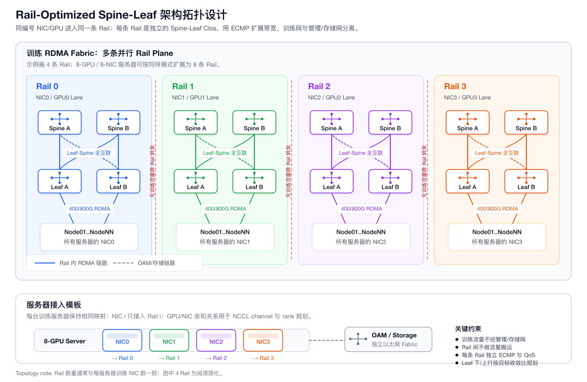

# Rail-Optimized Spine-Leaf 架构拓扑设计

AI 训练集群的网络设计，不能只看“有没有 Spine-Leaf”。对大模型训练更关键的是：

> **GPU/NIC 的流量能不能稳定、均匀、低拥塞地走在多条并行网络平面上。**

Rail-Optimized Spine-Leaf 的核心思想是：**把训练网络拆成多条独立 Rail，每条 Rail 都是一套 Spine-Leaf Clos，同编号 NIC/GPU 进入同一条 Rail。**



---

## 一句话理解

传统 Spine-Leaf 更像“一张大网”：

```text
所有训练 NIC → 同一套 Leaf/Spine → 依赖 ECMP 分摊
```

Rail-Optimized Spine-Leaf 更像“多张并行小网”：

```text
NIC0 → Rail 0 Spine-Leaf
NIC1 → Rail 1 Spine-Leaf
NIC2 → Rail 2 Spine-Leaf
...
NIC7 → Rail 7 Spine-Leaf
```

每条 Rail 内部做 ECMP 和带宽扩展，但训练流量不在 Rail 之间来回搬运。

---

## 1. 物理拓扑

### 1.1 训练网络：多条独立 Rail

以 8-GPU / 8-NIC 训练服务器为例：

| 服务器接口 | 接入网络 | 典型绑定关系 |
|---|---|---|
| NIC0 | Rail 0 | GPU0 / NCCL channel 0 |
| NIC1 | Rail 1 | GPU1 / NCCL channel 1 |
| NIC2 | Rail 2 | GPU2 / NCCL channel 2 |
| NIC3 | Rail 3 | GPU3 / NCCL channel 3 |
| NIC4 | Rail 4 | GPU4 / NCCL channel 4 |
| NIC5 | Rail 5 | GPU5 / NCCL channel 5 |
| NIC6 | Rail 6 | GPU6 / NCCL channel 6 |
| NIC7 | Rail 7 | GPU7 / NCCL channel 7 |

单条 Rail 的结构是标准 Clos：

```text
Rail 0:

  Spine R0-S1  Spine R0-S2  ...  Spine R0-Sk
       |          |                 |
       +----------+-----------------+
                  |
  Leaf  R0-L1  Leaf  R0-L2  ...  Leaf  R0-Lm
       |          |                 |
  Server01 NIC0  Server02 NIC0  ... ServerNN NIC0
```

Rail 1、Rail 2、Rail 3 以此类推。每条 Rail 有自己的 Leaf、Spine、路由域和 QoS 策略。

### 1.2 管理/存储网络独立

训练 RDMA 网络不要混入这些流量：

- BMC / OOB 管理；
- SSH / 调度 / 监控；
- 镜像拉取；
- 训练数据读写；
- checkpoint / 日志 / 对象存储访问。

这些流量建议走独立的 OAM / Storage Ethernet Fabric。训练网络只服务 GPU scale-out 通信。

---

## 2. 为什么 Rail-Optimized 适合 AI 集群

大模型训练的通信模式通常是高带宽、持续时间长、同步敏感：

- `AllReduce`
- `ReduceScatter`
- `AllGather`
- `All-to-All`
- MoE expert dispatch / combine

如果所有 NIC 都进入同一张大 Clos，ECMP 虽然能分流，但很容易出现几个问题：

- 某些 spine / uplink 被 hash 热点打满；
- 多个 NCCL channel 抢同一组路径；
- 存储或业务流量干扰训练流量；
- 故障域和拥塞域不清晰。

Rail-Optimized 的收益是：

| 目标 | 设计效果 |
|---|---|
| 带宽并行 | 每条 Rail 承担固定编号 NIC 的流量 |
| 拥塞隔离 | 一个 Rail 的拥塞不直接扩散到其他 Rail |
| 亲和调度 | NCCL / UCX 可以按 HCA/GPU 拓扑选路 |
| 故障定位 | 问题能收敛到某条 Rail、某组 Leaf/Spine |
| 扩容清晰 | 按 Rail 横向复制 Leaf/Spine 容量 |

---

## 3. 容量规划公式

定义几个变量：

```text
S = 训练服务器数量
R = 每台服务器训练 NIC 数量，也是 Rail 数量
B = 单 NIC 速率，例如 400G 或 800G
P = 单台 Leaf 的端口数
D = 每台 Leaf 用作下行的端口数
U = 每台 Leaf 用作上行的端口数
```

每条 Rail 需要承载所有服务器的同编号 NIC：

```text
每条 Rail 的下行端口数 = S
每条 Rail 的下行带宽 = S × B
整个集群训练网 host-facing 带宽 = S × R × B
```

每条 Rail 需要的 Leaf 数：

```text
Leaf 数 / Rail = ceil(S / D)
```

如果上下行端口速率相同，单 Leaf 收敛比约为：

```text
收敛比 = D : U
```

常见选择：

| 目标 | D/U 取值 |
|---|---|
| 极致训练性能 | `1:1` |
| 成本敏感但仍偏训练 | `2:1` |
| 不建议用于大规模同步训练 | `> 3:1` |

示例：

```text
S = 128 台训练服务器
R = 8 条 Rail
B = 400G
Leaf = 64 × 400G
D = 32
U = 32

每条 Rail:
  需要 128 个下行端口
  需要 ceil(128 / 32) = 4 台 Leaf
  下行带宽 = 128 × 400G = 51.2T
  Leaf 收敛比 = 1:1

整个集群:
  host-facing 训练带宽 = 128 × 8 × 400G = 409.6T
```

---

## 4. 路由与 QoS 设计

### 4.1 路由域

推荐每条 Rail 独立规划：

| 项目 | 建议 |
|---|---|
| Underlay | L3 Clos |
| 路由协议 | eBGP 常见，也可以使用 OSPF/IS-IS |
| Rail 隔离 | 独立 VRF、独立 VLAN 或独立三层地址段 |
| ECMP | 每条 Rail 内部开启 |
| 跨 Rail 转发 | 训练流量不跨 Rail 转发 |

地址规划示例：

| Rail | 地址段示例 | VLAN/VRF 示例 |
|---|---|---|
| Rail 0 | `10.10.0.0/16` | `vrf-rail-0` |
| Rail 1 | `10.11.0.0/16` | `vrf-rail-1` |
| Rail 2 | `10.12.0.0/16` | `vrf-rail-2` |
| Rail 3 | `10.13.0.0/16` | `vrf-rail-3` |

### 4.2 RoCEv2 QoS

如果训练网络使用 RoCEv2，至少要统一这些配置：

- MTU，一般使用 jumbo frame；
- PFC 只作用在 RDMA lossless priority；
- ECN 标记阈值；
- DCQCN / congestion control 参数；
- DSCP / PCP 映射；
- buffer 分配；
- ECMP hash 字段，确保 RoCE 流量能均匀分布。

如果使用 InfiniBand，每条 Rail 可以理解为独立 IB fabric，需要对应规划 Subnet Manager、SL/VL、Partition 和链路速率。

---

## 5. NCCL / UCX 亲和映射

拓扑建好后，还要让通信库“知道怎么走”。

关键原则：

1. **GPU 与本地 NIC 亲和**
   - GPU0 优先使用 NIC0；
   - GPU1 优先使用 NIC1；
   - 以此类推。

2. **NCCL channel 与 Rail 对齐**
   - channel 0 优先走 Rail 0；
   - channel 1 优先走 Rail 1；
   - 多 channel 不要无序挤到同一条 Rail。

3. **Rank 排布与物理拓扑对齐**
   - 同机 GPU rank 连续；
   - 同 Leaf 下服务器尽量成组；
   - 跨 Leaf、跨 Spine 的通信尽量均匀。

4. **显式控制 HCA 选择**
   - 使用 NCCL/UCX 的网卡选择、拓扑文件或运行时参数；
   - 避免通信库自动选择到管理网卡或存储网卡。

---

## 6. 故障域设计

| 故障点 | 影响 | 设计建议 |
|---|---|---|
| 单条 uplink 故障 | 对应 Rail 内 ECMP 带宽下降 | spine/leaf 间多链路 ECMP |
| 单台 Spine 故障 | 对应 Rail 容量下降 | 每条 Rail 至少 2 台 Spine |
| 单台 Leaf 故障 | 接在该 Leaf 的服务器丢失某条 Rail | 作业调度识别故障域，必要时双归接入 |
| 单条 Rail 整体故障 | 训练总带宽下降或作业失败 | Rail 级监控、快速摘除故障资源 |
| OAM/Storage 故障 | 不应影响正在跑的 RDMA 数据面 | 管理/存储与训练 Fabric 分离 |

Rail-Optimized 不等于“自动无损容灾”。它更准确的价值是：**把带宽、拥塞、故障清楚地分区**，让调度和运维可以按 Rail 定位和隔离。

---

## 7. 落地检查清单

上线前建议逐项检查：

- 每台服务器的 `NIC i → Rail i` 连接是否一致；
- 每条 Rail 的 Leaf/Spine 是否独立成网；
- 训练 VRF/VLAN 是否与管理/存储网络隔离；
- 每条 Rail 内 ECMP 路径数量是否一致；
- Leaf 上下行收敛比是否符合训练目标；
- RoCEv2 的 PFC/ECN/DCQCN/MTU 是否全网一致；
- NCCL/UCX 是否只选择训练 HCA；
- rank / job placement 是否考虑 Leaf 和 Rail 拓扑；
- 是否能按 Rail 维度采集链路利用率、PFC pause、ECN mark、丢包、重传和端口错误；
- 故障演练是否覆盖 spine、leaf、uplink、单 NIC、单 Rail。

---

## 8. 常见反模式

| 反模式 | 问题 |
|---|---|
| 所有训练 NIC 混接到一张大二层网 | 故障域和拥塞域不清晰 |
| 训练、存储、管理流量共用同一组 uplink | checkpoint 或数据读取会干扰训练同步 |
| Rail 之间允许训练流量绕行 | collective 路径不可控，排障困难 |
| 只看总带宽，不看每条 Rail 的下行/上行比例 | 单条 Rail 可能先成为瓶颈 |
| 通信库不限制 HCA | NCCL/UCX 可能选到非预期网卡 |
| 只做网络拓扑，不做 job placement | 物理上优化了，运行时仍可能打散流量 |

---

## 总结

Rail-Optimized Spine-Leaf 的设计重点不是“多画几层交换机”，而是三个约束：

1. **每条 Rail 是独立 Spine-Leaf Clos；**
2. **每台服务器的同编号 NIC 固定进入同一条 Rail；**
3. **训练流量、管理流量、存储流量分离。**

对 AI 训练集群来说，这种拓扑能把 NCCL/UCX 的多 NIC 并行能力、Leaf-Spine 的 ECMP 扩展能力、以及运维侧的故障隔离能力放在同一个设计里。
