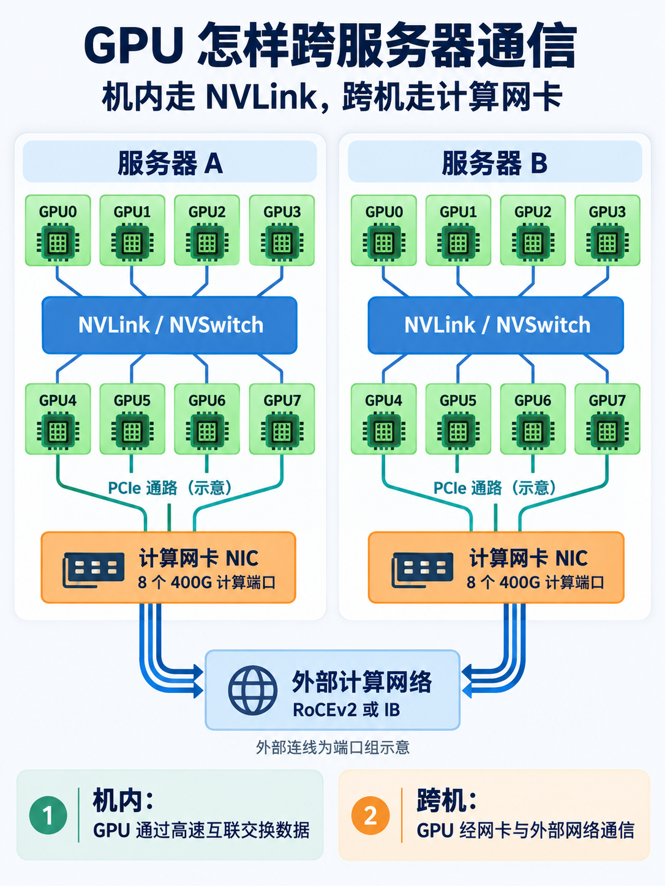
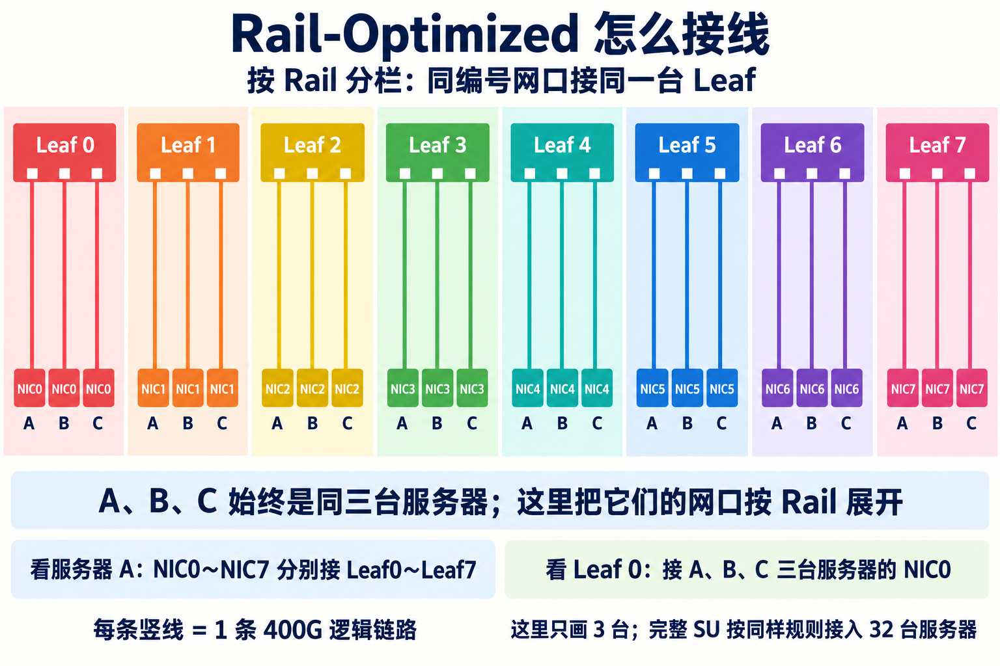
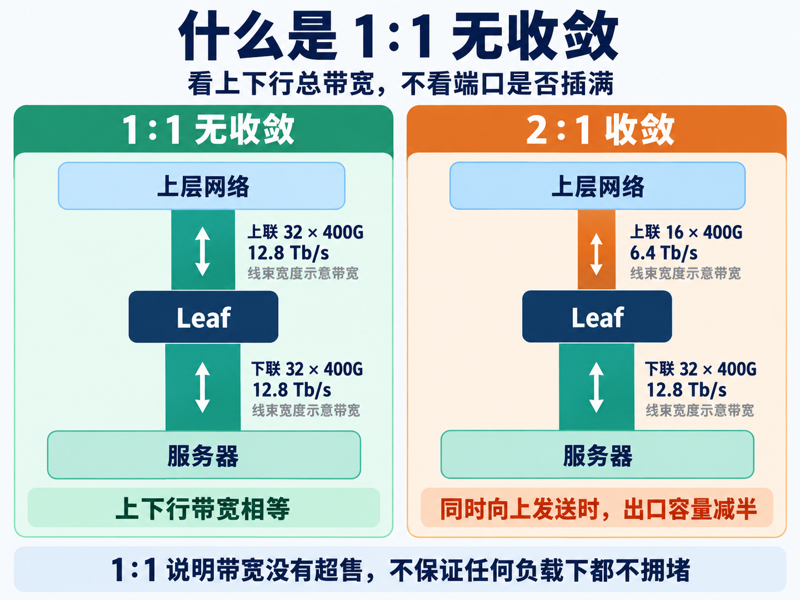
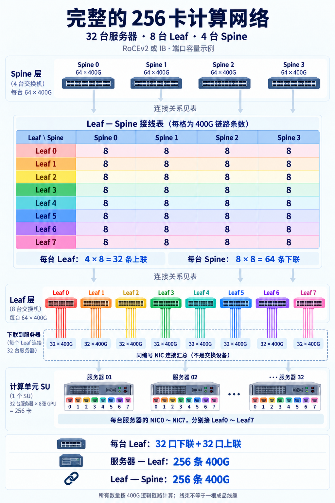

# 从零设计 Rail-Optimized 计算网络（一）：讲清一套完整的 256 卡方案

一台 GPU 服务器有八个计算网口。做集群时，这八根线该接到一台交换机，还是分别接到八台？

Rail-Optimized 网络的设计，就从这个接线问题开始。

这一篇从这些网口开始，讲清 Rail、Leaf 和 1∶1，再把 Spine 的数量与接法算出来。看完能得到一套完整的 256 卡计算网络逻辑方案，知道有多少设备、链路怎样连接、流量如何到达另一台服务器。第二篇再讨论扩到千卡时要改变什么。

## 01 先认识服务器上的两个连接范围

以一台八卡 HGX H100 服务器为例，八张 GPU 之间有机内 NVLink／NVSwitch 互联。它们与其他服务器上的 GPU 交换数据，则需要通过计算网卡和外部网络。

也就是两个范围，机内通信、跨服务器通信。

这里假设每台服务器除了八张 GPU，还配置了八个 400G 计算网络端口。网卡通常写作 NIC，后面用 NIC0～NIC7 表示这八个接口。

**八张 GPU 和八个网口是两项配置。** 有八张 GPU 的服务器，不一定配了八个 400G 网口；网卡与 GPU 之间的连接也要检查，不能只看整机名字。

400G 表示端口速率为 400Gb/s。八个端口的单向线速加起来是 3.2Tb/s，换算成字节为 400GB/s。这是端口总能力，实际训练吞吐还受机内通路和通信软件影响。

网络可以选择 RoCEv2 或 InfiniBand，简称 IB。先把它们理解成两种承载 RDMA 通信的网络选择。在端口速率和可用端口数相同的条件下，后面的容量计算可以共用；硬件和配置要按所选制式匹配。

*图 1：机内互联与外部计算网络分开理解。PCIe 通路和外部线束均为示意，实际 GPU／NIC 对应关系以服务器硬件拓扑为准。*

## 02 Rail 是怎样的一条轨道

Rail 可以译作轨道。它指围绕服务器对应计算接口组织起来的网络连接。

直接连接服务器的第一层交换机，叫 Leaf。

现在先放八台 Leaf，编号为 Leaf 0～Leaf 7。服务器 A 的 NIC0 接 Leaf 0，NIC1 接 Leaf 1，一直接到 NIC7 对应 Leaf 7。

服务器 B、C、D 也按同样规则接。

| 服务器网口 | 接入位置 |
|---|---|
| A、B、C……的 NIC0 | Leaf 0 |
| A、B、C……的 NIC1 | Leaf 1 |
| …… | …… |
| A、B、C……的 NIC7 | Leaf 7 |

**一台服务器向八台 Leaf 各接一条线，同编号网口集中接入对应的 Leaf。**

这是本系列采用的 Rail 对齐方式。Rail-Optimized，就是利用这种对齐关系来组织网络，使通信能利用对应接口之间的路径。

这些编号需要按实际 GPU 与 NIC 的硬件位置统一映射。操作系统里的 `mlx5_0` 不一定就是所有服务器上同一个物理位置的网卡，施工前需要核对。

*图 2：每栏对应一个 Rail，三条竖线分别连接服务器 A、B、C 的同编号网口。A、B、C 始终是同三台服务器，这里只是把它们的八个网口按 Rail 展开；每条线代表一条 400G 逻辑链路。*

## 03 它到底优化了什么

假设服务器 A 和服务器 B 在同一个接入组，A 的 NIC0 要给 B 的 NIC0 发数据。

两个网口都接在 Leaf 0，经过这一台交换机就可以到达对方。若它们接在不同 Leaf，就需要上层交换机转发。

负责连接不同 Leaf 的上层交换机，叫 Spine。

所以，Rail 对齐提供了一部分更短的通信路径。通信库结合 GPU 的机内互联和网卡位置安排数据交换，就有机会减少流量经过上层交换机。

**收益取决于流量实际怎么走。** 接线不会强制所有训练数据沿同一个 Rail 传输，也不会让不同组之间的通信都变成只经过一台 Leaf。NCCL 需要根据拓扑和任务组织选择网卡。[NCCL 多网卡与 Rail 设置](https://docs.nvidia.com/deeplearning/nccl/archives/nccl_2303/user-guide/docs/env.html)

这里先排除两个容易混淆的理解。

同编号网口接同一台 Leaf，只在这个接入组里成立。规模扩大后，同一个 Rail 的接口会分布在多台 Leaf 上，跨组还要经过上层网络。

Rail-Optimized 也不必然是八张完全隔离的网络。这个系列采用下层 Rail 对齐、上层交换机互通的设计。本篇的 256 卡网络只需 Leaf 和 Spine 两层，更大规模的 Core 留到第三篇。独立 Rail Fabric 是另一种组织方式，不能直接混用两种方案的接线和容量结论。

## 04 交换机为什么不能把端口全接服务器

接下来给交换机加一个明确条件，每台有 64 个可同时工作的 400G 逻辑端口。

如果 Leaf 把 64 个端口都接服务器，就没有端口通往其他 Leaf。对于我们要扩展的网络，必须留一部分端口向上连接。

选择 32 个端口接服务器，另外 32 个接上层交换机。

下联带宽是 32 × 400G＝12.8Tb/s，上联也一样。

**下面能进来多少流量，上面就配多少带宽，这里的配比叫 1∶1 无收敛。**

如果下联仍是 32 个 400G，上联只有 16 个，上联总带宽就只有下联的一半，叫 2∶1 收敛。低负载时未必能看出差别，大家同时往上发时才会争抢出口。

1∶1 看带宽，不看是否插满。下联 16 个 400G、上联 16 个 400G，其余端口空着，也符合这个配比。

这个概念也没有保证任何时候都不拥堵。多个发送端争抢同一个接收端，或者路由把流量挤在少数路径上，仍然会出现瓶颈。

至此，三个名字可以分开理解。Rail-Optimized 讲网口怎么对齐，Spine-Leaf 讲交换机怎么分层，1∶1 讲带宽是否缩减。

*图 3：上下行总带宽相等，就是这里所说的 1∶1；不要求端口全部插满，也不保证所有流量模式下都没有拥堵。*

## 05 256 卡，是这样算出来的

回到八台 Leaf，每台现在有 32 个服务器下联端口。

每增加一台服务器，它的八个网口分别接到八台 Leaf，所以每台 Leaf 多用一个下联端口。

接入 32 台服务器后，八台 Leaf 的下联正好用满。

每台服务器八张 GPU，合计 **32 × 8＝256 张 GPU**。

把两端再核对一次。服务器侧有 32 × 8＝256 个计算接口，Leaf 侧有 8 × 32＝256 个下联接口，恰好对应。

我们把这组 32 台服务器及其接入网络称为一个 SU，也就是基本扩展单元。NVIDIA H100 的参考架构采用每组 32 节点 Rail 对齐的设计。[NVIDIA H100 Network Fabrics](https://docs.nvidia.com/dgx-superpod/reference-architecture-scalable-infrastructure-h100/latest/network-fabrics.html)

**256 卡是这套条件下的完整模块，不是最低组网规模。** 可以先部署八台服务器、64 张 GPU，留空后续接入位置；换了网卡数量、交换机端口或带宽目标，模块大小也可能改变。

## 06 先数 Leaf 留下了多少条上联

Spine 是连接不同 Leaf 的上层交换机。

同一接入组内，NIC0 访问 NIC0 可以只经过 Leaf 0。NIC0 访问 NIC1 时，则可以经 Leaf 0、Spine、Leaf 1 到达对方。

现在一个 SU 有八台 Leaf，每台安排了 32 条上联，合计

**8 × 32＝256 条 400G 链路。**

这 256 条链路的另一端，都需要一个 Spine 端口。

我们先设计独立运行的两层网络。Spine 已经是最高层，无需再接 Core，所以它的 64 个端口都可以接 Leaf。

需要的 Spine 数量就是 **256 ÷ 64＝4 台**。

这道除法里，分子是待接链路数，分母是一台设备可以接入的链路数。换个规模，顺序也一样。

## 07 四台 Spine，怎样连接八台 Leaf

一台 Leaf 有 32 条上联，分给四台 Spine，每台接八条。

| 一台 Leaf 的连接对象 | 链路数 |
|---|---|
| Spine 0 | 8 条 400G |
| Spine 1 | 8 条 400G |
| Spine 2 | 8 条 400G |
| Spine 3 | 8 条 400G |
| 合计 | 32 条 400G |

其余七台 Leaf 也按这个规则接。

从 Leaf 检查，上下行都是 32 条 400G，符合 1∶1。从 Spine 检查，八台 Leaf 各接八条，正好占满 64 个端口。

这样，一个独立 256 卡集群的紧凑配置是 **32 台服务器、8 台 Leaf、4 台 Spine**。

这里的八条链路共同提供容量，并非一条工作、七条备用。实际流量如何分配由网络机制决定，不能把它当成单个流必然能用满的 3.2Tb/s 通道。

## 08 把整套 256 卡方案放在一起核对

我们现在有了完整的两层计算拓扑，设备与链路数量如下。

| 项目 | 数量与用途 |
|---|---|
| GPU 服务器 | 32 台，每台八张 GPU，合计 256 卡 |
| 服务器计算接口 | 每台八个 400G，共 256 个 |
| Leaf | 八台，每台 32 口接服务器、32 口接 Spine |
| Spine | 四台，每台 64 口全部接 Leaf |
| 服务器到 Leaf | 256 条 400G 逻辑链路 |
| Leaf 到 Spine | 256 条 400G 逻辑链路 |

接线时，先把服务器统一编号为 A01～A32，计算网口按硬件映射编号为 NIC0～NIC7。每台服务器的 NIC0 接 Leaf 0，NIC1 接 Leaf 1，依次对应。这样每台 Leaf 的 32 个下联口都有明确的接入对象。

再给 Spine 编号为 0～3，每台 Leaf 向这四台 Spine 各接八条 400G。Leaf 之间和 Spine 之间都不需要再加横向连接。

流量可以走两类路径。同一 SU 中，A01 的 NIC0 发给 A02 的 NIC0，只经过 Leaf 0；A01 的 NIC0 发给 A02 的 NIC1，则经过 Leaf 0、某台 Spine、Leaf 1。第二类路径说明这套网络允许不同 Rail 经上层互通，实际 GPU 通信采用哪条路径仍由软件与网络共同决定。

整个集群的服务器计算接口单向总带宽为 256 × 400G＝102.4Tb/s。八台 Leaf 的上联总带宽也是 8 × 32 × 400G＝102.4Tb/s，每台 Leaf 的上下行均为 12.8Tb/s。容量没有在 Leaf 上行处缩减。

*图 4：接线表中每个“8”代表这一对 Leaf—Spine 之间的八条 400G 链路。表格和虚线汇总框是说明标注，不是额外的交换设备；下方线束按标注数量读取。*

## 09 这套方案的完成范围与边界

现在可以把设备数和两端连接关系写成端口表。这里的完整，是完整的计算网络逻辑方案；存储网、管理网、供电和制冷需要单独设计。

RoCEv2 与 IB 都能按满足上述条件的硬件进行容量规划，但交换机、网卡模式、模块兼容性和路由配置不能混用。四台 Spine 的链路怎样分担流量，还要结合所选设备验证。

上线前需要检查 GPU 与 NIC 的对应关系、链路速率和错误计数，再进行跨服务器的 RDMA 与集合通信测试。单个端口连通，不等于八个计算端口都选对、也不等于训练已经能用足带宽。

还有一个直接影响扩容的边界，**这套紧凑配置的 Leaf 和 Spine 业务端口已经用满**。正常时按 1∶1 设计，发生链路或设备故障后可用容量可能下降；管理节点的计算网接入端口、备件和故障后满带宽冗余也没有包含在上述数量里。

文中的 400G 条数是逻辑链路数量，不能直接当成光模块与成品线缆采购数量。物理接口、拆分方式和线长，要根据实际机型逐条落实。

第二篇就以这套 32 台服务器、八台 Leaf、四台 Spine 的方案为起点，比较扩到 1024 卡、2048 卡的接法，以及如何通过提前预留避免重新分配旧上联。
