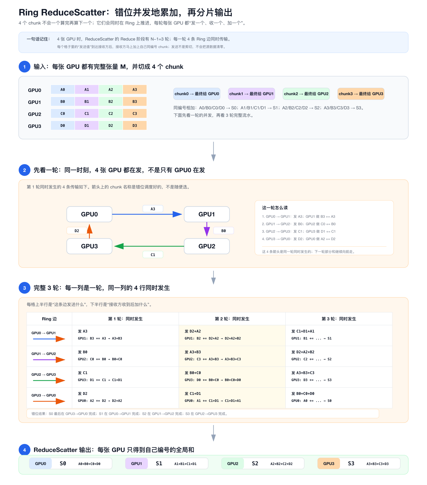

# 一文搞懂 NCCL 的 Ring AllReduce：大模型训练每天用无数遍的归约算法

训练大模型时，每一步反向传播结束后，几十、上百张 GPU 都要做同一件事：

> **把自己算出来的梯度，求和，再让每张 GPU 都拿到这份总和。**

这个看似简单的操作，就是 **AllReduce**。而 NCCL 在大多数场景下，用的是它的一个具体实现——**Ring AllReduce**。

为什么是 Ring？为什么不是更直觉的"星形聚合"或"树形归约"？这篇文章把 Ring AllReduce **从拓扑选型到内部流水**讲清楚。

读完之后你会明白：

- Ring AllReduce 为什么**带宽友好**；
- 两阶段（ReduceScatter + AllGather）各自在做什么；
- NCCL 内部为什么开**多个 channel、双向 ring**；
- 什么场景下 NCCL **不会**选 Ring。

---

## 一、先看问题：N 张 GPU 怎么同步梯度

假设 4 张 GPU，每张都有一个长度为 M 的梯度张量要归约：

```text
GPU0:  [A0, A1, A2, A3]
GPU1:  [B0, B1, B2, B3]
GPU2:  [C0, C1, C2, C3]
GPU3:  [D0, D1, D2, D3]
```

目标是让每张 GPU 都拿到完整的求和结果：

```text
S0 = A0 + B0 + C0 + D0
S1 = A1 + B1 + C1 + D1
S2 = A2 + B2 + C2 + D2
S3 = A3 + B3 + C3 + D3
```

每种拓扑的代价对比：

| 拓扑 | 每卡发送量 | 每卡接收量 | 关键问题 |
|---|---:|---:|---|
| **星形**（一台收齐再广播） | `M` | `M` | 中心节点带宽被 N 倍放大，是瓶颈 |
| **树形**（logN 层聚合） | `M` | `M` | 根节点仍要承担 M 的广播 |
| **Ring**（环形流水） | `(N-1)·M/N` | `(N-1)·M/N` | **每条链路持续工作，负载均匀** |

**Ring 的核心优势**：每张 GPU 的通信量与 N 几乎无关（≈ M），所以**带宽利用率最高**。

代价是延迟为 `O(N)` 轮，对超大 N 不利（这个后面会讲 NCCL 怎么补救）。

---

## 二、核心思想：Ring AllReduce = 两阶段

Ring AllReduce 把整个归约拆成两段连续的 Ring 流水：

```text
完整输入 M
    │
    ├─ 阶段 1：Ring ReduceScatter
    │     每张 GPU 得到一个全局归约 chunk S_r（大小 M/N）
    │
    └─ 阶段 2：Ring AllGather
          把 S0、S1、…、S_{N-1} 分发给所有 GPU
                 ↓
      每张 GPU 得到完整的全局归约张量 M
```

记住一句话：

> **ReduceScatter 把数据"压扁"，AllGather 把数据"摊开"。两段加起来，就是 AllReduce。**

接下来分别看两阶段怎么在 Ring 上跑。

---

## 三、阶段 1：Ring ReduceScatter（错位并发）

### 3.1 Ring 的结构

4 张 GPU 串成逻辑环：

```text
GPU0 → GPU1 → GPU2 → GPU3 → GPU0
```

总共执行 **N-1 = 3 轮**。每一轮里，每张 GPU 同时做四件事：

1. 向下游 GPU 发送一个 chunk（或部分归约结果）；
2. 从上游 GPU 接收一个 chunk；
3. 把接收数据与本地同编号 chunk 相加；
4. 在下一轮把新的部分和继续往下传。

### 3.2 三轮全过程

```text
第 1 轮：
  GPU0 → GPU1：发送 A3；GPU1 做 B3 += A3，得到 A3+B3
  GPU1 → GPU2：发送 B0；GPU2 做 C0 += B0，得到 B0+C0
  GPU2 → GPU3：发送 C1；GPU3 做 D1 += C1，得到 C1+D1
  GPU3 → GPU0：发送 D2；GPU0 做 A2 += D2，得到 D2+A2

第 2 轮：
  GPU0 → GPU1：发送 D2+A2；GPU1 得到 D2+A2+B2
  GPU1 → GPU2：发送 A3+B3；GPU2 得到 A3+B3+C3
  GPU2 → GPU3：发送 B0+C0；GPU3 得到 B0+C0+D0
  GPU3 → GPU0：发送 C1+D1；GPU0 得到 C1+D1+A1

第 3 轮：
  GPU0 → GPU1：发送 C1+D1+A1；GPU1 得到 S1
  GPU1 → GPU2：发送 D2+A2+B2；GPU2 得到 S2
  GPU2 → GPU3：发送 A3+B3+C3；GPU3 得到 S3
  GPU3 → GPU0：发送 B0+C0+D0；GPU0 得到 S0
```

三轮之后，每张 GPU 各自握着一块"碎片"：

```text
GPU0 拿到 S0
GPU1 拿到 S1
GPU2 拿到 S2
GPU3 拿到 S3
```

注意，**不是先算完 S0 再算 S1**。每个 chunk 的最后一步落在不同边上：

```text
S0 的最后一步：GPU3 → GPU0
S1 的最后一步：GPU0 → GPU1
S2 的最后一步：GPU1 → GPU2
S3 的最后一步：GPU2 → GPU3
```

这就是"错位并发"——**每个 chunk 都在路上，每一轮都继续向下游推进一跳**。



---

## 四、阶段 2：Ring AllGather（再 N-1 轮）

ReduceScatter 完成后，每张 GPU 都只有自己那一份"碎片"。AllGather 的工作就是把所有碎片拼回完整张量。

```text
GPU0 提供 S0
GPU1 提供 S1
GPU2 提供 S2
GPU3 提供 S3
```

AllGather 同样是 N-1 轮。每一轮里，每张 GPU 把自己当前拥有的某个 chunk 沿环传给下游，下游直接覆盖到对应位置（**不归约，只复制**）：

```text
第 1 轮：
  GPU0 → GPU1：发送 S0；GPU1 把 S0 写到 recvbuf 的第 0 槽
  GPU1 → GPU2：发送 S1；GPU2 把 S1 写到 recvbuf 的第 1 槽
  GPU2 → GPU3：发送 S2；GPU3 把 S2 写到 recvbuf 的第 2 槽
  GPU3 → GPU0：发送 S3；GPU0 把 S3 写到 recvbuf 的第 3 槽

第 2 轮：
  GPU0 → GPU1：发送 S3；GPU1 写入第 3 槽
  GPU1 → GPU2：发送 S0；GPU2 写入第 0 槽
  GPU2 → GPU3：发送 S1；GPU3 写入第 1 槽
  GPU3 → GPU0：发送 S2；GPU0 写入第 2 槽

第 3 轮：
  GPU0 → GPU1：发送 S2；GPU1 写入第 2 槽
  GPU1 → GPU2：发送 S3；GPU2 写入第 3 槽
  GPU2 → GPU3：发送 S0；GPU3 写入第 0 槽
  GPU3 → GPU0：发送 S1；GPU0 写入第 1 槽
```

三轮之后，**每张 GPU 都拿到完整的 `[S0, S1, S2, S3]`**：

```text
[
  A0+B0+C0+D0,
  A1+B1+C1+D1,
  A2+B2+C2+D2,
  A3+B3+C3+D3
]
```

AllReduce 完成。


---

## 五、为什么是 N-1 轮？通信量到底多少？

### 5.1 为什么 N-1 轮

每个 chunk 在起点已经包含 1 张 GPU 的本地数据。它只需要再经过其余 `N-1` 张 GPU，就完成了全局归约：

```text
本地值（1 份）
  → 融合第 2 张 GPU
  → 融合第 3 张 GPU
  → ...
  → 融合第 N 张 GPU   ← 这里停止，共 N-1 跳
```

AllGather 同理：每张 GPU 一开始已有自己的 1 个 chunk，只需从其余 `N-1` 张 GPU 收齐其余 chunk。

### 5.2 通信量的直觉

理想单 Ring 模型下，每张 GPU 在 ReduceScatter 阶段收发的数据量约为：

```text
(N-1) × (M/N)
```

AllGather 也是同一数量级。所以完整 Ring AllReduce，**每张 GPU 总发送量**约为：

```text
2 × (N-1) × (M/N)
```

当 `N` 很大时，这接近 **2M**——与 N 几乎无关。

对比一下星形：中心节点要发送/接收 N·M，**差了 N/2 倍**。这就是为什么 GPU 数量一上去，星形就崩了，而 Ring 还能扛住。

---

## 六、三个 collective 的输入输出对比

| 操作 | 每张 GPU 输入 | 每张 GPU 输出 | 典型用途 |
|---|---:|---:|---|
| **AllReduce** | `M` | `M` | 数据并行梯度同步（Ring AllReduce 干的就是这个） |
| **ReduceScatter** | `M` | `M/N` | ZeRO/FSDP 分片梯度或分片优化器 |
| **AllGather** | `M/N` | `M` | 把分片参数/梯度恢复为完整张量 |

写代码时记住这三行：**输入输出大小决定了你能在哪种并行策略里用它**。

---

## 七、NCCL 内部的 Ring 实现：不只是一个环

讲到这里，你脑里的 Ring 大概长这样：

```text
GPU0 → GPU1 → GPU2 → GPU3 → GPU0
```

**但 NCCL 真实跑的远不止一个环。** 这是工程上能把带宽吃满的关键。

### 7.1 双 Ring（双向流水）

NCCL 默认每条 channel 跑 **两个方向相反的 ring**：

```text
Ring 1：GPU0 → GPU1 → GPU2 → GPU3 → GPU0
Ring 2：GPU0 → GPU3 → GPU2 → GPU1 → GPU0
```

好处：
- **双向带宽都用上**（NVLink 和 IB 一般是全双工）；
- **数据切成两半**，分别沿两个 ring 流水，延迟减半。

### 7.2 Channel 并行

一条 ring 是一个 channel。NCCL 会**并发开多条 channel**（典型 4/8/16 条），把数据切成多个 slice 并行跑：

```text
bucket M
   │
   ├── channel 0 ── 双 ring ── 流水
   ├── channel 1 ── 双 ring ── 流水
   ├── channel 2 ── 双 ring ── 流水
   └── channel N ── 双 ring ── 流水
```

这就是为什么 nsys profile 里你会看到 NCCL kernel **同时占用多条 link**。

### 7.3 单 Kernel 流水线

NCCL 的核心 kernel 是一个**单 kernel 流水线**，不需要 N 次 kernel 启动：

```text
ncclKernel:
  for step in [0, N-1 + pipeline_depth):    # N-1 轮 + 流水填充
      recv(buf[recv_slot], prev_rank)
      reduce(buf[recv_slot], local_data)
      send(buf[recv_slot], next_rank)
```

几个关键点：
- **slot 0..N-1 循环复用**：buffer 切成多个 slot，错位用，避免等待；
- **LL/LL128 协议**：小消息用 64B/128B 包降低延迟；大消息走 Simple 协议打满带宽；
- **register 懒加载**：第一次通信时把 buffer pin 到物理页，后续零拷贝。

### 7.4 物理 Ring ≠ 逻辑 Ring

`GPU0 → GPU1 → GPU2 → GPU3 → GPU0` 是**逻辑拓扑**。NCCL 内部把它映射到物理链路：

- 同一台机器内：优先走 **NVLink / NVSwitch**（200+ GB/s）
- 跨机器：走 **InfiniBand**（HDR 200 Gbps / NDR 400 Gbps）
- 同台机器跨 NUMA：走 **PCIe**

NCCL 的 topology detection 会自动选择最优路径。

---

## 八、NCCL 不只用 Ring

Ring 在 N 很大时有瓶颈：

- **延迟随 N 线性增长**：N=8 没问题，N=64 就慢了；
- **跨节点跳数太多**：每跳可能跨 PCIe/IB，累积延迟不可忽视。

所以 NCCL 2.x 之后引入了多种算法：

| 算法 | 适用场景 | 一句话原理 |
|---|---|---|
| **Ring** | 中等 N、大消息 | 上面讲的全套 |
| **Recursive Doubling / Halving** | 小消息、AllReduce | logN 轮完成，每轮跨多跳 |
| **Tree**（double binary tree） | AllReduce 中等规模 | 把 Ring 的"链式"换成"树形" |
| **CollNet / NVSwitch SHARP** | 单节点 NVSwitch 机器 | 利用 NVSwitch 的硬件归约，1 跳完成 |
| **Rail-Optimized** | 多 rail IB 网络 | 把同一 AllReduce 拆到多条 rail 并行 |

NCCL 会根据消息大小、N、topology **自动选算法**，可以通过环境变量强制指定：

```bash
NCCL_ALGO=RING       # 强制 Ring
NCCL_ALGO=TREE       # 强制 Tree
NCCL_ALGO=COLLNET    # 强制 CollNet
```

调试时可以打开：

```bash
NCCL_DEBUG=INFO      # 看实际选了哪个算法、走了哪条 link
```

---

## 九、三个最容易踩的认知坑

1. **"Ring = 单环"** ❌  
   实际是 N 条 channel × 2 条反向 ring × 流水 slice，"环"只是逻辑抽象。

2. **"Ring 是 NCCL 唯一的算法"** ❌  
   小消息 NCCL 完全可能选 Tree 或 Recursive Doubling，不一定是 Ring。

3. **"Ring channel 越多越快"** ❌  
   channel 数量受物理 link 数限制。比如 8 卡 NVLink 机器最多有效开 ~6-8 channel；多了反而互相抢占。

---

## 十、实战检查清单

发起一次 AllReduce 前，确认：

1. 所有 rank 都加入同一个 communicator；
2. 所有 rank 调用的是同一种 collective；
3. 所有 rank 按**相同顺序**调用 collective（这点最容易死锁）；
4. 对同一次调用，元素数、数据类型、归约操作匹配；
5. collective 在 CUDA stream 上**异步执行**；GPU 操作完成前，不要读写相关 buffer。

调优时优先看：

- `NCCL_DEBUG=INFO` 的输出（实际算法、channel 数、link 选择）；
- nsys profile（kernel 占用、带宽利用率）；
- `NCCL_ALGO` 强制对比不同算法的性能差异。

---

## 写在最后

最后送你三句话：

> **Ring AllReduce = Ring ReduceScatter + Ring AllGather。**
>
> **每张 GPU 通信量 ≈ 2M，与 N 几乎无关——这就是它在大规模训练里胜出的根本原因。**
>
> **NCCL 内部不是单环，而是多 channel × 双 ring × 流水线，把物理带宽吃满。**

写代码时，请依赖 API 语义（每张 GPU 拿到完整求和结果）。

至于 Ring 的走向、内部 chunk 偏移、slice 大小、buffer 复用方式，都属于 NCCL 的**内部实现**——理解它们是为了调性能，不是为了推断显存里"应该有什么"。

**分清这两件事，你就不会在分布式训练的通信问题上反复踩坑。**

---

*如果这篇文章帮到了你，欢迎转发给你身边正在搞分布式训练的同事——他们大概率也需要。*
