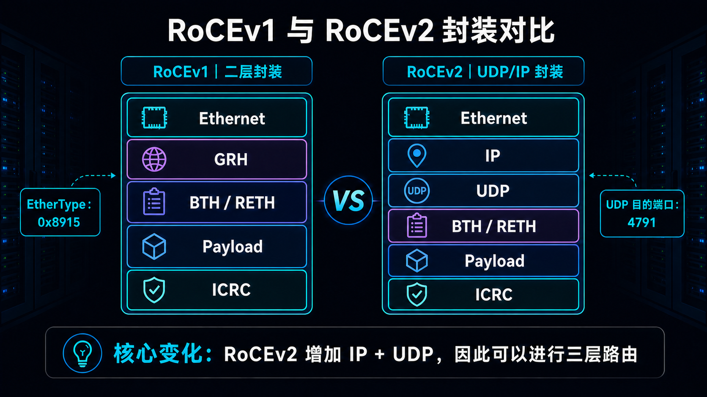
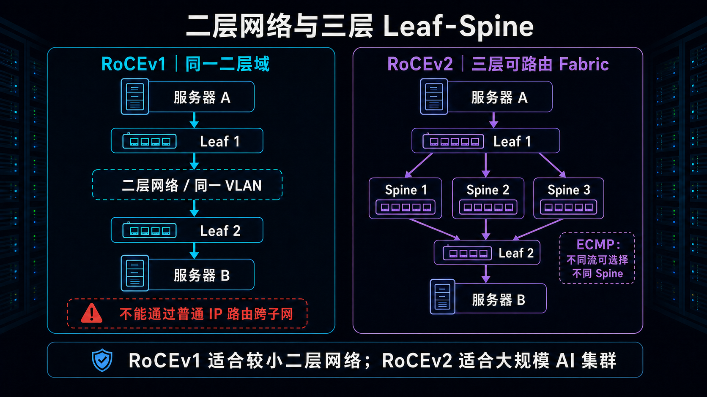
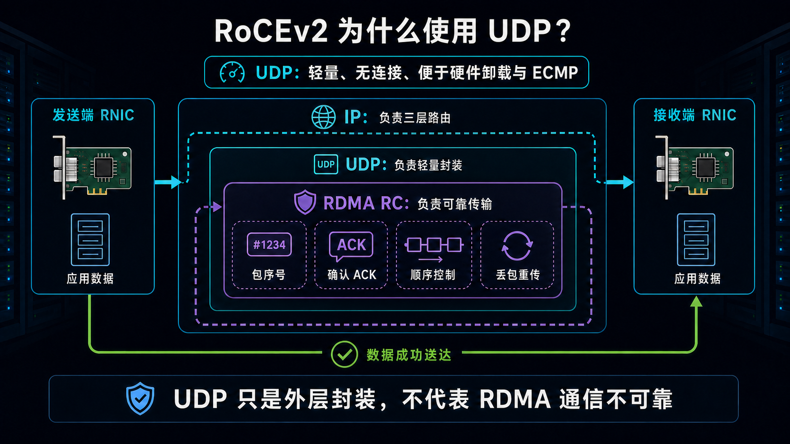
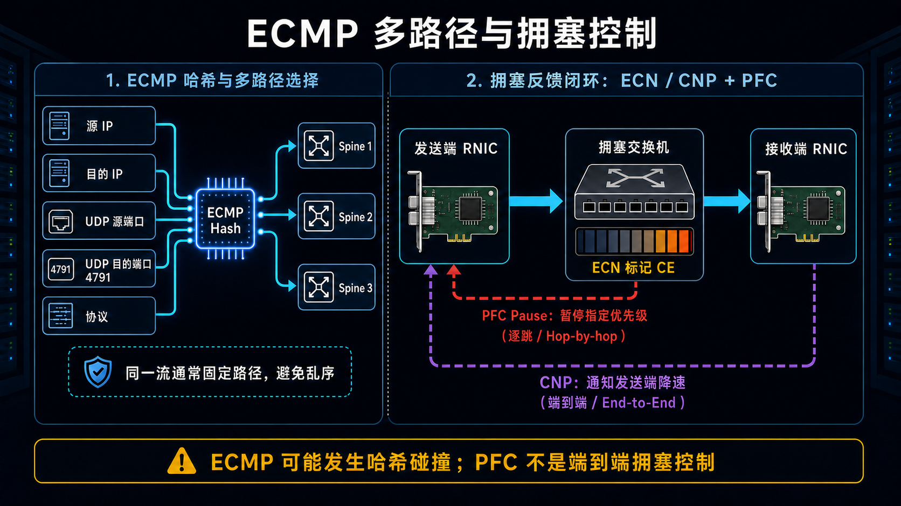
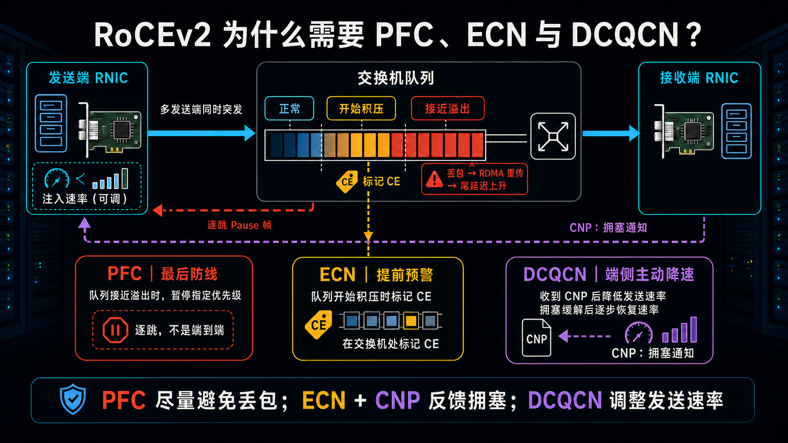

# RoCEv1 与 RoCEv2 的区别：从二层 RDMA 到可路由网络

在 AI 集群、分布式存储和高性能计算网络中，经常会看到 RoCEv1、RoCEv2、ECMP、PFC、ECN 等术语。RoCEv1 和 RoCEv2 都能让 RDMA 运行在以太网上，但二者采用的外层封装不同，适用的网络规模也不同。

最核心的区别可以概括为：

> **RoCEv1 工作在二层网络；RoCEv2 采用 UDP/IP 封装，可以跨三层网络路由。**

## 一、什么是 RoCE？

RoCE 全称是 RDMA over Converged Ethernet，即“融合以太网上的远程直接内存访问”。

从演进时间看，IBTA 在 2010 年公布了最初的 RoCE 规范，后来通常称为 RoCEv1；2014 年又发布 RoCEv2，通过 UDP/IP 封装把 RoCE 从二层网络扩展到可路由的三层网络。

传统网络通信通常需要 CPU 和操作系统内核参与协议处理，并在用户空间、内核空间和网卡之间复制数据。RDMA 则允许网卡直接在本地和远端应用内存之间传输数据，减少内核参与和数据复制。

因此，RDMA 具有低延迟、高吞吐和低 CPU 占用等特点，常用于 GPU 集群、分布式存储、高性能计算和高速数据库系统。RoCE 的作用，就是在以太网上提供这种 RDMA 能力。

## 二、协议封装有什么不同？



### RoCEv1：直接封装在以太网中

RoCEv1 直接把 RDMA 传输报文封装在以太网帧中，使用专用 EtherType `0x8915`。它的协议栈可以简化表示为：

```text
Ethernet → GRH → BTH/RETH → Payload → ICRC
```

交换机根据 MAC 地址进行二层转发。RoCEv1 可以在同一个二层网络或 VLAN 内运行，但不能像普通 IP 报文一样，通过三层路由器跨越不同子网。

### RoCEv2：采用 IP 和 UDP

RoCEv2 使用可路由的 IP 头替代 RoCEv1 的 GRH，并在 IP 与 RDMA 传输头之间加入 UDP 头：

```text
Ethernet → IP → UDP → BTH/RETH → Payload → ICRC
```

这里的 `BTH/RETH` 是便于理解的简化写法。BTH（Base Transport Header）是 RDMA 传输报文的基础传输头；RETH（RDMA Extended Transport Header）用于携带远端虚拟地址、R_Key 和数据长度，只会出现在需要这些信息的 RDMA Read/Write 等报文中，Send 报文不包含 RETH。因此，不应把图中的 `BTH/RETH` 理解为每个 RoCE 报文都同时带有这两个头部。

RoCEv2 使用 UDP 目的端口 `4791` 标识 RDMA 流量。IP 头部让报文能够跨越三层路由设备，UDP 则提供轻量、无状态并且容易由网卡硬件解析的封装。

需要注意，不能简单地说 RoCEv2 比 RoCEv1 固定“多出 28 字节”。RoCEv1 使用 40 字节的 GRH，而 RoCEv2 是用 IPv4 或 IPv6 头替代 GRH，再增加 8 字节 UDP 头。因此，净头部变化取决于 IP 版本：使用 IPv4 时，`IPv4 + UDP` 通常为 28 字节；使用 IPv6 时，`IPv6 + UDP` 通常为 48 字节。实际性能更容易受到拥塞、丢包、MTU 和负载均衡效果影响。

## 三、网络路径和扩展能力



RoCEv1 不能通过普通 IP 路由跨越子网。如果两台服务器连接在不同 Leaf 交换机下，通常需要将同一个 VLAN 延伸到两端。

在小型网络中，这种设计比较简单；但随着服务器数量增加，大二层网络可能出现广播域过大、VLAN 规划复杂、二层环路风险增加和故障影响范围扩大等问题。因此，RoCEv1 的横向扩展能力相对有限。

RoCEv2 使用 IP 地址，可以在三层 Leaf-Spine Fabric 中转发：

```text
服务器 A → Leaf 1 → Spine → Leaf 2 → 服务器 B
```

服务器即使位于不同子网，也可以通过 IP 路由通信。网络还可以通过增加 Leaf 和 Spine 扩展服务器数量与总体带宽，所以 RoCEv2 更适合大型数据中心和 AI 集群。

## 四、RoCEv2 为什么使用 UDP？



UDP 在 RoCEv2 中主要是一个**可路由的外层封装**，并不负责完整的可靠传输。

常用的 RDMA RC（Reliable Connection）传输服务本身已经具有包序号、确认、顺序控制、丢包检测和重传等能力。如果再使用 TCP，就会形成两套可靠传输机制，增加协议状态和处理复杂度。

UDP 的优势包括：

- 无连接，不需要建立 TCP 握手；
- 头部只有 8 字节，封装比较轻量；
- 容易由 RDMA 网卡进行硬件识别和卸载；
- 不引入 TCP 拥塞窗口等额外传输状态；
- UDP 源端口可以帮助交换机进行 ECMP 哈希。

所以，RoCEv2 使用 UDP 并不等于 RDMA 通信不可靠。二者的职责可以这样理解：

```text
IP：负责三层路由
UDP：负责轻量封装和流标识
RDMA RC：负责确认、排序和重传
```

## 五、ECMP 与拥塞控制



Leaf-Spine 网络中，两台服务器之间通常存在多条路由代价相同的路径。交换机可以根据源 IP、目的 IP、UDP 源端口、UDP 目的端口和协议类型计算哈希，将不同流量分配到不同 Spine，这种机制叫作 ECMP。由于 RoCEv2 的 UDP 目的端口通常固定为 `4791`、协议类型也固定为 UDP，不同流之间的哈希差异主要来自源/目的 IP 和承载流标识的 UDP 源端口。

同一条流通常固定经过同一路径，以避免报文乱序；不同的流则可能经过不同 Spine，从而并行利用多条链路。但是，ECMP 是根据哈希结果选路，并不一定选择当前最空闲的链路。多条大流仍可能被分配到同一条路径，形成哈希碰撞和局部拥塞。

RoCE 追求低延迟和高吞吐，但对突发拥塞和丢包比较敏感。AI 集群进行集合通信时，多个发送端可能同时向一个端口注入流量，形成典型的 Incast（多对一突发）。当流量进入交换机的速度超过出口转发速度时，队列会快速经历“正常、开始积压、接近溢出”三个阶段。下面以常见的 **RoCEv2 + DCQCN** 部署为例说明控制过程。

如果队列最终溢出，交换机会丢弃报文。RDMA RC 虽然能够检测丢包并重传，但重传恢复会中断原本连续的数据传输，放大尾延迟，并可能降低整条通信流水线的有效吞吐。因此，RoCE 网络不能只依赖丢包后的重传，还需要在队列溢出之前控制流量。



这套保护机制可以分成四个环节：

1. **ECN 负责提前预警。** 当交换机发现队列开始积压并达到配置的 ECN 门限时，可以给经过的 RoCEv2 IP 报文设置 CE 标记，而不是等到缓冲区溢出后才通过丢包反映拥塞。
2. **CNP 负责把拥塞反馈给发送端。** 接收端 RNIC 收到带 CE 标记的报文后，向发送端返回 CNP。CNP 本身只是通知，不直接决定发送速率。
3. **DCQCN 负责在发送端执行调速。** 发送端 RNIC 收到 CNP 后，由 DCQCN（Data Center Quantized Congestion Notification）降低对应流的发送速率；拥塞缓解后，再逐步恢复速率，让流量与网络可用带宽重新匹配。
4. **PFC 负责接近溢出时的最后保护。** 如果队列继续增长并达到 PFC 门限，交换机会向直接相连的上游设备发送 Pause 帧，暂时停止指定优先级的流量，尽量避免缓冲区溢出。

整个过程可以简化为：

```text
多个发送端同时突发
      ↓
交换机队列开始积压
      ├─ 达到 ECN 门限 → 标记 CE → 接收端返回 CNP
      │                                  ↓
      │                         DCQCN 降速并逐步恢复
      │
      └─ 继续增长至 PFC 门限 → 逐跳暂停直接上游
```

### DCQCN 如何完成闭环调速？

DCQCN 把 RoCEv2 拥塞控制划分为三个角色：

- **CP（Congestion Point，拥塞点）**：通常是发生排队的交换机。当队列超过 ECN 门限时，交换机给经过的 RoCEv2 报文设置 CE 标记。
- **NP（Notification Point，通知点）**：接收端 RNIC。它发现 CE 标记后生成 CNP，并沿反方向发送给流量源。
- **RP（Reaction Point，响应点）**：发送端 RNIC。它运行 DCQCN 的速率控制逻辑，根据收到的 CNP 调低对应流的发送速率。

DCQCN 不是收到一次 CNP 就永久固定在低速率。发送端会根据一段时间内收到的拥塞反馈维护拥塞程度估计：CNP 持续到达时继续抑制发送；一段时间没有新的拥塞反馈时，则通过定时器和已发送字节计数逐步提高速率。这样既能快速缓解热点，又能在拥塞消失后重新利用空闲带宽。

```text
CP：交换机检测排队并标记 ECN/CE
                    ↓
NP：接收端识别 CE 并返回 CNP
                    ↓
RP：发送端 DCQCN 降低对应流速率
                    ↓
无新拥塞反馈时逐步恢复速率
```

需要特别注意，PFC 和 DCQCN 的作用并不相同。PFC 是逐跳暂停机制，只作用于直接相邻的链路；DCQCN 则利用 ECN 和 CNP 构成端到端反馈闭环，让真正的流量源调整发送速率。PFC 配置不当还可能造成队头阻塞、拥塞扩散甚至 PFC 风暴，因此不能把“开启 PFC”简单等同于完成 RoCE 拥塞控制。实际部署需要统一设计 PFC 门限、ECN 门限、交换机缓存以及 DCQCN 参数。

一句话概括：**PFC 尽量避免队列溢出和丢包；ECN + CNP 负责反馈拥塞；DCQCN 负责调整发送端速率。**

## 六、核心区别对比

| 对比项 | RoCEv1 | RoCEv2 |
|---|---|---|
| 网络层级 | 二层 L2 | 三层 L3 |
| 外层封装 | Ethernet | Ethernet + IP + UDP |
| 协议标识 | EtherType `0x8915` | UDP 目的端口 `4791` |
| 能否跨子网 | 通常不能 | 可以 |
| 转发依据 | MAC 地址 | IP 地址 |
| ECMP | 不能直接利用标准 L3 五元组 ECMP | 可利用 IP/UDP 字段进行 ECMP 哈希 |
| 网络规模 | 相对较小 | 适合大规模扩展 |
| 典型场景 | 小型二层 RDMA 网络 | AI 集群、大型数据中心 |
| RDMA 操作语义 | 基本相同 | 基本相同 |

## 七、总结

RoCEv1 和 RoCEv2 都可以在以太网上提供 RDMA 能力。二者最大的差异不是 RDMA Read、Write、Send 等操作本身，而是外层网络封装以及由此带来的可路由性。

RoCEv1 是二层协议，结构简单，但不能通过普通 IP 路由跨越不同子网，更适合规模有限的二层网络。

RoCEv2 采用 UDP/IP 封装，能够跨三层网络路由，并可以利用 Leaf-Spine 和 ECMP 多路径，因此更适合大型数据中心、分布式存储和 AI GPU 集群。

从当前实践看，新建的大规模数据中心和 AI 集群通常优先采用 RoCEv2，它也已成为多种网卡驱动和软件栈的默认 RoCE 模式。RoCEv1 并非从软硬件中完全消失，部分产品仍保留支持，但更多见于遗留系统或范围受限的纯二层网络。因此，与其说 RoCEv1 已经被彻底淘汰，更准确的说法是：**RoCEv2 已成为现代生产网络的主流选择。**

一句话记忆：

> **RoCEv1 = 二层 RDMA；RoCEv2 = UDP/IP 可路由 RDMA。**

## 参考资料

- [IBTA：2014 年发布 RoCEv2，并回顾 2010 年最初的 RoCE 规范](https://www.infinibandta.org/infiniband-trade-association-releases-updated-specification-for-remote-direct-memory-access-over-converged-ethernet-roce/)
- [NVIDIA：RoCEv1 与 RoCEv2 封装和 UDP 源端口](https://docs.nvidia.com/networking/display/WINOFv55052000/RoCEv2)
- [NVIDIA MLNX_OFED：RoCEv2 自 4.1 版起为默认 RoCE 模式](https://docs.nvidia.com/networking/display/mlnxofedv495100/general%2Bsupport%2Bin%2Bmlnx_ofed)
- [NVIDIA WinOF-2 v26.4：RoCEv2 拥塞管理中的 CP、NP 与 RP（见 3.3.3.4 节）](https://docs.nvidia.com/nvidia-winof-2-documentation-v26-4-50010.pdf)
- [SIGCOMM：DCQCN 原始论文](https://conferences.sigcomm.org/sigcomm/2015/pdf/papers/p523.pdf)
