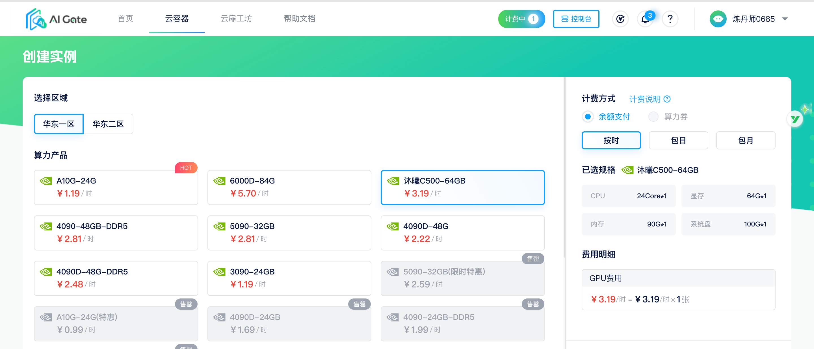
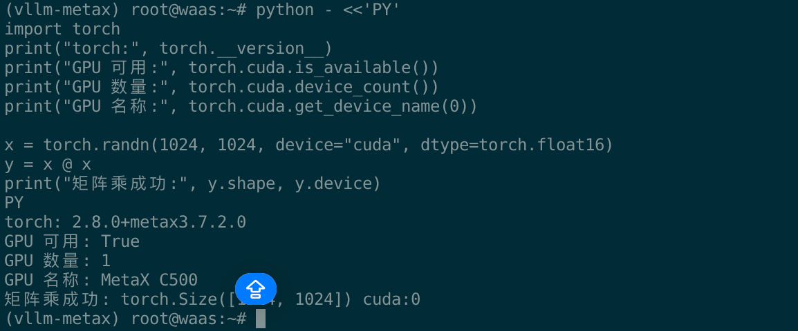
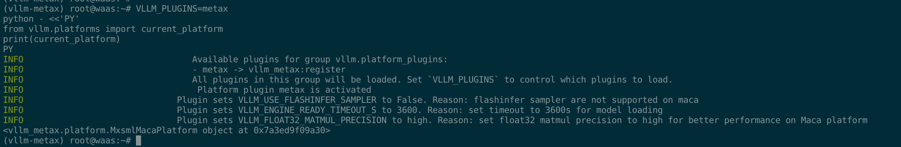

# WaaS MetaX C500 跑 Qwen3.5-4B，vLLM-MetaX 安装、服务与性能测试

这次是在 WaaS 的一张 MetaX C500 上实跑 Qwen3.5-4B。环境用 Python venv，vLLM-MetaX 用官方预编译 wheel，OpenAI 接口和并发压测也都跑了一遍。

命令都在 C500 容器里执行。模型、虚拟环境、缓存和日志放在 `/home/waas`，别往 100 GB 的系统盘里堆大文件。这里没有编译 vLLM；`vllm bench serve` 只是向已运行的服务发请求。

## 开始前：申请 MetaX C500 实例

打开 [WaaS 云容器创建实例页面](https://waas.aigate.cc/productService)，在算力产品中选「沐曦 C500-64GB」，然后选择区域和计费方式。价格和库存以页面当时显示的为准。



实例进入运行状态后，到「实例管理」里确认 GPU、CPU、显存和系统盘规格。控制台可以查看登录信息，也可以从 VS Code、云扉 OS 或 JupyterLab 进入容器。


## 一、本次部署结果

### 1.1 硬件和软件

| 项目 | 实测值 |
|---|---|
| GPU | 1 × MetaX C500 |
| 显存 | 64 GiB |
| 系统 | Ubuntu 24.04.1 LTS |
| Python | 3.12.3 |
| MACA | 3.7.2.0 |
| 驱动 | 3.8.23 |
| `mx-smi` | 2.3.1 |
| MetaX Torch | 2.8.0+metax3.7.2.0 |
| vLLM | 0.21.0 |
| vLLM-MetaX | 0.21.0+gfbfedf.d20260626.maca3.7.1.5.torch2.8 |
| 模型 | Qwen3.5-4B，BF16，约 8.68 GiB |
| API | `http://127.0.0.1:8000/v1` |
| 最大上下文 | 8192 token |

### 1.2 跑通情况

启动日志里能看到 `vllm_metax.platform.MxsmlMacaPlatform`，mcoplib 也确认构建时与运行时的 MACA 主次版本一致。模型被识别为 `Qwen3_5ForConditionalGeneration`，`/v1/models` 和 `/v1/chat/completions` 都返回了 HTTP 200。

后面的两轮压测也都跑完了。Random 数据集 40 个请求、并发 4，成功 40 个；Sonnet 数据集一次发 10 个请求，成功 10 个。

### 1.3 性能测试结果

服务使用 eager 模式。2026 年 7 月 26 日冷启动后，使用 vLLM 0.21 官方 `vllm bench serve` 重新验证。

| 数据集 | 请求数 | 峰值并发 | 成功率 | 总耗时 | 请求吞吐 | 输出吞吐 | 平均 TTFT | 平均 TPOT |
|---|---:|---:|---:|---:|---:|---:|---:|---:|
| Random，输入 128、输出 64 | 40 | 4 | 100% | 21.22 s | 1.89 req/s | 120.66 token/s | 96.97 ms | 32.12 ms/token |
| Sonnet，输入 256、输出 64、前缀 100 | 10 | 10 | 100% | 2.40 s | 4.16 req/s | 266.30 token/s | 195.57 ms | 34.90 ms/token |

这是这张卡、这套版本和这组参数下的结果。换输入长度、输出长度、并发或图优化开关，数值都会变。

## 二、使用预编译 wheel 安装 vLLM

MetaX 官方文档同时给了 [wheel 安装](https://developer.metax-tech.com/api/client/document/preview/1360/split_files/macart_vllm_metax.html#wheel) 和 [源码构建](https://developer.metax-tech.com/api/client/document/preview/1360/split_files/macart_vllm_metax.html#n2mflikvtm6z1) 两种路子。这台机器有匹配 Python、MACA、Torch 的预编译包，直接装 wheel 就行。

这次实际装的是：

1. MetaX 官方 PyPI 仓库中的 MACA 适配 wheel：`https://repos.metax-tech.com/r/maca-pypi/simple`。
2. MetaX 软件中心列出的 `maca-vllm-metax-0.21.0-py312-3.7.1.106-linux-x86_64.tar.xz` 对应版本信息。
3. vLLM 0.21.0 的预编译 `cp38-abi3-manylinux_2_24_x86_64.whl`，没有从源码执行 `setup.py`、`pip wheel .` 或 CMake 构建。

软件中心下载需要登录令牌，匿名 shell 不能直接拉那个压缩包。不过 MetaX 的依赖能从官方 PyPI 装，vLLM 核心也有预编译 wheel。

第一次启动时，日志可能会写 `mcoplib during compilation`、Triton helper 或 Torch extension。那是在生成很小的运行时辅助模块，vLLM 本身没有重新编译。

## 三、规划目录，避免写满系统盘

系统盘只有 100 GB，模型和缓存都往 `/home/waas` 放：

```bash
mkdir -p /home/waas/{venvs,models,packages,logs,compat}
mkdir -p /home/waas/.cache/{pip,huggingface,torch_extensions}

export PIP_CACHE_DIR=/home/waas/.cache/pip
export HF_HOME=/home/waas/.cache/huggingface
export TORCH_EXTENSIONS_DIR=/home/waas/.cache/torch_extensions
```

看空间和内存：

```bash
df -h / /home/waas
du -sh /home/waas/models /home/waas/.cache 2>/dev/null
free -h
```

安装完成时系统盘用了约 1.4 GB，模型、虚拟环境和缓存都在 `/home/waas`。

## 四、检查原始环境

### 4.1 查看 GPU

```bash
mx-smi
mx-smi --show-memory
```

看到 `MXC500`、一张卡和约 64 GiB 显存就对了。

### 4.2 查看 Python 和 MACA

```bash
command -v python3
python3 --version
ls -ld /opt/maca
```

这台机器输出的是 `/usr/bin/python3`、`Python 3.12.3`，MACA 在 `/opt/maca`。

## 五、先创建 venv，再安装官方 wheel

这一章只在第一次部署时做一次。服务重启不需要重建 venv，也不用再装 wheel。

### 5.1 创建并激活环境

```bash
python3 -m venv /home/waas/venvs/vllm-metax
source /home/waas/venvs/vllm-metax/bin/activate

python -m pip install -U pip setuptools wheel
```

如果 `venv` 报缺组件，再装：

```bash
apt-get update
apt-get install -y python3.12-venv python3.12-dev
```

`python3.12-dev` 里是 Python 头文件，Triton 第一次运行时会用到。它不是拿来编译 vLLM 的。

### 5.2 配置 MACA 环境

这些变量只对当前终端有效。换一个终端或重启容器后要重新设置。第八章会再贴一遍，直接复制就能启动。

```bash
export MACA_PATH=/opt/maca
export CUCC_PATH=$MACA_PATH/tools/cu-bridge
export CUDA_PATH=$CUCC_PATH/CUDA_DIR
export CUCC_CMAKE_ENTRY=2

export PATH=/home/waas/venvs/vllm-metax/bin:$MACA_PATH/mxgpu_llvm/bin:$MACA_PATH/bin:$CUCC_PATH/tools:$CUCC_PATH/bin:$PATH
export LD_LIBRARY_PATH=$MACA_PATH/lib:$MACA_PATH/ompi/lib:$MACA_PATH/mxgpu_llvm/lib:${LD_LIBRARY_PATH:-}
export VLLM_PLUGINS=metax
```

### 5.3 使用 MetaX 官方 PyPI

官方索引：

```text
https://repos.metax-tech.com/r/maca-pypi/simple
```

这次锁定的关键包版本：

```text
torch==2.8.0+metax3.7.2.0
vllm-metax==0.21.0+gfbfedf.d20260626.maca3.7.1.5.torch2.8
mcoplib==0.4.6+maca3.7.1.5.torch2.8
flash-attn==2.6.3+metax3.7.2.0torch2.8
flashinfer==0.2.6+metax3.7.2.0torch2.8
triton==3.0.0+metax3.7.2.0
```

安装时让 pip 直接走这个仓库：

```bash
export PIP_CACHE_DIR=/home/waas/.cache/pip
METAX_INDEX=https://repos.metax-tech.com/r/maca-pypi/simple

python -m pip install --extra-index-url "$METAX_INDEX" \
  'torch==2.8.0+metax3.7.2.0' \
  'vllm-metax==0.21.0+gfbfedf.d20260626.maca3.7.1.5.torch2.8'
```

如果你从 MetaX 软件中心拿到了官方 0.21 安装包，按包里的版本清单装。MACA、Torch、vLLM-MetaX 的版本别混着拼。

本机 vLLM 核心预编译包保存在：

```text
/home/waas/packages/vllm-0.21.0-1-cp38-abi3-manylinux_2_24_x86_64.whl
```

安装：

```bash
python -m pip install /home/waas/packages/vllm-0.21.0-1-cp38-abi3-manylinux_2_24_x86_64.whl
```

> 这套环境不需要 `git clone vllm`、`pip install .` 或 `python setup.py bdist_wheel`。

### 5.4 验证 Torch、GPU 和插件

```bash
python - <<'PY'
import torch
print("torch:", torch.__version__)
print("GPU 可用:", torch.cuda.is_available())
print("GPU 数量:", torch.cuda.device_count())
print("GPU 名称:", torch.cuda.get_device_name(0))

x = torch.randn(1024, 1024, device="cuda", dtype=torch.float16)
y = x @ x
print("矩阵乘成功:", y.shape, y.device)
PY
```

实测中 Torch 识别到一张 MetaX C500，FP16 矩阵乘跑在 `cuda:0`：



检查 vLLM 插件：

```bash
export VLLM_PLUGINS=metax
python - <<'PY'
from vllm.platforms import current_platform
print(current_platform)
PY
```

日志里 `metax` 插件已激活，平台识别为 `vllm_metax.platform.MxsmlMacaPlatform`：



0.21 版 mcoplib 已经没有旧文档里的 `mcoplib_init`。导入插件后看到 MACA 主次版本匹配成功，就说明检查过了。

## 六、MetaX Torch 2.8 最小兼容层

vLLM 0.21 会调用新版 `torch.accelerator` API，MetaX Torch 2.8 的同类能力还挂在 `torch.cuda` 下。这里不改 vLLM 源码，只在单独目录补几个别名。

创建 `/home/waas/compat/sitecustomize.py`：

```python
import torch

if hasattr(torch, "accelerator"):
    aliases = {
        "current_device_index": torch.cuda.current_device,
        "device_count": torch.cuda.device_count,
        "device_index": torch.cuda.device,
        "empty_cache": torch.cuda.empty_cache,
        "max_memory_allocated": torch.cuda.max_memory_allocated,
        "memory_reserved": torch.cuda.memory_reserved,
        "memory_stats": torch.cuda.memory_stats,
        "reset_peak_memory_stats": torch.cuda.reset_peak_memory_stats,
        "set_device_index": torch.cuda.set_device,
        "synchronize": torch.cuda.synchronize,
    }
    for name, function in aliases.items():
        if not hasattr(torch.accelerator, name):
            setattr(torch.accelerator, name, function)
```

启动前加上：

```bash
export PYTHONPATH=/home/waas/compat
```

这只是运行时 API 别名，不改 wheel，也不编译东西。以后 MetaX Torch 原生补齐 `torch.accelerator` 后，可以试着去掉这层。

## 七、准备 Qwen3.5-4B 模型

### 7.1 本次测试模型

本次测试使用 Qwen3.5-4B。模型 BF16 权重约 8.68 GiB。

模型目录：

```text
/home/waas/models/Qwen3.5-4B
```

检查文件：

```bash
du -sh /home/waas/models/Qwen3.5-4B
find /home/waas/models/Qwen3.5-4B -maxdepth 1 -type f -printf '%f\n' | sort
```

模型不在时，可以用 ModelScope 下载到数据盘：

```bash
source /home/waas/venvs/vllm-metax/bin/activate
python -m pip install modelscope

setsid nohup modelscope download \
  --model Qwen/Qwen3.5-4B \
  --local_dir /home/waas/models/Qwen3.5-4B \
  > /home/waas/logs/download-qwen35-4b.log 2>&1 &
```

下载慢时可以临时开 WaaS 代理：

```bash
source /etc/waas-script/proxy.sh
```

下载结束后关掉：

```bash
source /etc/waas-script/unset_proxy.sh
```

## 八、启动和管理模型服务

### 8.1 后台启动

每次启动服务，把下面整段复制到新终端里即可。环境变量再写一遍，省得在第五章和第六章之间来回找。

```bash
source /home/waas/venvs/vllm-metax/bin/activate

export MACA_PATH=/opt/maca
export CUCC_PATH=$MACA_PATH/tools/cu-bridge
export CUDA_PATH=$CUCC_PATH/CUDA_DIR
export CUCC_CMAKE_ENTRY=2
export PATH=/home/waas/venvs/vllm-metax/bin:$MACA_PATH/mxgpu_llvm/bin:$MACA_PATH/bin:$CUCC_PATH/tools:$CUCC_PATH/bin:$PATH
export LD_LIBRARY_PATH=$MACA_PATH/lib:$MACA_PATH/ompi/lib:$MACA_PATH/mxgpu_llvm/lib:${LD_LIBRARY_PATH:-}
export VLLM_PLUGINS=metax
export PYTHONPATH=/home/waas/compat
export TORCH_EXTENSIONS_DIR=/home/waas/.cache/torch_extensions
export HF_HOME=/home/waas/.cache/huggingface
```

接着用 `setsid` 和 `nohup` 起服务：

```bash
setsid nohup vllm serve /home/waas/models/Qwen3.5-4B \
  --served-model-name Qwen3.5-4B \
  --host 0.0.0.0 \
  --port 8000 \
  --trust-remote-code \
  --dtype auto \
  --max-model-len 8192 \
  --gpu-memory-utilization 0.85 \
  --enforce-eager \
  --language-model-only \
  > /home/waas/logs/qwen35-4b-vllm.log 2>&1 &

echo $! > /home/waas/logs/qwen35-4b-vllm.pid
echo "服务进程 PID: $!"
```

这里有两个参数要留着：

- `--enforce-eager` 会绕开 MetaX Torch 2.8 缺失的 functorch 编译配置。它关掉了 Torch Compile 和 CUDA Graph，跑起来会慢一点，但这套版本组合能稳定启动。
- `--language-model-only` 让 Qwen3.5 按纯文本模型启动，跳过不需要的视觉编码器 profiling。

`setsid nohup` 让服务脱离终端继续跑。PID 写在数据盘里，停服务时直接用。

### 8.2 查看状态和日志

```bash
ps -fp "$(cat /home/waas/logs/qwen35-4b-vllm.pid)"
ss -ltnp | grep :8000
tail -n 100 /home/waas/logs/qwen35-4b-vllm.log
mx-smi --show-memory
free -h
```

日志出现 `Application startup complete` 后再去调接口。只有 Python 进程还不够，8000 端口可能没起来。

### 8.3 停止

```bash
PID=$(cat /home/waas/logs/qwen35-4b-vllm.pid)
kill -TERM -- "-$PID"
```

这个命令会停掉 API Server 和 EngineCore 所在的整个进程组。再查一下：

```bash
ps -fp "$PID"
ss -ltnp | grep :8000
```

下次重启服务，重新执行本节的环境变量和启动命令就行。

## 九、调用 OpenAI 兼容 API

### 9.1 查看模型列表

```bash
curl http://127.0.0.1:8000/v1/models
```

能看到模型 ID `Qwen3.5-4B` 就行。

### 9.2 发送聊天请求

```bash
curl http://127.0.0.1:8000/v1/chat/completions \
  -H 'Content-Type: application/json' \
  -d '{
    "model": "Qwen3.5-4B",
    "messages": [
      {"role": "user", "content": "请用一句话介绍 MetaX C500。"}
    ],
    "temperature": 0.1,
    "max_tokens": 64,
    "chat_template_kwargs": {"enable_thinking": false}
  }'
```

这次实测返回：

```text
MetaX C500 服务器上的 vLLM 服务已成功启动并处于就绪状态，能够正常处理推理请求。
```

这次请求输入 31 token，输出 28 token，共 59 token。

接口返回 200，只能说明推理链路通了，不代表模型说的每句话都对。复验时它曾把 MetaX C500 说成别家的 5G 设备，这就是典型幻觉。验部署看 HTTP 状态、返回结构和 token 统计；验专业内容得靠可靠资料、检索或人工复核。

### 9.3 Python SDK

```bash
python -m pip install openai
```

```python
from openai import OpenAI

client = OpenAI(base_url="http://127.0.0.1:8000/v1", api_key="EMPTY")
response = client.chat.completions.create(
    model="Qwen3.5-4B",
    messages=[{"role": "user", "content": "你好，请介绍一下你自己。"}],
    max_tokens=128,
    extra_body={"chat_template_kwargs": {"enable_thinking": False}},
)
print(response.choices[0].message.content)
```

## 十、性能测试

### 10.1 测试方法

vLLM 0.21 已经弃用了旧的 `benchmarks/benchmark_serving.py`。直接跑它只会提示改用 CLI，于是这里改用官方入口：

```bash
vllm bench serve
```

Benchmark 走流式请求，所以能看到 TTFT（首 token 延迟）、TPOT（首 token 之后平均每个 token 的时间）和 ITL（token 间延迟）。跑前跑后都看一眼主存和显存。这次客户端退出后内存回落，服务还在。

### 10.2 Random 数据集，并发 4

参数很简单：输入 128 token，输出 64 token，先预热 2 个，再跑 40 个，最大并发 4。

```bash
vllm bench serve \
  --backend openai-chat \
  --base-url http://127.0.0.1:8000 \
  --endpoint /v1/chat/completions \
  --model Qwen3.5-4B \
  --tokenizer /home/waas/models/Qwen3.5-4B \
  --dataset-name random \
  --random-input-len 128 \
  --random-output-len 64 \
  --num-prompts 40 \
  --num-warmups 2 \
  --request-rate inf \
  --max-concurrency 4 \
  --ignore-eos \
  --save-result \
  --result-dir /home/waas/logs
```

```text
Successful requests:                  40
Failed requests:                       0
Benchmark duration:                21.22 s
Request throughput:                 1.89 req/s
Output token throughput:          120.66 token/s
Peak output token throughput:     128.00 token/s
Total token throughput:           381.73 token/s
Mean TTFT:                          96.97 ms
P99 TTFT:                          120.50 ms
Mean TPOT:                          32.12 ms/token
P99 TPOT:                           32.62 ms/token
Mean ITL:                           31.62 ms
P99 ITL:                            33.21 ms
```

### 10.3 Sonnet 数据集，10 请求同时发送

测试文本直接取 vLLM 0.21 官方仓库里的同版本文件：

```bash
mkdir -p /home/waas/benchmarks /home/waas/benchmark-results
curl -fL \
  https://raw.githubusercontent.com/vllm-project/vllm/v0.21.0/benchmarks/sonnet.txt \
  -o /home/waas/benchmarks/sonnet.txt
```

这轮设成输入 256 token、输出 64 token、公共前缀 100 token，一次发 10 个请求：

```bash
vllm bench serve \
  --backend vllm \
  --base-url http://127.0.0.1:8000 \
  --endpoint /v1/completions \
  --dataset-name sonnet \
  --dataset-path /home/waas/benchmarks/sonnet.txt \
  --model Qwen3.5-4B \
  --tokenizer /home/waas/models/Qwen3.5-4B \
  --num-prompts 10 \
  --sonnet-input-len 256 \
  --sonnet-output-len 64 \
  --sonnet-prefix-len 100 \
  --request-rate inf \
  --save-result \
  --result-dir /home/waas/benchmark-results \
  --result-filename qwen35-4b-sonnet-10-20260726.json
```

```text
Successful requests:                  10
Failed requests:                       0
Peak concurrent requests:             10
Benchmark duration:                  2.40 s
Request throughput:                 4.16 req/s
Output token throughput:          266.30 token/s
Peak output token throughput:     320.00 token/s
Total token throughput:          1279.91 token/s
Mean TTFT:                         195.57 ms
P99 TTFT:                          227.28 ms
Mean TPOT:                          34.90 ms/token
P99 TPOT:                           36.40 ms/token
Mean ITL:                           34.90 ms
P99 ITL:                           217.07 ms
```

`--request-rate inf` 会尽快把请求发出去。这轮没设 `--max-concurrency`，10 个请求的峰值并发就是 10，别拿它和上面的并发 4 直接对比。

结果文件：

```text
/home/waas/benchmark-results/qwen35-4b-sonnet-10-20260726.json
```

想继续加并发，先看：

```bash
free -h
mx-smi --show-memory
df -h / /home/waas
```

别只盯着聚合 TPS。并发上去后，整卡吞吐常会变高，TTFT、ITL 和尾延迟也会一起涨。固定输入、输出和数据集，再按 1、4、8、16 逐级试，顺手盯着错误率、P99、主存和显存。

## 十一、这次修正的几个问题

### 11.1 把编译 vLLM 当成必选步骤

旧方案默认要从源码构建。这台机器已经有匹配的预编译 wheel，直接装就能用。真遇到官方没有适配包的 Python、MACA、Torch 组合，再考虑源码构建。

### 11.2 只装 `vllm-metax`

`vllm-metax` 是平台插件，vLLM 核心版本也得对上。不要随手装一个最新版 vLLM，照 MetaX 发布包的版本矩阵配。

### 11.3 还在找 `mcoplib_init`

这是早期版本的命令。0.21 的 mcoplib 在加载插件时会自己输出构建版本和运行时 MACA 的匹配结果，不用再跑这个不存在的命令。

### 11.4 `torch.accelerator.*` 缺失

表现：

```text
AttributeError: module 'torch.accelerator' has no attribute 'empty_cache'
AttributeError: module 'torch.accelerator' has no attribute 'memory_stats'
```

vLLM 0.21 用了新 API，MetaX Torch 2.8 还通过 `torch.cuda` 暴露同样的能力。按第六章加独立兼容层就够了，别直接改 site-packages 里的 vLLM。

### 11.5 Functorch 配置项不存在

表现：

```text
torch._functorch.config.autograd_cache_normalize_inputs does not exist
```

眼下能稳定跑的办法是 `--enforce-eager`。别为了绕过它在 Torch 内部硬塞一堆配置字段。以后 MetaX 给出和 vLLM 0.21 图编译路径完全匹配的 Torch，再去掉这个参数做 A/B 测试。

### 11.6 权重加载后长时间不监听端口

Qwen3.5-4B 会被识别成支持多模态的架构。这里只跑纯文本，加上 `--language-model-only`，它就不会在启动时给视觉编码器准备缓存和做 profiling。

### 11.7 为什么显存显示约 85%

`--gpu-memory-utilization 0.85` 会让 vLLM 给模型权重和 KV Cache 预留约 85% 显存。模型权重没有 50 多 GiB，也不是显存泄漏。空闲时 KV Cache 使用率可以是 0，服务还是会占着那块预留显存。

## 十二、容器重启后的恢复

容器重启后，数据盘里的模型、venv、兼容配置和日志通常还在，没必要重新下载模型或重装 wheel。先看数据盘、GPU 和 Python 头文件：

```bash
df -h / /home/waas
mx-smi
if [ ! -f /usr/include/python3.12/Python.h ]; then
  apt-get update
  apt-get install -y python3.12-dev
fi
```

2026 年 7 月 26 日冷启动复验时，容器中的 Python 开发头文件已经消失，首次启动报错：

```text
fatal error: Python.h: No such file or directory
```

补上 `python3.12-dev` 后，Triton 生成了小型运行时辅助模块，服务就起来了。数据盘里的模型和 venv 能留住，系统层软件包未必会留住。这一步依然不是编译 vLLM。

接着重新执行第八章的环境变量和 `setsid nohup vllm serve`。环境变量重启后不会自己回来。启动后查：

```bash
tail -f /home/waas/logs/qwen35-4b-vllm.log
ss -ltnp | grep :8000
curl http://127.0.0.1:8000/v1/models
```

模型、venv、兼容配置和日志都在 `/home/waas`。数据盘挂载有变化时，先确认这个目录还在，再启动。

## 十三、常用命令速查

前面用过的常用命令放在一起，平时直接复制。

```bash
# 服务进程
ps -fp "$(cat /home/waas/logs/qwen35-4b-vllm.pid)"

# 服务日志
tail -f /home/waas/logs/qwen35-4b-vllm.log

# 停止整个服务进程组
PID=$(cat /home/waas/logs/qwen35-4b-vllm.pid)
kill -TERM -- "-$PID"

# API 模型列表
curl http://127.0.0.1:8000/v1/models

# GPU 显存
mx-smi --show-memory

# 主存
free -h

# 磁盘
df -h / /home/waas

# 查看安装版本
/home/waas/venvs/vllm-metax/bin/python -m pip list | \
  grep -E 'torch|vllm|metax|mcoplib|flash|triton'
```

## 参考资料

1. MetaX 官方《vLLM-MetaX 概述》：<https://developer.metax-tech.com/api/client/document/preview/1360/split_files/macart_vllm_metax.html>
2. MetaX 官方文档入口：<https://developer.metax-tech.com/api/client/document/preview/1360/split_files/%E6%A6%82%E8%BF%B0.html>
3. MetaX 官方 PyPI：<https://repos.metax-tech.com/r/maca-pypi/simple>
4. MetaX 开发者社区 vLLM 搜索：<https://developer.metax-tech.com/search?q=vllm>
5. vLLM 官方文档：<https://docs.vllm.ai/>
6. Qwen 官方模型页面：<https://modelscope.cn/organization/qwen>
