# 从 DGX GB200 SuperPOD 看下一代 AI 工厂的 IDC 网络架构

> 基于 NVIDIA《DGX SuperPOD: Next Generation Scalable Infrastructure for AI Leadership Reference Architecture Featuring NVIDIA DGX GB200》（RA-11338-001 V01，2025-06-16）的阅读总结。  
> 本文不是逐页翻译，而是按“怎么建设一套 AI 集群 IDC”的视角重新组织。

如果只用一句话概括这份参考架构：

> **DGX GB200 SuperPOD 不是把很多 GPU 服务器接到一张大网里，而是把 576 GPU 的 Scalable Unit 当作标准积木：机柜内用 NVLink 做 scale-up，机柜间用 rail-optimized InfiniBand 做 scale-out，存储和管理用分段以太网承载，最后用 Mission Control 把部署、监控、调度和恢复串起来。**

这篇文章围绕几个问题展开：

- 单个 Scalable Unit 长什么样；
- DGX GB200 机柜内部怎么组织；
- 为什么网络被拆成多张 fabric；
- Compute Fabric 为什么强调 rail-optimized；
- 存储、带内管理、OOB 管理怎么分层；
- 软件栈如何支撑运维和调度；
- 对 AI 集群 IDC 设计的启发。

---

## 1. 先看整体：SuperPOD 的基本积木是 Scalable Unit

在这份参考架构里，最重要的容量单位不是“单台服务器”，而是 **Scalable Unit，简称 SU**。

一个单 SU 的典型配置是：

| 层级 | 关键点 |
|---|---|
| 单 SU | 8 个 DGX GB200 NVL72 机柜 |
| GPU 数量 | 8 × 72 = 576 张 B200 GPU |
| 功耗量级 | 单 SU TDP 约 1.2MW |
| 数据中心要求 | 建议达到 Tier 3 / TIA-942-B Rated 3 / EN 50600 Availability Class 3 这类可并行维护、无单点故障的等级 |
| 冷却方式 | DGX GB200 采用液冷和风冷结合 |
| 扩展方向 | 从 1 个 SU 扩到多 SU，最大参考规模可到 16 SU / 9216 GPU，甚至更大 |

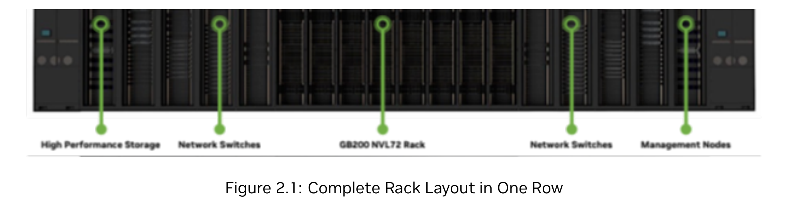

**图片解释：**这是 PDF 原图 Figure 2.1，展示了一个 SU 在一整排机柜里的物理布局。中间是 DGX GB200 NVL72 计算机柜，两侧有高性能存储、网络交换机和管理节点。它表达了一个很关键的设计思想：AI 工厂不是只买 GPU 机柜，网络、存储、管理节点和供配电/冷却都必须作为一个整体交付。

为什么要以 SU 为单位？

因为 AI 训练集群最怕“局部能跑、整体不均衡”。如果 GPU、网络、存储、管理节点分批随意拼装，后面很容易出现：

- 某些机柜网络路径更长；
- 某些 leaf/spine 被打满；
- 存储吞吐跟不上 checkpoint；
- 管理网络和训练网络互相影响；
- 扩容时必须重布线、重规划、重调度。

SU 的意义是把这些变量提前封装成一个经过验证的最小规模单元。后续扩容时，不是“加几台机器”，而是复制和扩展一套相对完整的计算、网络、存储和运维单元。

---

## 2. DGX GB200 机柜：72 张 GPU 先在机柜内组成一个 NVLink 域

单个 DGX GB200 NVL72 机柜可以理解成一个 rack-scale AI system。

它不是传统意义上的“机柜里塞了很多独立服务器”，而是把 72 张 GPU 组织成一个高速 NVLink 域。

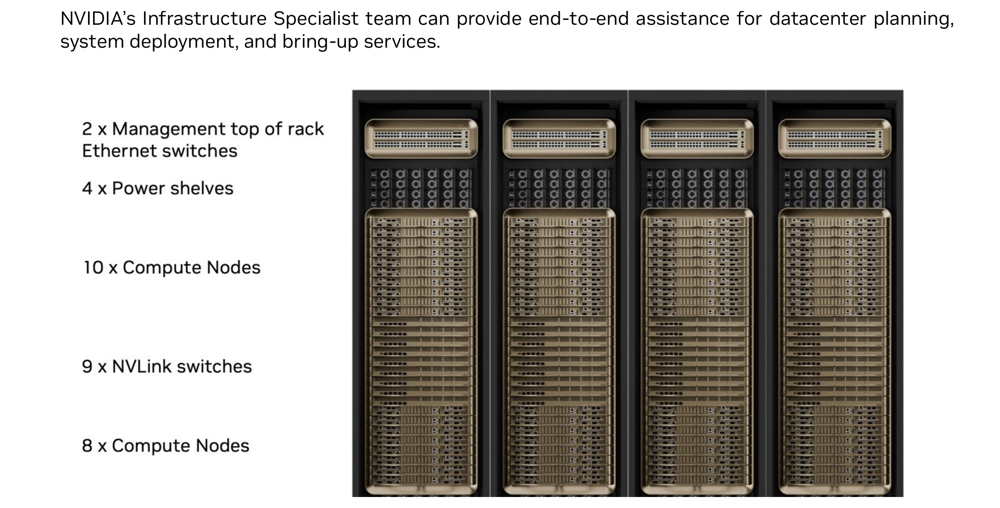

**图片解释：**这是 PDF 原图 Figure 3.1，展示 DGX GB200 的机柜结构。一个机柜内包含计算托盘、NVLink Switch 托盘、电源 shelf 和管理相关模块。文档里强调的不是单个节点，而是整柜作为一个 NVL72 系统交付。

一个 DGX GB200 机柜的关键组成是：

| 组件 | 数量/特征 | 作用 |
|---|---|---|
| Compute Tray | 18 个 | 每个 tray 内有 2 个 GB200 Superchip |
| GPU | 72 张 B200 | 形成单个 NVLink 域 |
| NVLink Switch Tray | 9 个 | 负责机柜内 GPU 间高速互联 |
| Power Shelf | 8 个 | 每个 power shelf 由 6 个 5.5kW PSU 组成，支持冗余 |
| 网络接口 | CX-7 + BlueField-3 | 分别服务 InfiniBand 训练网和以太网存储/管理网 |
| 本地盘 | E1.S NVMe + M.2 NVMe | 前者可做本地 RAID0 缓存/暂存，后者用于 OS 镜像 |

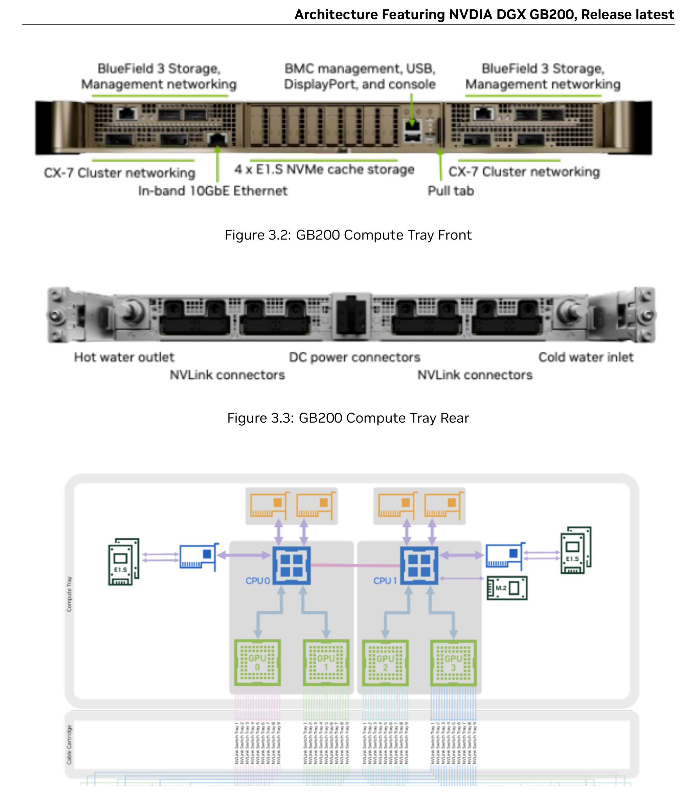

**图片解释：**这是 PDF 原图 Figure 3.2、Figure 3.3 和 Figure 3.4，分别展示 compute tray 的前面板、后面板和块图。每个 compute tray 有 2 个 GB200 Superchip；每个 Superchip 由 1 个 Grace CPU 和 2 个 B200 GPU 组成。也就是说，一个 compute tray 内有 4 张 GPU。18 个 tray 叠起来就是 72 GPU。

在这个层级里，最值得关注的是 **NVLink-C2C 和 NVLink Switch**。

GB200 Superchip 内部通过 NVLink-C2C 把 Grace CPU 和 B200 GPU 连接起来；机柜内部再通过 NVLink Switch Tray 让 72 张 GPU 处在同一个高带宽、低延迟的互联域里。这样做的目的，是尽量把模型并行、张量并行、专家并行里的高频通信留在机柜内部解决。

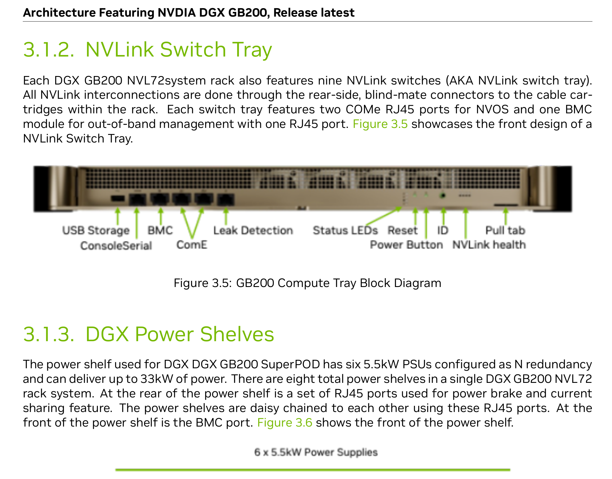

**图片解释：**这是 PDF 原图 Figure 3.5 和 Figure 3.6，对应 NVLink Switch Tray 与 Power Shelf。NVLink Switch Tray 负责机柜内 GPU 高速互联；Power Shelf 则体现出 GB200 这一代系统对供电和机房基础设施的要求已经非常高。到这个密度，IDC 设计不能只看网络，液冷、供电、BMS 和运维系统都要一起设计。

---

## 3. 网络不是一张网，而是五个逻辑网络、四类物理 fabric

DGX SuperPOD 的网络设计很有代表性。

从逻辑上看，它包含五张网络：

| 逻辑网络 | 主要作用 |
|---|---|
| NVLink5 | 机柜内 72 GPU scale-up |
| Compute Fabric | 跨机柜、跨 SU 的 GPU scale-out 通信 |
| Storage Fabric | 高性能共享存储访问 |
| In-Band Management Network | provisioning、数据移动、用户访问、Slurm/Kubernetes 服务访问 |
| Out-of-Band Management Network | BMC、BlueField BMC、NVSwitch COMe、PDU、网络设备管理口等 |

从物理承载上看，它们被放到四类 fabric 上：

| 物理 fabric | 承载内容 |
|---|---|
| Multi-node NVLink Fabric | 机柜内 NVLink |
| Compute InfiniBand Fabric | 训练计算网络 |
| Storage and In-band Ethernet Fabric | 存储和带内管理 |
| Out-of-Band Network | 隔离的 OOB 管理 |

这套拆法背后的原则很简单：

> **训练流量、存储流量、用户/控制流量、硬件管理流量不要混在一起。**

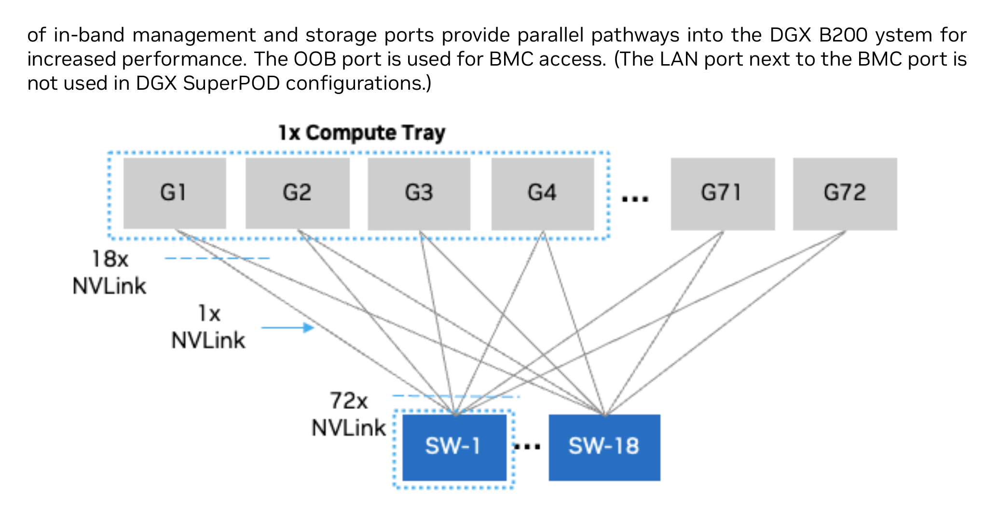

**图片解释：**这是 PDF 原图 Figure 4.1，是机柜内 NVLink 的简化表达。上方是 72 张 GPU，下方是 NVLink Switch。每张 GPU 通过 NVLink 连接到交换芯片，从而形成机柜内高带宽通信域。它解决的是“单柜内 GPU 怎么互联”的问题。

---

## 4. Compute Fabric：训练网的重点是 rail-optimized

跨机柜、跨 SU 的训练通信走 InfiniBand Compute Fabric。

文档里对 compute fabric 的要求可以概括为几句话：

- rail-optimized，一直优化到 fabric 顶层；
- balanced full fat-tree；
- 使用高性能、低延迟 InfiniBand 交换机；
- 支持 SHARP v3 等集合通信加速能力；
- 支持更大规模的 spine-leaf-group 扩展。

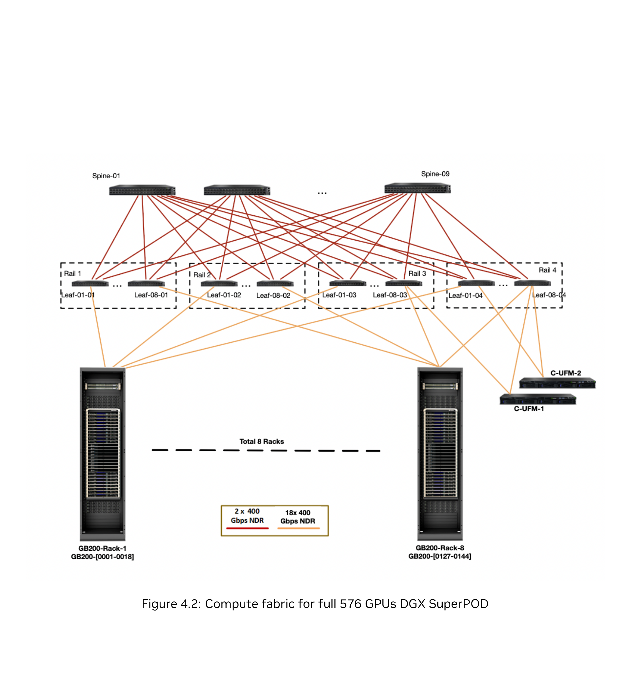

**图片解释：**这是 PDF 原图 Figure 4.2，展示完整 576 GPU / 1 SU 的计算网络。每个 DGX GB200 机柜按 rail 对齐接入 leaf/spine。相同 rail 的流量尽量保持路径短且一致；跨 rack 或跨 rail 的流量再经过 spine 层。

rail-optimized 的核心不是“有 spine-leaf 就行”，而是：

```text
同编号 GPU/NIC 尽量进入同一条 rail
每条 rail 都有自己清晰的 leaf/spine 路径
训练 collective 通信不在一张大网里随机碰撞
```

这对大模型训练特别重要。AllReduce、ReduceScatter、AllGather、All-to-All 都会产生持续的大流量。如果所有 NIC 进入一张混合大网，ECMP hash 一旦不均，某些链路就会被打爆。rail-optimized 的好处是把流量域拆清楚，让拥塞、故障和容量规划都更可控。

对于更大规模的 SuperPOD，文档采用 spine-leaf-group 设计来扩展。

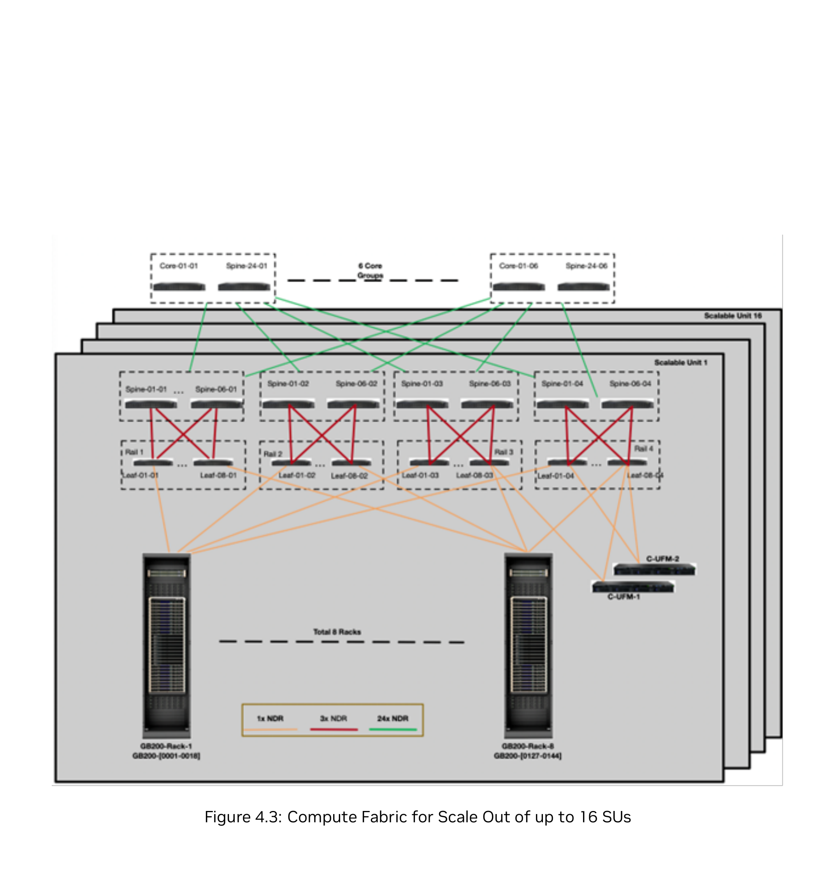

**图片解释：**这是 PDF 原图 Figure 4.3，展示 compute fabric 从单 SU 扩到多 SU 的方法。多个 SU 通过上层 core group 连接，形成可扩展的非阻塞 fat-tree。参考表里给出的规模包括 2 SU / 1152 GPU、4 SU / 2304 GPU、8 SU / 4608 GPU、16 SU / 9216 GPU。

这里可以看到一个很关键的工程思路：

> **扩容不是把新机器随便接到现网，而是提前按最大规模规划 core、spine、leaf 和线缆。即使某些端口先不用，也要保证将来扩容后路径一致。**

这也是很多 AI 集群早期设计容易低估的地方。前期为了省交换机或省光纤，做了非标准收敛和非对称拓扑，后期一扩容就会遇到 NCCL 性能不稳定、作业跨区调度性能掉崖、故障定位困难等问题。

---

## 5. 以太网 fabric：存储和带内管理共享物理底座，但逻辑隔离

到了 DGX GB200，NVIDIA 把存储和带内管理放在新一代以太网 fabric 上，核心交换机是 Spectrum-4 SN5600。

单 SU 里，这张以太网 fabric 大致承担三类流量：

- 高性能存储访问；
- 带内管理和用户访问；
- OOB 管理流量的汇聚与隔离。

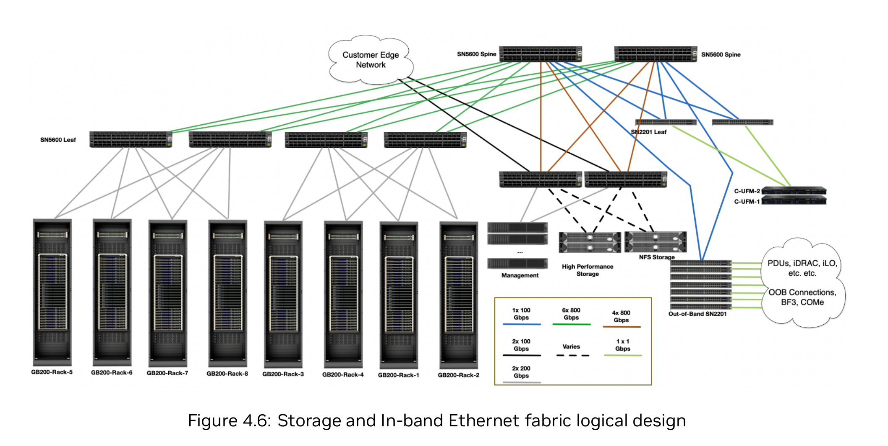

**图片解释：**这是 PDF 原图 Figure 4.6，展示单 SU 的 Storage and In-band Ethernet Fabric。DGX 机柜、存储设备、管理节点、客户边界网络和 OOB 设备都会接入这张以太网体系，但通过不同逻辑网络和 VXLAN/VTEP 做隔离。

文档里的设计要点包括：

| 网络 | 设计重点 |
|---|---|
| Storage Network | 面向高性能存储，使用 RoCE，要求拥塞控制和 adaptive routing |
| In-Band Network | 承载 provisioning、服务访问、用户登录、NGC/代码仓库/数据源访问 |
| OOB Network | 面向 BMC、PDU、交换机管理口等，和普通用户隔离 |

当 SuperPOD 从单 SU 扩到多 SU 时，以太网 fabric 会增加 super-spine 层。这样存储和带内管理网络也能按 SU 扩展，而不是只有训练 InfiniBand 网络能扩。

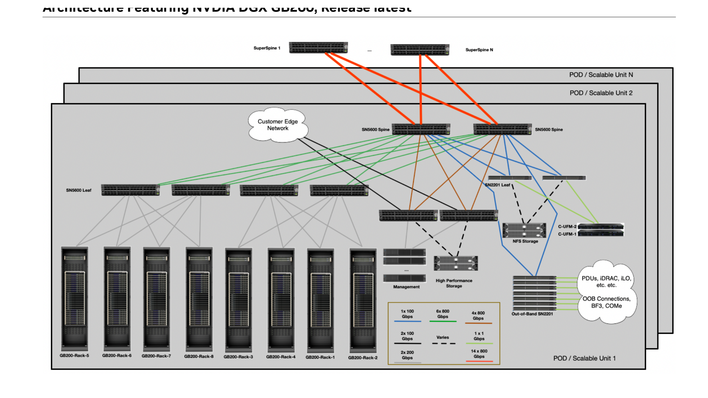

**图片解释：**这是 PDF 原图 Figure 4.7，展示 Storage and In-band Ethernet Fabric 的 scale-out 设计。多个 SU 通过 super-spine 层扩展，保持存储和带内管理网络的整体性。

这里有两个数字值得记：

| 项目 | 参考值 |
|---|---|
| DGX 节点侧连接 | 文档描述为 BlueField-3 DPU 上的 4 × 200GbE 接入 |
| 单 SU 到存储设备侧 | 设计为 16 × 800Gbps 的非阻塞带宽 |

但 DGX 节点侧并不是完全非阻塞，文档给出的描述是稍微 blocking，blocking factor 为 5:3。这个选择很现实：存储网络要足够强，但不一定需要和训练网一样按最极端全互联通信来设计。

---

## 6. Storage、In-band、OOB：三张网分别解决三个问题

存储网络要解决的是吞吐、延迟和 checkpoint。

在大模型训练里，数据不是只读一次。训练数据会反复读取，checkpoint 文件可能非常大，写 checkpoint 时还会影响训练推进。所以存储不是“挂个 NAS 就行”，而是要和计算规模匹配。

文档给了两档存储性能参考：

| 性能项 | Standard | Enhanced |
|---|---:|---:|
| 单 SU 聚合读 | 40 GBps | 125 GBps |
| 单 SU 聚合写 | 20 GBps | 62 GBps |
| 4 SU 聚合读 | 160 GBps | 500 GBps |
| 4 SU 聚合写 | 80 GBps | 250 GBps |

Standard 更适合多路 LLM fine-tuning、数据集可被本地内存缓存、计算主导的场景。Enhanced 更适合多模态、大数据集、I/O 对端到端训练时间影响明显的场景。

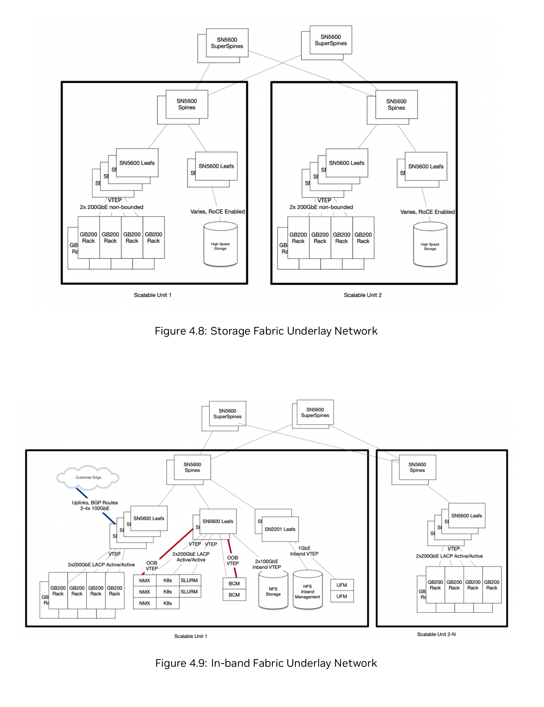

**图片解释：**这是 PDF 原图 Figure 4.8 和 Figure 4.9。上半部分是 Storage Fabric Underlay，下半部分是 In-band Fabric Underlay。两者都建立在 SN5600 leaf/spine/super-spine 之上，但逻辑目的不同：存储网络追求高吞吐和 RoCE 性能；带内管理网络负责用户访问、NFS、Slurm/Kubernetes、NGC、代码仓库和数据源等控制/服务流量。

OOB 网络则要解决另一个问题：硬件管理不要暴露给普通用户。

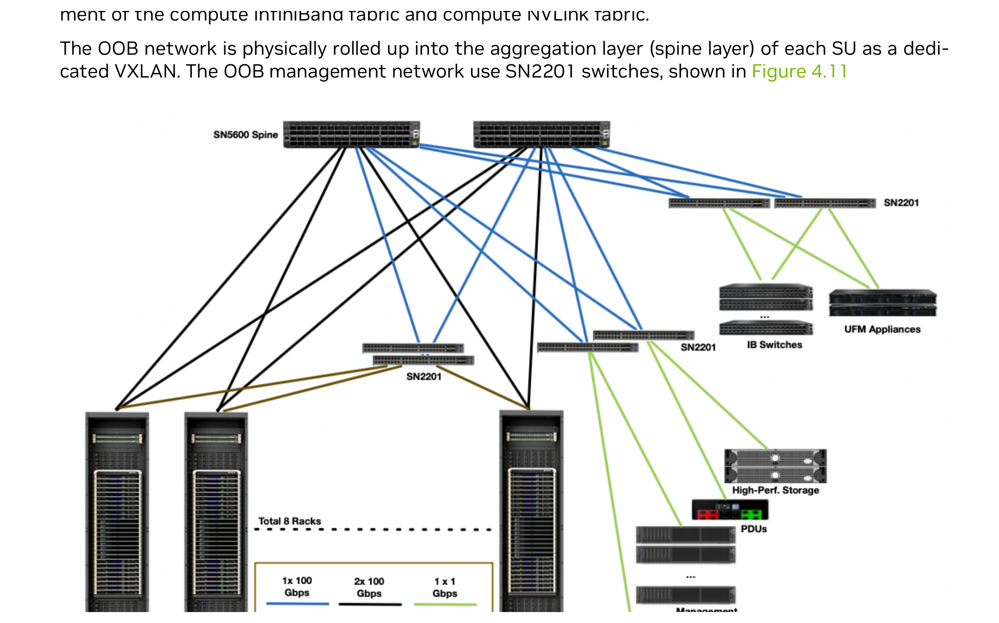

**图片解释：**这是 PDF 原图 Figure 4.10，展示 OOB Ethernet Fabric。OOB 网络连接 DGX compute tray、NVLink switch tray、管理服务器、存储、网络设备、PDU 等所有管理口。它承载 IPMI、fabric 管理、NVLink 管理等控制流量，应该和用户可访问网络严格隔离。

到了 GB200 这一代，还多了一个传统 AI 服务器集群里容易忽视的对象：**BMS，Building Management System**。

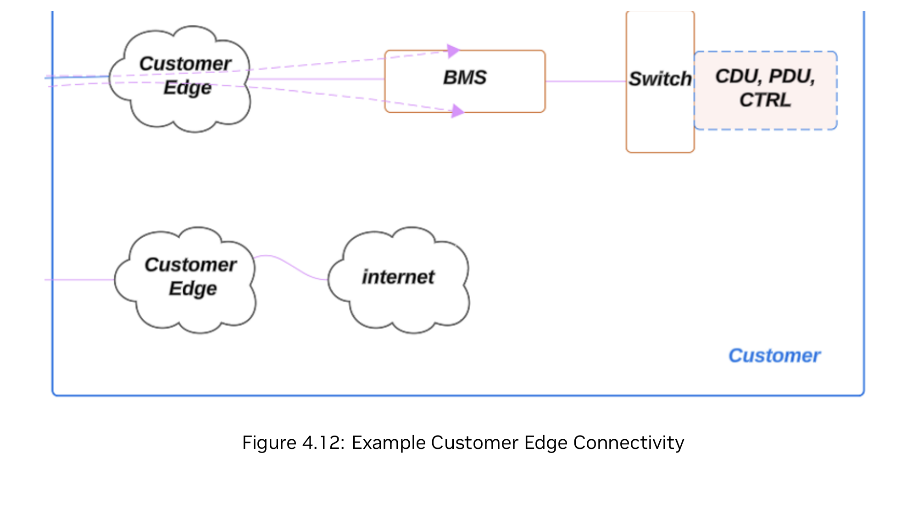

**图片解释：**这是 PDF 原图 Figure 4.12。图中 Customer Edge 不只连接互联网/企业网，还需要连接 BMS，再到 CDU、PDU、CTRL 等数据中心基础设施。原因是 GB200 的供电和液冷复杂度已经让 OT 系统成为 AI 集群的一部分。

文档建议客户边界至少准备 2 × 100GbE DR1 单模连接，并通过 eBGP 与客户网络交接路由。这里交接的不只是 in-band 路由，也包括 OOB 和 BMS 相关路由。

换句话说，DGX GB200 SuperPOD 的 IDC 网络边界已经不是简单的“业务出口”。它同时包含：

- 用户和企业网络访问；
- NGC、镜像仓库、代码仓库、数据源访问；
- OOB 管理域路由；
- BMS / OT 系统连接；
- 运维和安全边界控制。

---

## 7. 软件栈：Mission Control 把硬件、网络、调度和恢复串起来

如果只看硬件，SuperPOD 像一个超大 GPU 集群。

但 NVIDIA 的参考架构更强调完整系统：硬件、网络、存储、操作系统、调度器、容器平台、监控诊断、故障恢复都要一起交付。

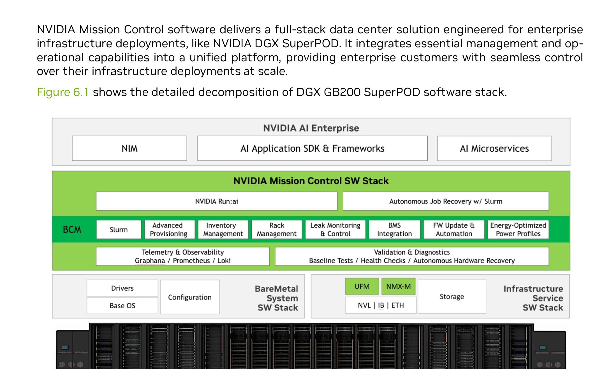

**图片解释：**这是 PDF 原图 Figure 6.1，展示 DGX GB200 SuperPOD 的软件栈。底层是驱动、OS、配置、裸机栈、UFM/NMX、存储和网络；上层是 Slurm、Kubernetes、Run:ai、健康检查、诊断、遥测和自动恢复；再上层是 NVIDIA AI Enterprise、NGC、AI frameworks 和 microservices。

Mission Control 的价值主要体现在四件事上：

| 能力 | 价值 |
|---|---|
| 自动故障检测与恢复 | 减少人工介入，降低训练中断时间 |
| 工作负载迁移与资源分配 | 把作业迁到健康节点，减少 GPU 空转 |
| 基础设施和应用统一诊断 | SRE、DevOps、算法团队能更快定位问题 |
| checkpoint 相关恢复能力 | 训练失败后尽量从最近有效状态恢复，减少重跑成本 |

Run:ai 被包含在 Mission Control 体系里，负责更上层的工作负载编排。

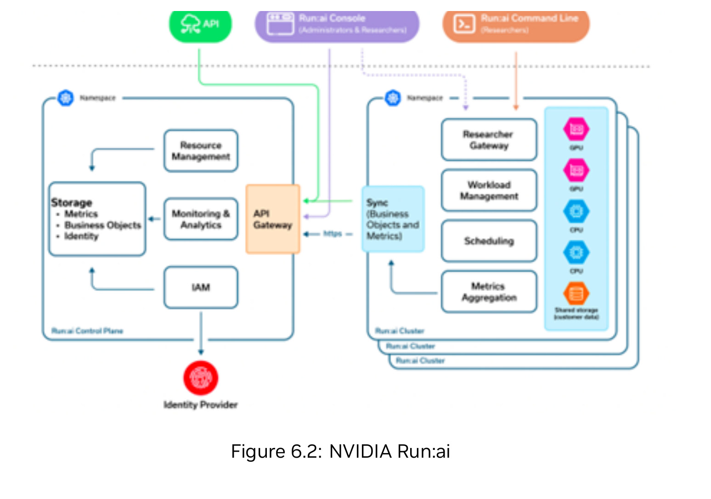

**图片解释：**这是 PDF 原图 Figure 6.2。Run:ai 分成 control plane 和 cluster 两部分。control plane 负责集中管理，cluster 组件部署在 Kubernetes 基础设施上。研究人员通过 console、CLI 或 API 提交作业，平台在后端处理资源管理、调度、监控、指标汇聚和身份权限。

对于 AI 工厂来说，软件栈的重要性不亚于网络。

因为 576 GPU、2304 GPU、9216 GPU 这种规模下，集群一定会有节点故障、链路抖动、作业失败、镜像拉取失败、存储抖动、队列拥塞。没有统一的观测、诊断、调度和恢复能力，GPU 利用率会被运维复杂度吃掉。

---

## 8. 这份架构给 IDC 网络设计的几个启发

### 8.1 不要从“服务器数量”开始设计，要从 SU 开始设计

AI 集群的容量单位应该包含：

- GPU 数量；
- 训练网络端口和 rail；
- 存储吞吐；
- 管理节点；
- 供电和冷却；
- OOB 和 BMS；
- 调度和运维系统。

只算“几台 GPU 服务器”是不够的。

### 8.2 scale-up 和 scale-out 要分清

DGX GB200 的分层很清楚：

```text
机柜内：NVLink / NVSwitch，解决 scale-up
机柜间：NDR InfiniBand，解决 scale-out
存储/管理：Spectrum-4 Ethernet，解决数据和控制面
```

这对我们理解 AI 集群很有帮助。不是所有流量都应该走同一张 RDMA 网，也不是所有网络都应该追求同一种拓扑。

### 8.3 训练网的核心不是“带宽够”，而是路径一致

大模型训练的 collective communication 对尾延迟和拥塞非常敏感。

rail-optimized 的价值在于：

- GPU/NIC 到 rail 的绑定清晰；
- 每条 rail 的容量和故障域清晰；
- 调度器更容易做拓扑感知；
- 故障定位可以缩小到某条 rail；
- 扩容时不破坏原来的路径一致性。

### 8.4 存储不是配角，checkpoint 会把问题放大

LLM 训练里，很多人只盯着 GPU 算力，但 checkpoint 写入会真实阻塞训练进度。

如果 checkpoint 文件是 TB 级，存储写性能和元数据性能不足，训练就会周期性卡顿。文档建议根据模型类型、数据集大小、是否多模态、是否频繁 checkpoint 来选择 Standard 或 Enhanced 存储能力，这个思路比简单按容量买盘更靠谱。

### 8.5 OOB、BMS、OT 要前置设计

GB200 这种液冷高密系统，已经把数据中心基础设施拉进了集群架构本身。

OOB 网络不只是“能登录 BMC”，还要管理：

- DGX compute tray；
- BlueField BMC；
- NVLink switch；
- InfiniBand / Ethernet 交换机；
- 存储设备；
- PDU；
- CDU 和 BMS 相关系统。

这意味着网络、安全、机房、运维团队要一起规划，而不是等 GPU 到货后再补管理网络。

---

## 9. 总结

DGX GB200 SuperPOD 的参考架构，本质上是在回答一个问题：

> **当 AI 集群从几十张 GPU 走向几百、几千、上万张 GPU 时，IDC 架构应该怎么标准化？**

它给出的答案是：

- 用 SU 作为标准化建设单元；
- 机柜内用 NVLink 做高带宽 scale-up；
- 机柜间用 rail-optimized InfiniBand 做训练 scale-out；
- 存储和带内管理走独立的高性能以太网；
- OOB 管理、BMS、OT 网络作为一等公民设计；
- 用 Mission Control、Run:ai、Slurm、Kubernetes、UFM、NMX 等软件能力把部署、调度、监控、诊断和恢复闭环。

对我们做 AI 集群 IDC 网络学习来说，这份文档最大的价值不是告诉你“买哪些设备”，而是展示了一套完整的工程边界：

> **AI 工厂不是 GPU 服务器堆叠，而是计算、网络、存储、供电、冷却和软件运维共同组成的系统工程。**
