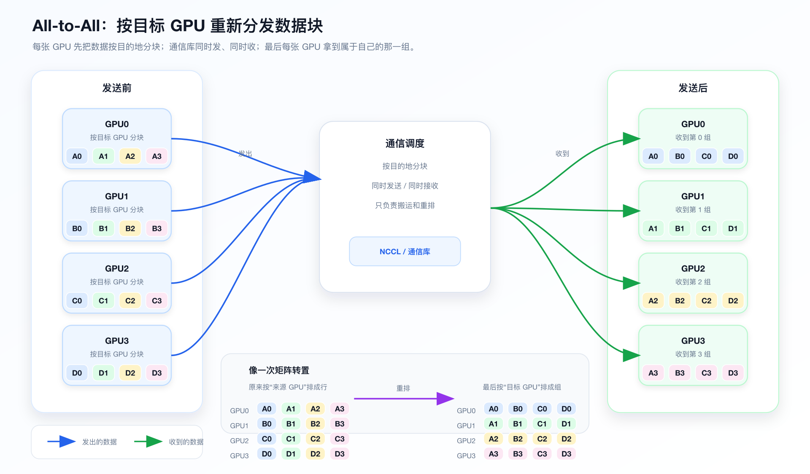
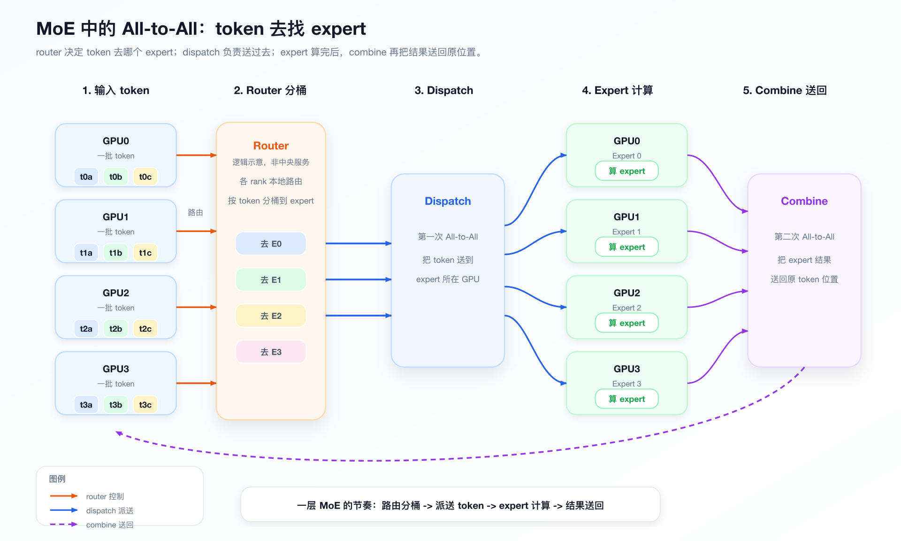

# 一文搞懂 All-to-All：MoE 模型里的专家派送系统

学大模型通信时，很多人先接触的是 AllReduce。

比如数据并行训练里，每张 GPU 算出一份梯度，然后大家把梯度加起来，再让每张 GPU 都拿到同一份结果。

这个逻辑很像：

```text
全班每个人交一份分数
老师算平均分
再把平均分告诉所有人
```

但到了 MoE 模型，事情就变了。

MoE 里不是所有 token 都走同一个大 MLP，而是先让 router 判断：

```text
这个 token 去 expert 3
那个 token 去 expert 8
另一个 token 去 expert 21
```

如果这些 expert 分布在不同 GPU 上，那么 token 就要被送到对应 expert 所在的 GPU。

这时候用的核心通信，就不是 AllReduce，而是 **All-to-All**。

一句话：

> **AllReduce 是大家一起合并答案；All-to-All 是大家互相分发包裹。**

这篇文章用大白话讲清楚：

- All-to-All 到底在干什么；
- 为什么训练和推理里都会遇到它；
- MoE 为什么绕不开 All-to-All；
- NCCL 的 All-to-All 大概怎么做。

---

## 先说结论

All-to-All 和 AllReduce 不是一个问题。

AllReduce 解决的是：

```text
大家把数据合起来，每张 GPU 拿到同一个结果
```

All-to-All 解决的是：

```text
每张 GPU 把不同数据发给不同 GPU，大家拿到各自该拿的那一部分
```

MoE 模型里，如果 expert 被切分到多张 GPU 上，token 就经常要跨 GPU 去找对应 expert。

所以一个 MoE layer 里通常会出现两次核心数据搬运：

```text
dispatch：token 发给 expert
combine：expert 输出送回原位置
```

NCCL 提供的是通用 GPU 通信能力。

它可以帮 GPU 之间搬数据，但哪些 token 该去哪里，通常由 MoE 框架根据 router 结果决定。

一句话：

> **All-to-All 是 MoE 的专家派送系统；router 决定 token 去哪里，通信库负责搬运，expert 负责计算。**

---

## 一、All-to-All 到底在做什么

假设有 4 张 GPU：

```text
GPU0、GPU1、GPU2、GPU3
```

每张 GPU 手里都有 4 份数据。

GPU0 手里的数据可以写成：

```text
GPU0: A0 A1 A2 A3
```

这里的意思是：

```text
A0 留给 GPU0
A1 发给 GPU1
A2 发给 GPU2
A3 发给 GPU3
```

同理：

```text
GPU1: B0 B1 B2 B3
GPU2: C0 C1 C2 C3
GPU3: D0 D1 D2 D3
```

All-to-All 做完以后，结果变成：

```text
GPU0: A0 B0 C0 D0
GPU1: A1 B1 C1 D1
GPU2: A2 B2 C2 D2
GPU3: A3 B3 C3 D3
```

你可以把它想成一个“矩阵转置”：

```text
原来每一行属于一张 GPU
现在每一列被送到对应 GPU
```

更大白话一点：

> **每张 GPU 把自己手里的数据按目标 GPU 分成多个数据块，然后分别发送到对应 GPU。**



注意，All-to-All 不负责“算”。

它不做求和，不做平均，不做归约。

真正负责计算的是收到数据后的 GPU。

比如 MoE 里，All-to-All 只是把 token 送到 expert 所在的 GPU；后面真正执行矩阵计算的，是这个 GPU 上的 expert，也就是对应的 MLP/GEMM kernel。

它只是搬运和重排：

```text
这份数据该去 GPU2
那份数据该去 GPU7
另一份数据该留在本地
```

所以 All-to-All 的本质是：

> **按目的地重新分发数据。**

补充一句：实际工程里的 MoE All-to-All 往往不是简单的固定大小搬运。上层框架通常会先按 expert 分桶、统计每个目标要收发多少 token，再用通信库提供的原语或成组 send/recv 完成变长分发，以获得更细粒度的调度控制。

---

## 二、All-to-All 和 AllReduce 到底差在哪

很多人容易把 collective communication 混在一起。

但 AllReduce 和 All-to-All 的目标完全不同。

### AllReduce：大家合并成同一个结果

比如 4 张 GPU 各有一份梯度：

```text
GPU0: grad0
GPU1: grad1
GPU2: grad2
GPU3: grad3
```

AllReduce 之后：

```text
GPU0: grad0 + grad1 + grad2 + grad3
GPU1: grad0 + grad1 + grad2 + grad3
GPU2: grad0 + grad1 + grad2 + grad3
GPU3: grad0 + grad1 + grad2 + grad3
```

每张 GPU 拿到的是同一个结果。

它像：

```text
全班一起算总分
每个人都拿到总分
```

### All-to-All：每个人给每个人发不同东西

All-to-All 不是合并。

它更像：

```text
每个人手里有很多快递
每个快递都有不同收件人
大家同时互相派送
```

最后每个人收到的是别人发给自己的那部分。

可以简单记成：

| 通信类型 | 大白话 | 结果 |
|---|---|---|
| AllReduce | 大家把东西合起来 | 每张 GPU 拿到相同结果 |
| AllGather | 大家把碎片收齐 | 每张 GPU 拿到完整拼接结果 |
| ReduceScatter | 先合并，再分片 | 每张 GPU 拿到一片合并结果 |
| All-to-All | 大家互相发不同包裹 | 每张 GPU 拿到属于自己的包裹 |

所以，只要你看到“不同数据要去不同 GPU”，脑子里就应该想到：

```text
这大概率是 All-to-All
```

---

## 三、训练里有 All-to-All 吗

有，但不是所有训练都有。

普通 dense Transformer 训练里，核心通信更多是：

```text
数据并行：AllReduce / ReduceScatter / AllGather
张量并行：AllReduce / AllGather / ReduceScatter
流水线并行：Send / Recv
```

如果模型是普通 dense 模型，没有 MoE，也没有复杂的数据重排，那么 All-to-All 通常不是核心通信。

但如果是 MoE 训练，尤其是 Expert Parallelism，All-to-All 就非常关键。

原因很简单：

```text
expert 被切到不同 GPU 上
token 一开始不一定在 expert 所在 GPU 上
所以 token 要被送过去
```

一个 MoE layer 里，通常会发生两次主要通信：

```text
第一次：dispatch
把 token 送到 expert 所在 GPU

第二次：combine
把 expert 算完的结果送回原来的位置
```

训练时还有 backward。

forward 是“题目送给专家，专家算完送回答案”。

backward 则是反过来：

```text
先把答案上的梯度送回 expert
再把 token 上的梯度送回原来的位置
```

所以 All-to-All 的压力不只出现在 forward，backward 里也会出现。

所以 MoE 训练对网络很敏感。

模型算力够强，但 All-to-All 堵住了，GPU 就会等网络。

GPU 等网络，就会出现一个很尴尬的局面：

```text
显卡很贵
但它在等快递
```

---

## 四、推理里也有 All-to-All 吗

也有。

只要推理的模型是 MoE，并且 expert 分布在多张 GPU 上，就可能有 All-to-All。

推理时流程大概是：

```text
用户输入 prompt
  ↓
模型开始 forward
  ↓
到了 MoE 层
  ↓
router 决定 token 去哪个 expert
  ↓
All-to-All 把 token 发过去
  ↓
expert 计算
  ↓
All-to-All 把结果送回来
```

训练和推理的区别在于：

> **训练更怕吞吐不够，推理更怕延迟抖动。**

训练时，batch 往往比较大。

一大批 token 一起 dispatch，All-to-All 虽然重，但更容易把网络带宽打满。

推理时，要分成 prefill 和 decode 看。

### Prefill 阶段

prefill 是一次性处理用户 prompt。

比如用户输入了几千个 token，模型要一次性处理这些 token，建立 KV Cache，并生成第一个输出位置的结果。

这个阶段 token 多，通信更像训练：

```text
大批量 token 进来
router 分发
expert 处理
结果合并
```

它更偏带宽敏感。

### Decode 阶段

decode 是一个 token 一个 token 往外生成；对每条序列来说，每一步生成一个新 token。

比如：

```text
生成第 1 个 token
生成第 2 个 token
生成第 3 个 token
...
```

每一步都可能经过 MoE 层。

如果每一步都要跨 GPU、跨机器发 token，那么网络延迟会直接影响用户看到的生成速度。

所以 decode 更偏延迟敏感。

这也是为什么 MoE 推理部署里，expert 怎么放、请求怎么 batch、通信怎么 overlap，都很重要。

---

## 五、MoE 为什么绕不开 All-to-All

MoE 可以理解成：

```text
不是所有题目都交给同一个老师
而是不同题目交给不同专家
```

比如有 4 个 expert：

```text
Expert 0：擅长数学
Expert 1：擅长代码
Expert 2：擅长医学
Expert 3：擅长法律
```

当然，真实模型里的 expert 不是这么按人类学科分工的，这里只是方便理解。

现在每张 GPU 都拿到一批 token。

router 看完 token 后说：

```text
这个 token 去 Expert 0
这个 token 去 Expert 3
这个 token 去 Expert 1
```

如果 Expert 0 在 GPU0，Expert 1 在 GPU1，Expert 3 在 GPU3，那么 token 就要被送到对应 GPU。

这就形成了 All-to-All：

```text
GPU0 的一部分 token 发给 GPU1
GPU0 的一部分 token 发给 GPU3
GPU1 的一部分 token 发给 GPU0
GPU2 的一部分 token 发给 GPU3
...
```



MoE 里的两个关键词：

```text
dispatch：把 token 派送到 expert
combine：把 expert 输出送回原位置
```

dispatch 很像发快递：

```text
token -> expert 所在 GPU
```

combine 很像把快递处理完后寄回去：

```text
expert 输出 -> 原 token 所在位置
```

这就是 MoE All-to-All 最核心的一句话：

> **token 在哪里，和负责计算它的 expert 在哪里，经常不是同一个地方。**

只要这个矛盾存在，All-to-All 就绕不开。

### 补充：是 MoE 就一定有 All-to-All 吗

不一定。

关键要看有没有开启 **Expert Parallelism（EP，专家并行）**。

如果没有开启 EP，比如 **DP-MoE**，每张 GPU 上都有一份完整的 expert，token 在本地就能找到 expert，那么 MoE 的 dispatch/combine 通常不需要跨 GPU All-to-All。

如果开启了 **EP-MoE**，不同 expert 分布在不同 GPU 上，token 就可能需要从 GPU0 发到 GPU3 去找 expert。

这时候就需要两次通信：

```text
dispatch：把 token 送到 expert 所在 GPU
combine：把结果送回原来的 GPU
```

所以更准确地说：

> **MoE 不一定都有 All-to-All；但只要做了 EP，让 expert 分布在多张 GPU 上，All-to-All 基本就绕不开。**

---

## 六、NCCL 是怎么做 All-to-All 的

NCCL 可以理解成 GPU 之间的通信调度系统。

它知道：

```text
哪些 GPU 在同一台机器里
哪些 GPU 要跨机器
哪些链路更快
哪些通信可以同时做
```

对于 All-to-All，可以先这样理解：

早期 NCCL 没有原生 `ncclAlltoAll` 接口时，All-to-All 通常是用 `ncclSend/ncclRecv` 配合 group 拼出来的。

大白话就是：

```text
我给 GPU0 发一份，也收 GPU0 一份
我给 GPU1 发一份，也收 GPU1 一份
我给 GPU2 发一份，也收 GPU2 一份
我给 GPU3 发一份，也收 GPU3 一份
```

这些 send/recv 要放在同一个 group 里一起推进。

为什么？

因为 All-to-All 是大家同时发、同时收。

如果调度不好，就可能出现：

```text
大家都在等别人先收
没人真正开始收
于是全堵住
```

所以 NCCL 会把这些 send/recv 合在一个 group 里，让它们一起推进。

后来从 NCCL 2.28.3 开始，NCCL 提供了原生 `ncclAlltoAll`。

从语义上说，它做的就是：

```text
每个 rank 给每个 rank 发 count 份数据
每个 rank 也从每个 rank 收 count 份数据
一个 rank 通常对应一张 GPU
```

这种接口适合“每个目的地数据量一样”，或者上层已经把数据 padding 成固定大小的场景。

但 MoE 里经常不是这样。

MoE 的 token 分布往往是不均匀的。

有的 expert 热门，收到很多 token。

有的 expert 冷门，只收到少量 token。

也就是说：

```text
GPU0 发给 GPU1 的数据量
不一定等于 GPU0 发给 GPU2 的数据量
```

这种“变长 All-to-All”，通常比固定大小 All-to-All 更麻烦。

上层框架要先做：

```text
按 expert 分桶
统计每个目标要发多少 token
准备发送 buffer
准备接收 buffer
再调用通信库搬运
```

所以即使有了原生 `ncclAlltoAll`，MoE 里每个 expert 收到的 token 数也常常不一样，导致每张 GPU 发给不同目标 GPU 的数据量不固定。这类通信通常仍然会用 send/recv group，或者用专门的 MoE 通信优化方案来做。

可以简单总结：

> **原生 `ncclAlltoAll` 要求每对 GPU 之间收发的数据量完全相同——比如都发 1000 个 token，谁对谁都一样，多一个少一个都不行；MoE 里 token 去哪个 expert 是动态决定的，发给每张 GPU 的数据量经常不一样，所以直接用它不一定高效。实际工程里，MoE 更常用 send/recv group 或专门的 MoE 通信优化方案来做。**

---

## 七、All-to-All 为什么特别考验 IDC 网络

AllReduce 通常可以设计成 ring、tree、CollNet、NVLS 等比较规整的模式。

它的流量更容易预测。

All-to-All 更麻烦。

因为它是：

```text
每张 GPU 都可能给很多 GPU 发
每张 GPU 也可能从很多 GPU 收
```

在 MoE 里还会更复杂：

```text
router 的选择不一定均匀
热门 expert 可能收到更多 token
不同 batch 的流量分布会变化
跨节点流量可能突然集中
```

所以 All-to-All 对网络的要求不只是“总带宽大”。

它还要求：

```text
路径足够均衡
交换机 buffer 不容易被打爆
拥塞控制靠谱
ECMP 哈希不要太偏
PFC / ECN / DCQCN 配置合理
跨节点和机内通信能配合
```

尤其在 RoCE 网络里，如果 All-to-All 突然形成热点，可能会出现：

```text
PFC pause 增多
队列堆积
尾延迟变高
GPU 等通信
整体吞吐下降
```

这就是为什么 AI 集群网络设计里，MoE 会成为一个很重要的压力测试。

Dense 模型训练跑得好，不代表 MoE 一定跑得好。

因为 MoE 多了一个非常重的多对多分发过程。

---

## 八、怎么判断一个通信是在做 All-to-All

以后你看分布式训练或推理框架，可以用这几个问题判断。

### 1. 数据是不是要按目的地重新分发

如果只是同步梯度，大概率是 AllReduce / ReduceScatter。

如果是：

```text
不同 token 要去不同 expert
不同 key 要去不同 partition
不同 embedding ID 要去不同 shard
```

那就很像 All-to-All。

### 2. 每个 GPU 收到的数据是不是不同

AllReduce 后，每张 GPU 拿到相同结果。

All-to-All 后，每张 GPU 拿到的是“发给自己的那部分”。

所以结果通常不同。

### 3. 是否有 dispatch / combine

MoE 里只要看到：

```text
dispatch tokens
combine outputs
expert parallel
```

基本就可以把 All-to-All 这个词放进脑子里。

### 4. 通信量是否跟 token 路由有关

如果通信量取决于 router 怎么选 expert，那就不是普通固定模式通信。

这通常是 MoE All-to-All。

---

## 九、最后总结

All-to-All 不是“高级版 AllReduce”。

它们是不同问题。

AllReduce 解决的是：

```text
大家的数据要合并成同一个结果
```

All-to-All 解决的是：

```text
大家的数据要按目的地重新分发
```

MoE 模型里，token 要去不同 expert。

expert 又分布在不同 GPU 上。

所以这种 MoE 训练和推理通常绕不开：

```text
dispatch All-to-All
combine All-to-All
```

NCCL 可以做通用 All-to-All，也可以用成组 send/recv 拼出更灵活的通信模式。

但 MoE 的问题更特殊：

```text
token 数量不均匀
expert 分布复杂
跨节点通信昂贵
推理 decode 怕延迟
训练怕吞吐掉下来
```

一句话收尾：

> **All-to-All 是 MoE 的“专家派送系统”：router 决定 token 去哪里，通信库负责搬运，expert 负责计算。**

如果你理解了这句话，再看 MoE 模型的训练和推理瓶颈，就不会只盯着算力了。

很多时候，真正卡住 GPU 的不是不会算，而是：

```text
token 还在路上
```

---

## 参考资料

- NVIDIA NCCL collective API 文档：[ncclAlltoAll](https://docs.nvidia.com/deeplearning/nccl/user-guide/docs/api/colls.html#ncclalltoall)
- NVIDIA NCCL P2P 文档：[用 send/recv group 表达 All-to-All](https://docs.nvidia.com/deeplearning/nccl/user-guide/docs/usage/p2p.html#all-to-all)
- NVIDIA NCCL 2.28.3 Release Notes：[新增 ncclAlltoAll](https://docs.nvidia.com/deeplearning/nccl/release-notes/rel_2-28-3.html)
