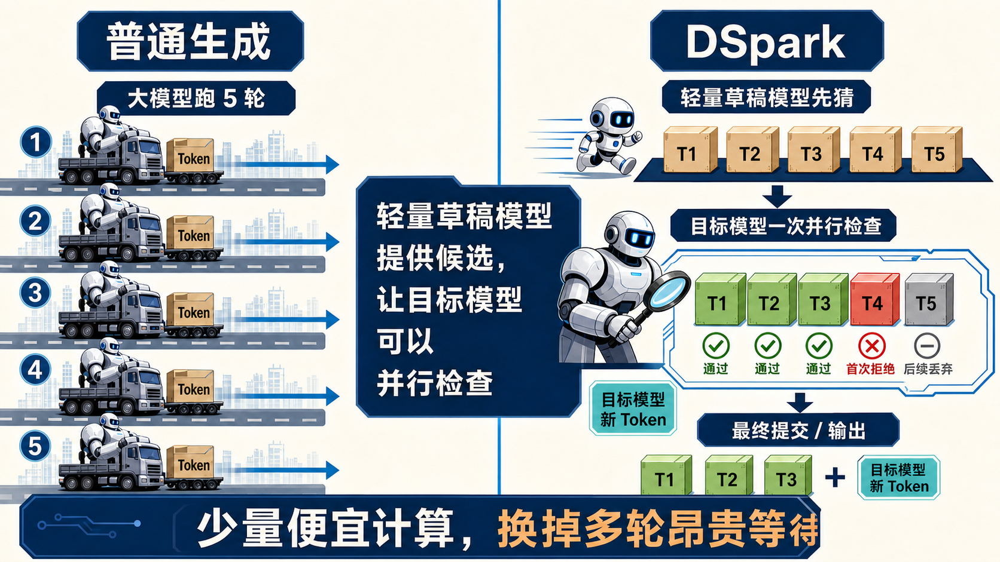
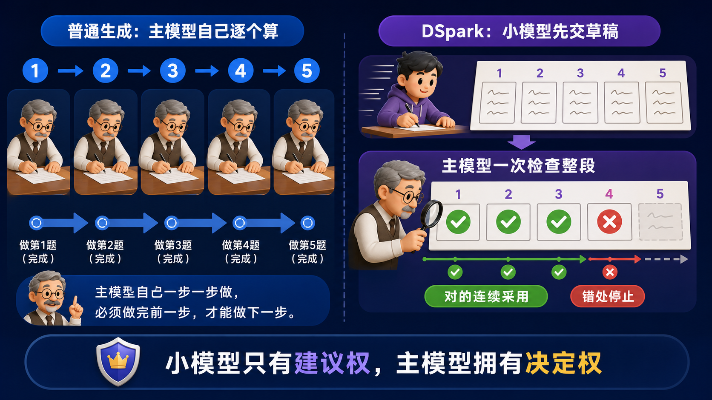
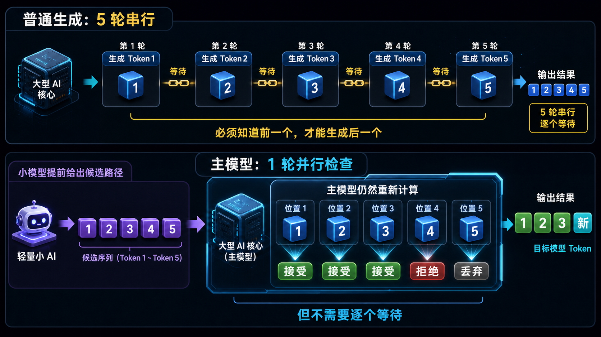
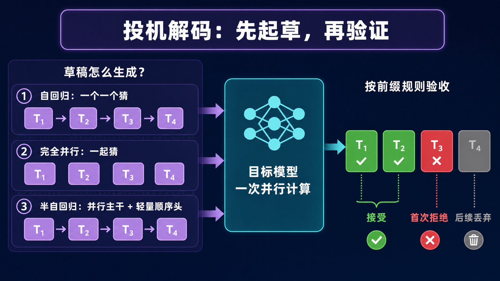
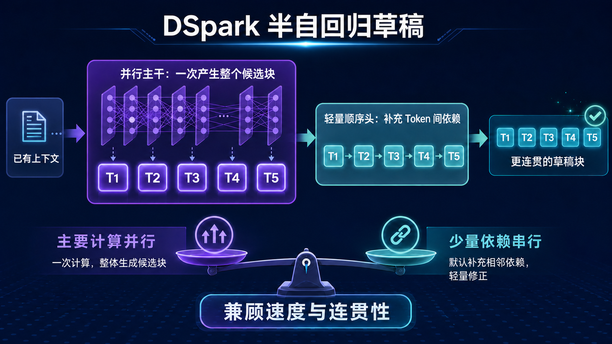
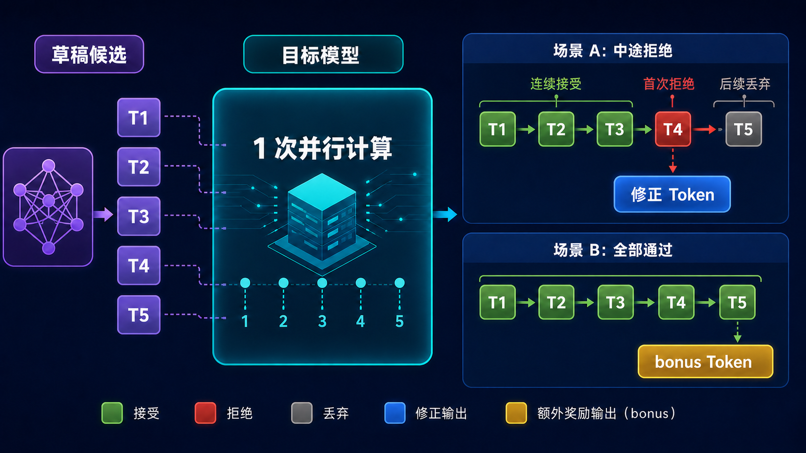
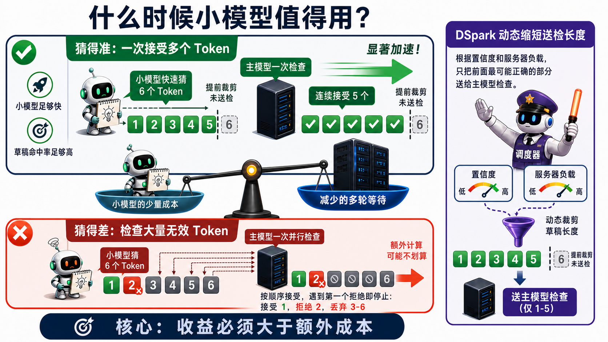
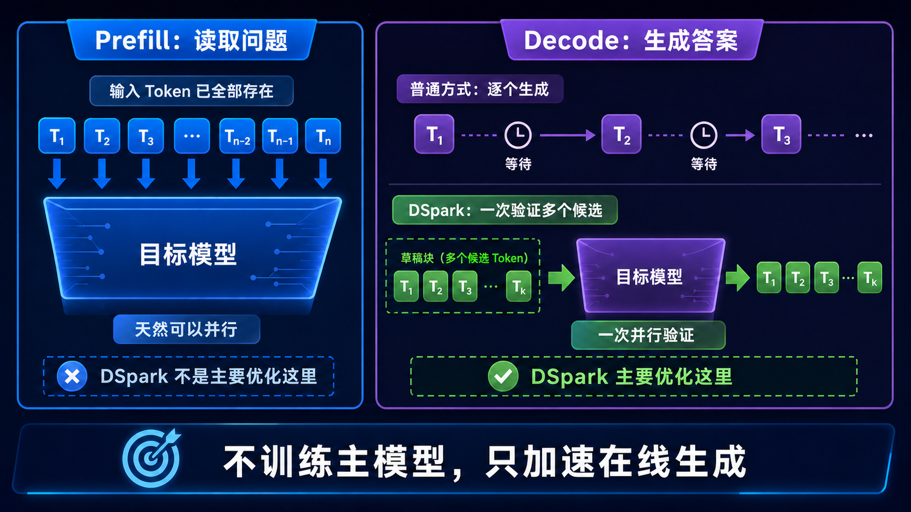
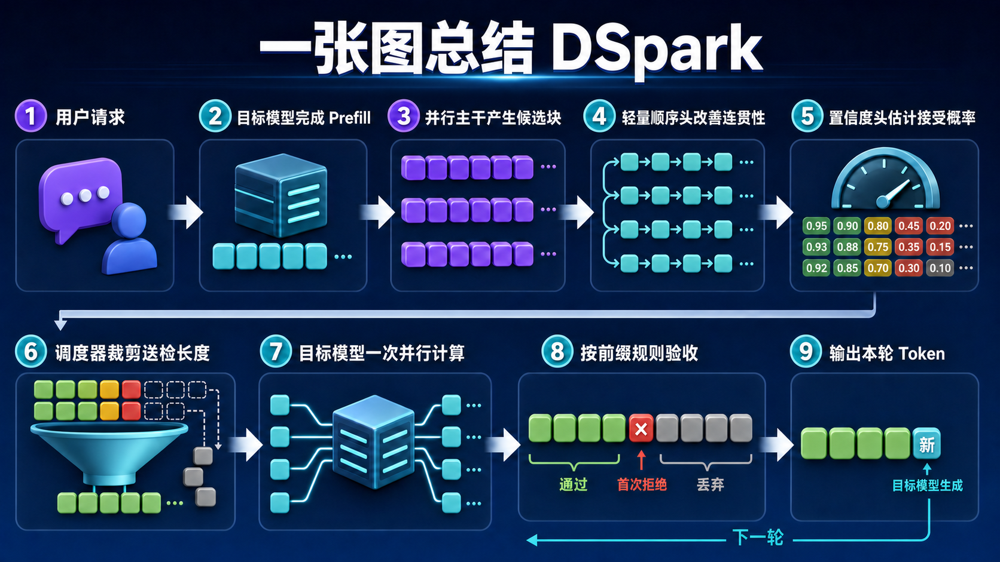

# 一文搞懂 DSpark：小模型先猜，主模型验证，为什么反而更快？

DSpark 的思路并不复杂：草稿模型先提出候选，目标模型一次验证多个位置。它增加了一部分便宜的草稿计算，换来更少的主模型串行等待。



---

## 0. 先看结论：DSpark 解决哪两个问题？

DSpark 是 DeepSeek 提出的一个用于加速大模型推理的投机解码框架。它主要解决传统投机解码中的两个瓶颈：

| 传统方法的问题 | 直接后果 | DSpark 的解决办法 |
|---|---|---|
| 草稿越往后越不准 | 接受率快速下降 | 半自回归生成 |
| 不管质量如何都验证整段草稿 | 浪费目标模型算力 | 置信度调度验证 |

前一个机制提高草稿质量，后一个机制减少无效验证。

---

## 1. 大模型为什么一个 Token 一个 Token 地输出？

大模型生成内容的基本单位叫 **Token**。在这篇文章里，可以先把它理解成一个字或一个词。

```text
北 → 京 → 是 → 中 → 国 → 的 → 首 → 都
```

后一个 Token 依赖前面的结果，所以普通生成必须一轮接一轮：

```text
第 1 轮 → Token 1
第 2 轮 → Token 2
第 3 轮 → Token 3
第 4 轮 → Token 4
第 5 轮 → Token 5
```

GPU 当然可以并行计算。这里的限制在于未来 Token 尚未产生，模型还不知道后面的上下文。

---

## 2. 什么是投机解码？

投机解码需要两个角色：

```text
DSpark 草稿模型：提前提出候选
目标模型：验证并决定最终输出
```

用助教和老师来类比：

1. 助教快速写一份草稿；
2. 老师一次检查整段；
3. 前面通过的连续采用；
4. 遇到第一次拒绝就停止。



草稿模型只有建议权，决定最终输出的仍然是目标模型。

草稿模型也不是随便找来的通用小模型，而是专门学习目标模型的输出行为。两者越匹配，草稿越容易通过验证。

---

## 3. 主模型也要重新计算，为什么还能更快？

目标模型仍然要计算，只是计算方式发生了变化：

```text
普通生成：主模型运行 5 轮，每轮生成 1 个 Token
投机解码：草稿模型先猜，主模型运行 1 轮验证多个位置
```



一次检查 5 个位置的计算量并不等于只生成 1 个 Token，但 GPU 更擅长一次处理多个位置，通常比连续启动主模型 5 轮更快。

草稿模型的价值正在这里：它提前提供候选，让目标模型获得并行检查多个未来位置的机会。

---

## 4. 自回归、完全并行和半自回归有什么区别？

投机解码负责“先起草、再验证”，而草稿本身可以通过下面三种方式生成：



### 自回归草稿

```text
Token 1 → Token 2 → Token 3 → Token 4
```

优点是连贯，缺点是草稿模型也要逐个等待。

### 完全并行草稿

```text
[Token 1] [Token 2] [Token 3] [Token 4]
               一次产生
```

优点是快，缺点是后面的 Token 缺少前面候选的信息，越往后越容易猜错。

### 半自回归生成

DSpark 把两种方式组合起来：

```text
主要计算并行完成
       +
少量依赖顺序完成
```

它不是一种新的验证框架，而是 DSpark **生成草稿的方法**。

---

## 5. 核心创新一：半自回归生成

DSpark 使用“并行主干 + 轻量顺序头”。



### 并行主干

并行主干一次产生整个候选块的基础预测，避免草稿模型为了猜多个 Token 运行同样数量的串行轮次。

### 轻量顺序头

轻量顺序头让后面的候选参考前面的候选，补回 Token 之间的局部联系。

昂贵的主要计算仍然并行完成，只有轻量修正需要顺序执行。这就是**半自回归生成**。

---

## 6. 目标模型如何验证草稿？

草稿已经存在后，目标模型可以通过一次前向计算，同时得到多个位置的预测结果。

```text
计算方式：多个位置并行计算
验收规则：从左到右执行
```



### 场景 A：中途拒绝

```text
T1 ✓  T2 ✓  T3 ✓  T4 ✗  T5 丢弃
```

接受 T1～T3；T4 被拒绝后，后面的草稿全部丢弃，再由目标模型给出修正 Token。

### 场景 B：全部通过

如果整个草稿块都通过，目标模型通常还能利用这次计算产生一个额外的 **bonus Token**。

### 补充：随机采样时如何验证？

在贪心解码中，可以近似理解为：

```text
草稿 Token = 目标模型最想输出的 Token？
```

随机采样时则不是简单比较相等。系统会参考草稿模型概率和目标模型概率，通过接受—拒绝规则决定是否采用。

这套接受—拒绝规则保证加速后的结果仍服从目标模型原来的输出分布。数学证明不影响本文主线：草稿模型负责提议，目标模型的概率分布仍然是最终标准。

---

## 7. 核心创新二：置信度调度验证

因为草稿越长，后面的候选通常越不可靠：

```text
T1 ✓  T2 ✓  T3 ✓  T4 ✗  T5～T100 全部丢弃
```

主模型虽然检查了很长的草稿，最后却只接受 3 个 Token，后面的计算就浪费了。

草稿并非越长越好。系统真正需要决定的是：这一轮送给目标模型检查多长才划算。

为此，DSpark 增加了两个组件：

```text
置信度头：估计各位置被接受的可能性
硬件感知调度器：决定实际送检长度
```

调度器会综合考虑：

- 每个候选的置信度；
- 连续前缀能够存活到多长；
- 验证不同长度草稿的效率；
- 当前批量大小和服务器负载。



服务器不忙时，可以验证更长的草稿，争取让单个用户更快。

服务器很忙时，会裁掉低置信度后缀，避免无效 Token 占用其他请求的计算空间。

---

## 8. 使用 DSpark 能带来哪些收益？

### 降低 TPOT

DSpark 主要改善的是 Decode 阶段的 TPOT（Time Per Output Token）。目标模型一次验证若能接受多个 Token，单个输出 Token 分摊到的时间就会下降，用户看到的生成速度也会更快。

```text
TPOT ≈ 一轮草稿与验证的耗时 ÷ 这一轮实际产出的 Token 数
```

每轮接受的 Token 越多，TPOT 的下降通常越明显。

### 提高单用户生成速度

普通解码需要目标模型连续运行多轮。DSpark 用一次并行验证替代其中一部分串行轮次，因此能够提高每秒输出的 Token 数。

### 高并发下减少验证浪费

长草稿后半段如果很可能被拒绝，继续验证只会占用批处理空间。DSpark 会根据置信度和系统负载裁剪草稿，在高并发时更有利于维持整体吞吐量。

### 不改变目标模型的输出分布

草稿模型只提出候选，最终结果仍由目标模型按照接受—拒绝规则决定。正确实现的无损投机解码不需要用模型质量换速度。

DSpark 的主要收益可以概括为：

| 指标 | 可能的改善 |
|---|---|
| TPOT | 降低 |
| 输出速度 | 提高 |
| 无效验证计算 | 减少 |
| 高并发吞吐稳定性 | 提高 |
| TTFT | 通常不是主要改善目标 |

---

## 9. DSpark 一定会更快吗？

不一定。只有减少的主模型串行等待超过草稿生成和无效验证的成本，整个系统才会变快。

下面这些条件有利于获得加速：

- 草稿模型足够快；
- 草稿与目标模型足够匹配；
- 每轮能连续接受多个 Token；
- 送检长度选择合理。

如果第一个或第二个 Token 经常被拒绝，小模型就可能成为额外负担。

---

## 10. DSpark 优化推理的哪个阶段？



### Prefill：读取用户输入

输入 Token 已经全部存在，本来就可以并行处理。DSpark 不是主要优化这里。

### Decode：生成答案

新 Token 要逐个产生，串行等待最明显。DSpark 主要优化这里。

```text
主模型训练：DSpark 不参与
草稿模型训练：需要提前完成
Prefill：不是主要优化对象
Decode：DSpark 的主要加速对象
```

DSpark 不会增加目标模型的知识或能力，它只负责让在线生成更快。

---

## 11. 把完整流程串起来



DSpark 的价值不在于绕过目标模型，而在于让目标模型用更少的串行轮次完成同样的生成工作。

---

## 延伸阅读

- [详细谈谈 DSpark 投机解码的原理](https://mp.weixin.qq.com/s/RRHg9UCCInSc_zEcIgjNBQ)
- [DSpark 论文](https://arxiv.org/abs/2607.05147)
- [DeepSpec 官方开源仓库](https://github.com/deepseek-ai/DeepSpec)
