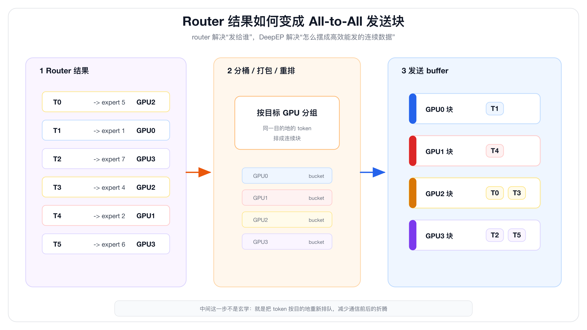
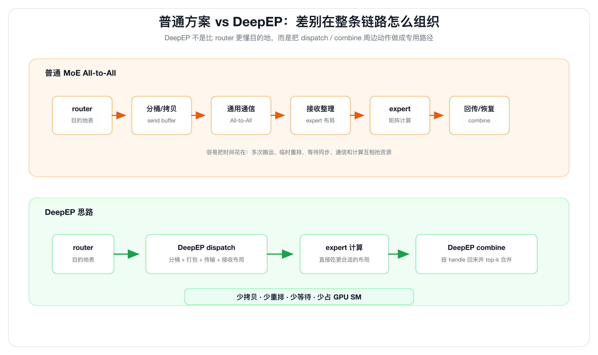
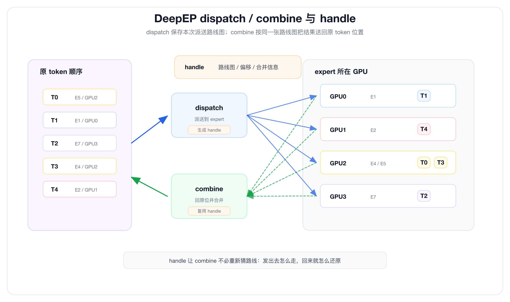
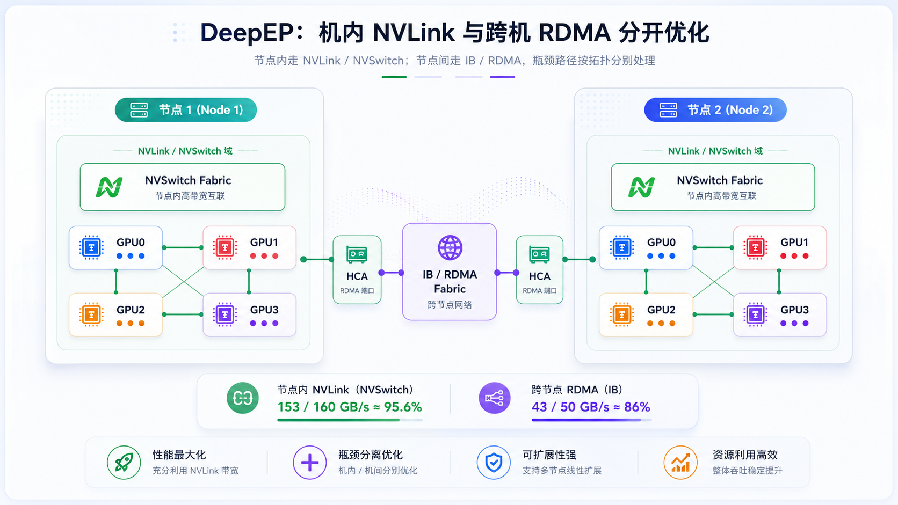

# 一文搞懂 DeepEP：为什么有 All-to-All 还需要 MoE 专用通信库

上一篇我们讲了 All-to-All。

一句话回忆：

> **All-to-All 是 MoE 模型里的专家派送系统。**

MoE 里，token 不是都去同一个 MLP，而是由 router 决定：

```text
这个 token 去 expert 3
那个 token 去 expert 8
另一个 token 去 expert 21
```

如果 expert 分布在不同 GPU 上，token 就要被送到 expert 所在的 GPU。

这就是 All-to-All。

但很多人学到这里会有一个疑问：

```text
既然已经有 All-to-All 了
为什么还需要 DeepEP？
```

这个问题非常关键。

因为 **All-to-All 只是说“大家互相发数据”这个动作**。

DeepEP 解决的是另一个问题：

```text
MoE 里的 token 派送，怎么派得足够快？
怎么少拷贝？
怎么少等待？
怎么少占 GPU 算力？
怎么把 NVLink 和 RDMA 带宽尽量吃满？
```

这篇文章就用一个统一的比喻讲清楚：

> **All-to-All 是仓库之间互相发货。DeepEP 是专门为 MoE 包裹建的高速自动分拣中心。**

---

## 先说结论

DeepEP 不是一个新的 MoE 模型。

它也不是在概念上替代 All-to-All。

DeepEP 是 DeepSeek 开源的一个高性能通信库，当前重点服务 **Expert Parallelism，也就是专家并行**。

官方 README 对它的定位很直接：

```text
DeepEP 提供面向 EP 的高吞吐、低延迟 all-to-all GPU kernels。
这些 kernel 对应 MoE 里的 dispatch 和 combine。
```

也就是说：

```text
All-to-All：通信模式
NCCL：通用 GPU 通信工具
DeepEP：MoE 专用的 dispatch / combine 通信引擎
```

普通 All-to-All 能帮你搬数据。

但 MoE 真正麻烦的地方不是“能不能搬”，而是：

```text
token 要先按 expert 分桶
再按 GPU 打包
还要跨节点传输
收到后要按 expert 分组，方便 expert 做矩阵计算
算完后还要送回原来的 token 位置
如果 top-k 大于 1，还要按 router weight 合并
```

DeepEP 优化的是这整条链路。

一句话：

> **普通 All-to-All 解决“能送”；DeepEP 解决“怎么把 MoE 里的 token 送得接近硬件极限”。**

如果只记三句话，就记这三句：

```text
1. router 知道 token 要去哪个 expert，也就能推出来要去哪个 GPU。
2. 但普通 All-to-All 只搬已经摆好的内存块，不负责 MoE 分拣、打包、回寄和合并。
3. DeepEP 做的是 MoE 专用 dispatch / combine，把分拣、打包、传输、接收布局、回传合并做成高速流水线。
```

本文按这几个问题展开：

```text
1. All-to-All、NCCL、DeepEP 到底是不是一回事？
2. router 已经知道 token 去哪，为什么还不能直接结束？
3. 普通 All-to-All 慢在哪里？
4. DeepEP 到底优化了哪些步骤？
5. 用了 DeepEP 以后，还用不用 All-to-All / NCCL？
6. 官方说的 86%-96% 带宽利用率该怎么理解？
```

---

## 一、先把三个层次分清楚

新手最容易混的，是这三个词：

```text
All-to-All
NCCL All-to-All
DeepEP
```

它们不是同一层东西。

可以先这样分：

| 名字 | 它是什么 | 大白话 |
|---|---|---|
| All-to-All | 一种通信模式 | 大家互相发货 |
| NCCL All-to-All / send-recv | 通用通信接口或通信工具 | 通用货车，负责搬内存 |
| DeepEP dispatch / combine | MoE 专用通信库接口 | 自动分拣中心 + 专用运输流水线 |

所以，用了 DeepEP 以后，不是说：

```text
MoE 不需要 All-to-All 了
```

而是：

```text
MoE 仍然在做 All-to-All 这种通信模式
但不再是你手工分拣后，直接用普通 NCCL All-to-All 硬搬
而是调用 DeepEP 的 dispatch / combine 来做 MoE 专用 All-to-All
```

换句话说：

```text
All-to-All：问题本身，大家要互相发
NCCL：通用搬运能力
DeepEP：把 MoE 这类特殊搬运做快的专用系统
```

这点先分清，后面就不容易绕。

---

## 二、先把比喻统一起来

我们只用一个比喻：**快递分拣中心**。

对应关系如下：

| MoE 里的东西 | 快递系统里的东西 |
|---|---|
| token | 包裹 |
| expert | 专门处理某类包裹的工位 |
| GPU | 一个分拣仓 |
| router | 地址识别系统 |
| dispatch | 把包裹送到对应工位所在的仓 |
| combine | 工位处理完后，把结果送回原仓并合并 |
| All-to-All | 仓库之间互相发货 |
| DeepEP | MoE 专用高速自动分拣中心 |

假设有 4 个 GPU，也就是 4 个分拣仓：

```text
GPU0：expert 0、expert 1
GPU1：expert 2、expert 3
GPU2：expert 4、expert 5
GPU3：expert 6、expert 7
```

现在 GPU0 手里有几个 token：

```text
token A
token B
token C
```

router 看完以后说：

```text
token A -> expert 5
token B -> expert 1
token C -> expert 7
```

因为 expert 5 在 GPU2，expert 1 在 GPU0，expert 7 在 GPU3，所以：

```text
token A 要发到 GPU2
token B 留在 GPU0
token C 要发到 GPU3
```

这就是 MoE 的 dispatch。

expert 算完以后，结果还要回到原来的 token 位置：

```text
GPU2 算完 token A 的 expert 输出
GPU3 算完 token C 的 expert 输出
结果还要送回 GPU0
```

这就是 MoE 的 combine。

所以一个 MoE layer 里，经常有两次核心派送：

```text
dispatch：token -> expert 所在 GPU
combine：expert 输出 -> 原 token 所在 GPU
```

---

## 三、普通 All-to-All 到底做了什么

普通 All-to-All 更像一个通用运输系统。

你要先把包裹分好：

```text
发给 GPU0 的放一堆
发给 GPU1 的放一堆
发给 GPU2 的放一堆
发给 GPU3 的放一堆
```

然后告诉通信库：

```text
这一段内存发给 rank 0
这一段内存发给 rank 1
这一段内存发给 rank 2
这一段内存发给 rank 3
```

通信库负责把这些内存搬过去。

注意，这里不是说“系统没人知道 token 去哪”。

router 和上层 MoE 框架当然知道：

```text
这个 token 要去 expert 5
expert 5 在 GPU2
这个 token 原来来自 GPU0
这个 token 同时还被路由到了另一个 expert
回来以后要按 top-k weight 合并
```

但普通 All-to-All 这个通信接口本身不会读取这些 router 结果。

它只按已经准备好的发送 buffer 搬内存：

```text
这段内存发给 rank 2
那段内存发给 rank 3
```

所以，普通 All-to-All 不是不知道 GPU 之间怎么通信。

它是不理解 MoE 的业务语义，也不负责把 router 结果变成 MoE 最适合的通信布局。

更准确地说：

```text
上层 MoE 框架：知道 expert 分布，决定 token 去哪
普通 All-to-All：只负责按 rank 搬内存
DeepEP：把 MoE dispatch / combine 当成一整条链路来优化
```

这就是最核心的区别。



这张图要表达的重点是：

```text
router 给的是“每个 token 的目的地”
All-to-All 要的是“已经按目标 GPU 摆好的连续发送块”
```

中间这一步，就是 DeepEP 或上层 MoE 框架要做的通信布局转换。

---

## 四、为什么“能 All-to-All”还不够

因为真实 MoE 里的通信不是这么简单：

```text
每张 GPU 给每张 GPU 发一块一样大的数据
大家收完就结束
```

真实情况更像这样：

```text
router 每个 batch 都会重新决定 token 去哪个 expert
每个 expert 收到的 token 数不一样
每张 GPU 发给其他 GPU 的数据量也不一样
一个 token 可能要去 top-k 个 expert
收到后还要按 expert 分组，方便后面的矩阵计算
算完后还要按原 token 位置还原
```

如果用普通方式做，流程可能是：

```text
1. router 算出每个 token 的 top-k expert
2. 框架查每个 expert 在哪张 GPU
3. 框架按目标 GPU 给 token 分桶
4. 把 token 拷贝到发送 buffer
5. 调用 All-to-All 发送
6. 接收端把 token 拿出来
7. 再按 expert 分组，交给 expert 做矩阵计算
8. expert 算完
9. 再做一次反向 All-to-All
10. 回到原 token 位置
11. 按 top-k weight 做 combine
```

注意，这里面真正的“通信搬运”只是其中几步。

剩下很多步骤都是：

```text
分桶
重排
拷贝
记录路由关系
恢复原顺序
加权合并
同步等待
```

这些步骤如果做得不好，就会出现：

```text
网络没有吃满
GPU 在等数据
通信 kernel 抢 SM
中间 buffer 来回拷贝
小 batch decode 延迟很高
```

所以问题不是：

```text
有没有 All-to-All
```

而是：

```text
MoE 这种特殊 All-to-All，能不能做得足够极致
```

DeepEP 就是为这个问题来的。



所以 DeepEP 快，不是因为它比 router 更知道 token 去哪。

它快在：

```text
把“知道去哪”变成“更少拷贝、更少等待、更适合 expert 计算的布局”
```

---

## 五、DeepEP 到底多做了什么

DeepEP 更像一个 MoE 专用自动分拣中心。

它知道这批包裹不是普通包裹，而是 MoE token。

所以它围绕 MoE 的两件事设计：

```text
dispatch
combine
```

### 1. 它知道 dispatch 不是普通发货

dispatch 不是简单把一块大 buffer 发出去。

它要处理：

```text
token hidden states
top-k expert index
top-k weight
每个 expert 收到多少 token
后续 expert 矩阵计算需要的排列方式
```

这里的矩阵计算，工程里经常叫 GEMM。

你可以先简单理解成：

```text
expert 拿到一批 token
用自己的权重矩阵处理这些 token
得到输出结果
```

DeepEP 的接口里，dispatch 会返回一个 `handle`。

你可以把这个 `handle` 理解成：

```text
本次派送的路线图
```

后面的 combine 可以复用这张路线图，把 expert 输出送回原来的位置。

这就像快递系统里有一张完整运单：

```text
包裹从哪里来
送到哪个工位
处理完以后回哪里
怎么合并回原订单
```

普通运输系统只看目的地。

DeepEP 关心整张运单。



这里的 `handle` 可以理解成本次派送的路线图。

dispatch 负责把 token 发出去。

combine 负责按这张路线图把结果送回来，并恢复到原 token 位置。

### 2. 它把训练 / prefill 和 decode 分开优化

MoE 通信在训练和推理里都存在。

但不同阶段的痛点不一样。

训练和 prefill 通常 token 多：

```text
一大批包裹同时进入分拣中心
最重要的是吞吐
```

decode 通常 token 少，而且一步一步生成：

```text
每次来少量包裹
最重要的是延迟
```

所以 DeepEP 官方文档里同时强调：

```text
high-throughput all-to-all kernels
low-latency all-to-all kernels
```

大批量时，要把带宽吃满。

小批量时，要少绕路、少同步、少等待。

### 3. 它利用节点内和节点间的不同链路

AI 集群里，GPU 之间不是一样远的。

节点内 GPU 通常通过 NVLink / NVSwitch 通信。

节点间 GPU 要走 IB / RDMA 网络。

可以简单理解成：

```text
节点内 NVLink：仓库内部高速传送带
节点间 RDMA / IB：城市之间的高速干线
```

这两条路的带宽和延迟完全不同。

如果通信库不充分理解这个拓扑，就可能让数据走得很别扭。

DeepEP 的 V1 官方文档里提到，它针对 NVLink domain 到 RDMA domain 的非对称带宽转发做了优化。

用快递比喻就是：

```text
跨城市走干线
到城市后走本地高速分拣
不要让每个小包裹都乱走
```



这对 MoE 特别重要。

因为 MoE 的 token 派送天然是多对多，很容易把网络打成一团。

### 4. 它尽量减少通信对 GPU SM 的占用

GPU 的 SM 是拿来计算的。

比如：

```text
attention
MLP
expert 矩阵计算
```

如果通信 kernel 占用太多 SM，就会出现一个很尴尬的局面：

```text
网络在搬数据
但 GPU 计算资源也被通信占住了
```

DeepEP 很强调低 SM 占用。

官方 README 里写到，DeepEP V2 在 V3-like legacy training 场景下，SM 使用量可以从 V1 的 24 个降到 4 到 6 个，同时保持相当或更好的性能。

这件事很重要。

因为 MoE 的 expert 矩阵计算本来就需要大量 GPU 算力。

通信越少抢 SM，计算越能顺畅跑。

### 5. 它支持 FP8 dispatch，减少要搬的数据

DeepEP 官方性能测试里使用了：

```text
FP8 dispatch
BF16 combine
```

dispatch 阶段用 FP8，可以降低 token 派送时的数据量。

快递比喻就是：

```text
发出去的时候把包裹压缩
减少干线运输压力
```

combine 阶段使用 BF16，则是在性能和精度之间做平衡。

所以 DeepEP 的优化不是单点优化。

它是围绕 MoE 通信全流程做的：

```text
少搬
少拷贝
少等待
少占 SM
更懂 NVLink / RDMA 拓扑
更贴合 dispatch / combine 语义
```

---

## 六、为什么带宽利用率能到 86%-96%

这个数字可以从 DeepEP V1 官方性能表里看出来。

官方测试环境大概是：

```text
GPU：H800
节点内：NVLink，约 160 GB/s 最大带宽
节点间：CX7 InfiniBand 400 Gb/s RDMA，约 50 GB/s 最大带宽
场景：DeepSeek-V3 / R1 pretraining setting
配置：4096 tokens，hidden 7168，top-8 experts
精度：FP8 dispatch，BF16 combine
```

官方给出的 normal kernels 性能里：

```text
节点内 dispatch：153 GB/s
节点内 combine：158 GB/s
```

如果按 NVLink 约 160 GB/s 来看：

```text
153 / 160 = 95.6%
158 / 160 = 98.8%
```

跨节点 EP16 场景里：

```text
RDMA dispatch：43 GB/s
RDMA combine：43 GB/s
```

如果按 CX7 400Gb/s 约 50 GB/s 来看：

```text
43 / 50 = 86%
```

所以我们常说 DeepEP 把带宽利用率干到 86%-96%，大概就是这个意思：

> **它把 MoE dispatch / combine 里的瓶颈链路，跑到了非常接近硬件上限的位置。**

这里要注意一个细节。

官方 README V2 的性能表里写的是 `Bottleneck Bandwidth`，并且说明某些结果是 `logical bandwidth`，例如 EP 8 x 2 下的 90 GB/s 里面包含 local rank traffic。

所以公众号里不要粗暴写成：

```text
DeepEP 让网卡突破了物理极限
```

更准确的说法是：

> **DeepEP 在 MoE 通信的瓶颈路径上，把有效吞吐压到了接近硬件极限的位置。**

这已经非常夸张了。

因为 MoE 的通信不是干净规整的大块拷贝，而是动态路由、变长分发、跨节点、回传、重排、合并混在一起。

能在这种业务形态下接近链路上限，说明它优化的不只是“发包”，而是整条流水线。

---

## 七、用了 DeepEP，是不是就不用 All-to-All / NCCL 了

这个问题一定要讲清楚。

答案分两层。

### 1. 用了 DeepEP，还是在做 All-to-All

MoE 的本质没有变。

token 还是要从很多 GPU 发到很多 GPU：

```text
GPU0 的一部分 token 去 GPU2
GPU1 的一部分 token 去 GPU3
GPU2 的一部分 token 去 GPU0
GPU3 的一部分 token 去 GPU1
```

这仍然是 All-to-All。

所以不能说：

```text
用了 DeepEP，就没有 All-to-All 了
```

更准确的是：

```text
用了 DeepEP，MoE 里的 All-to-All 由 DeepEP 的 dispatch / combine 来做。
```

### 2. 用了 DeepEP，通常不再直接调用普通 NCCL All-to-All

如果没有 DeepEP，普通 MoE 实现可能是：

```text
router 算出 token 去哪
框架自己分桶、打包
调用 NCCL All-to-All 或 send/recv 把数据搬过去
收到后再整理给 expert
expert 算完后再反向来一遍
```

用了 DeepEP 后，模型侧看到的流程更像：

```text
router 算出 token 去哪
调用 DeepEP dispatch
expert 做矩阵计算
调用 DeepEP combine
```

也就是说：

```text
普通 NCCL All-to-All：通用搬运接口
DeepEP dispatch/combine：MoE 专用搬运接口
```

DeepEP 不是简单替你喊一句：

```text
ncclAllToAll(...)
```

它做的是 MoE 专用流程：

```text
根据 router 结果生成通信布局
按目标 GPU / expert 打包
控制通信 kernel
利用 NVLink / RDMA 路径
减少中间拷贝
降低 SM 占用
保存 handle 方便 combine 回来
```

### 3. 那 DeepEP 和 NCCL 到底是什么关系

NCCL 不是分拣系统。

NCCL 更像底层运输能力。

DeepEP V2 官方 README 提到，它切到了更轻量的 **NCCL Gin backend**，并且可以复用已有 NCCL communicators。

这说明：

```text
DeepEP 上层：MoE 专用 dispatch / combine 逻辑
NCCL Gin 底层：通信后端能力
```

所以最准确的说法是：

> **用了 DeepEP，不是“不用 All-to-All”，而是“不用普通 NCCL All-to-All 直接硬做 MoE”；All-to-All 这个通信模式还在，但由 DeepEP 的 MoE 专用 dispatch / combine 来实现。**

用快递比喻再说一次：

```text
All-to-All：仓库之间互相发货这个模式
NCCL：通用货车和道路能力
DeepEP：自动分拣中心 + 专用装车系统 + 回寄系统
```

DeepEP 可以使用底层运输能力。

但分拣、装车、回寄、合并这套 MoE 业务，是 DeepEP 接管并优化的。

---

## 八、DeepEP V2 又改进了什么

DeepEP 官方 README 现在重点介绍的是 V2。

V2 有几个关键变化。

### 1. 后端从 NVSHMEM 转向 NCCL Gin

V1 是 NVSHMEM-based legacy 文档。

V2 官方 README 提到，DeepEP 切到了更轻量的 **NCCL Gin backend**，并且可以复用已有 NCCL communicators。

这意味着它更容易和现有分布式训练系统结合。

### 2. 用 ElasticBuffer 统一接口

V2 把高吞吐和低延迟 EP API 统一到了 `ElasticBuffer` 接口。

对用户来说，可以理解成：

```text
过去不同场景可能需要不同分拣通道
现在统一成一个更弹性的分拣系统
```

训练、prefill、decode 仍然有不同优化路径，但接口更统一。

### 3. 自动计算 SM 和 QP 数量

官方 README 里提到，V2 支持 analytical SM & QP count calculation。

简单说就是：

```text
不用完全靠手工调参或反复 auto-tuning
系统可以根据 EP 配置推导更合适的通信资源
```

这对于大规模集群很重要。

因为 EP 规模一大，靠人工一点点试参数，成本会很高。

### 4. 支持更大的 EP 域

V2 官方 README 提到支持更大的 scale-up 和 scale-out domain，最大写到 EP2048。

这意味着它不是只为小规模 MoE 通信设计，而是面向更大专家并行规模。

---

## 九、再回答那个核心问题

现在我们回到最开始的问题：

```text
已经有 All-to-All 了
为什么还需要 DeepEP？
```

答案是：

```text
因为 All-to-All 只是运输动作
DeepEP 优化的是 MoE 专用运输业务
```

普通 All-to-All 看到的是：

```text
rank 0 给 rank 2 发一段内存
rank 1 给 rank 3 发一段内存
```

DeepEP 看到的是：

```text
这些 token 被 router 路由到了这些 expert
这些 expert 分布在这些 GPU 上
dispatch 要这样打包
expert 矩阵计算希望收到这样的布局
combine 要按原路径回去
top-k 的结果还要合并
通信最好少占 SM
节点内走 NVLink，节点间走 RDMA
```

所以 DeepEP 不是为了证明 All-to-All 不行。

它是承认 All-to-All 是 MoE 的核心通信，然后把这个通信做成专用高速流水线。

可以这样记：

```text
All-to-All：仓库之间互相发货
NCCL：通用运输公司
DeepEP：MoE 专用自动分拣中心
```

没有 DeepEP，也能做 MoE All-to-All。

但可能会有更多：

```text
中间拷贝
重排开销
同步等待
SM 占用
链路利用不足
decode 延迟
```

有 DeepEP，是为了把 MoE 的 dispatch / combine 做到更接近硬件极限。

---

## 十、从 IDC 网络角度看 DeepEP

如果你是从 AI 集群 IDC 网络角度看 DeepEP，重点不是记 API。

重点是看它暴露出的趋势：

> **MoE 会把网络从“辅助系统”推到“核心性能路径”。**

Dense 模型里，大家经常关注 AllReduce。

到了 MoE，All-to-All 的压力变得非常突出。

因为 MoE 的流量是：

```text
多对多
动态
变长
跨节点
容易产生热点
和 GPU 计算强耦合
```

这会直接考验 IDC 网络：

```text
NVLink / NVSwitch 机内拓扑
IB / RoCE 跨节点带宽
多 rail 设计
ECMP / Adaptive Routing
PFC / ECN / DCQCN
交换机 buffer
拥塞隔离
业务流量隔离
```

DeepEP 官方文档里也提到，它在 InfiniBand 网络上充分测试，同时理论上兼容 RoCE。

V1 文档还提到可以通过 InfiniBand Virtual Lane 做 traffic isolation，并建议在重负载时启用 adaptive routing，在轻负载时用 static routing。

这些都说明一件事：

> **MoE 通信优化不是单纯 CUDA kernel 问题，也不是单纯网卡问题，而是 GPU、通信库、拓扑、路由、拥塞控制共同决定的系统问题。**

---

## 十一、最后总结

最后把整篇文章压成一张新手复习卡。

### 1. router 负责决定 token 去哪

```text
router：这个 token 去 expert 5
expert 5 在 GPU2
所以这个 token 要发到 GPU2
```

这一步解决的是：

```text
发给谁
```

### 2. All-to-All 负责表达通信模式

```text
很多 GPU 之间互相发不同数据
这叫 All-to-All
```

这一步解决的是：

```text
大家互相发
```

### 3. NCCL 是通用搬运能力

```text
NCCL 可以搬 GPU 内存
但普通 NCCL All-to-All 不负责 MoE 分拣、回寄、合并
```

这一步解决的是：

```text
怎么把已经摆好的 buffer 搬过去
```

### 4. DeepEP 是 MoE 专用自动分拣系统

```text
DeepEP dispatch：把 router 结果变成高效发送布局，并把 token 发到 expert 所在 GPU
DeepEP combine：把 expert 输出按原路送回来，并恢复原 token 位置、做合并
```

用一个比喻收尾：

> **All-to-All 是“仓库之间互相发货”这个动作；NCCL 是通用货车；DeepEP 是专门为 MoE 包裹设计的自动化分拣、运输、回寄、合并系统。**

所以最终关系是：

```text
不是 DeepEP 替代了 All-to-All
而是 DeepEP 在做 MoE 专用的 All-to-All
```

也不是 DeepEP 一定完全不用 NCCL。

```text
DeepEP V2 底层用了 NCCL Gin backend
但模型侧调用的是 DeepEP dispatch / combine
不是自己直接拿普通 NCCL All-to-All 硬拼 MoE 流程
```

一句话真正收尾：

> **router 解决“去哪”，All-to-All 描述“大家互相发”，NCCL 提供“通用搬运”，DeepEP 解决“MoE 怎么发得快”。**

---

## 参考资料

- DeepEP 官方 GitHub README：[https://github.com/deepseek-ai/DeepEP](https://github.com/deepseek-ai/DeepEP)
- DeepEP V1 Legacy 官方文档：[https://github.com/deepseek-ai/DeepEP/blob/main/docs/legacy.md](https://github.com/deepseek-ai/DeepEP/blob/main/docs/legacy.md)
- DeepSeek-V3 Technical Report：[https://arxiv.org/html/2412.19437v1](https://arxiv.org/html/2412.19437v1)
