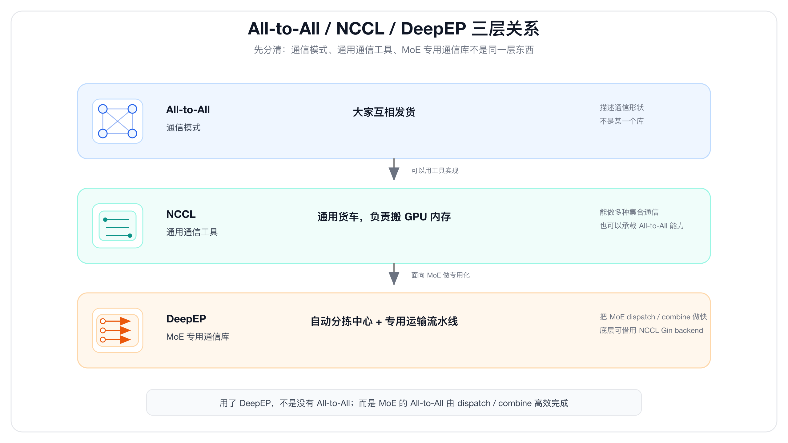
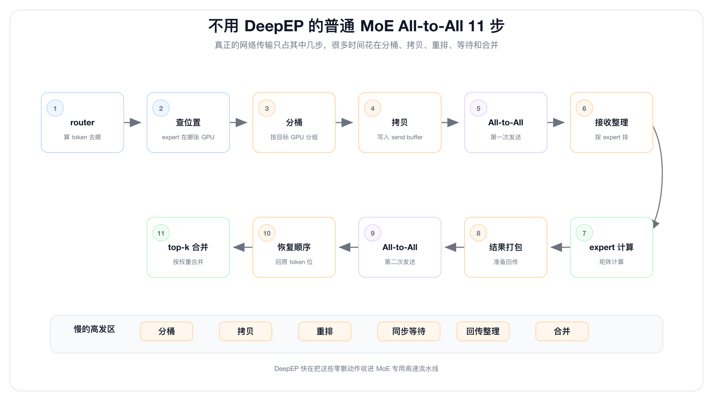
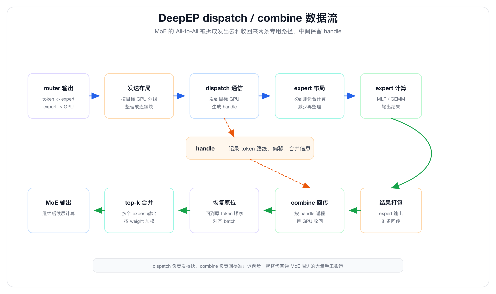

# 一文搞懂 DeepEP：少字多图版

上一篇我们讲了 All-to-All。

一句话回忆：

> **All-to-All 是 MoE 里的专家派送动作。**

到了 DeepEP，很多人会问：

```text
router 已经知道 token 要去哪个 expert
expert 又知道在哪张 GPU
那直接 All-to-All 发过去不就行了吗？
为什么还要 DeepEP？
```

答案很简单：

> **直接 All-to-All 能跑，DeepEP 是为了跑得更快。**

这篇少讲术语，多看图。

---

## 一、先分清三层关系

先记住这张表：

| 名字 | 它是什么 | 大白话 |
|---|---|---|
| All-to-All | 通信模式 | 大家互相发货 |
| NCCL | 通用通信工具 | 通用货车，负责搬内存 |
| DeepEP | MoE 专用通信库 | 自动分拣中心 + 专用运输流水线 |

所以：

```text
All-to-All 不是某一个库
它是一种通信模式
```

NCCL 可以做通用 All-to-All。

DeepEP 做的是 **MoE 专用 All-to-All**。

更准确地说：

```text
用了 DeepEP，不是没有 All-to-All 了
而是 MoE 里的 All-to-All 由 DeepEP dispatch / combine 来做
```

DeepEP V2 底层用了 NCCL Gin backend。

所以也不能简单说：

```text
DeepEP 完全不用 NCCL
```

更准确的说法是：

> **DeepEP 底层可以借用 NCCL 的通信后端能力，但它不是简单包一层普通 ncclAllToAll。**



---

## 二、router 知道目的地，但 All-to-All 要的是发送块

MoE 里，router 会算出：

```text
T0 -> expert 5 -> GPU2
T1 -> expert 1 -> GPU0
T2 -> expert 7 -> GPU3
T3 -> expert 4 -> GPU2
```

所以系统当然知道：

```text
每个 token 要发给哪张 GPU
```

但普通 All-to-All 通信接口不会自己读 router 结果。

它更喜欢你提前准备好这种格式：

```text
发给 GPU0 的连续数据
发给 GPU1 的连续数据
发给 GPU2 的连续数据
发给 GPU3 的连续数据
```

也就是说，中间要有一步：

```text
router 结果
  -> 按目标 GPU 分组
  -> 摆成发送 buffer
```

这一步就是所谓“分桶、打包、重排”。

不是玄学，就是把 token 按目的地重新排队。


一句话：

> **router 解决“发给谁”；DeepEP 解决“怎么把这些 token 摆成高效能发的样子”。**

---

## 三、普通方案慢在哪里

如果不用 DeepEP，一个普通 MoE All-to-All 可能是这样：

```text
1. router 算 token 去哪个 expert
2. 框架查 expert 在哪张 GPU
3. 框架按目标 GPU 分桶
4. 拷贝到 send buffer
5. 调用 NCCL All-to-All / send-recv
6. 接收端再按 expert 整理
7. expert 做矩阵计算
8. 结果再打包
9. 再 All-to-All 发回来
10. 恢复原 token 顺序
11. 按 top-k weight 合并
```

这里真正的网络传输只是其中几步。

很多时间会花在：

```text
分桶
拷贝
重排
等待
回传
合并
```

DeepEP 快，不是因为它比 router 更知道 token 去哪。

它快在把这些步骤做成了 MoE 专用高速流水线。




可以这样理解：

```text
普通方案：人工分拣 + 通用货车
DeepEP：自动分拣 + 专用装车 + 专用回寄
```

---

## 四、DeepEP 到底做了什么

DeepEP 面向 MoE，核心就是两个动作：

```text
dispatch
combine
```

### dispatch：发出去

```text
把 token 发到 expert 所在 GPU
并尽量整理成 expert 好计算的布局
```

### combine：收回来

```text
expert 算完以后
把结果送回原 token 位置
如果一个 token 去了多个 expert，还要按权重合并
```

DeepEP dispatch 会保存一个 `handle`。

你可以把它理解成：

```text
本次派送路线图
```

发出去时怎么走，回来时就可以按这张路线图恢复。




所以 DeepEP 不是简单：

```text
DeepEP dispatch = 调一次 ncclAllToAll
```

它更像：

```text
router 结果
  -> MoE 专用发送布局
  -> dispatch 通信
  -> expert 计算布局
  -> combine 回传
  -> 原 token 顺序和 top-k 合并
```

---

## 五、为什么带宽利用率能这么高

DeepEP 快在几件事叠加。

第一，**少拷贝、少重排**。

```text
不要把 token 来回倒腾太多次
```

第二，**收到后更适合 expert 计算**。

```text
不是只把数据送到 GPU
还要尽量送成 expert 好处理的样子
```

第三，**更懂 NVLink 和 RDMA**。

节点内和节点间不是一条路：

```text
节点内：NVLink / NVSwitch
节点间：IB / RDMA
```

DeepEP 会围绕这种拓扑做优化。


第四，**少占 GPU SM**。

GPU 的 SM 要留给 attention、MLP、expert 矩阵计算。

通信 kernel 占太多 SM，就会抢计算资源。

DeepEP V2 官方 README 提到，在 V3-like legacy training 场景下，SM 使用量可以从 V1 的 24 个降到 4 到 6 个，同时保持相当或更好的性能。

第五，**支持 FP8 dispatch**。

dispatch 阶段用 FP8，可以减少要传的数据量。

快递比喻就是：

```text
发出去前先压缩包裹
干线压力更小
```

官方 V1 文档里，在 H800 + CX7 400Gb/s RDMA 场景下给过一组性能：

```text
节点内 NVLink：153 / 160 GB/s ≈ 95.6%
跨节点 RDMA：43 / 50 GB/s = 86%
```

所以常说 DeepEP 把带宽利用率做到 86%-96% 左右。

但要注意：

```text
这不是突破物理极限
而是在 MoE dispatch / combine 的瓶颈路径上
把有效吞吐压到接近硬件上限
```

---

## 最后总结

最后只记这一组关系：

```text
router：决定 token 去哪
All-to-All：描述大家互相发这种通信模式
NCCL：通用 GPU 通信能力，像通用货车
DeepEP：MoE 专用自动分拣系统，负责 dispatch / combine 做快
```

所以，DeepEP 不是简单包一层 NCCL All-to-All。

更准确地说：

> **DeepEP 是在底层通信能力之上，为 MoE 的 token 派送专门做了一套自动分拣、打包、运输、回寄、合并系统。**

一句话真正收尾：

> **All-to-All 解决“要互相发”；DeepEP 解决“MoE 怎么发得快”。**

---

## 参考资料

- DeepEP 官方 GitHub README：[https://github.com/deepseek-ai/DeepEP](https://github.com/deepseek-ai/DeepEP)
- DeepEP V1 Legacy 官方文档：[https://github.com/deepseek-ai/DeepEP/blob/main/docs/legacy.md](https://github.com/deepseek-ai/DeepEP/blob/main/docs/legacy.md)
- DeepSeek-V3 Technical Report：[https://arxiv.org/html/2412.19437v1](https://arxiv.org/html/2412.19437v1)
