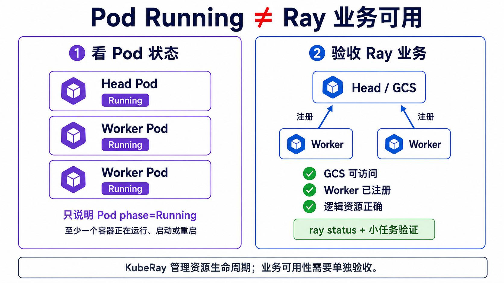
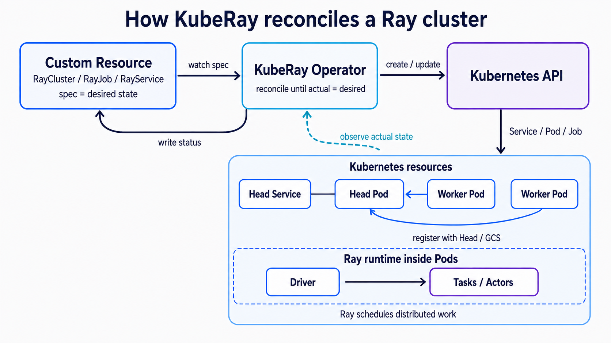
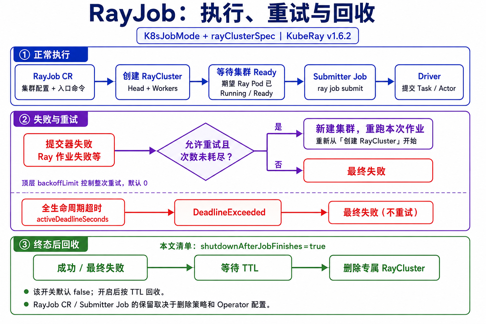

# Kubernetes 已经能跑 Pod，为什么还需要 KubeRay（Ray Operator）？

Kubernetes 能让 Head 和 Worker Pod 持续运行，却不知道 Worker 是否已经注册到 Ray、集群何时能提交作业、任务结束后要回收什么。

KubeRay Operator（下文简称 Operator）用控制回路管理 Ray 集群、作业和服务的生命周期。Kubernetes 管 Pod，Ray runtime 调度 Task、Actor 和 Placement Group，Operator 让两边状态保持一致。



*左侧只是 Pod phase=`Running`；右侧是业务可用性验收，不等同于 `RayCluster.status.state=Ready`。GCS 指 Global Control Service。*

## 1. 三层职责和对象选择

| 层 | 负责什么 | 不负责什么 |
| --- | --- | --- |
| Kubernetes | 调度 Pod、重启容器，由控制器补建 Pod；分配 CPU、内存、GPU | 不理解 Ray 集群成员和 Task |
| KubeRay Operator | RayCluster、RayJob、RayService 的生命周期 | 不逐个调度 Ray Task |
| Ray runtime | Task、Actor、Placement Group 和对象存储 | 不把 Pod 放到 Kubernetes Node |

| 名称 | 含义 |
| --- | --- |
| Kubernetes Node | 运行 Pod 的物理机或虚拟机 |
| Pod | Kubernetes 的容器运行单元 |
| Ray Node | 运行 raylet 并注册到 Ray 集群的逻辑节点，在 KubeRay 中通常对应一个 Pod |
| Head / Worker | Ray 的控制节点和计算节点，通常各自运行在 Pod 中 |

| 需求 | 首选对象 | 原因 |
| --- | --- | --- |
| 开发、调试、共享计算池 | `RayCluster` | 集群生命周期独立于一次程序 |
| 训练、评估、批推理、ETL | `RayJob` | 自动建集群、提交作业、追踪终态和清理 |
| Ray Serve 在线服务 | `RayService` | 稳定入口、Serve 健康检查和升级编排 |
| 定时 Ray 作业 | `RayCronJob` | Alpha 功能，需要显式开启 feature gate |

## 2. Pod 跑起来后，Ray 可能仍没准备好

排障时要分开看五层状态：

| 层 | 已就绪的含义 | 常见误判 |
| --- | --- | --- |
| Pod phase=`Running` | Pod 已绑定 Node，容器已创建，至少一个容器处于运行、启动或重启中 | 当成 Pod 已 Ready |
| Pod `Ready=True` | 所有容器 Ready，且所有 readiness gate 满足；可作为 Service 的正常流量后端 | 当成 Ray 集群可提交作业 |
| KubeRay Ready | 期望数量的 Ray Pod 已 Running/Ready | 当成 GCS、Worker 注册和逻辑资源都正确 |
| Ray 业务可用 | GCS 可用，Worker 已注册，逻辑资源正确 | 当成业务程序已成功 |
| Job / Serve | Driver 终态成功，或 Serve replica 健康 | 当成资源会自动回收 |

KubeRay v1.6.2 的 `RayCluster.status.state=Ready` 不是持续运行的健康检查。Worker 注册数和逻辑资源仍要用 `ray status` 验证。普通 Deployment 或 StatefulSet 也不会维护 Worker 向 Head/GCS 注册的关系。

## 3. KubeRay 的控制回路



*Operator 调谐 CR 与 Kubernetes 资源；Worker 向 Head/GCS 注册；Task 和 Actor 的调度留在 Ray runtime 内。*

Operator 读取 CR（Custom Resource，自定义资源）的 `spec`，通过 Kubernetes API 创建或更新 Service、Pod 和 Job，再把实际状态写回 `status`。手工删除受控 Worker Pod 后，控制回路会补建。

## 4. RayJob 与 RayService 的关键语义

### RayJob

`RayJob` 默认使用 `K8sJobMode`。Operator 先根据 `rayClusterSpec` 创建专属 RayCluster；集群 Ready 后再创建 submitter Job，由它调用 Ray Jobs API 启动 Driver。



几个容易混淆的名字：

| 名称 | 作用 |
| --- | --- |
| RayJob CR | KubeRay 的声明式对象 |
| submitter Job | Kubernetes Job，向 Ray Jobs API 提交入口命令 |
| Ray job | Ray Jobs API 中一次应用运行及其状态 |
| Driver | 执行入口程序，并向集群提交 Task 和 Actor 的进程 |

顶层 `backoffLimit` 控制整次 RayJob 的重试，默认值为 0；提交器失败、Ray 作业失败等都可能进入这一流程。`submitterConfig.backoffLimit` 只控制 submitter Job。`activeDeadlineSeconds` 覆盖建集群、提交和运行阶段，超时产生的 `DeadlineExceeded` 不重试。Task 和 Actor 的失败仍由 Ray 的 `max_retries`、`max_restarts` 处理。

`shutdownAfterJobFinishes` 默认是 `false`。本文清单将它设为 `true`，配合 `ttlSecondsAfterFinished` 在终态后回收专属 RayCluster。自定义删除策略可改变回收行为；RayJob CR 和 submitter Job 是否保留也取决于删除策略和 Operator 配置。

Head Pod 消失后，不要依赖原地重建恢复当前作业；若 RayJob 触发失败重试，Operator 会新建集群。入口程序、外部写入和 Checkpoint 都应支持重复执行。

### RayService

RayService 同时管理 RayCluster 和 Serve 应用。修改 `spec.rayClusterConfig` 通常会触发默认 `NewCluster` 升级：创建待切换集群，等新集群和 Serve 应用健康后，再切换稳定 Service。

例外是 Autoscaler 管理的 `replicas`、`minReplicas`、`maxReplicas` 和 `scaleStrategy.workersToDelete`：单独修改这些字段既不触发升级，也不会从 RayService 同步到已有 RayCluster。

这类升级通常需要一段双份容量。GPU 池没有余量时，升级会卡在新集群无法就绪，而不会凭空做到零停机。`serveConfigV2` 的应用配置更新通常可以在现有集群内完成。

## 5. GPU 和扩缩容

Ray 要把 Task 调度到 GPU，必须同时满足两层资源契约：

```yaml
# Worker Pod：让 Kubernetes 分配物理 GPU
resources:
  requests:
    nvidia.com/gpu: "1"
  limits:
    nvidia.com/gpu: "1"
```

```python
# Task：让 Ray 预留逻辑 GPU
@ray.remote(num_gpus=1)
def infer_one_shard(shard):
    ...
```

Kubernetes 根据 `nvidia.com/gpu` 把 Pod 放到有设备的 Node；KubeRay 根据主 Ray 容器的 GPU limit 推导 Ray 的逻辑容量；Ray 根据 `num_gpus` 放置 Task 并设置 `CUDA_VISIBLE_DEVICES`。

| 配置 | 结果 |
| --- | --- |
| Pod 有 1 张 GPU，Task 要 1 张 GPU | 正常的整卡契约 |
| Pod 有 GPU，Task 未声明 `num_gpus` | Ray 可能并发放多个 GPU 程序到同一 Worker |
| Pod 无 GPU，Task 要 1 张 GPU | Ray 看到的逻辑 GPU 为 0，Task 会等待 |
| Pod limit 为 1，却写 `num-gpus: "2"` | Ray 逻辑超卖，物理隔离和显存不会随之增加 |

本文的双 GPU 清单用于验证跨节点放置，Worker 数固定为 2，没有启用自动扩缩容。生产环境启用扩缩容后，链路分三层：

1. 应用增加 Task、Actor 或 Serve replica，产生逻辑资源需求。
2. RayJob 通过 `spec.rayClusterSpec.enableInTreeAutoscaling: true` 启用 Ray Autoscaler，由它在 Worker Group 的 `minReplicas` 和 `maxReplicas` 之间调整 Worker 数。
3. Kubernetes 或云节点 Autoscaler 为 Pending Worker Pod 提供新的 Node。

一个 Task 请求 2 张 GPU，而任一 Worker Pod 只有 1 张 GPU 时，即使集群共有两张卡，它也无法被拆开运行。

## 6. 故障、队列和安全边界

资源被重建，不代表状态会恢复。

| 故障 | 平台通常会做什么 | 应用仍要负责什么 |
| --- | --- | --- |
| Operator Pod 失败 | Deployment 重建；Operator 恢复后继续调谐 | 容忍控制面短暂不可用 |
| Worker Pod / Node 失败 | Kubernetes 和 KubeRay 视容量补建 Worker | Task retry、Actor restart、Checkpoint、幂等 |
| Head 失败 | 容器可能重启；RayJob 可通过重试重建专属集群 | GCS 状态、Driver 内存、外部副作用 |
| Task / Actor 失败 | Ray 按配置重试或重启 | 事务、去重和业务补偿 |

基于 Redis 的 GCS 容错可保留 GCS 状态。官方建议在 RayService 上启用；其他工作负载不推荐，且不保证兼容性。

NVIDIA GPU Operator 负责驱动和 Device Plugin；需要配额与队列时用 Kueue，需要 Gang（成组调度）和 Pod 级批调度时用 Volcano。没有这些需求就不必引入。

生产环境还要保护 Ray Dashboard 和 Jobs API。KubeRay v1.6+ 配合 Ray 2.52+，可通过 `authOptions` 启用 token authentication；token 不加密流量，仍应配合 TLS、受限 Ingress、NetworkPolicy 或可信网络。不要把 Dashboard 直接暴露到公网。

## 7. 版本和实验

本文示例使用 KubeRay v1.6.2、Ray 2.57.0 和 `ray.io/v1`。仓库中的 CPU RayJob 已在两节点环境验证；双 GPU 清单仍待实际执行。

按 [官方安装与升级指南](https://docs.ray.io/en/latest/cluster/kubernetes/user-guides/upgrade-guide.html) 安装 Operator。旧版本升级时先更新 CRD；Helm 不会自动更新已经安装的 `crds/`。

CPU 烟测见 [`examples/kuberay/rayjob-cpu-smoke.yaml`](./examples/kuberay/rayjob-cpu-smoke.yaml)。

双 GPU 实验的完整清单见 [`examples/kuberay/rayjob-two-gpu.yaml`](./examples/kuberay/rayjob-two-gpu.yaml)。它固定两个各占一张 GPU 的 Worker，用 Pod 反亲和强制跨 Node，并让两个 `num_gpus=1` Task 并发运行。

```bash
kubectl create namespace kuberay-lab --dry-run=client -o yaml | kubectl apply -f -
kubectl apply --dry-run=server -f examples/kuberay/rayjob-two-gpu.yaml
kubectl apply -f examples/kuberay/rayjob-two-gpu.yaml
```

本次验证环境访问 Docker Hub 不稳定，清单使用 DaoCloud 代理。运行前先确认代理已同步 GPU tag；完成实测后应固定镜像 digest。换到其他集群时，还要确认 NVIDIA 驱动、Device Plugin、CUDA 与镜像兼容，以及 GPU 节点的 taint 是否有对应 toleration。

成功时，两个任务会打印不同的 `kubernetes_node`，最后输出 `SUCCESS: two Ray GPU tasks ran on two different Kubernetes nodes`。

这份清单只检查 GPU 调度和跨节点放置，不运行 CUDA 算子或 NCCL 性能测试。检查 CUDA 可用性时，应改用目标框架镜像，并在 Task 中运行真实 GPU 算子。

## 8. 卡住时从外到内排查

| 层 | 先看什么 |
| --- | --- |
| CR / Operator | `kubectl describe rayjob NAME -n NS`；`kubectl logs -n kuberay-system deployment/kuberay-operator --tail=200` |
| Pod 调度 | `kubectl describe pod POD -n NS`；`kubectl get events -n NS --sort-by=.lastTimestamp` |
| Ray 注册 | Head 和 Worker 的容器日志；`kubectl exec -n NS HEAD_POD -c ray-head -- ray status` |
| Task Pending | `ray status` 的 Demands、单 Pod GPU 容量、Placement Group、`maxReplicas` |
| RayJob 失败 | submitter Job 日志、RayJob `status`、Ray Jobs API 日志 |

先判断问题属于哪一层，再看对应对象。只盯一个 Pending Pod 往往会忽略 Ray 的资源需求；若使用 Kueue，还要检查其准入状态。

## 结论

需要把 Ray 集群、作业或 Serve 服务变成可声明、可恢复、可回收的 Kubernetes 对象时，就该使用 KubeRay。

## 参考资料

- [KubeRay v1.6.2 Release](https://github.com/ray-project/kuberay/releases/tag/v1.6.2)
- [KubeRay v1.6.0 Release 和 RayJob 行为变更](https://github.com/ray-project/kuberay/releases/tag/v1.6.0)
- [KubeRay v1.6.2 样例与 Helm Chart](https://github.com/ray-project/kuberay/tree/v1.6.2)
- [RayService 升级与例外字段（Ray 2.57.0）](https://github.com/ray-project/ray/blob/ray-2.57.0/doc/source/cluster/kubernetes/user-guides/rayservice.md)
- [Kubernetes Pod 与容器的生命周期](https://kubernetes.io/docs/concepts/workloads/pods/pod-lifecycle/)
- [KubeRay 安装与升级](https://docs.ray.io/en/latest/cluster/kubernetes/user-guides/upgrade-guide.html)
- [KubeRay token authentication](https://docs.ray.io/en/latest/cluster/kubernetes/user-guides/kuberay-auth.html)
- [GCS fault tolerance](https://docs.ray.io/en/latest/cluster/kubernetes/user-guides/kuberay-gcs-ft.html)
