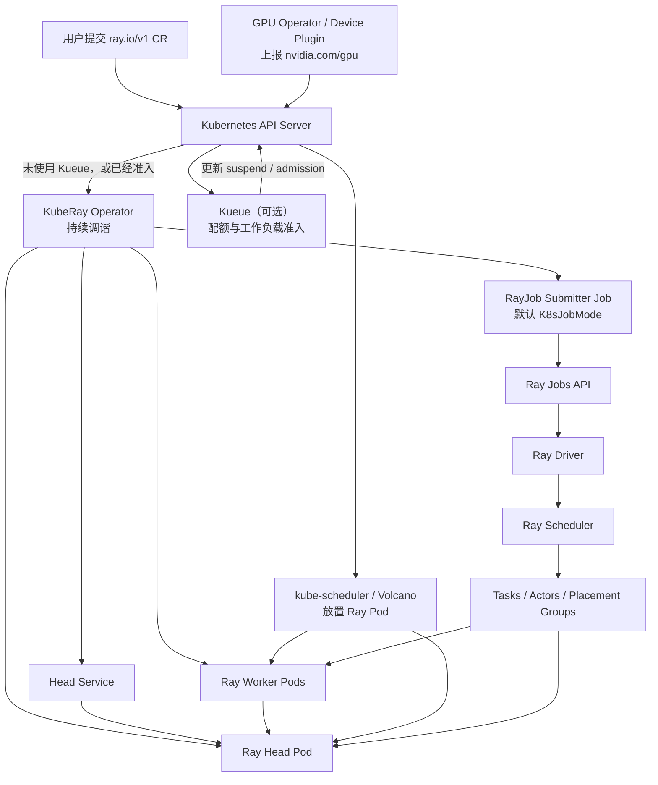
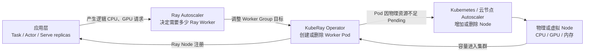

# 一文搞懂 KubeRay：Kubernetes 已经能跑 Pod，为什么还需要 Ray Operator？

假设你要在 Kubernetes 上运行一个 Ray 程序：一个 Head、两个 GPU Worker，并行处理两份推理任务。三个 Pod 不难写，难的是让 Worker 注册、判断集群就绪、提交程序，并处理扩缩容、升级和故障恢复。

Kubernetes 的原生控制器能维护 Pod、Service 和 Job，却不理解 Ray 集群、作业与 Serve 服务。KubeRay 把这些生命周期规则写进 Operator，免得控制逻辑散落在脚本、流水线和人工操作中。

> 版本说明：本文以 **KubeRay v1.6.2、Ray 2.57.0 和 `ray.io/v1` API** 为基线。KubeRay v1.6.2 的端到端测试清单主要固定 Ray 2.52.0，因此文中的版本组合仍需在自己的 Kubernetes、GPU 驱动和镜像环境中验证。

## 1. 先分清三层职责

[KubeRay](https://github.com/ray-project/kuberay) 是在 Kubernetes 上部署和管理 Ray 的官方推荐 Operator。Kubernetes 负责创建、放置和重启 Pod；KubeRay 维护 Ray 集群、作业和服务的生命周期；Ray runtime 在已经就绪的 Ray Node 上调度 Task、Actor 和 Placement Group。Volcano、Kueue 等批量资源组件属于可选的下一层能力，第 10 节再展开。

## 2. 为什么几个普通 Pod 还不等于一个 Ray 集群

### 2.1 Ray 有自己的控制面和成员关系

一个典型 Ray 集群至少包含：

- 一个 Head Pod，运行 GCS、Ray Dashboard 等控制面进程；
- 零个或多个 Worker Pod，向 Head 注册并提供 CPU、GPU 和自定义逻辑资源；
- 一个用于发现 Head 的 Kubernetes Service；
- 可选的 Ray Autoscaler；
- 真正运行用户代码的 Driver、Task 和 Actor。

Worker 不是“只要容器 Running 就能工作”。它必须知道 Head 地址，等待 GCS 可用，启动 `ray start`，再成功注册进 Ray 集群。

这些成员关系和就绪条件，普通 Deployment 或 StatefulSet 不会自动理解。

### 2.2 两套状态机需要衔接

Kubernetes 看到的状态可能是：

```text
head Pod: Running
worker-0 Pod: Running
worker-1 Pod: Running
```

但 Ray 看到的状态还可能是：

```text
Head 的 GCS 尚未响应
一个 Worker 还没注册
Ray 逻辑资源只有 1 GPU
Job 仍是 PENDING
Serve application 还没有健康副本
```

Pod `Running` 只表示容器进程已经启动，不等于 Ray 集群 Ready，更不等于作业成功或在线服务可接流量。

KubeRay 用不同 CRD 表达这些生命周期差异。

## 3. KubeRay v1.6.2 的四个 CRD

### 3.1 RayCluster：直接描述一套 Ray 集群

`RayCluster` 适合长期集群、交互式开发、共享计算池，或者需要由其他系统自行提交 Ray Job 的场景。

它描述 Ray 版本、Head 和 Worker Group 模板、扩缩容边界，以及资源、存储、调度和网络配置。KubeRay 据此维护 Head、Service 和 Worker Pod；删除 RayCluster 时，受控资源通常会按 OwnerReference 级联删除。

### 3.2 RayJob：把“一次程序”与“一套集群”绑在一起

`RayJob` 面向有明确起止的批处理任务，可以创建专属 RayCluster、提交入口程序、追踪终态并清理资源。默认 `K8sJobMode` 中，Kubernetes Job 只是提交器，用户程序仍由 Ray Jobs API 接收并在 Ray 集群内执行。

它也能用 `clusterSelector` 复用已有 RayCluster，但会失去专属集群的隔离和清理语义；Volcano/Kueue 的限制见第 10 节。

### 3.3 RayService：管理 Ray Serve 的长期在线服务

`RayService` 组合 RayCluster 配置、`serveConfigV2`、稳定的 Kubernetes Service 和升级策略，适合模型服务等长期 Ray Serve 工作负载。Operator 会同时检查集群与 Serve 应用健康，再决定何时切换流量。

### 3.4 RayCronJob：按时间表创建 RayJob

KubeRay v1.6.2 Helm Chart 的 CRD bundle 包含 `ray.io/v1` 的 `RayCronJob`，但该能力仍是 Alpha，Operator Chart 中的 feature gate 默认关闭。生产使用前需要显式评估并启用，不能只凭 CRD 已存在就认为控制器会处理它。

四种对象可以这样选：

| 需求 | 首选对象 | 关键理由 |
| --- | --- | --- |
| 开发、调试、共享 Ray 计算池 | `RayCluster` | 集群生命周期独立于单次程序 |
| 训练、评估、批推理、ETL | `RayJob` | 自动建群、提交、追踪终态和清理 |
| Ray Serve 在线推理 | `RayService` | 稳定入口、Serve 健康与升级编排 |
| Alpha 阶段的定时 Ray 作业 | `RayCronJob` | 由时间表生成 RayJob |

## 4. KubeRay 到底在集群里做了什么

下面这张图把 Kubernetes、KubeRay、Ray 与可选批调度器放在同一条链路上：



*图 1：Kueue 可先控制 Ray CR 的配额准入，KubeRay 再维护工作负载；kube-scheduler 或 Volcano 放置 Pod，Ray 调度进程内的分布式工作。它们是相邻层，不是彼此的替代品。*

### 4.1 调谐（Reconcile）是“持续对账”，不是一次性生成 YAML

创建 RayCluster 后，KubeRay 不只是运行一次模板：

1. 读取 CR 的期望状态；
2. 检查 Head Service、Head Pod 和 Worker Pod；
3. 创建缺失对象，更新允许变更的对象，删除多余 Worker；
4. 把观察结果写回 CR 的 `status`；
5. 在对象或定时重排队触发后继续对账。

因此，手工删除一个由 RayCluster 管理的 Worker Pod，通常只会让 Operator 再创建一个 Worker，以恢复期望副本数。想缩容应该修改 RayCluster 或让 Autoscaler 调整目标，而不是把受控 Pod 当成独立对象管理。

### 4.2 Operator 不在每个 Task 的调度热路径上

集群就绪后，Task 和 Actor 的提交、依赖解析与节点选择由 Ray runtime 完成。KubeRay 不会为每个 Python 函数创建一个 Kubernetes Pod，也不会逐个审批 Task。

这也是 Ray 能快速调度大量细粒度 Task 的原因：Pod 是较粗粒度的 Ray Node，Task/Actor 是 Ray 内部的细粒度执行单元。

## 5. RayJob：从提交到清理的完整路径

### 5.1 默认提交模式到底创建了什么

KubeRay v1.6.2 中，RayJob 默认使用 `submissionMode: K8sJobMode`：

1. Operator 根据 `rayClusterSpec` 创建专属 RayCluster；
2. RayCluster Controller 创建 Head、Service 和 Worker；
3. 集群达到可提交状态后，Operator 创建一个 Kubernetes submitter Job；
4. Submitter 执行 `ray job submit`，把 `entrypoint` 发给 Head 上的 Ray Jobs API；
5. Ray 创建 Driver，再由 Driver 提交 Task 和 Actor；
6. Operator 同步 Ray Job 状态到 RayJob CR。

`HTTPMode`、`InteractiveMode` 和 `SidecarMode` 只改变提交路径，执行仍由 Ray runtime 负责。生产选型要比较网络边界、权限、可观测性和失败语义。

### 5.2 两个 backoffLimit 不是一回事

RayJob 顶层的：

```yaml
spec:
  backoffLimit: 1
```

它控制 RayJob 进入 `jobDeploymentStatus: Failed` 后的整作业重试次数。每次重试会删除旧的专属 RayCluster 和 submitter Job，再创建新集群；Head Service 通常只更新 selector。集群暂未 Ready、Service 更新失败或 Dashboard 暂时不可达一般只会重新入队，不一定消耗次数。

`submitterConfig.backoffLimit` 只重试 submitter Kubernetes Job，Task 和 Actor 则受 Ray 的 `max_retries`、`max_restarts` 控制。

### 5.3 结束后究竟删除什么

最容易理解的兼容配置是：

```yaml
spec:
  shutdownAfterJobFinishes: true
  ttlSecondsAfterFinished: 300
```

作业到达终态 300 秒后，Operator 删除专属 RayCluster，但默认保留 RayJob CR、submitter Job 和 Head Service，直到 RayJob 被删除。外部 ConfigMap、PVC 和对象存储数据不在级联清理范围内。若开启 `DELETE_RAYJOB_CR_AFTER_JOB_FINISHES`，RayJob 及其受控资源才会随终态自动删除。

v1.6.2 也支持 `deletionStrategy.deletionRules`，可按不同终态选择 `DeleteCluster`、`DeleteWorkers`、`DeleteSelf` 或 `DeleteNone` 并分别设置 TTL。它受默认开启的 `RayJobDeletionPolicy` feature gate 控制，不能与 `shutdownAfterJobFinishes`、全局 `ttlSecondsAfterFinished` 混用。需要保留 CR 审计时，不要过早使用 `DeleteSelf`。

## 6. RayService：为什么升级不是改一个 Deployment 镜像

Ray Serve 同时依赖集群和应用状态。仅更新 Pod 镜像，可能造成 Head 与 Worker 版本混杂，或 Serve 副本尚未恢复就开始接流量。RayService 默认采用新集群升级：有效的 RayCluster 配置哈希变化后创建 pending RayCluster，等新集群及 Serve applications Ready，再切换稳定 Service 并清理旧集群。

这只能提供服务级的零停机目标。在途请求、连接耗尽、模型热身、外部状态兼容和升级期间的双份容量仍要单独设计。

### 6.1 不是任何字段变化都会创建新集群

默认 NewCluster 升级依赖有效 spec 哈希。哈希会忽略 Worker Group 的 `replicas`、`minReplicas`、`maxReplicas`、`scaleStrategy.workersToDelete`，Pod Template 的 `tolerations`、`schedulingGates`，以及 RayCluster 的 `upgradeStrategy`；这些扩缩容或控制字段不会触发换集群。`serveConfigV2` 也通常在当前集群原地更新。

因此，排查“改了 YAML 为什么没有蓝绿升级”时，先区分基础集群配置、扩缩容字段和 Serve 应用配置。v1.6.2 的 `RayServiceIncrementalUpgrade` 仍是默认关闭的 Alpha 能力，不要与 NewCluster 行为混用。

## 7. GPU 必须同时满足两层资源契约

在 KubeRay 中，“这个任务要一张 GPU”至少要在两个层次表达。

### 7.1 第一层：Kubernetes 的 `nvidia.com/gpu`

Worker Pod 必须请求设备插件暴露的扩展资源：

```yaml
resources:
  requests:
    nvidia.com/gpu: "1"
  limits:
    nvidia.com/gpu: "1"
```

Kubernetes 据此把 Pod 放到有可分配 GPU 的 Node，由 kubelet 和 NVIDIA Device Plugin 注入设备并占用资源账本。KubeRay 则根据主 Ray 容器（`ray-head` 或 `ray-worker`）的 GPU **limit** 推导 Ray 逻辑 GPU 容量，不累计 sidecar 的 limit，也不使用 GPU request。实践中应让 request 与 limit 相同，并避免让 `rayStartParams.num-gpus` 与容器 limit 冲突。

### 7.2 第二层：Ray 的 `num_gpus`

应用代码还要声明 Task 或 Actor 的逻辑需求：

```python
@ray.remote(num_gpus=1)
def infer_one_shard(shard):
    ...
```

Ray Scheduler 据此选择有逻辑 GPU 的 Ray Node，在任务期间预留资源、设置 `CUDA_VISIBLE_DEVICES`，并把未满足的需求反馈给 Ray Autoscaler。

两层契约缺一不可：

| 配置情况 | Kubernetes 的看法 | Ray 的看法 | 典型后果 |
| --- | --- | --- | --- |
| Pod 有 `nvidia.com/gpu: 1`，Task 有 `num_gpus=1` | Pod 占一张物理 GPU | Task 占一单位逻辑 GPU | 正常的整卡契约 |
| Pod 有 GPU，Task 没写 `num_gpus` | 设备已给 Pod | Task 不需要 GPU | 多个 GPU 程序可能被 Ray 同时塞进同一 Worker |
| Pod 没 GPU，Task 要 `num_gpus=1` | 容器没有设备 | 集群逻辑 GPU 为 0 | Task 一直等待，Autoscaler 也可能无法找到可扩组 |
| Pod limit 是 1，却手工宣告 `num-gpus: "2"` | 只有一张设备 | Ray 以为有两单位 | 逻辑超卖，不等于物理隔离或显存切分 |

Ray 的 `num_gpus` 是逻辑调度资源，不负责安装驱动，也不天然提供显存级强隔离。MIG、时间共享或其他 GPU 共享方案仍要在设备插件和硬件层正确配置。

## 8. 三层扩缩容：Task 变多不等于 Node 立刻变多

KubeRay 场景里经常同时存在三层扩缩容：



*图 2：需求从 Ray 应用向下传递，容量从基础设施向上返回。任何一层没有配置好，上层都可能表现为“怎么不扩容”。*

### 8.1 应用层：任务并发和 Serve 副本

应用首先决定要创建多少 Task、Actor、Placement Group 或 Serve replica。Serve Autoscaler 调整的是 Serve deployment 副本，不能直接凭空增加 Kubernetes Node。

如果应用没有提交逻辑资源请求，底层 Autoscaler 不会仅凭“GPU 使用率很高”就知道还需多少 Worker。

### 8.2 Ray 集群层：增加或减少 Worker Pod

启用 `enableInTreeAutoscaling: true` 后，Ray Autoscaler 根据待调度 Task、Actor 和 Placement Group 的逻辑资源请求，在各 Worker Group 的 `minReplicas` 与 `maxReplicas` 之间计算需要多少 Ray Node。

它关注的是资源需求和空闲状态，不是单纯读取 `nvidia-smi` 利用率。KubeRay 再把目标落实成 Kubernetes Worker Pod。

一个 Task 如果单体请求 2 GPU，而所有 Worker Group 每个 Pod 最多只有 1 个逻辑 GPU，即使总集群有两张卡，也无法把这个不可拆分 Task 放下。

### 8.3 基础设施层：增加 Kubernetes Node

Worker Pod 创建后，若现有 Node 缺少 CPU、内存、GPU 或不满足亲和性，它会 Pending。增加 Node 依赖另行部署的 Cluster Autoscaler、Karpenter 或云厂商节点池；裸金属环境没有节点供给能力时，调高 Ray Worker 上限只会产生更多 Pending Pod。

缩容同样需要分层协调。长期 Actor、对象存储中的唯一副本、Placement Group 和正在处理的请求都可能阻止 Ray Worker 安全缩容；Node Autoscaler 还要判断节点是否可驱逐。不要把三层 idle timeout 都设得极短，否则会出现频繁拉起镜像和抖动。

## 9. 故障恢复：谁能重建，谁会丢状态

Operator 模式很容易给人一种错觉：只要 Pod 能重建，分布式程序就自动恢复。实际恢复能力取决于失败发生在哪一层。

| 故障 | KubeRay / Kubernetes 通常能做什么 | 仍需应用或外部系统负责什么 |
| --- | --- | --- |
| Operator Pod 失败 | Deployment 重建 Operator；leader election 后继续 reconcile | 运行中的 Ray 数据面通常暂时继续，但期间没有生命周期对账 |
| Worker Pod 失败 | 容器是否重启由 kubelet 按 `restartPolicy` 决定；终态或不可重启的 Worker Pod 由 KubeRay 在后续调谐中按副本目标替换 | Ray Task 重试、Actor 重启、对象重建和业务幂等 |
| Kubernetes Node 失败 | 原 Pod 被驱逐或删除且存在可调度容量后，控制器创建替代 Pod | 数据卷可用性、Checkpoint、网络和剩余容量 |
| 普通 RayCluster Head 失败 | kubelet 可按 restartPolicy 重启容器；满足重建条件时 KubeRay 可补建 Head Pod | 没有 GCS fault tolerance 时，重启或重建进程不等于恢复原集群控制状态 |
| RayJob 专属 Head 失败 | 恢复行为取决于提交模式、Pod `restartPolicy` 和 RayJob 状态；`SidecarMode` 的集群首次 Provision 后，Head 消失时默认不再原地补建，其他提交模式没有这一统一限制 | 顶层 `backoffLimit` 仅在 RayJob 被判定为 Failed 后才会整集群重试；入口程序幂等、外部输出去重和 Checkpoint |
| Task 或 Actor 异常 | Ray 按配置尝试 Task retry 或 Actor restart | 外部副作用、不可重建内存状态和业务补偿 |
| RayService 异常 | 持续维护 Serve 配置、状态和稳定入口；初始化、有效集群配置变化或受管集群缺失时可准备 pending cluster，单纯 Serve 不健康不保证换群 | 在途请求、持久会话、模型状态和外部依赖 |

### 9.1 Head 是特殊故障域

Head 不只是一个普通 Worker。GCS 保存集群元数据和控制状态。若需要 Head 恢复后保留 GCS 状态，应按官方 GCS fault tolerance 方案配置外部 Redis 等持久后端，并验证存储本身的高可用。

即使 GCS 可恢复，Driver 本地内存、用户进程临时状态和未落盘模型也不会自动持久化。GCS fault tolerance、容器重启、Head Pod 重建和 RayJob 整集群重试覆盖不同的故障窗口，不能相互替代。

### 9.2 重试意味着可能重复执行

RayJob `backoffLimit` 会创建新集群重跑入口程序。Task 的 `max_retries` 也可能再次执行函数。如果程序写数据库、发消息或生成同名对象，必须设计幂等键、事务、Checkpoint 或提交协议。

“能重试”与“能精确恢复到失败前一条指令”不是同一件事。

## 10. KubeRay 与 Volcano、Kueue、GPU Operator 的关系

这几类组件经常同时出现在 AI 集群里，但各自解决不同问题。

| 组件 | 主要职责 | 不负责什么 |
| --- | --- | --- |
| NVIDIA GPU Operator | 驱动、Container Toolkit、Device Plugin、监控等 GPU 软件栈 | 不管理 Ray 作业或 Task |
| KubeRay | RayCluster、RayJob、RayService 生命周期 | 不做 Queue 公平性，也不取代 Pod 调度器 |
| Volcano | Gang、Queue、优先级、公平性和 Pod 绑定 | 不提交 Ray Jobs，不调度 Ray Task |
| Kueue | 工作负载准入、配额、Queue、抢占和多集群排队 | 不替 Ray 创建 Worker，也不选择 Task 落在哪个 Worker |
| Ray runtime | Task、Actor、Placement Group 和对象执行 | 不把 Kubernetes Pod 绑定到 Node |

### 10.1 与 Volcano：给一组 Ray Pod 增加 Gang 和 Queue

KubeRay v1.6 可在 Operator 安装时配置：

```yaml
batchScheduler:
  name: volcano
```

独立 RayCluster 和 RayService 的底层集群会创建 Volcano PodGroup。未启用 Ray Autoscaler 时，Gang 最低资源按目标副本计算；启用后按 `minReplicas` 计算。

RayJob 从 v1.6 起也有原生路径：PodGroup owner 是 RayJob；submitter 不计入 `minMember`，但其 requests 计入 `minResources`。Queue、Gang 和 Pod 绑定仍由 Volcano 负责，KubeRay 不因此变成调度器。

### 10.2 与 Kueue：先做配额准入，再允许建群

Kueue 原生支持 RayJob、RayCluster 和 RayService。工作负载先在 LocalQueue 等待，获得 ClusterQueue 配额后再解除 suspend，避免 Ray Pod 零散占用 GPU。

Kueue 管“何时获准使用配额”，Volcano 还负责 Pod 级调度。同一工作负载应明确两者的所有权，避免 Queue/Gang 策略无设计地叠加。v1.6.2 的 Volcano batch scheduling 会跳过使用 `clusterSelector` 的 RayJob；该字段也不支持与 `suspend` 共用，无法走标准 Kueue 准入流程。不要期待这种模式为作业创建专属 PodGroup 或管理专属集群配额。

## 11. 安装 KubeRay Operator v1.6.2

### 11.1 前置检查

准备好可访问的 Kubernetes 集群和 Helm，然后检查：

```bash
kubectl version
helm version
kubectl get nodes -o wide
```

GPU 实验还要确认每个节点的可分配设备：

```bash
kubectl get nodes \
  -o 'custom-columns=NAME:.metadata.name,GPU_CAPACITY:.status.capacity.nvidia\.com/gpu,GPU_ALLOCATABLE:.status.allocatable.nvidia\.com/gpu'
```

### 11.2 全新安装官方 Helm Chart，并固定 1.6.2

```bash
helm repo add kuberay https://ray-project.github.io/kuberay-helm/
helm repo update

helm install kuberay-operator kuberay/kuberay-operator \
  --namespace kuberay-system \
  --create-namespace \
  --version 1.6.2 \
  --wait --timeout 10m --atomic
```

检查 Operator 和 API：

```bash
kubectl get deployment,pod -n kuberay-system
kubectl api-resources --api-group=ray.io
kubectl get crd \
  rayclusters.ray.io \
  rayjobs.ray.io \
  rayservices.ray.io \
  raycronjobs.ray.io
```

### 11.3 从旧版本升级时，先升级 CRD

Helm 不会自动升级 Chart `crds/` 目录中已经安装的 CRD。若集群里已有旧版 KubeRay，应先按官方升级指南更新 CRD，再升级 Operator；否则新字段可能被 API Server 拒绝或裁剪。

以升级到 v1.6.2 为例，server-side apply 既能更新已有 CRD，也能创建旧版本中尚不存在的 CRD：

```bash
kubectl apply --server-side -k "github.com/ray-project/kuberay/ray-operator/config/crd?ref=v1.6.2"

helm upgrade kuberay-operator kuberay/kuberay-operator \
  --namespace kuberay-system \
  --version 1.6.2 \
  --wait --timeout 10m --atomic
```

先在测试环境核对升级路径与兼容矩阵。如果 server-side apply 报 field manager 冲突，应先检查冲突字段与现有 CRD 管理方式，不要直接追加 `--force-conflicts`；如果跨越多个版本，还应以对应版本的官方升级说明为准。官方指南中的 `kubectl replace -k` 只适用于目标清单里的 CRD 都已经存在的情况。

生产安装还要核对 Kubernetes 兼容范围，确保 Operator image、Chart 与 CRD 同版本，并检查 RBAC、watch namespace、资源限制、Ray/CUDA 依赖及 Volcano/Kueue 兼容性。

## 12. 动手跑一个两节点、两张 RTX 3080 Ti 的 RayJob

下面给出一份针对本仓库实验拓扑设计的待验证方案：

```text
Kubernetes Node A：1 × RTX 3080 Ti
Kubernetes Node B：1 × RTX 3080 Ti

Ray Head：不请求 GPU，Ray 逻辑 CPU 设为 0
GPU Worker 0：请求 1 × nvidia.com/gpu
GPU Worker 1：请求 1 × nvidia.com/gpu
两个 Worker：按 kubernetes.io/hostname 拓扑键强制跨 Node 反亲和
Python Driver：同时提交两个 num_gpus=1 的 Ray Task
```

> **验证状态（2026-08-16）：**两节点集群已用 KubeRay v1.6.2 / Ray 2.57.0 完成 CPU RayJob 烟测，状态为 `SUCCEEDED / Complete`。双 GPU 方案尚未执行，因为两张 GPU 当时正被已有 Pod 使用。实际运行还取决于驱动、CUDA、镜像、资源余量和网络；CPU 清单见 [`examples/kuberay`](./examples/kuberay/README.md)。

### 12.1 创建 namespace

```bash
kubectl create namespace kuberay-lab
```

### 12.2 保存 ConfigMap 与 RayJob

把下面内容保存为 `rayjob-two-gpu.yaml`：

```yaml
apiVersion: v1
kind: ConfigMap
metadata:
  name: ray-two-gpu-code
  namespace: kuberay-lab
data:
  two_gpu.py: |
    import os
    import socket
    import time

    import ray

    ray.init()

    @ray.remote(num_cpus=0.1, num_gpus=1)
    def gpu_task(index: int):
        started = time.time()
        # 保持资源一小段时间，两个 remote() 在 ray.get() 前已同时提交。
        time.sleep(10)
        return {
            "task": index,
            "pod_hostname": socket.gethostname(),
            "kubernetes_node": os.environ.get("K8S_NODE_NAME"),
            "ray_gpu_ids": ray.get_gpu_ids(),
            "cuda_visible_devices": os.environ.get("CUDA_VISIBLE_DEVICES"),
            "started": started,
            "finished": time.time(),
        }

    refs = [gpu_task.remote(i) for i in range(2)]
    results = ray.get(refs)

    for result in sorted(results, key=lambda item: item["task"]):
        print(result, flush=True)

    node_names = {result["kubernetes_node"] for result in results}
    assert all(result["kubernetes_node"] for result in results), results
    assert len(node_names) == 2, f"expected two Kubernetes nodes, got: {node_names}"
    assert all(result["ray_gpu_ids"] for result in results), results
    print("SUCCESS: two Ray GPU tasks ran on two different Kubernetes nodes", flush=True)
---
apiVersion: ray.io/v1
kind: RayJob
metadata:
  name: ray-two-gpu
  namespace: kuberay-lab
spec:
  submissionMode: K8sJobMode
  entrypoint: python /home/ray/app/two_gpu.py
  shutdownAfterJobFinishes: true
  ttlSecondsAfterFinished: 300
  backoffLimit: 0
  submitterConfig:
    backoffLimit: 0

  rayClusterSpec:
    rayVersion: "2.57.0"

    headGroupSpec:
      # Head 仍需要容器 CPU 来运行控制进程，但不向 Ray 应用提供 CPU/GPU。
      rayStartParams:
        num-cpus: "0"
        dashboard-host: "0.0.0.0"
      template:
        spec:
          restartPolicy: Never
          containers:
            - name: ray-head
              image: rayproject/ray:2.57.0
              imagePullPolicy: IfNotPresent
              env:
                # 防止未请求 GPU 的 Head 在某些 NVIDIA Runtime 配置下看到设备。
                - name: NVIDIA_VISIBLE_DEVICES
                  value: void
              ports:
                - name: gcs-server
                  containerPort: 6379
                - name: dashboard
                  containerPort: 8265
                - name: client
                  containerPort: 10001
              resources:
                requests:
                  cpu: "1"
                  memory: 2Gi
                limits:
                  cpu: "1"
                  memory: 2Gi
              volumeMounts:
                - name: app-code
                  mountPath: /home/ray/app
                - name: ray-shm
                  mountPath: /dev/shm
          volumes:
            - name: app-code
              configMap:
                name: ray-two-gpu-code
            - name: ray-shm
              emptyDir:
                medium: Memory
                sizeLimit: 1Gi

    workerGroupSpecs:
      - groupName: gpu-workers
        replicas: 2
        minReplicas: 2
        maxReplicas: 2
        rayStartParams: {}
        template:
          metadata:
            labels:
              kuberay-two-gpu-worker: "true"
          spec:
            restartPolicy: Never
            affinity:
              podAntiAffinity:
                requiredDuringSchedulingIgnoredDuringExecution:
                  - labelSelector:
                      matchLabels:
                        kuberay-two-gpu-worker: "true"
                    topologyKey: kubernetes.io/hostname
            containers:
              - name: ray-worker
                image: rayproject/ray:2.57.0-gpu
                imagePullPolicy: IfNotPresent
                env:
                  - name: K8S_NODE_NAME
                    valueFrom:
                      fieldRef:
                        fieldPath: spec.nodeName
                resources:
                  requests:
                    cpu: "1"
                    memory: 2Gi
                    nvidia.com/gpu: "1"
                  limits:
                    cpu: "1"
                    memory: 2Gi
                    nvidia.com/gpu: "1"
                volumeMounts:
                  - name: ray-shm
                    mountPath: /dev/shm
            volumes:
              - name: ray-shm
                emptyDir:
                  medium: Memory
                  sizeLimit: 1Gi
```

配置把 Head 排除在应用资源池外，并固定两个各占一张 GPU 的 Worker，避免引入 Autoscaler 变量。`podAntiAffinity` 强制 Worker 跨 Node，Downward API 记录实际节点；两个 `.remote()` 在 `ray.get()` 前并发提交，每个 Task 独占一单位逻辑 GPU。脚本不运行 CUDA 算子或性能测试。

### 12.3 先 dry-run，再提交

```bash
kubectl apply --dry-run=server -f rayjob-two-gpu.yaml
kubectl apply -f rayjob-two-gpu.yaml
```

观察对象：

```bash
kubectl get rayjob -n kuberay-lab -w
kubectl get raycluster,pod,job,svc -n kuberay-lab -o wide
```

第一条命令会持续 watch；请另开终端执行后续命令，或在获得终态后按 `Ctrl-C`。

检查两个 Worker 是否落在不同 Node：

```bash
kubectl get pods -n kuberay-lab \
  -l kuberay-two-gpu-worker=true \
  -o 'custom-columns=NAME:.metadata.name,NODE:.spec.nodeName,PHASE:.status.phase,GPU:.spec.containers[0].resources.limits.nvidia\.com/gpu'
```

RayJob 的 `status.jobId` 出现后，可以进入实际 Head Pod 查看 Ray 状态和 Job 日志：

```bash
kubectl get rayjob ray-two-gpu -n kuberay-lab -o yaml
kubectl get pods -n kuberay-lab -l ray.io/node-type=head

# 用上一条命令中的真实 Head Pod 名称替换 HEAD_POD。
kubectl exec -n kuberay-lab HEAD_POD -- ray status

# 用 RayJob status.jobId 替换 JOB_ID。
kubectl exec -n kuberay-lab HEAD_POD -- \
  ray job logs --address=http://127.0.0.1:8265 JOB_ID
```

预期逻辑结果是两条字典输出具有不同 `kubernetes_node`，`ray_gpu_ids` 均非空，最后出现：

```text
SUCCESS: two Ray GPU tasks ran on two different Kubernetes nodes
```

两个 Worker 里的 `CUDA_VISIBLE_DEVICES` 都可能显示 `0`。这是各容器内部重新编号后的本地设备 ID，不表示两个 Task 使用同一张物理卡。`pod_hostname` 默认是 Pod 名，只能辅助定位 Pod；跨节点结论来自 Downward API 注入的 `spec.nodeName`、上面的 Pod 查询结果，以及 Kubernetes 的 GPU 分配账本。

### 12.4 实验边界

成功输出只验证专属 RayJob 的创建与提交、两张 GPU 的 Pod 分配，以及两个 `num_gpus=1` Task 的跨 Worker 放置；终态后的清理计时还要继续观察资源对象。实验不覆盖框架与 CUDA 兼容性、NCCL 性能、RDMA/RoCE 网络、Head/GCS 恢复、Volcano 批调度、Kueue 准入，或 Ray 2.57.0 与 KubeRay 1.6.2 的其他组合。

### 12.5 清理实验

第 5.3 节已说明通用清理规则。本例的 TTL 只自动删除专属 RayCluster；要清理保留的受控对象和外部 ConfigMap，执行：

```bash
kubectl delete rayjob ray-two-gpu -n kuberay-lab
kubectl delete configmap ray-two-gpu-code -n kuberay-lab
```

确认 namespace 内没有其他资源后，也可以删除整个实验 namespace：

```bash
kubectl get all,configmap,secret,pvc,raycluster,rayjob,rayservice -n kuberay-lab
kubectl delete namespace kuberay-lab
```

## 13. RayJob 或 RayCluster 卡住时怎样排障

排障时先判断问题属于哪一层，不要从头到尾只盯一个 Pod。

### 13.1 第一层：CR 有没有被 Operator 接管

```bash
kubectl get raycluster,rayjob,rayservice -A
kubectl describe rayjob ray-two-gpu -n kuberay-lab
kubectl logs -n kuberay-system deployment/kuberay-operator --tail=200
```

重点检查：

- API 是否为 `ray.io/v1`；
- Operator 是否在 watch 这个 namespace；
- CR 是否 `suspend: true`；
- Kueue 是否尚未准入；
- Webhook、RBAC 或字段校验是否报错；
- `status.observedGeneration` 是否跟上最新 generation。

### 13.2 第二层：Pod 为什么没被 Kubernetes 调度

```bash
kubectl get pods -n kuberay-lab -o wide
kubectl describe pod POD_NAME -n kuberay-lab
kubectl get events -n kuberay-lab --sort-by=.lastTimestamp
```

常见原因包括：

- `nvidia.com/gpu` 不足或 Device Plugin 未上报；
- CPU、内存或 `/dev/shm` 配置不足；
- 两节点反亲和要求与实际可调度 hostname 数量冲突；
- Taint/Toleration、NodeAffinity 或 PVC 拓扑不匹配；
- 镜像拉取失败；
- 使用 Volcano 时 PodGroup 还未满足 Gang；
- Kueue 仍在等待配额。

### 13.3 第三层：Pod Running，但 Ray Node 没注册

```bash
kubectl logs -n kuberay-lab HEAD_POD -c ray-head --tail=200
kubectl logs -n kuberay-lab WORKER_POD -c ray-worker --tail=200
kubectl exec -n kuberay-lab HEAD_POD -- ray status
```

检查 Head Service DNS、GCS 端口、Worker 注入的初始化容器、Ray 版本是否一致，以及容器是否因内存或共享内存不足退出。

### 13.4 第四层：集群 Ready，但 Task 一直 Pending

这时优先看 `ray status` 的 Demands，而不是 Kubernetes Pod 事件：

- Task 请求的 `num_gpus` 是否大于任一 Worker 的单 Pod 容量；
- Placement Group 的 bundle 是否能同时放下；
- 应用是否请求了不存在的自定义资源；
- `num-cpus: "0"` 是否把 Head 正确排除；
- Autoscaler 是否启用，目标 Worker Group 的 `maxReplicas` 是否足够；
- Ray 看到的 GPU 总量是否与 Kubernetes limit 一致。

### 13.5 第五层：RayJob 已提交，但程序失败

分别检查：

```bash
kubectl get jobs,pods -n kuberay-lab
kubectl logs -n kuberay-lab job/SUBMITTER_JOB_NAME
kubectl get rayjob ray-two-gpu -n kuberay-lab -o yaml
```

Submitter Job 失败通常是连接、认证、命令或镜像问题；`status.jobStatus: FAILED` 则更可能是用户 entrypoint、依赖、Task 或 Actor 失败。两者可能触发不同的清理规则，不能只看 RayJob 最终显示 Failed。

RayService 还要同时查看：

```bash
kubectl describe rayservice RAYSERVICE_NAME -n NAMESPACE
kubectl get svc,raycluster,pod -n NAMESPACE -o wide
kubectl exec -n NAMESPACE HEAD_POD -- serve status
```

集群 Ready 与 Serve application Ready 是两道不同门槛。

## 14. 边界与结论

单 Pod Python 程序直接用 Kubernetes Job 更简单，单机临时开发也可以使用本地 Ray。只有需要 Kubernetes 持续维护 Ray 的成员关系、作业或 Serve 生命周期时，KubeRay 才值得引入。

KubeRay 也不负责 GPU 驱动、CUDA 兼容、Pod 调度、应用幂等、Checkpoint、NCCL/RDMA 网络、多租户安全或容量规划。它解决的是 Kubernetes 与 Ray runtime 之间的生命周期编排：批任务用 RayJob，在线 Serve 用 RayService，长期或共享集群用 RayCluster。

## 参考资料

- [KubeRay 官方仓库与 v1.6.2 Release](https://github.com/ray-project/kuberay/releases/tag/v1.6.2)
- [KubeRay API Reference](https://ray-project.github.io/kuberay/reference/api/)
- [KubeRay 安装与升级](https://docs.ray.io/en/latest/cluster/kubernetes/user-guides/upgrade-guide.html)
- [RayJob Quickstart](https://docs.ray.io/en/latest/cluster/kubernetes/getting-started/rayjob-quick-start.html)
- [RayService Quickstart](https://docs.ray.io/en/latest/cluster/kubernetes/getting-started/rayservice-quick-start.html)
- [KubeRay Autoscaling 与 GPU](https://docs.ray.io/en/latest/cluster/kubernetes/user-guides/configuring-autoscaling.html)
- [GCS fault tolerance](https://docs.ray.io/en/latest/cluster/kubernetes/user-guides/kuberay-gcs-ft.html)
- [KubeRay 与 Volcano](https://docs.ray.io/en/latest/cluster/kubernetes/k8s-ecosystem/volcano.html)
- [Kueue：运行 RayJob](https://kueue.sigs.k8s.io/docs/tasks/run/rayjobs/)
- [Ray 资源调度与故障恢复](https://docs.ray.io/en/latest/ray-core/fault_tolerance/index.html)
