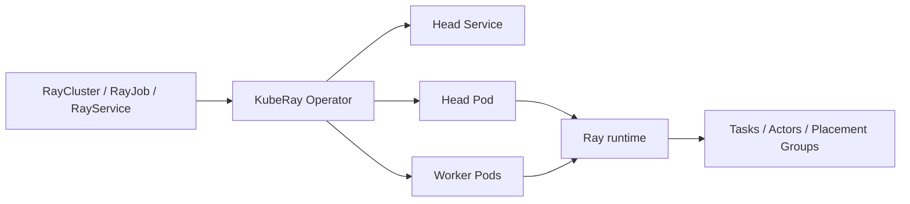

# Kubernetes 已经能跑 Pod，为什么还需要 KubeRay（Ray Operator）？

Kubernetes 能把 Head 和 Worker Pod 跑起来，却不知道 Worker 有没有加入 Ray、集群何时能接收作业、任务结束后哪些资源该回收。

KubeRay 用 Kubernetes 控制器管理这部分 Ray 生命周期。Kubernetes 管 Pod，Ray 管 Task、Actor 和 Placement Group，KubeRay 负责让两套状态持续对上。

## 1. 三层职责和对象选择

| 层 | 负责什么 | 不负责什么 |
| --- | --- | --- |
| Kubernetes | 创建、放置、重启 Pod；分配 CPU、内存、GPU | 不理解 Ray 集群成员和 Task |
| KubeRay | RayCluster、RayJob、RayService 的生命周期 | 不逐个调度 Ray Task |
| Ray runtime | Task、Actor、Placement Group 和对象存储 | 不把 Pod 放到 Kubernetes Node |

本文的几个术语：

| 名称 | 含义 |
| --- | --- |
| Kubernetes Node | 运行 Pod 的物理机或虚拟机 |
| Pod | Kubernetes 的容器运行单元 |
| Ray Node | 已启动并注册到 Ray 集群的 Ray 进程 |
| Head / Worker | Ray 的控制节点和计算节点，通常各自运行在 Pod 中 |

| 需求 | 首选对象 | 原因 |
| --- | --- | --- |
| 开发、调试、共享计算池 | `RayCluster` | 集群生命周期独立于一次程序 |
| 训练、评估、批推理、ETL | `RayJob` | 自动建集群、提交作业、追踪终态和清理 |
| Ray Serve 在线服务 | `RayService` | 稳定入口、Serve 健康检查和升级编排 |
| 定时 Ray 作业 | `RayCronJob` | Alpha 功能，需要显式开启 feature gate |

## 2. Pod 跑起来后，Ray 可能仍没准备好

`Running` 只说明容器进程已启动。排障时应分开看四层状态：

| 层 | 已就绪的含义 | 常见误判 |
| --- | --- | --- |
| Pod | 容器已启动 | 当成 Ray Worker 已可调度 |
| Kubernetes Ready | 就绪探针通过，Pod 可作为 Service Endpoint | 当成 Ray 集群可提交作业 |
| Ray cluster | Head 的 GCS 可用，Worker 已注册，逻辑资源正确 | 当成业务成功 |
| Job / Serve | Driver 终态成功，或 Serve replica 健康 | 当成资源会自动回收 |

一个 Worker 要能工作，至少要找到 Head、等待 GCS、运行 `ray start` 并完成注册。普通 Deployment 或 StatefulSet 不会维护这套关系。

## 3. KubeRay 的控制回路



Operator 会持续读取 CR 的期望状态，补齐或删除受控资源，再把观察到的状态写回 `status`。手工删掉一个受控 Worker Pod，通常只会被重新创建。

Task 和 Actor 的调度在 Ray runtime 内完成。KubeRay 不会为每个 Python 函数创建 Pod，也不在每个 Task 的热路径上。

## 4. RayJob 与 RayService 的关键语义

### RayJob

`RayJob` 默认使用 `K8sJobMode`：

1. Operator 根据 `rayClusterSpec` 创建专属 RayCluster。
2. RayCluster Controller 创建 Head、Service 和 Worker。
3. 集群可提交后，Operator 创建 Kubernetes submitter Job。
4. Submitter 执行 `ray job submit`；Ray Jobs API 启动 Driver，Driver 再提交 Task 和 Actor。

三个名字很像，实际职责不同：

| 名称 | 作用 |
| --- | --- |
| RayJob CR | KubeRay 的声明式对象 |
| submitter Kubernetes Job | 把入口命令提交给 Ray Jobs API |
| Ray job / Driver | 在 Ray 集群内执行用户程序 |

顶层 `backoffLimit` 控制整次 RayJob 失败后的重试；`submitterConfig.backoffLimit` 只控制 submitter Job。Task 重试和 Actor 重启仍由 Ray 的 `max_retries`、`max_restarts` 等参数控制。

`shutdownAfterJobFinishes: true` 配合 `ttlSecondsAfterFinished` 会在终态后回收专属 RayCluster。RayJob CR 和 submitter Job 是否保留，取决于删除策略和 Operator 配置。

首次创建成功后，Head Pod 消失时，RayJob 不能靠原地重建 Head 来恢复作业。当 RayJob 进入失败重试流程，`backoffLimit` 会新建集群并重跑入口程序。入口程序、外部写入和 Checkpoint 都要能应对重复执行。

### RayService

RayService 同时管理 RayCluster 和 Serve 应用。有效的集群配置变化时，默认升级策略会创建 pending 集群，等新集群和 Serve application 健康后再切换稳定 Service。

这类升级通常需要一段双份容量。GPU 池没有余量时，升级会卡在新集群无法就绪，而不会凭空做到零停机。`serveConfigV2` 的应用配置更新通常可以在现有集群内完成。

## 5. GPU 和扩缩容

需要由 Ray 调度到 GPU 的 Task，要同时满足两层资源契约：

```yaml
# Worker Pod：让 Kubernetes 分配物理 GPU
resources:
  requests:
    nvidia.com/gpu: "1"
  limits:
    nvidia.com/gpu: "1"
```

```python
# Task：让 Ray 预留逻辑 GPU
@ray.remote(num_gpus=1)
def infer_one_shard(shard):
    ...
```

Kubernetes 根据 `nvidia.com/gpu` 把 Pod 放到有设备的 Node；KubeRay 根据主 Ray 容器的 GPU limit 推导 Ray 的逻辑容量；Ray 根据 `num_gpus` 放置 Task 并设置 `CUDA_VISIBLE_DEVICES`。

| 配置 | 结果 |
| --- | --- |
| Pod 有 1 张 GPU，Task 要 1 张 GPU | 正常的整卡契约 |
| Pod 有 GPU，Task 未声明 `num_gpus` | Ray 可能并发放多个 GPU 程序到同一 Worker |
| Pod 无 GPU，Task 要 1 张 GPU | Ray 看到的逻辑 GPU 为 0，Task 会等待 |
| Pod limit 为 1，却写 `num-gpus: "2"` | Ray 逻辑超卖，物理隔离和显存不会随之增加 |

扩缩容同样分三层：

1. 应用增加 Task、Actor 或 Serve replica，产生逻辑资源需求。
2. Ray Autoscaler 在 Worker Group 的 `minReplicas` 和 `maxReplicas` 之间计算 Ray Worker 数。
3. Kubernetes 或云节点 Autoscaler 为 Pending Worker Pod 提供新的 Node。

一个 Task 请求 2 张 GPU，而任一 Worker Pod 只有 1 张 GPU 时，即使集群共有两张卡，它也无法被拆开运行。

## 6. 故障、队列和安全边界

资源被重建，不代表状态会恢复。

| 故障 | 平台通常会做什么 | 应用仍要负责什么 |
| --- | --- | --- |
| Operator Pod 失败 | Deployment 重建并继续调谐 | 调谐间隙的生命周期变化 |
| Worker Pod / Node 失败 | Kubernetes 和 KubeRay 视容量补建 Worker | Task retry、Actor restart、Checkpoint、幂等 |
| Head 失败 | 容器可能重启；RayJob 可通过重试重建专属集群 | GCS 状态、Driver 内存、外部副作用 |
| Task / Actor 失败 | Ray 按配置重试或重启 | 事务、去重和业务补偿 |

需要保留 GCS 状态时，可评估 Redis-backed GCS fault tolerance。官方对 KubeRay Ray Serve 提供完整支持；其他工作负载需要自行验证兼容性和恢复语义。

GPU Operator 提供驱动和 Device Plugin；Kueue 管配额与队列；Volcano 管 Gang 和 Pod 级批调度。它们与 KubeRay 互补。不涉及多租户配额或 Gang 调度时，可以先不引入 Kueue 和 Volcano。

生产环境还要保护 Ray Dashboard 和 Jobs API。KubeRay v1.6+ 支持 token authentication；token 不加密流量，仍应配合 TLS、受限 Ingress、NetworkPolicy 或可信网络。不要把 Dashboard 直接暴露到公网。

## 7. 版本和实验

本文以 KubeRay v1.6.2、Ray 2.57.0 和 `ray.io/v1` 为示例组合。仓库中的 CPU RayJob 已在两节点环境验证；双 GPU 清单仍待实际执行。

按 [官方安装与升级指南](https://docs.ray.io/en/latest/cluster/kubernetes/user-guides/upgrade-guide.html) 安装 Operator。旧版本升级时先更新 CRD；Helm 不会自动更新已经安装的 `crds/`。

CPU 烟测见 [`examples/kuberay/rayjob-cpu-smoke.yaml`](./examples/kuberay/rayjob-cpu-smoke.yaml)。

双 GPU 实验的完整清单见 [`examples/kuberay/rayjob-two-gpu.yaml`](./examples/kuberay/rayjob-two-gpu.yaml)。它固定两个各占一张 GPU 的 Worker，用 Pod 反亲和强制跨 Node，并让两个 `num_gpus=1` Task 并发运行。

```bash
kubectl create namespace kuberay-lab --dry-run=client -o yaml | kubectl apply -f -
kubectl apply --dry-run=server -f examples/kuberay/rayjob-two-gpu.yaml
kubectl apply -f examples/kuberay/rayjob-two-gpu.yaml
```

该环境访问 Docker Hub 不稳定，清单使用 DaoCloud 代理。运行前先确认代理已同步 GPU tag；完成实测后应固定镜像 digest。换到其他集群时，也要确认 NVIDIA 驱动、Device Plugin、CUDA 与镜像兼容。

成功时，两个任务会打印不同的 `kubernetes_node`，最后输出 `SUCCESS: two Ray GPU tasks ran on two different Kubernetes nodes`。

这份清单验证的是 Ray 的 GPU 调度和跨节点放置，并不执行 CUDA 算子或 NCCL 性能测试。要验证 CUDA 可用性，应使用带有目标框架的镜像，再在 Task 中运行实际 GPU 算子。

## 8. 卡住时从外到内排查

| 层 | 先看什么 |
| --- | --- |
| CR / Operator | `kubectl describe rayjob NAME -n NS`；`kubectl logs -n kuberay-system deployment/kuberay-operator --tail=200` |
| Pod 调度 | `kubectl describe pod POD -n NS`；`kubectl get events -n NS --sort-by=.lastTimestamp` |
| Ray 注册 | Head 和 Worker 的容器日志；`kubectl exec -n NS HEAD_POD -c ray-head -- ray status` |
| Task Pending | `ray status` 的 Demands、单 Pod GPU 容量、Placement Group、`maxReplicas` |
| RayJob 失败 | submitter Job 日志、RayJob `status`、Ray Jobs API 日志 |

先判断问题属于哪一层，再看对应对象。只盯一个 Pending Pod 往往会忽略 Ray 的资源需求或 Kueue 的准入状态。

## 结论

Kubernetes 擅长维护 Pod；Ray 擅长在已加入集群的节点上调度分布式计算。KubeRay 负责两者之间的集群、作业和服务生命周期。

## 参考资料

- [KubeRay v1.6.2 Release](https://github.com/ray-project/kuberay/releases/tag/v1.6.2)
- [KubeRay v1.6.0 Release 和 RayJob 行为变更](https://github.com/ray-project/kuberay/releases/tag/v1.6.0)
- [KubeRay v1.6.2 样例与 Helm Chart](https://github.com/ray-project/kuberay/tree/v1.6.2)
- [KubeRay 安装与升级](https://docs.ray.io/en/latest/cluster/kubernetes/user-guides/upgrade-guide.html)
- [KubeRay token authentication](https://docs.ray.io/en/latest/cluster/kubernetes/user-guides/kuberay-auth.html)
- [GCS fault tolerance](https://docs.ray.io/en/latest/cluster/kubernetes/user-guides/kuberay-gcs-ft.html)
