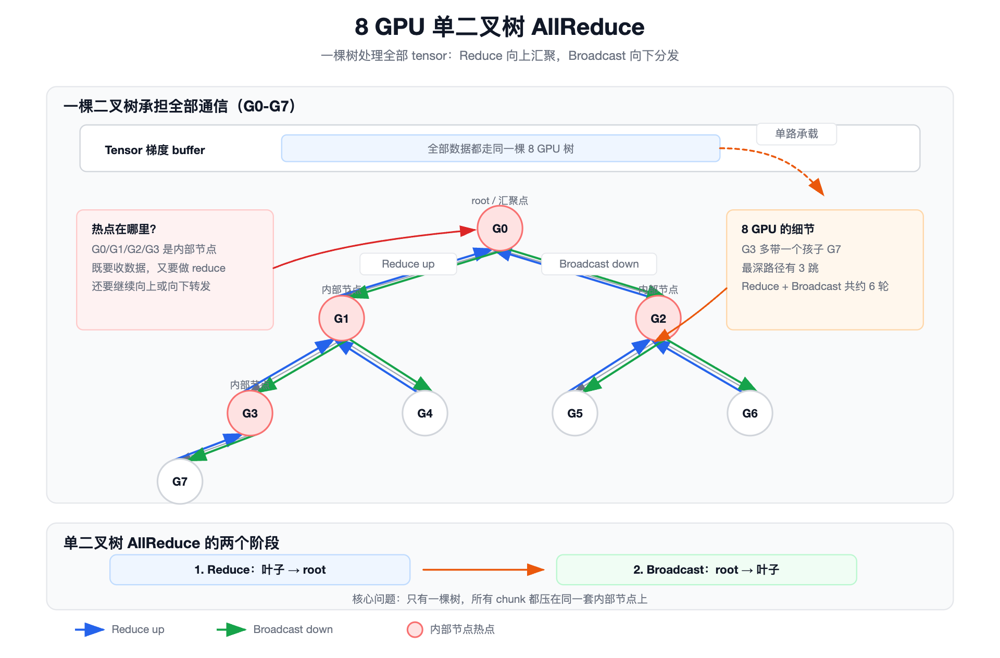
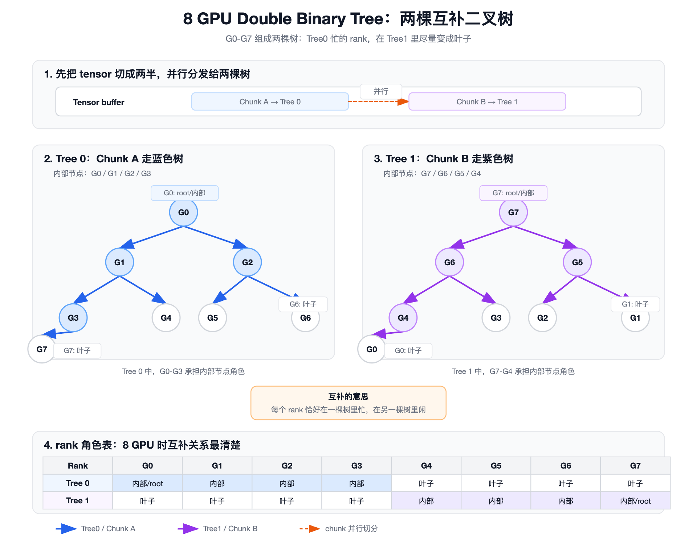

# 一文搞懂 NCCL 的 Tree AllReduce：大模型训练每天用无数遍的归约算法

训练大模型时，每一步反向传播结束后，几十、上百、甚至上千张 GPU 都要做同一件事：

> **把自己算出来的梯度，求和，再让每张 GPU 都拿到这份总和。**

这个操作，就是 **AllReduce**。

如果你看过 Ring AllReduce，会知道 Ring 的核心优势是**带宽友好**：大 tensor 在环上流水起来，每条链路都能持续干活。Ring AllReduce 本质上分两阶段——**Ring-ReduceScatter**(每张卡只持有最终结果的一段)+ **Ring-AllGather**(再把所有段拼齐),每阶段 `N-1` 步。

但 Ring 有一个天然问题：

> **通信轮数随 GPU 数量线性增长。**

8 张 GPU 还好，64 张、512 张、4096 张 GPU 时，`N-1` 轮带来的延迟就会越来越明显。

于是 NCCL 还会使用另一类算法：**Tree AllReduce**。

这篇文章把 NCCL 的 Tree AllReduce 从小白视角讲清楚：

- Tree AllReduce 为什么等价于 **Reduce + Broadcast**；
- 单棵二叉树的完整通信流程是什么；
- 为什么普通树会有**内部节点热点**；
- NCCL 的 **Double Binary Tree** 到底在“双”什么；
- Chunk A / Chunk B 是串行执行，还是并行流水；
- 实战中如何确认 NCCL 真的选了 Tree。

---

## 一、先看问题：AllReduce 到底要干什么

假设有 8 张 GPU，每张 GPU 上都有一份梯度：

```text
G0: a0
G1: a1
G2: a2
G3: a3
G4: a4
G5: a5
G6: a6
G7: a7
```

AllReduce Sum 的目标是：**每张 GPU 最后都拿到同一个结果**：

```text
sum = a0 + a1 + a2 + a3 + a4 + a5 + a6 + a7
```

也就是说，最后应该变成：

```text
G0: sum
G1: sum
G2: sum
G3: sum
G4: sum
G5: sum
G6: sum
G7: sum
```

在大模型数据并行里，这个 `sum` 通常就是所有 GPU 的梯度求和结果。

之后每张 GPU 再用相同的梯度更新参数，模型副本才能保持一致。

---

## 二、Tree AllReduce 的一句话版本

Tree AllReduce 可以先记成一句话：

> **先沿树往上汇总，再沿树往下分发。**

也就是：

```text
Tree AllReduce = Reduce up + Broadcast down
```

看起来像这样：

```text
阶段 1：Reduce up
叶子节点 -> 中间节点 -> root

阶段 2：Broadcast down
root -> 中间节点 -> 叶子节点
```

如果用生活化比喻：

```text
Reduce up：
组员先把分数报给组长，组长算小计，再报给总负责人。

Broadcast down：
总负责人算出总分，再通知组长，组长再通知组员。
```

最后每个人都知道总分。

这就是 Tree AllReduce。

---

## 三、先画一棵普通二叉树

假设 8 张 GPU 被组织成这样一棵二叉树：

```text
              G0
           /      \
         G1        G2
       /   \      /   \
     G3    G4   G5    G6
    /
  G7
```

这里面有三类角色：

| 角色 | GPU | 做什么 |
|---|---|---|
| root 根节点 | `G0` | 最终先拿到完整 reduce 结果 |
| 内部节点 | `G1/G2/G3` | 接收孩子数据，做 reduce，再继续转发 |
| 叶子节点 | `G4/G5/G6/G7` | 发送自己的数据，最后接收结果 |

注意这棵树不是完美平衡的：`G3` 多带了一个孩子 `G7`，所以从最深的叶子到 root 的深度是 3,与 `log2(8)` 同阶,但比"完美平衡二叉树"多了一层。当 `N` 不是 2 的幂时,这种不对称会更明显——后面会看到,Double Binary Tree 的构造对任意 `N` 都成立,只是 2 的幂时两棵树最对称、互补性最干净。

图里更直观：



接下来我们按时间顺序，把这棵树上的 AllReduce 跑一遍。

---

## 四、阶段 1：Reduce up，数据往上汇总

一开始，每张 GPU 只有自己的本地数据：

```text
G0: a0
G1: a1
G2: a2
G3: a3
G4: a4
G5: a5
G6: a6
G7: a7
```

### 4.1 第一轮：叶子发给父节点

叶子节点先把数据发给自己的父节点：

```text
G4 -> G1: a4
G5 -> G2: a5
G6 -> G2: a6
G7 -> G3: a7
```

`G1` 收到 `G4` 的数据后，和自己的 `a1` 相加：

```text
G1 = a1 + a4
```

`G2` 收到 `G5/G6` 的数据后，和自己的 `a2` 相加：

```text
G2 = a2 + a5 + a6
```

`G3` 收到 `G7` 的数据后，和自己的 `a3` 相加：

```text
G3 = a3 + a7
```

这一轮之后，树上的状态可以理解成：

```text
              G0: a0
           /              \
  G1: a1+a4          G2: a2+a5+a6
   /
G3: a3+a7
```

### 4.2 第二轮：中间节点继续往上

接着，已经汇总好的中间节点继续往上发：

```text
G3 -> G1: a3+a7
G2 -> G0: a2+a5+a6
```

`G1` 把 `G3` 的结果合进来：

```text
G1 = (a1+a4) + (a3+a7) = a1+a3+a4+a7
```

`G0` 把 `G2` 的结果合进来：

```text
G0 = a0 + (a2+a5+a6)
```

### 4.3 第三轮：G1 发给 root

```text
G1 -> G0: a1+a3+a4+a7
```

`G0` 把 `G1` 的结果合进来：

```text
G0 = (a0+a2+a5+a6) + (a1+a3+a4+a7)
   = a0+a1+a2+a3+a4+a5+a6+a7
```

到这里，**root G0 已经拿到了完整的求和结果**。

但是注意：现在只有 `G0` 有完整结果，其他 GPU 还没有。

所以 AllReduce 还没结束。

---

## 五、阶段 2：Broadcast down，结果往下分发

现在 `G0` 手里有完整结果：

```text
sum = a0+a1+a2+a3+a4+a5+a6+a7
```

接下来要把 `sum` 发给所有 GPU。

### 5.1 第一轮：root 发给中间节点

```text
G0 -> G1: sum
G0 -> G2: sum
```

这时：

```text
G0 有 sum
G1 有 sum
G2 有 sum
```

### 5.2 第二轮：中间节点发给下一层

```text
G1 -> G3: sum
G1 -> G4: sum
G2 -> G5: sum
G2 -> G6: sum
```

这时：

```text
G0/G1/G2 有 sum
G3/G4/G5/G6 有 sum
```

### 5.3 第三轮：G3 发给 G7

```text
G3 -> G7: sum
```

最终：

```text
G0 有 sum
G1 有 sum
G2 有 sum
G3 有 sum
G4 有 sum
G5 有 sum
G6 有 sum
G7 有 sum
```

AllReduce 完成。

---

## 六、为什么 Tree 的延迟低

Tree 的最大优点是：**通信深度低**。

还是这棵树：

```text
              G0
           /      \
         G1        G2
       /   \      /   \
     G3    G4   G5    G6
    /
  G7
```

从最深的叶子到 root，需要 3 跳：

```text
G7 -> G3 -> G1 -> G0
```

从 root 再发回最深的叶子，也是 3 跳：

```text
G0 -> G1 -> G3 -> G7
```

所以一棵深度为 `log2(N)` 的二叉树，通信轮数大致是：

```text
Reduce up:      log2(N)
Broadcast down: log2(N)
总轮数:          2 * log2(N)
```

8 张 GPU 时：

```text
log2(8) = 3
2 * 3 = 6 轮
```

如果有 1024 张 GPU：

```text
log2(1024) = 10
Tree AllReduce 的通信深度大概是 2 * 10 = 20 轮
```

对比 Ring AllReduce：

```text
Ring ReduceScatter: N-1 轮
Ring AllGather:     N-1 轮
总轮数:              2 * (N-1)
```

1024 张 GPU 时，Ring 约等于：

```text
2 * 1023 = 2046 轮
```

⚠️ **但轮数少不等于一定更快**，这里有一个特别容易踩的反直觉点：

```text
Tree：轮数少，但每一轮传的数据块更大。
Ring：轮数多，但每一轮只传 tensor 的一小段。
```

可以把它想成两种搬东西方式：

```text
Tree：
  少跑几趟，但每趟搬得多，而且中间节点比较忙。

Ring：
  跑很多趟，但每趟只搬一小段，链路可以持续流水。
```

所以:

- **小消息**：数据本来就小，主要开销来自“要通信多少轮”。这时 Tree 的轮数少，优势明显；
- **大消息**：数据量很大，主要看链路能不能持续打满。Ring 的流水线很好，所以大消息下 Ring 经常表现很强；
- **Double Binary Tree**：想做的是同时拿两边的好处：用 Tree 降低通信轮数，再用两棵互补树把内部节点压力摊开，让大消息带宽尽量接近 Ring。

真实性能不能只看轮数，还要看每轮数据量、带宽、拓扑、协议和流水线。但从直觉上看：

| 算法 | 通信轮数直觉 | 优势 |
|---|---:|---|
| Ring | `O(N)` | 大消息带宽利用好 |
| Tree | `O(logN)` | 小消息、大规模下延迟低 |

这就是 Tree AllReduce 存在的根本原因：**在小消息、大规模、延迟敏感的场景下，用更少的通信轮数降低等待时间**。

---

## 七、普通单树的问题：内部节点太忙

单棵树虽然延迟低，但它有一个明显问题：**内部节点压力大**。

还是这棵树：

```text
              G0
           /      \
         G1        G2
       /   \      /   \
     G3    G4   G5    G6
    /
  G7
```

`G1` 要做什么？

```text
1. 从 G3 接收数据；
2. 从 G4 接收数据；
3. 和自己的数据做 reduce；
4. 把结果发给 G0；
5. Broadcast 阶段再从 G0 收结果；
6. 再把结果发给 G3/G4。
```

`G2` 也类似，`G3` 还要多照顾一个 `G7`。

`G0` 更忙：它是 root，要收左右子树的结果，还要向下广播。

相比之下，叶子节点 `G4/G5/G6/G7` 就轻松很多：

```text
Reduce 阶段发一次
Broadcast 阶段收一次
```

所以单棵树的问题是：

```text
内部节点一直忙
叶子节点相对闲
负载不均衡
带宽容易被少数节点限制
```

更关键的是带宽层面：root 和内部节点要同时照顾多个孩子，既要收数据、做归约，又要继续往上发；Broadcast 阶段还要反过来再分发一遍。整个过程很容易变成“大家都在等少数几个忙节点”，链路利用不够均匀。

用一句话说：

> **单二叉树延迟低，但热点明显，带宽被 root 卡死。**

这就引出了 NCCL 的关键设计:**Double Binary Tree**。

> 📌 **版本信息**:Double Binary Tree AllReduce 是 NVIDIA 在 **NCCL 2.4**开始支持的，下面我将详细介绍下**Double Binary Tree**

---

## 八、NCCL 的 Double Binary Tree：到底“双”在哪里

NCCL Tree AllReduce 最关键的优化，不是简单地“把 Ring 换成 Tree”。

真正关键的是：

> **用两棵互补的二叉树，同时处理不同的数据块。**

先看图：



核心动作有两个：

```text
1. 把 tensor 切成两部分；
2. 两部分分别走两棵不同的树。
```

比如：

```text
完整 tensor = [ Chunk A ][ Chunk B ]

Chunk A -> Tree 0
Chunk B -> Tree 1
```

为了先把"双树互补"讲清楚，下面用一组**简化的逻辑树**来说明。真实 NCCL 源码里的 rank 连接不是按这张图硬编码出来的，而是会结合 rank、拓扑和 channel 去构造。

Tree 0 长这样（和前面单树一样，以 `G0` 为 root）：

```text
              G0
           /      \
         G1        G2
       /   \      /   \
     G3    G4   G5    G6
    /
  G7
```

在 Tree 0 里：

```text
G0/G1/G2/G3 是内部节点，比较忙
G4/G5/G6/G7 是叶子节点，比较轻松
```

Tree 1 的构造目标是:**让 Tree 0 里比较忙的 rank，在 Tree 1 里尽量少承担中转工作**。为了好理解，可以先把它想成"换一批 GPU 来当中转节点":

```text
              G7
           /      \
         G6        G5
       /   \      /   \
     G4    G3   G2    G1
    /
  G0
```

⚠️ 注意:这张图只是帮助理解，不代表 NCCL 源码里的真实连法。你只要记住一点：**两棵树会尽量错开忙的 GPU，避免总让同一批 GPU 做中转。**

在 Tree 1 里：

```text
G7/G6/G5/G4 是内部节点，比较忙
G0/G1/G2/G3 是叶子节点，比较轻松
```

逐 rank 对比一下：

| rank | Tree 0 角色 | Tree 1 角色 | 是否互补 |
|---|---|---|---|
| G0 | 内部（root，忙） | 叶子（闲） | ✓ |
| G1 | 内部（忙） | 叶子（闲） | ✓ |
| G2 | 内部（忙） | 叶子（闲） | ✓ |
| G3 | 内部（忙） | 叶子（闲） | ✓ |
| G4 | 叶子（闲） | 内部（忙） | ✓ |
| G5 | 叶子（闲） | 内部（忙） | ✓ |
| G6 | 叶子（闲） | 内部（忙） | ✓ |
| G7 | 叶子（闲） | 内部（root，忙） | ✓ |

在这个简化的 8 卡例子里，可以把它理解成：**每个 rank 大致在一棵树里忙、在另一棵树里轻松**。这就是"互补"的直觉含义。

真实 NCCL 里，特别是 rank 数不是 2 的幂、或者跨机器拓扑比较复杂时，互补性不一定像这张图这么整齐。但设计目标仍然一样：让通信压力尽量摊开。

这样，热点就被摊开了。

---

## 九、互补的两个具体例子

拿两个 rank 看一下"互补"在具体节点上的体现。

先看 `G0`：

```text
G0 在 Tree 0:
  root / 内部节点，很忙

G0 在 Tree 1:
  叶子节点，比较轻松
```

再看 `G7`：

```text
G7 在 Tree 0:
  叶子节点，比较轻松

G7 在 Tree 1:
  root / 内部节点，很忙
```

也就是说，不是永远让 `G0` 当 root，也不是永远让同一批 GPU 做中转，而是：

```text
这半数据你忙
那半数据我忙
大家轮流承担内部节点角色
```

这也是 NCCL 做 Double Binary Tree 的目标：它不只是"换一个 root"，而是希望把中转压力摊开，让 Tree 在保留低延迟的同时，也尽量接近 Ring 的带宽表现。

---

## 十、Double Binary Tree 的完整流程

假设每张 GPU 上都有一个大 tensor。

为了方便理解，把它切成两半：

```text
G0: [A0][B0]
G1: [A1][B1]
G2: [A2][B2]
G3: [A3][B3]
G4: [A4][B4]
G5: [A5][B5]
G6: [A6][B6]
G7: [A7][B7]
```

其中：

```text
A 表示 Chunk A
B 表示 Chunk B
```

目标是每张 GPU 最后都拿到：

```text
[ A0+A1+...+A7 ][ B0+B1+...+B7 ]
```

NCCL 的思路是：

```text
Chunk A 用 Tree 0 做 AllReduce
Chunk B 用 Tree 1 做 AllReduce
```

### 10.1 Chunk A 在 Tree 0 上跑

Tree 0：

```text
              G0
           /      \
         G1        G2
       /   \      /   \
     G3    G4   G5    G6
    /
  G7
```

Reduce up（3 轮）：

```text
第1轮: G4->G1, G5->G2, G6->G2, G7->G3
第2轮: G3->G1, G2->G0
第3轮: G1->G0
```

`G0` 得到：

```text
A_sum = A0+A1+A2+A3+A4+A5+A6+A7
```

Broadcast down（3 轮，对称）：

```text
第1轮: G0->G1, G0->G2
第2轮: G1->G3, G1->G4, G2->G5, G2->G6
第3轮: G3->G7
```

最后所有 GPU 都拿到 `A_sum`。

### 10.2 Chunk B 在 Tree 1 上跑

Tree 1：

```text
              G7
           /      \
         G6        G5
       /   \      /   \
     G4    G3   G2    G1
    /
  G0
```

Reduce up（3 轮，结构对称）：

```text
第1轮: G0->G4, G3->G6, G2->G5, G1->G5  （叶子层向上）
第2轮: G4->G6, G5->G7                    （中间层向上;G5 子树已完整,G7 此时只拿到右子树的部分和）
第3轮: G6->G7                            （G6 把左子树完整结果交给 G7,G7 完成最终求和）
```

`G7` 得到：

```text
B_sum = B0+B1+B2+B3+B4+B5+B6+B7
```

Broadcast down（3 轮）：

```text
第1轮: G7->G6, G7->G5
第2轮: G6->G4, G6->G3, G5->G2, G5->G1
第3轮: G4->G0
```

最后所有 GPU 都拿到 `B_sum`。

### 10.3 最终拼起来

每张 GPU 最后都有：

```text
[ A_sum ][ B_sum ]
```

也就是完整 tensor 的 AllReduce 结果。

---

## 十一、Chunk A 和 Chunk B 是同时跑吗

是的，**设计目标就是尽量同时跑**。

不是这样：

```text
先把 Chunk A 全部 AllReduce 完
再开始 Chunk B
```

而是更接近这样：

```text
同一时间：
  Tree 0 正在处理 Chunk A
  Tree 1 正在处理 Chunk B
```

更真实一点，NCCL 不会只切成两个大块。

一个大 tensor 通常会继续切成更小的 chunk / slice：

```text
Tree 0:
  A0, A1, A2, A3 ...

Tree 1:
  B0, B1, B2, B3 ...
```

然后流水线推进：

```text
时刻 T0:
  Tree0 reduce A0
  Tree1 reduce B0

时刻 T1:
  Tree0 broadcast A0，同时 reduce A1
  Tree1 broadcast B0，同时 reduce B1

时刻 T2:
  Tree0 broadcast A1，同时 reduce A2
  Tree1 broadcast B1，同时 reduce B2
```

注意：对于单个 slice 来说，它内部仍然有顺序依赖：

```text
必须先 Reduce up
root 拿到结果
才能 Broadcast down
```

但不同 slice 之间可以流水线。

所以准确说法是：

> **Chunk A 和 Chunk B 不是串行 A 再 B，而是通过两棵树并行、流水线执行。**

---

## 十二、Double Binary Tree 为什么能接近 Ring 的带宽

朴素 Tree 的问题是：有些 GPU 太忙，有些 GPU 太闲。

比如 root 和内部节点要反复接收、归约、转发；叶子节点只需要发一次、收一次。这样一来，整体速度很容易被少数忙节点拖住。

Double Binary Tree 的思路就是：

```text
不要让同一批 GPU 永远当中转站。
```

它把 tensor 分成两部分：

```text
前半部分走 Tree 0
后半部分走 Tree 1
```

而 Tree 0 和 Tree 1 是互补的：

```text
在 Tree 0 里忙的 rank，在 Tree 1 里尽量变成叶子；
在 Tree 0 里闲的 rank，在 Tree 1 里承担更多中转工作。
```

这样做的结果是：

```text
单树：少数内部节点很忙，容易成为瓶颈。
双树：忙点被摊开，更多链路可以同时工作。
Ring：流水线最自然，大消息带宽利用通常很好。
```

所以 Double Binary Tree 想解决的问题不是单纯“换一个 root”，而是：

```text
用两棵互补树并行处理不同数据块，让每张 GPU 的通信压力更均匀。
```

它保留了 Tree 的低轮数优势，又尽量减少单树的热点问题，因此在很多场景下能比朴素 Tree 更接近 Ring 的大消息带宽。

可以这样记：

| 算法 | 优点 | 问题 |
|---|---|---|
| 单棵 Tree | 通信深度低 O(logN) | 内部节点容易太忙 |
| Ring | 大消息流水线很好 | 通信轮数随 N 线性增长 |
| Double Binary Tree | 低轮数 + 压力更均匀 | 实现复杂，依赖拓扑和调度 |

---

## 十三、真实 NCCL:双树之外还有 channel 和流水线

公众号文章里画两棵树，是为了帮助理解。

但真实 NCCL 里，事情更工程化。

### 13.1 多 channel

NCCL 会把通信拆到多个 channel 上。

你可以把 channel 理解成多条并行通信车道：

```text
大 tensor
   │
   ├── channel 0 -> tree pair
   ├── channel 1 -> tree pair
   ├── channel 2 -> tree pair
   └── channel N -> tree pair
```

不同 channel 可以对应不同的数据片段和不同通信路径。

这样可以同时利用多条 NVLink、PCIe 或 IB 路径。

### 13.2 chunk / slice 流水线

真实 NCCL 不会等一个超大 tensor 完整 Reduce 再 Broadcast。

它会切成更小单位：

```text
buffer -> channel -> chunk -> slice
```

然后用 CUDA kernel 做流水线：

```text
recv
reduce
send
```

多个 slice 错位推进，链路才不会空等。

### 13.3 拓扑感知

Tree 不是随便连的。

你可以先把它理解成一棵**逻辑树**：

```text
每个 rank 知道自己从谁收、往谁发。
```

但这些逻辑连接最后到底走哪条物理链路，NCCL 还会根据机器拓扑去安排：

- 单机内优先考虑 NVLink / NVSwitch；
- 跨 NUMA 时考虑 PCIe 层级；
- 跨节点时考虑 NIC、rail、IB 拓扑；
- 多机多卡时还要避免所有流量压到同一条链路。

所以你在文章里画的树，只是帮助理解算法的**逻辑树**。

真实执行时，NCCL 会把逻辑树映射到物理链路。

---

## 十四、Tree 和 Ring 怎么选

很多人容易误解：

> **NCCL 不是永远使用 Ring，也不是永远使用 Tree。**

它会根据消息大小、rank 数量、拓扑和硬件能力自动选择。

一个粗略直觉是：

| 场景 | 更可能适合 |
|---|---|
| 大消息、中等规模 | Ring |
| 小消息、大规模、延迟敏感 | Tree |
| 多 rail 跨节点拓扑 | 拓扑感知算法 |

除了 Ring 和 Tree,NCCL 后续还引入了更多和硬件、拓扑强相关的路径，比如 NVLS、CollNet 等。它们和本文重点讲的 Tree 不在同一层,这里不展开。

但真实选择以 NCCL 实际日志为准。

可以通过环境变量强制对比：

```bash
NCCL_ALGO=Tree ./build/all_reduce_perf -b 8 -e 1G -f 2 -g 8
NCCL_ALGO=Ring ./build/all_reduce_perf -b 8 -e 1G -f 2 -g 8
```

`NCCL_ALGO` 接受算法名列表，支持逗号分隔（`Ring,Tree`）和排除前缀（`^Tree`）。入门调试时，可以先把它当成一个简单开关来用：强制 Tree 跑一遍，再强制 Ring 跑一遍，对比性能。

新版本 NCCL 也支持更细粒度的写法，比如只给某一种 collective 指定算法。公众号入门文章里先不展开，真实调优时以你机器上的 NCCL 文档和日志为准。

协议层用 `NCCL_PROTO`（`Simple`/`LL`/`LL128`）单独控制。

调试时打开：

```bash
NCCL_DEBUG=INFO
```

看日志里实际选择了什么算法、多少 channel、什么协议。

---

## 十五、三个最容易踩的认知坑

1. **“Tree AllReduce 就是一棵树”** ❌  
   NCCL 里的 Tree AllReduce 重点是 **double binary tree**，不是朴素单树。

2. **“Chunk A 完了才会做 Chunk B”** ❌  
   Double Binary Tree 的设计目标就是两棵树并行工作。真实执行还会按 slice 流水线推进。

3. **“Tree 一定比 Ring 快”** ❌  
   Tree 延迟低，但大消息下 Ring 的带宽利用可能更好。NCCL 会按拓扑和消息大小自动选择。

---

## 十六、实战检查清单

发起一次 NCCL AllReduce 前,确认:

1. 所有 rank 都加入同一个 communicator;
2. 所有 rank 调用的是同一种 collective(都是 AllReduce,不能有的 rank 调 Broadcast);
3. 在**同一个 communicator** 上,所有 rank 的 collective 调用顺序一致(多个 communicator 之间不需要对齐);
4. 对同一次调用,`count`、`datatype`、`op` 在所有 rank 上完全一致;
5. 所有 rank 使用相同的 NCCL 版本和兼容的 CUDA driver,避免混版本导致协议不兼容或 hang;
6. NCCL collective 入栈到 CUDA stream 后立即返回,**同 stream 的后续 kernel 会自动按序消费输出,无需额外同步**;只有跨 stream 使用、或 CPU 端要读 buffer 时,才需要 `cudaStreamSynchronize` / event;
7. 同一 communicator 不要从多个 CPU 线程并发发起 collective,除非用 `ncclGroupStart/End` 显式包起来;
8. 不要假设内部一定是 Ring 或 Tree,除非你明确强制并验证过。

调优时优先看:

- `NCCL_DEBUG=INFO`:确认算法、channel、协议、拓扑;
- `nsys profile`:看 NCCL kernel 时间线和链路利用;
- `nccl-tests`:用 `NCCL_ALGO=Tree/Ring` 做 A/B 对比;
- 小消息看 latency(`busbw` 没意义),大消息看 bus bandwidth;
- 不要只看单次结果,多跑几轮取稳定值,首轮通常包含 NCCL 拓扑探测和 channel 建立的一次性开销。

---

## 写在最后

最后送你三句话：

> **Tree AllReduce = Reduce up + Broadcast down。**
>
> **单棵树延迟低，但内部节点容易成为热点。**
>
> **NCCL 的 Double Binary Tree 用两棵互补树并行处理不同 chunk，把低延迟和高带宽尽量同时拿到。**

写代码时，你只需要相信 AllReduce 的 API 语义：

```text
每张 GPU 输入一份 tensor
每张 GPU 输出完整 reduce 结果
```

至于内部到底是 Ring、Tree、CollNet、NVLS，还是多 channel + 多 slice + 拓扑感知路径，那是 NCCL 的实现细节。

理解这些细节，是为了在性能不好时知道该看哪里：

```text
是算法选错了？
是 channel 不够？
是跨 NUMA 了？
是 IB rail 没打满？
还是小消息被启动延迟支配了？
```

**分清 API 语义和内部实现，你就不会在分布式训练通信问题上反复绕圈。**

---

*如果这篇文章帮到了你，欢迎转发给你身边正在搞分布式训练的同事——他们大概率也需要。*
