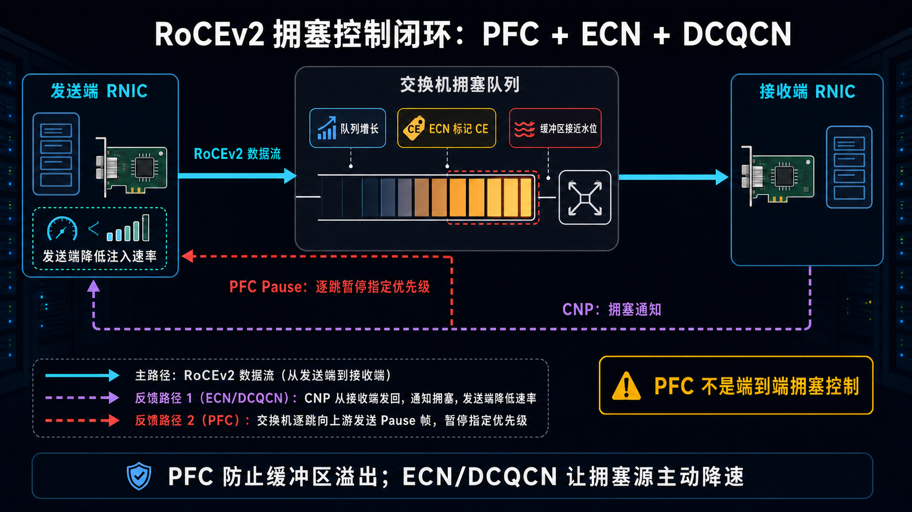

# 一文搞懂 RDMA：让网络数据直达内存的高速通道


> 阅读提示：第一次接触 RDMA，先把三件事看懂就够了：数据为什么要少绕路、MR/QP/CQ 分别做什么、Send/Write/Read 有什么区别。连接状态机、拥塞控制和性能调优可以第二遍再看。

大模型训练时，节点之间要同步梯度、交换激活值、分发 MoE token。

分布式存储里，一台服务器也要不断读写另一台服务器上的数据。

当网络只有几 Gb/s 时，大家最关心的通常是：

```text
网线够不够快？
交换机背板够不够宽？
```

但进入高速网络后，另一个问题会越来越明显：

**数据已经到服务器了，为什么还要在操作系统、CPU 和内存之间绕这么多路？**

传统 Socket 通信的概念路径大致是：

```text
发送端应用内存
    -> 系统调用
    -> 内核 Socket Buffer
    -> TCP/IP 协议栈
    -> 网卡驱动
    -> NIC
    -> 网络
    -> 对端 NIC
    -> 对端内核协议栈
    -> 对端 Socket Buffer
    -> 接收端应用内存
```

现代操作系统和网卡已经有很多零拷贝与卸载优化，真实路径不一定每次都完整复制这么多遍。

但这张图仍然能说明核心问题：

```text
传统网络把内核协议栈放在数据快路径上
数据处理、内存复制和上下文切换都会消耗 CPU 与内存带宽
```

RDMA 要解决的，就是这条数据路径过长的问题。

一句话总结：

> RDMA 让应用把通信任务直接交给支持 RDMA 的网卡，由网卡在两台主机的已注册内存之间搬运数据；数据快路径通常绕过内核协议栈，从而减少复制、CPU 处理和上下文切换。

注意这里说的是“减少”，不是让 CPU、内核和数据搬运全部消失。

---

## 一、RDMA 到底是什么？

RDMA 的全称是：

```text
Remote Direct Memory Access
远程直接内存访问
```

先拆开看。

### 1. DMA：设备直接访问本机内存

普通 DMA 解决的是本机设备与内存之间的数据搬运。

例如网卡收到数据后，可以通过 DMA 把数据写入主机内存，而不需要 CPU 执行一条循环，逐字节完成复制。

```text
CPU：告诉 DMA Engine 搬什么、搬到哪里
DMA：真正执行大块数据搬运
```

CPU 仍负责配置和管理，数据搬运主要由硬件完成。

### 2. RDMA：把 DMA 能力延伸到网络另一端

RDMA 进一步把这件事扩展到两台机器：

```text
节点 A 应用内存
    -> 节点 A 的 RDMA 网卡
    -> RDMA 网络
    -> 节点 B 的 RDMA 网卡
    -> 节点 B 应用内存
```

应用提前准备并注册好内存，建立通信队列。

数据传输时，应用只需要向队列提交一个请求，RDMA 网卡就可以完成后面的搬运。

### 3. RDMA 不是“远程主机的任意内存都能访问”

这点非常重要。

如果要允许对端执行 RDMA Read、Write 或 Atomic，远程应用必须先：

```text
1. 准备一块内存
2. 把它注册为 Memory Region
3. 设置允许的访问权限
4. 把必要的地址、范围和访问密钥交给通信对端
```

对端只能在授权范围内访问。

Send/Recv 不需要把远程地址和 rkey 暴露给发送方；它使用的是接收方提前提交到 RQ 或 SRQ 的 Buffer。

所以 RDMA 的“直接”，指的是数据快路径直接，不是绕过权限随意读写远程机器。

---

## 二、RDMA 为什么快？

通常会看到三个关键词：

```text
Zero-copy
Kernel bypass
Transport offload
```

它们分别解决不同问题。

### 1. Zero-copy：减少中间复制

传统网络经常需要在应用缓冲区、内核缓冲区和网卡缓冲区之间搬数据。

RDMA 让网卡可以直接 DMA 访问应用注册的内存：

```text
传统概念路径：
应用 Buffer -> 内核 Buffer -> NIC -> 网络 -> 内核 Buffer -> 应用 Buffer

RDMA 数据路径：
已注册应用 Buffer -> RNIC -> 网络 -> RNIC -> 已注册应用 Buffer
```

这里的 zero-copy 不是“数据没有移动”。

数据仍然要经过 PCIe、网卡、线缆和交换机。

它真正表达的是：

```text
尽量不再为了经过软件协议栈而做额外的中间内存复制
```

### 2. Kernel bypass：数据快路径绕过内核

RDMA 的资源创建仍然需要内核参与，例如：

```text
打开设备
创建保护域
注册内存
创建队列
建立连接
处理异常
```

这些属于控制面和慢路径。

但队列准备好以后，用户态程序通常可以直接向映射的硬件队列提交工作，再直接轮询完成队列：

```text
用户态应用 -> 提交 WQE -> RNIC 执行 -> 读取 CQE
```

正常数据快路径不需要每次都陷入内核，也不需要每条消息都经过完整的内核网络协议栈。

### 3. Transport offload：把协议处理交给网卡

RDMA 网卡通常被称为：

```text
RNIC：RDMA Network Interface Card
HCA：Host Channel Adapter
```

在不同技术体系和文档中，两个词的使用习惯略有差异。入门阶段可以先把它们都理解为支持 RDMA 的高性能网络适配器。

它不只负责收发比特，还会在硬件里处理很多工作：

```text
队列调度
地址转换与权限检查
分包与组包
可靠传输与重传（取决于传输类型）
数据直接放置
完成通知
```

于是 CPU 可以把更多时间留给模型计算、存储逻辑或业务线程。

### 4. RDMA 不等于零 CPU

更准确的说法是：

```text
CPU 负责准备、协调和收尾
RNIC 负责数据快路径上的大块搬运与协议处理
```

而且追求极低延迟时，应用经常会用一个 CPU 核持续轮询 CQ。

这种方式减少了中断唤醒延迟，却不代表不消耗 CPU。

---

## 三、先看懂 RDMA 的对象模型

刚接触 RDMA 时，最难的往往不是网络报文，而是一串缩写。先别急着全部记住，第一次只要记住下面三个主角：

```text
MR：网卡被允许访问的那块内存
QP：应用把通信任务交给网卡的工作队列
CQ：应用查看“任务完成了吗”的回执队列
```

其余缩写会在后文用到时再解释：

```text
PD、MR、QP、SQ、RQ、CQ、WR、WQE、CQE、SGE、lkey、rkey
```

先看图，再看文字关系：


现在再把它们放进一张关系图：

```text
应用进程
   |
   +-- Device Context：打开的 RDMA 设备上下文
   |
   +-- PD：保护域
       |
       +-- MR：注册内存
       |    +-- lkey：本地访问密钥
       |    +-- rkey：远程访问密钥
       |
       +-- QP：队列对
            +-- SQ：发送工作队列
            +-- RQ：接收工作队列

CQ：完成队列，可与一个或多个 QP 关联
```

下面逐个解释。

### 1. Device Context：先打开一张 RDMA 网卡

应用通常通过 `libibverbs` 使用 RDMA 设备。

第一步是枚举设备并打开其中一张网卡，得到 Device Context。

它可以理解成：

```text
这个进程接下来要操作哪一张 RDMA 设备
```

### 2. PD：Protection Domain，保护域

PD 是一组 RDMA 资源的保护边界。

MR、QP 等对象会归属于某个 PD。只有关系匹配的资源，才能一起完成合法访问。

可以把 PD 理解成一个仓库园区：

```text
属于同一园区的仓库、车辆和通行证才能互相配合
```

### 3. MR：Memory Region，注册内存区域

RNIC 不能直接拿一个普通用户态指针就去 DMA。

应用需要先把一段内存注册成 MR：

```text
起始地址
长度
本地写权限（本地读通常隐含允许）
是否允许远程读
是否允许远程写
是否允许远程原子操作
```

注册完成后，应用会拿到两个重要字段：

| 字段 | 用途 |
|---|---|
| `lkey` | 本地 RNIC 访问本地 Buffer 时校验 |
| `rkey` | 远程发起方执行 RDMA Read、Write 或 Atomic 时校验 |

执行单边操作时，对端通常需要知道：

```text
remote_addr + rkey + length
```

也就是“远程地址、访问密钥和可访问范围”。

这里顺便纠正一个常见误区：

**注册内存不要求整块虚拟内存在物理上形成一段连续的大块。**

传统注册方式通常会固定相关页面，并建立供 RNIC 使用的页表、Scatter/Gather 或 IOMMU 映射；较新的 On-Demand Paging 还可以按需建立映射。

应用看到的可以是一段连续虚拟地址，底层物理页不必是单个连续区间。

初次阅读可以先跳过 ODP。它是一种“需要用到页面时再建立映射”的进阶能力，需要网卡、驱动和内核共同支持；首次访问可能带来额外延迟。

### 4. QP：Queue Pair，队列对

QP 是 RDMA 通信里最核心的对象。

一个 QP 通常包含两条工作队列：

```text
SQ：Send Queue，发送队列
RQ：Receive Queue，接收队列
```

可以把 SQ 想成“待办工作队列”：应用要做的主动通信任务都从这里提交。

下面这些主动操作通常都提交到 SQ：

```text
Send
RDMA Write
RDMA Read
Atomic
```

RQ 则像“提前摆好的收件箱”，主要服务 Send/Recv，以及需要远端接收通知的 Write with Immediate。多个 QP 也可以按需共享一个 SRQ；第一次阅读时，把它理解成“共享收件箱”即可。

### 5. CQ：Completion Queue，完成队列

RDMA 操作是异步的。

应用提交请求后不用站在原地等网卡搬完，可以继续做其他事情，之后再从 CQ 查看结果。

```text
应用提交 WR
    -> RNIC 执行
    -> RNIC 按完成通知策略生成 CQE
    -> 应用轮询或等待 CQ
```

一个 CQ 可以服务一个或多个 QP。

### 6. WR、WQE、CQE 和 WC

这些词经常成组出现：

| 名词 | 含义 |
|---|---|
| WR | Work Request，应用提交的一项工作请求 |
| WQE | Work Queue Element，队列中的硬件工作条目 |
| CQE | Completion Queue Element，完成队列中的硬件条目 |
| WC | Work Completion，应用轮询 CQ 后看到的完成结果 |
| SGE | Scatter/Gather Element，描述一段 Buffer 的地址、长度和 lkey |

可以用快递类比：

```text
WR：寄件请求
WQE：进入分拣线的工单
RNIC：自动分拣与运输系统
CQE/WC：硬件完成或失败回执
```

### 7. 整个队列模型怎么运转？

核心循环只有四步：

```text
1. 应用生产 WR，提交到 SQ 或 RQ
2. RNIC 消费 WQE 并执行数据传输
3. 需要通知的 WR 完成后，RNIC 把结果写入 CQ
4. 应用消费 WC，回收 Buffer 和队列资源
```

先记住一句话：**把任务放进队列，不等于任务已经做完；CQ 才是查看结果的地方。**

开发时还会遇到 CQE、`IBV_SEND_SIGNALED`、Flush 等细节。它们决定网卡何时生成完成记录，初次理解 RDMA 时不必先钻进去。

这就是 RDMA 所谓的 Verbs 编程模型。

Verbs 不是什么网络协议，它更像一组操作 RDMA 设备的标准动作，例如：

```text
注册内存
创建 QP
提交 Send
提交 RDMA Write
轮询 CQ
```

---

## 四、RDMA 的四类核心操作语义

RDMA 最容易混淆的地方，是 Send/Recv、Write 和 Read 看起来都像“发数据”，但它们决定的是数据放在哪里、谁需要提前准备、谁会收到通知。

四类核心操作是 Send/Recv、Write、Read 和 Atomic；其中 Write with Immediate 是 Write 的“带通知”变体。

### 1. Send/Recv：双方都参与的双边操作

Send/Recv 和消息通信最接近。

接收方必须先向 RQ，或 QP 关联的 SRQ，提交 Receive WR：

```text
接收方：我提前放好一个可接收 Buffer
发送方：向我的 SQ 提交 Send
RNIC：把消息写入接收方预先准备的 Buffer
接收方：看到 Receive completion
发送方：仅在该 Send 请求了完成通知时看到成功 completion
```

路径可以画成：

```text
发送端 SQ -- Send --> 网络 --> 接收端 RQ 中的 Buffer
      |                               |
   发送 CQ                         接收 CQ
```

如果发送方的消息已经到达，但接收方没有提前 Post Receive，可靠连接可能出现 RNR，也就是 Receiver Not Ready。

所以 Send/Recv 的关键是：

```text
发送方要发
接收方也要提前准备
```

### 2. RDMA Write：把本地数据推到远程内存

RDMA Write 是典型的单边操作。

发送方需要知道远程的：

```text
remote_addr
rkey
```

然后直接把本地 Buffer 写进远程 MR：

```text
本地 Buffer -- RDMA Write --> 远程指定地址
```

普通 RDMA Write 不需要远程应用为这次传输 Post Receive，也通常不会给远程应用生成一次接收完成通知。

这意味着数据写到了，不等于远程业务线程已经知道或已经消费了它。

实际协议通常还需要额外的通知或状态同步，例如：

```text
再发一条 Send
使用 Write with Immediate
更新一个双方约定的门铃字段
通过上层协议交换状态
```

#### Write with Immediate：写数据，再带一个通知

Write with Immediate 仍然把主体数据写到 `remote_addr` 指向的 MR。

同时，它会携带一个 32 位 Immediate Data。在操作成功且远端预先提交了 Receive WR 时，远端会生成一个 Receive CQE；应用仍需要轮询 CQ，或正确使用 Completion Channel，才能处理这条通知。

```text
数据：写到远程指定 MR
立即数：出现在远端完成记录中
```

远端需要在 RQ 或 SRQ 提前准备一个 Receive WR 来接住这次通知；该 Receive WR 会被消耗，但主体数据并不是放进它描述的接收 Buffer，而是放进 Write 指定的远程地址。

它很适合表达：

```text
“第 17 号 Buffer 已经写好，可以处理了”
```

### 3. RDMA Read：从远程内存拉数据

RDMA Read 是 Pull：

```text
远程 MR -- RDMA Read --> 本地 Buffer
```

发起方同样需要远程地址和 rkey。

数据由 RNIC 拉回本地，完成通知出现在发起方 CQ；远程应用通常不会因为这次 Read 收到一条工作完成。

### 4. Atomic：远程原子操作

常见原子操作包括：

```text
Fetch and Add
Compare and Swap
```

它们可以对远程注册内存中的小字段执行原子更新，常用于计数器、锁或分布式协调。

是否支持、支持哪些宽度与扩展能力，要看传输类型和网卡能力。

### 5. 四种核心语义放在一起

| 操作 | 方向 | 需要远端 Post Receive | 需要远程地址和 rkey | 远端应用通常收到 CQ 通知 |
|---|---|---:|---:|---:|
| Send/Recv | Push 消息 | 是 | 否 | 是 |
| RDMA Write | Push 数据 | 否 | 是 | 否 |
| Write with Immediate | Push 数据 + 通知 | 是，接通知 | 是 | 是 |
| RDMA Read | Pull 数据 | 否 | 是 | 否 |
| Atomic | 远程原子更新 | 否 | 是 | 否 |

### 6. “提交成功”和“操作完成”不是一回事

`ibv_post_send()` 返回成功，只表示“任务已放进工作队列”，不表示网络操作已经完成。

真正要确认结果时，还要从 CQ 取回完成记录，并检查 `WC.status`：

```text
Send / Write 的成功本地 WC：
该 WR 已按传输语义完成，相关本地源 Buffer 可以安全复用

Read 的成功本地 WC：
远程数据已经放进本地目标 Buffer

Receive 的成功 WC：
Send 数据已经放进接收 Buffer

Write with Immediate 的远端 Receive WC：
主体 Write 已放进指定远程地址，并且 32 位 Immediate Data 有效
```

`unsignaled SQ WR` 是性能调优中的进阶概念。只要先记住：没有看到完成记录，就不要急着复用这块 Buffer。

无论哪一种硬件完成，都不等于业务已经确认、连接故障后仍具备 exactly-once、下游计算已经开始使用数据，或数据已经持久化到存储介质。

可以这样记：

```text
Send/Recv：把数据交给“对方准备的收件箱”
Write：把数据放进“对方授权的指定货架”
Read：从“对方授权的指定货架”取货
```

这里的“单边”只描述数据操作阶段。

在操作之前，双方仍然要完成连接建立、内存准备和上层协议协调；单边 Read、Write、Atomic 还要额外交换远程地址、范围与 rkey。

---

## 五、RC、UC、UD：QP 也有不同运输模式

创建 QP 时，还要选择传输类型。第一次接触 RDMA 时，重点理解 RC 就够了；它是 AI、HPC 和存储场景里最常用的可靠连接。

最常见的是：

```text
RC：Reliable Connection
UC：Unreliable Connection
UD：Unreliable Datagram
```

### 1. RC：可靠连接

RC 是最常见的模式。

特点是：

```text
一个 QP 与对端一个 QP 建立连接
可靠传输
按序交付
支持重传
支持 Send/Recv、Read、Write 和 Atomic
```

它的语义有点像 TCP，但实现和 API 并不是 Socket/TCP。

这里的可靠与按序，是单个 QP 的传输层语义。它不提供连接故障后的业务 exactly-once，也不替代跨 QP、跨处理器的可见性和持久化顺序；Atomic 能力还取决于设备支持。

AI 通信、HPC 和存储场景里，大量数据通路都会使用 RC。

### 2. UC：不可靠连接

UC 也是一对一连接，但不做 ACK 和重传，因此不保证可靠交付。

```text
支持 Send/Recv
支持 RDMA Write
不支持 RDMA Read 和 Atomic
```

丢失可能不会被发送端获知，多包 RDMA Write 还可能已经放置了部分数据。上层需要自行设计校验、序号、确认和恢复，因此通用应用里不如 RC 常见。

### 3. UD：不可靠数据报

UD 更像 UDP：不先建立固定连接，消息也不保证可靠到达或按序到达。

```text
一个 QP 可以向多个 UD QP 发消息
不保证可靠性
不保证顺序
只支持 Send/Recv
单条消息受路径 MTU 限制
支持多播
```

它适合小消息、发现、控制面或对连接规模敏感的场景。

### 4. 放在一张表里

| 模式 | 是否连接 | 可靠与有序 | Send/Recv | Write | Read | Atomic | 常见印象 |
|---|---|---|---:|---:|---:|---:|---|
| RC | 一对一 | 是 | 是 | 是 | 是 | 是 | 功能最完整，最常见 |
| UC | 一对一 | 否 | 是 | 是 | 否 | 否 | 上层自行处理错误 |
| UD | 无连接，可多对多 | 否 | 是 | 否 | 否 | 否 | 小消息、多播 |

此外还有 XRC、DC 等面向连接规模和资源共享的机制。它们不影响理解 RDMA 的基本主线，第一次阅读可以先略过。

---

## 六、InfiniBand、RoCE 和 iWARP 是什么关系？

RDMA 是一种通信能力和语义，不是一根特定线缆，也不等于某一种交换机。

常见承载方式有三类：

```text
InfiniBand
RoCE
iWARP
```

### 1. InfiniBand：原生为高性能通信设计的 Fabric

InfiniBand 从架构设计开始就包含 RDMA、队列、服务等级、拥塞管理，以及 RC、UC、UD 等多种传输服务。

它需要 InfiniBand HCA、交换机和相应的 Fabric 管理体系。

可以简单理解为：

```text
RDMA 原生公路系统
```

### 2. RoCE：把 RDMA 承载在以太网上

RoCE 全称：

```text
RDMA over Converged Ethernet
```

它把 InfiniBand 的传输语义承载到以太网上。

RoCE 又分两个常见版本。

#### RoCEv1

```text
Ethernet
  -> RoCE EtherType 0x8915
  -> RDMA Transport
```

它工作在二层，不能像普通 IP 报文一样跨三层路由。

#### RoCEv2

```text
Ethernet
  -> IP
  -> UDP，目的端口 4791
  -> RDMA Transport
```

它可以跨三层网络，也能利用 UDP 源端口提供的流标识参与 ECMP 哈希。

这里不要误解：

**RoCEv2 使用 UDP 封装，不等于应用在用普通 UDP Socket，也不等于 RC 的可靠性由 UDP 提供。**

UDP/IP 是线上封装；RC 的顺序、确认与重传等语义由 RDMA Transport 和 RNIC 实现。

### 3. iWARP：在 IP/TCP 体系上实现 RDMA

iWARP 的标准协议栈由 MPA、DDP 和 RDMAP 组成，运行在 TCP/IP 之上。

它可以利用普通 IP 路由，可靠与拥塞处理依托 TCP 体系，但端点仍需要支持 iWARP 的 RNIC 或软件实现。

线上使用 TCP，不等于数据走普通内核 Socket 快路径；硬件 RNIC 仍可以提供直接数据放置和用户态快路径。

### 4. 三者对比

| 技术 | 底层网络 | 是否可三层路由 | 主要特点 |
|---|---|---:|---|
| InfiniBand | 专用 InfiniBand Fabric | 通过 IB 自身路由体系 | 原生高性能、生态成熟 |
| RoCEv1 | 二层以太网 | 否 | 报文简单，受限于二层域 |
| RoCEv2 | UDP/IP 以太网 | 是 | 易与数据中心 IP Fabric 融合 |
| iWARP | TCP/IP 以太网 | 是 | 依托 TCP 可靠传输，部署思路接近 IP 网络 |

Verbs 提供内存、队列和数据面操作接口，RDMA CM 负责地址解析与连接管理。它们能屏蔽一部分承载差异，但不同设备、网络和传输类型的能力与运维方式仍不相同。

---

## 七、为什么 RoCE 网络总在谈 PFC、ECN 和 DCQCN？

RDMA 把软件协议栈的大量工作卸载到了硬件。

这会带来极低延迟，也让网络丢包和拥塞更容易直接反映为重传、队列阻塞和尾延迟抖动。

这一节偏网络运维。先记住结论就行：**PFC 防止队列溢出，ECN/DCQCN 让真正造成拥塞的发送端主动降速。**

AI 集群尤其容易出现：

```text
多台 GPU 同时向一个方向发送
All-to-All 突发
参数同步时的 incast
多条大流争抢同一上行链路
```

所以 RoCE 网络不能只做到“IP 能 ping 通”。



### 1. PFC：快满了，先按优先级暂停上游

PFC 是 Priority Flow Control。

当交换机某个优先级的接收队列接近危险水位时，可以向上游发送 Pause：

```text
下游端口拥塞
    -> 发送 PFC Pause
    -> 上游暂停指定优先级
    -> 缓冲区得到喘息时间
```

它是逐跳流控，目的是减少因缓冲区溢出造成的丢包。

但 PFC 不是端到端拥塞控制。

配置不当时，它还可能带来：

```text
Pause 扩散
队头阻塞
无关流被拖慢
极端情况下形成死锁风险
```

所以不能只把 PFC 打开就算完成网络设计。

### 2. RoCEv2 的 ECN：在真正丢包前标记拥塞

ECN 是 Explicit Congestion Notification。

RoCEv2 交换机发现队列持续增长时，不必立刻丢包，可以先在 IP 头的 ECN 字段标记 CE：

```text
交换机：这里开始堵了
接收端：把拥塞信息反馈给发送端
发送端：降低发送速率
```

### 3. DCQCN：让发送端根据反馈主动降速

DCQCN 是 RoCEv2 常见的拥塞控制算法之一。

高层流程是：

```text
交换机拥塞并做 ECN 标记
    -> 接收端 RNIC 看到标记
    -> 返回 CNP
    -> 发送端 RNIC 降低注入速率
    -> 拥塞缓解后再逐步恢复
```

PFC 和 ECN/DCQCN 的职责不同：

```text
PFC：逐跳应急刹车，避免队列溢出
ECN/DCQCN：端到端调速，让拥塞源慢下来
```

### 4. RoCE 是否一定要求全网绝对零丢包？

不应简单回答“是”。

传统生产 RoCEv2 部署通常使用 PFC + ECN 构建近似无损的数据中心网络，因为丢包会明显影响性能。

部分 RoCEv2 平台或部署也支持 PFC-free / lossy 或 semi-lossless 配置。这类方案更依赖 ECN 与端到端调速、RC 已有的重传恢复、合理缓冲和精细调参，不能理解成“新网卡可以随便丢包”。

更准确的工程目标是：

```text
让拥塞可检测、速率可收敛、微突发可吸收、丢包与重传可控
```

到底使用哪一种模式，要以网卡能力、交换机能力、业务流量模型和实测结果为准。

---

## 八、一条 RC 连接是怎么真正跑起来的？

把前面的对象连起来，一条 RC 连接大致经历“准备内存 → 建立队列 → 交换信息 → 提交任务 → 查看完成”这几个阶段。下面的九步是展开版，第一次阅读先抓住这个顺序即可。

### 第一步：发现并打开设备

应用枚举 RDMA 设备，选择端口并打开 Device Context。

### 第二步：创建 PD，注册 MR

```text
PD = 创建保护域
MR = 注册本地 Buffer
得到 lkey / rkey
```

如果要允许远程 Read、Write 或 Atomic，还要在注册时明确设置对应权限。

### 第三步：创建 CQ 和 QP

应用先创建 CQ，再创建 QP，并指定：

```text
SQ 深度
RQ 深度
每个 WR 最多多少个 SGE
发送 CQ 与接收 CQ
QP 类型，例如 RC
```

### 第四步：交换连接元数据

两个端点通常需要通过 TCP、RDMA CM 或其他控制通道交换连接与路径信息：

```text
QP Number
LID 或 GID
Packet Sequence Number
端口与路径信息
```

如果要执行 Read、Write、Atomic 这类单边操作，还要额外交换远程 MR 信息：

```text
remote_addr
rkey
可访问长度与权限约定
```

### 第五步：把 QP 推进到可工作状态

RC QP 常见状态变化是：

```text
RESET -> INIT -> RTR -> RTS
```

其中：

```text
RTR：Ready to Receive
RTS：Ready to Send
```

### 第六步：提前 Post Receive

如果要使用 Send/Recv 或 Write with Immediate，接收端要提前向 RQ 或关联的 SRQ 放入 Receive WR。

### 第七步：向 SQ 提交工作

应用构造 WR 和 SGE，告诉 RNIC：

```text
做什么操作
本地 Buffer 在哪里
长度是多少
远程地址和 rkey 是什么
是否需要生成完成通知
```

然后“敲 Doorbell”，告诉网卡队列里有新工作。

### 第八步：RNIC 执行并写入 CQ

RNIC 取出 WQE，完成 DMA、分包、网络传输、远程放置和可靠性处理。

需要完成通知的 WR 结束后，RNIC 在 CQ 中生成结果；成功的 unsignaled SQ WR 通常不会单独产生 CQE。

### 第九步：应用处理 WC 并回收资源

应用轮询 CQ 或等待事件，检查：

```text
wr_id
status
opcode
byte_len
immediate data
```

然后回收或复用 Buffer、WR 和队列槽位。

用伪代码串起来就是：

```c
context = open_rdma_device();
pd      = alloc_protection_domain(context);
mr      = register_memory(pd, buffer, permissions);
cq      = create_completion_queue(context);
qp      = create_queue_pair(pd, cq, RC);

exchange_connection_info(qp, mr);
move_qp_to_RTS(qp);

post_receive(qp, recv_buffer);   // Send/Recv 场景
post_send_or_rdma(qp, wr);

while (!poll_completion(cq, &wc)) {
    // 当前线程在忙轮询；并行工作需使用其他线程、事件通知或异步调度
}
```

这段代码只是表达顺序，不是可直接编译的 Verbs 程序。

---

## 九、RDMA 很快，但也不是没有成本

RDMA 把很多成本从“每条消息经过内核”转移到了“提前准备资源、管理队列和设计协议”。

### 1. 内存注册有成本

传统 MR 注册通常会涉及：

```text
固定内存页
建立地址转换
把映射下发给 RNIC
分配访问密钥
```

频繁注册和注销小 Buffer，可能把性能优势吃掉。

所以应用不会每发一次小消息就重新注册一次内存，而是倾向于复用。常见优化包括：

```text
预先注册大块 Buffer Pool
长期复用 MR
使用 Memory Window 或 Fast Registration
在适合的设备上使用 ODP
```

### 2. QP 不是无限免费的

每条连接的 QP 都会消耗：

```text
主机内存
网卡片上缓存
队列上下文
连接状态
```

连接数巨大时，QP 上下文可能频繁换入换出，性能反而下降。

这也是 SRQ、XRC、DC 等资源共享机制存在的原因。

### 3. CQ 轮询会占 CPU

忙轮询可以获得低延迟，但会占住 CPU 核。

事件通知更省 CPU，却多了唤醒和中断延迟。

工程上要根据消息速率和延迟目标取舍，而不是一律选择某一种方式。

### 4. Doorbell 和 CQE 也要优化

高消息率下，常见手段包括：

```text
批量 Post 多个 WR
Doorbell batching
小消息使用 Inline Data
不是每个 SQ WR 都请求成功 CQE
控制 CQ moderation
```

少生成不必要的完成记录，可以降低 PCIe 和 CQ 压力。

但 unsignaled 不等于“已经完成”。应用通常等后续 signaled WR 的成功完成，再按同一 SQ 的顺序关系批量回收此前请求及其 Buffer。

### 5. 拓扑仍然决定上限

如果 RNIC 挂在 NUMA0，应用线程和内存却都在 NUMA1，路径可能跨 CPU Socket。

所以还要看：

```text
CPU-NIC NUMA 亲和性
PCIe 代际与链路宽度
网卡端口速率
交换网络是否阻塞
```

### 6. 零拷贝不等于零同步

如果一个 signaled RDMA Write 返回成功 WC，说明该 WR 已按 RC 传输语义报告成功，本地源 Buffer 可以复用；普通 Write 仍不会因此给远端应用产生 Receive WC。

它不等于：

```text
远端业务线程已经看到状态变化
远端程序已经消费数据
数据已经持久化到 SSD
```

应用仍然需要设计所有权、通知、顺序、内存可见性和错误恢复协议。

---

## 十、RDMA 在 AI 集群里处在什么位置？

在多机大模型训练中，使用者通常不会手写 Verbs；PyTorch、NCCL、MPI 或 UCX 会把底层细节封装起来。

更常见的层次是：

```text
PyTorch / JAX / TensorFlow
        |
NCCL / MPI / UCX
        |
RDMA Verbs / RDMA CM
        |
InfiniBand 或 RoCE
        |
HCA / RNIC + 交换网络
```


第一次看这张图时，只沿着中间的软件栈自上而下阅读即可：框架调用通信库，通信库使用 RDMA，RDMA 再使用 IB 或 RoCE 网络。图中绿色的可选路径属于延伸能力，不影响理解本文的通用 RDMA 主线。

RDMA 解决的是跨节点高速数据通道。

NCCL 等通信库还要继续解决：

```text
选哪张网卡
走哪条路径
使用 Ring 还是 Tree
如何把大消息切片与流水化
如何使用多 Rail
如何组织 AllReduce、AllGather、All-to-All
```

## 十一、怎么确认一套 RDMA 环境真的可用？

不要一上来就跑大模型训练。先确认 RDMA 设备、基本连通性和点对点性能，再扩大到多机训练。

建议按层验证。

### 1. 先看设备

```bash
rdma link
ibv_devices
ibv_devinfo
```

InfiniBand 环境还常用：

```bash
ibstat
```

重点确认：

```text
设备是否存在
端口是否 Active
Link Layer 是 InfiniBand 还是 Ethernet
速率和 MTU 是否符合预期
```

### 2. 再测 RDMA CM 连通性

可以使用 `rping` 或示例程序验证连接管理与基本数据路径。

普通 `ping` 成功，只能说明 IP 控制面大致可达，不代表 RDMA QP 一定能建立，更不代表 RDMA 性能正常。

### 3. 用 perftest 分开测操作

常见工具包括：

```bash
ib_write_bw
ib_read_bw
ib_send_bw
ib_write_lat
ib_send_lat
```

分别测 Write、Read、Send 的带宽或延迟，能够更快判断是哪一种语义、哪一个方向出现问题。

具体参数会随工具版本和环境变化，以本机 `--help` 为准。

### 4. RoCE 要检查网络而不只是主机

重点包括：

```text
RoCEv2 的 GID、IP 和路由是否一致
VLAN、PCP、DSCP 与优先级映射是否一致
端到端 MTU 是否一致
PFC 是否只作用于预期优先级
ECN 阈值是否合理
CNP、ECN Mark、PFC Pause、丢包和重传计数
交换机 Buffer 与队列是否持续堆积
```

只看平均带宽不够，还要看尾延迟、重传和 Pause 时间。

### 5. 检查内存锁定与设备权限

传统内存注册会受 `memlock` 限制影响：

```bash
ulimit -l
```

容器里还要确认：

```text
/dev/infiniband/* 是否可见
RDMA Device Plugin 或设备映射是否正确
用户态 verbs 库和驱动是否匹配
```

### 6. 最后才进入多机、多卡和全流量

建议逐步扩大：

```text
单端口点对点
    -> 双端口
    -> 单机多进程
    -> 多机并发
    -> 多 Rail
    -> NCCL collective
    -> 真实训练流量
```

每扩大一层，都保留前一层的基准数据，定位问题会容易很多。

---

## 十二、十个常见误区

### 误区一：RDMA 就是 InfiniBand

不是。InfiniBand 是 RDMA 的一种网络承载；RoCE 和 iWARP 也可以提供 RDMA。

### 误区二：RDMA 完全不需要 CPU

不准确。CPU 仍负责初始化、注册、连接、提交请求、同步、轮询和异常处理。RDMA 主要卸载数据快路径。

### 误区三：Zero-copy 意味着数据没有被搬运

不是。它表示减少额外的中间内存复制，数据仍要穿过主机 I/O 和网络。

### 误区四：注册内存必须物理连续

不是。MR 可以由多个物理页通过页表或 Scatter/Gather 映射组成；传统注册通常固定页面，ODP 则可按需映射。

### 误区五：拿到 rkey 就等于有了完整安全机制

不是。rkey 是内存保护与授权的一部分，不替代身份认证、链路加密、网络隔离和租户安全。

### 误区六：本地 CQ 显示成功，远端应用就已经处理完

不是。完成语义取决于操作类型；业务消费、下游计算和存储持久化都需要上层协议另行确认。

### 误区七：普通 RDMA Write 会自动通知远端应用

不会。需要额外消息、Write with Immediate 或双方约定的通知协议。

### 误区八：RoCEv2 就是普通 UDP

不是。UDP/IP 是报文封装，应用使用的是 RDMA Verbs，可靠连接的传输语义由 RNIC 和 RDMA Transport 实现。

### 误区九：打开 PFC，RoCE 网络就调好了

不够。还要看 ECN、拥塞控制、Buffer、QoS 映射、路由、故障域和业务流量模型。

### 误区十：有 RDMA，应用自然就会变快

不一定。

如果消息太小却频繁注册内存、QP 规模失控、NUMA 绑错、协议通知过多或网络已经拥塞，RDMA 也可能发挥不出优势。

---

## 十三、总结

如果只记五句话：

```text
1. RDMA 让 RNIC 在两台主机的已注册内存之间直接搬数据。
2. 它的核心收益是减少内存复制、内核快路径和 CPU 协议处理，不是让 CPU 完全消失。
3. MR 决定“哪块内存可以访问”，QP 决定“工作从哪里提交”，CQ 告诉应用“工作完成得怎么样”。
4. Send/Recv 是双边消息，Write/Read 是典型单边访问；InfiniBand、RoCE、iWARP 是不同承载方式。
5. 真正的性能取决于内存注册、队列设计、NUMA/PCIe 拓扑、拥塞控制和上层协议，而不只是网卡标称带宽。
```

RDMA 最值得记住的，不是某一条命令或某一个缩写。

而是它重新划分了工作：

**让 CPU 负责控制，让网卡负责搬运，让应用直接面对队列和内存。**

这也是它能够成为 AI 集群、HPC 和高性能存储网络底座的根本原因。

---

## 参考资料

### 规范与官方文档

- [IBTA：InfiniBand Architecture Specification](https://www.infinibandta.org/ibta-specification/)
- [Linux Kernel：Userspace verbs access](https://docs.kernel.org/infiniband/user_verbs.html)
- [Linux RDMA Core：用户态库与工具](https://github.com/linux-rdma/rdma-core)
- [rdma-core / libibverbs：ibv_reg_mr(3)](https://github.com/linux-rdma/rdma-core/blob/master/libibverbs/man/ibv_reg_mr.3)
- [rdma-core / libibverbs：ibv_post_send(3)](https://github.com/linux-rdma/rdma-core/blob/master/libibverbs/man/ibv_post_send.3)
- [NVIDIA：RDMA Aware Networks Programming User Manual](https://docs.nvidia.com/rdma-aware-networks-programming-user-manual-1-7.pdf)
- [NVIDIA：RDMA over Converged Ethernet（RoCE）](https://networking-docs.nvidia.com/mlnxofedswum/24.10-5.1.6.1lts/rdma-over-converged-ethernet-roce)
- [RFC 5040：iWARP 的 RDMAP 协议](https://www.rfc-editor.org/info/rfc5040)
- [RFC 5041：Direct Data Placement over Reliable Transports](https://www.rfc-editor.org/info/rfc5041)
- [RFC 5042：DDP / RDMAP Security](https://www.rfc-editor.org/info/rfc5042)
- [RFC 7306：RDMAP 扩展（Atomic、Immediate Data）](https://www.rfc-editor.org/info/rfc7306)

### 启发性参考

- [【RDMA 学习笔记——基础篇】（1）RDMA 概述](https://blog.csdn.net/qq_54050349/article/details/161665483)
