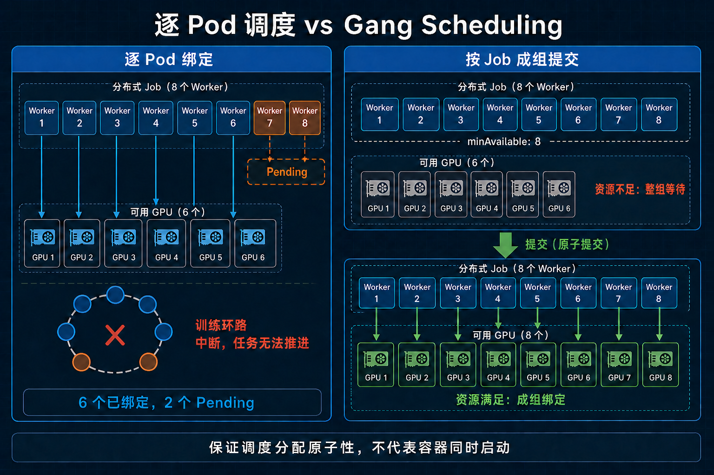
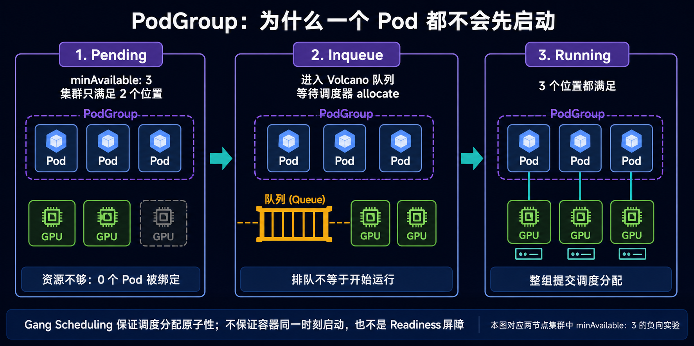
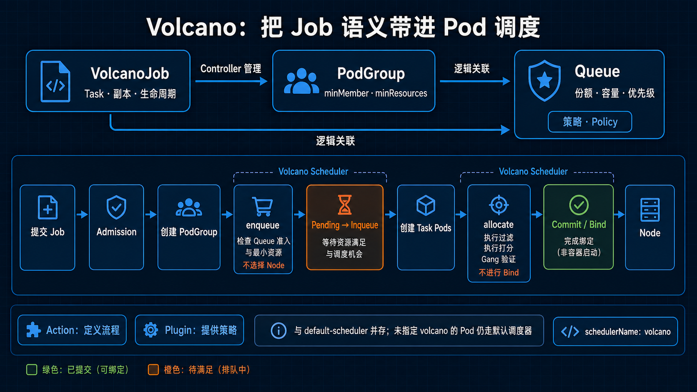
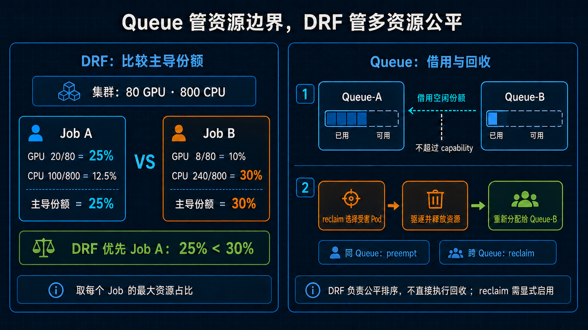
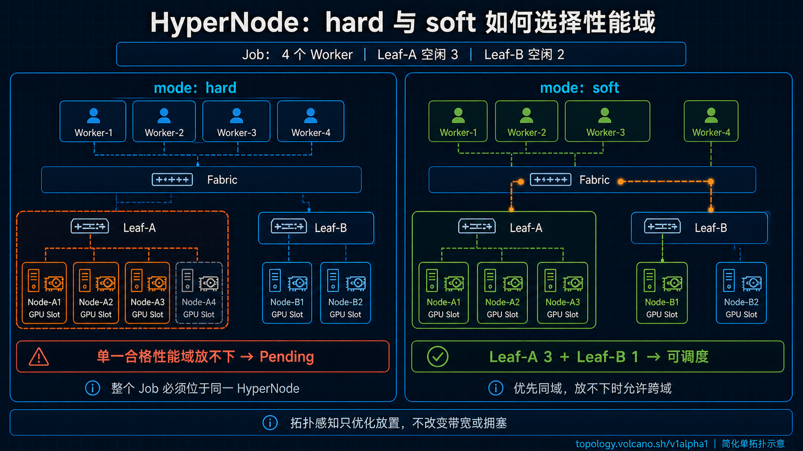
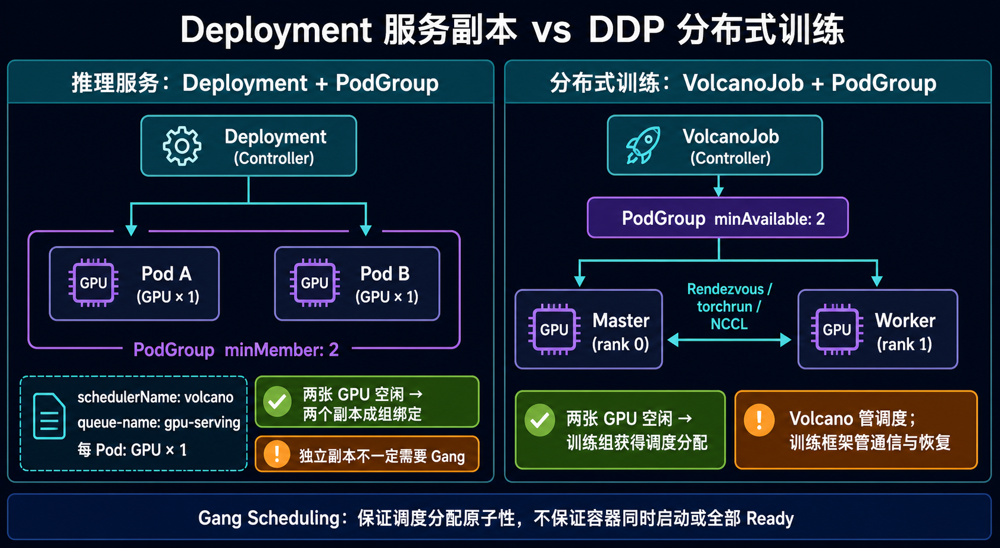

# 一文搞懂 Volcano：Kubernetes 为什么还需要一个 AI 调度器？

假设集群里一共有 32 块 GPU，现在只剩 6 块空闲。此时有人提交了一个需要 8 块 GPU 的分布式训练任务。

如果把这个任务拆成 8 个普通 Pod 交给 Kubernetes 默认调度器，它很可能先把其中 6 个 Pod 调度出去，剩下 2 个继续 Pending。

问题是：这 6 个已经拿到 GPU 的 Worker 并不能真正开始训练。它们只能等另外 2 个 Worker，白白占住 6 块昂贵的 GPU。与此同时，一个只需要 4 块 GPU 的任务也可能因为资源被占而跑不起来。

从单个 Pod 的角度看，调度器没有做错；从整个训练任务的角度看，集群却陷入了“有人占座，没人开饭”的局面。

这正是 Volcano 要解决的问题。



*图 1：Gang 的价值，是避免 GPU 被“已分配但无法产生有效吞吐”的半成品任务占住。它保证最低成员的调度分配原子性，不是容器启动或 Readiness 屏障。*

Volcano 不是另一个 Kubernetes，也不是 GPU 驱动或训练框架。它是运行在 Kubernetes 之上的云原生批处理系统，把调度视角从“一个 Pod 放到哪台机器”提升到了“一个 Job 何时能启动、整个 Job 应该放在哪里、不同团队如何公平共享资源”。

本文从一个最核心的问题开始：**Kubernetes 已经有调度器了，AI 集群为什么还需要 Volcano？**

> 版本说明：本文依据 Volcano v1.15 系列文档编写。截至 2026 年 8 月 10 日，GitHub 最新稳定补丁版本为 v1.15.1。生产环境应固定具体版本，并根据 Kubernetes、设备插件和硬件环境完成兼容性验证。

## 1. 先用一句话认识 Volcano

[Volcano](https://volcano.sh/docs/home/introduction/) 是一个 Kubernetes 原生的高性能工作负载调度与管理系统，面向 AI/ML、大数据和 HPC 等批处理场景。它在 2020 年进入 CNCF，并于 2022 年成为 [CNCF Incubating 项目](https://www.cncf.io/projects/volcano/)。

Kubernetes 默认调度器更擅长处理彼此相对独立的 Pod；Volcano 更理解由多个 Pod 共同组成的 Job。

| 关注点 | Kubernetes 默认调度器 | Volcano |
| --- | --- | --- |
| 基本调度视角 | 单个 Pod | Job、PodGroup、Queue 和 Pod |
| 典型负载 | Web 服务、无状态应用、普通控制器创建的 Pod | 分布式训练、MPI、Spark、Ray、批推理、HPC |
| 多 Pod 成组分配 | 默认不保证 | Gang Scheduling |
| 多租户资源治理 | ResourceQuota、PriorityClass 等通用机制 | Queue、配额、权重、借用、回收和层级队列 |
| 多维资源公平性 | 需要额外设计 | DRF 等插件 |
| 批处理生命周期 | 主要由 Job 或上层 Operator 管理 | VolcanoJob 支持多 Task、重试和事件策略 |
| 网络拓扑感知 | 支持通用亲和性与拓扑约束 | 可使用 HyperNode 表达多级网络拓扑并按 Job 优化放置 |

这里不是说默认调度器“不好”。它解决的是通用 Pod 调度问题，而分布式训练需要的是 **Job 级调度语义**。二者处理的问题层次不同。

安装 Volcano 也不会让它自动接管集群里的所有 Pod。通常它会和 `default-scheduler` 并存：原生工作负载需要在 PodSpec 中把 `schedulerName` 设为 `volcano`，并通过 PodGroup 或 `scheduling.volcano.sh/group-min-member` 注解建立 Job 语义；没有指定 Volcano 的 Pod 仍由默认调度器处理。VolcanoJob 的 `schedulerName` 默认值则是 `volcano`。

## 2. AI 任务为什么不能只按 Pod 调度

### 2.1 一个 Worker 跑起来，不等于训练跑起来

数据并行训练通常包含多个 Worker。它们需要完成 Rendezvous、建立通信组，然后一起进入迭代。只启动一部分 Worker，训练往往无法向前推进。

MPI、参数服务器架构和某些分布式大数据任务也有类似特点：只有关键角色和足够数量的执行进程同时就绪，任务才有运行价值。

默认调度器看到的是：

```text
Pod-0 需要 1 块 GPU
Pod-1 需要 1 块 GPU
...
Pod-7 需要 1 块 GPU
```

Volcano 看到的则是：

```text
这是同一个 Job 的 8 个成员。
至少 8 个成员所需的资源能够一起满足时，才提交这批 Pod 的绑定。
```

这个“成组调度”的语义，就是 Gang Scheduling。

### 2.2 AI 集群面对的不只是“有没有资源”

调度一个普通 Pod，通常先判断节点的 CPU、内存、端口、污点、亲和性和卷是否满足要求，再从候选节点中选一个得分最高的节点。

调度一个大型训练 Job，还要回答更多问题：

- 需要的 GPU 能不能一次凑齐？
- 这批 GPU 属不属于该团队可用的 Queue？
- 两个团队同时排队时，谁先拿资源才公平？
- 应该把任务压紧放置，还是分散放置？
- 8 个 Worker 能否尽量留在同一组 Leaf 交换机下面？
- 高优任务到来时，应该抢占哪些低优任务，才能确保高优任务真的启动？
- 某个 Worker 失败后，是只重启它，还是重启整个 Job？

这些都不是简单的“给 Pod 找节点”。Volcano 的价值，是把这些批处理语义放进同一套调度和 Job 管理体系。

## 3. Volcano 的三个核心对象

理解 Volcano，不必先背所有插件。先抓住 `VolcanoJob`、`PodGroup` 和 `Queue` 三个对象。

### 3.1 VolcanoJob：描述整份计算任务

`VolcanoJob`，命令行里常简称 `vcjob`，是 `batch.volcano.sh/v1alpha1` 下的 CRD。它可以描述：

- 一个 Job 里有哪些 Task，例如 `master`、`worker`、`ps`；
- 每种 Task 有多少个副本；
- Job 的最低可运行成员数是多少；
- Job 属于哪个 Queue、使用哪个优先级；
- Pod 或 Task 失败时如何处理；
- 最大重试次数、卷和辅助插件等。

Kubernetes 原生 Job 通常围绕一个 Pod Template 表达批量或索引化完成语义；VolcanoJob 则可以直接建模多个不同角色的 Task，更适合表达“多个角色共同构成一次高性能计算任务”。

### 3.2 PodGroup：告诉调度器这些 Pod 是一伙的

`PodGroup` 是 `scheduling.volcano.sh/v1beta1` 下的 CRD，也是 Gang Scheduling 的关键载体。

其中最重要的字段是：

- `minMember`：至少要有多少个成员可以运行；
- `minResources`：这组 Pod 成组调度所需的最低资源总量；
- `queue`：属于哪个 Queue；
- `priorityClassName`：这个 PodGroup 的优先级。

如果集群无法满足 `minMember` 或 `minResources`，这组 Pod 就继续等待，而不是先占住一部分资源。

使用 VolcanoJob 时，Controller 会为它管理对应的 PodGroup。原生 Deployment、StatefulSet 等工作负载也可以通过 `schedulerName: volcano` 和相应的 Group 注解接入 Volcano，不一定都要改写成 VolcanoJob。

`PodGroup` 的状态很适合用来定位 Gang Job 卡在了哪里：

| 现象 | 常见含义 | 本文双卡实验中的例子 |
| --- | --- | --- |
| PodGroup `Pending`，甚至还没有 Worker Pod | 整组最低资源需求还不能通过 `enqueue`；Controller 会先等待 | 高优 Job 需要 2 张 GPU，但低优 Job 已占 1 张 GPU |
| PodGroup `Inqueue`，Pod 的 `NODE` 仍是空 | 已通过入队检查，`allocate` 阶段仍无法找到满足整组约束的放置方案 | 3 个 CPU Pod 要求跨 3 台节点，但集群只有 2 台节点 |
| PodGroup `Running` | 已达到 `minMember`，成员完成调度绑定 | 2 个 GPU Worker 分别绑定到两台节点 |

这几个状态描述的是**调度阶段**，不是应用层的就绪屏障。PodGroup `Running` 不代表镜像已经拉完、所有容器都已经 Ready，或 PyTorch/MPI 的通信已经建立。



*图 6：三栏概括的是典型调度状态，并非每个 Job 必然按固定顺序线性流转。本文的两节点反向实验属于中间的 `Inqueue` 情形：3 个成员要求跨 3 个节点运行，但集群只能提供 2 个不同主机的位置，因此整组不会部分绑定。只有最低成员和全部约束都能满足，调度器才会提交绑定。*

### 3.3 Queue：管理团队之间如何分资源

Volcano 的 Queue 不是消息队列，也不天然对应一组物理节点。它是 PodGroup 的逻辑调度队列与资源治理对象。

可以把不同团队或业务映射到不同 Queue，例如：

```text
root
├── training-prod
├── training-dev
├── inference
└── data-processing
```

Queue 可以表达权重、资源上限、保证资源、是否允许其他 Queue 回收借出的资源，以及层级关系。它回答的不是“这个 Pod 放在哪个节点”，而是“这个团队现在应该得到多少资源”。

把三个对象放在一起看：

| 对象 | 可以理解成 | 主要解决的问题 |
| --- | --- | --- |
| VolcanoJob | 一张计算订单 | 任务由哪些角色组成，失败后怎么办 |
| PodGroup | 必须一起出发的车队 | 最低成员所需资源何时能一起凑齐 |
| Queue | 团队的资源账户 | 多团队之间如何分配、借用和回收资源 |

## 4. Volcano 在集群里是怎么工作的

在默认的单集群批处理部署中，Volcano 的经典核心由四部分组成：

| 组件 | 职责 |
| --- | --- |
| `volcano-scheduler` | 运行调度流程，通过 Action 和 Plugin 选择 Job、Task 与节点 |
| `volcano-controllers` | 管理 VolcanoJob、PodGroup、Queue 等 CRD 的生命周期 |
| `volcano-admission` | 校验和变更相关 API 对象，阻止非法配置进入系统 |
| `vcctl` | Volcano 命令行客户端，用于查看和管理 Job、Queue 等对象 |

从 v1.14 开始，Volcano 还提供可选的 Sharding Controller 和面向低延迟工作负载的 Agent Scheduler；它们在 v1.15 仍属于 Alpha 能力，本文不展开。

一个 VolcanoJob 的典型路径如下：

```text
用户提交 VolcanoJob
        ↓
Admission 校验对象
        ↓
Controller 创建和维护 PodGroup
        ↓
Scheduler 读取 Queue、PodGroup 与节点资源状态，执行 enqueue
        使 PodGroup 从 Pending 进入 Inqueue
        ↓
Controller 创建和协调 Task Pod
        ↓
Scheduler 执行 allocate，Plugin 提供过滤、排序与 Gang 判断
        ↓
满足 Gang、Queue 和节点约束后，将 Pod 绑定到节点
```

上面描述的是 VolcanoJob 的典型路径。原生 Deployment、StatefulSet 等工作负载接入 Volcano 时，Pod 与 PodGroup 的创建路径会有所不同，但最终仍由 Volcano Scheduler 依据 PodGroup 和 Queue 语义完成调度。



*图 2：VolcanoJob 描述任务，PodGroup 提供成组门槛，Queue 管理资源份额；Controller 与 Scheduler 再把这些 Job 级语义落实到 Pod 绑定。*

这里最有特点的是 **Action + Plugin** 模型。

Action 决定一个调度周期依次做什么，常见 Action 包括：

| Action | 作用 |
| --- | --- |
| `enqueue` | 判断 Job 是否满足入队条件，把 PodGroup 从 Pending 推进到 Inqueue |
| `allocate` | 为 Task 过滤、评分并选择节点，在满足 Gang 条件后提交绑定 |
| `backfill` | 主要为没有显式资源请求的 BestEffort Pod 选择节点；不是按预计运行时长做经典 HPC 回填 |
| `preempt` | 在同一 Queue 内按优先级处理抢占 |
| `reclaim` | 在不同 Queue 之间回收被借用的资源 |

Plugin 决定这些步骤采用什么算法。常见插件包括：

| Plugin | 主要作用 |
| --- | --- |
| `gang` | 检查 Job 的最小可运行成员或资源是否满足 |
| `priority` | 比较 Job 和 Task 优先级 |
| `drf` | 按主导资源份额改善多维资源公平性 |
| `proportion` / `capacity` | 管理 Queue 的资源份额与容量 |
| `predicates` | 过滤不满足资源、亲和性、卷等条件的节点 |
| `nodeorder` | 对候选节点评分 |
| `binpack` | 倾向把资源压紧放置，减少碎片 |
| `deviceshare` | 配合相应设备插件处理 GPU/vGPU 等设备资源 |
| `network-topology-aware` | 根据 HyperNode 表达的网络层级优化 Job 放置 |

v1.15.1 Helm Chart 默认启用 `priority`、`gang`、`conformance`、`overcommit`、`drf`、`predicates`、`proportion`、`nodeorder` 和 `binpack`。`deviceshare`、`network-topology-aware` 等能力需要按场景显式配置。

下面是一份用于说明结构的简化配置，并不是 v1.15.1 Helm Chart 的完整默认值：

```yaml
actions: "enqueue, allocate, backfill"
tiers:
  - plugins:
      - name: priority
      - name: gang
      - name: conformance
  - plugins:
      - name: drf
      - name: predicates
      - name: proportion
      - name: nodeorder
      - name: binpack
```

这不是一条写死的调度算法，而是一条可以组合的流水线。生产环境不能只因为某个插件“看起来有用”就打开它：Action 的顺序、同一 Tier 内注册的函数，以及 `enqueue` 与抢占/回收逻辑之间的关系，都需要结合实际策略验证。

## 5. 核心能力一：Gang Scheduling

Gang Scheduling 常被翻译为“成组调度”或“组调度”。它的目标可以概括为：**要么满足 Job 的最低成组调度条件，要么先一个都不占。**

假设一个 Job 有 8 个 Worker：

```yaml
spec:
  minAvailable: 8
  tasks:
    - name: worker
      replicas: 8
```

当集群只有 6 块可用 GPU 时，Volcano 不会让 6 个 Worker 长时间占着 GPU 等另外 2 个。等到至少 8 个 Worker 都能获得资源后，再提交这一组分配。

这里要注意两个细节。

第一，`minAvailable` 表示最低成组调度门槛，不一定等于总副本数。如果任务有 8 个 Worker，却把 `minAvailable` 设为 4，那么 4 个成员所需资源一起满足时就可以提交这组分配。只有训练框架真的支持弹性成员时，这样配置才有意义。

第二，Gang Scheduling 解决的是资源原子性，不保证应用一定能成功启动。镜像拉取失败、PVC 挂载失败、Rendezvous 配置错误和容器崩溃，仍然要由对应组件和 Job 策略处理。

它保证的也不是 8 个容器在同一时刻进入 `Running`，而是调度器只有在最低成员所需资源能够一起满足时，才提交这组分配。镜像大小、节点缓存和容器运行时状态仍可能让各 Pod 的实际启动时间有先后。

### 为什么 Gang 能提高利用率

乍看之下，“资源不够就继续等”似乎会降低利用率，实际往往相反。

没有 Gang 时，多个大 Job 可能各自拿到一部分 GPU，却都凑不齐最低启动规模；GPU 看起来已经分配，业务吞吐却是零。有了 Gang 后，调度器可以先让真正凑得齐的 Job 运行，剩余资源再用于其他任务，减少资源被半成品 Job 锁住的情况。

## 6. 核心能力二：Queue 与多租户公平性

AI 集群通常价格昂贵，不可能只服务一个人。真正难的不是把 GPU 分完，而是在下面几件事之间取得平衡：

- 生产训练要有基本保障；
- 研发任务不能无限占用资源；
- 某个团队暂时没任务时，空闲 GPU 可以借给别人；
- 原团队提交任务后，借出去的资源能够按规则回收；
- CPU 密集型和 GPU 密集型任务不能只按单一资源比较。

Volcano 的 Queue、Proportion/Capacity 和 DRF 大致形成三层分工。

### 6.1 Queue：先划定资源治理边界

Queue 可以配置 `weight`、`capability`、`guarantee`、`deserved`、`reclaimable` 等字段。不同插件使用的字段和计算方式不同：

- `proportion` 根据 Queue 权重和集群总资源动态计算应得份额；
- `capacity` 可以更明确地配置应得资源和容量，适合确定性更强的配额模型；
- `capability` 用于限制 Queue 的最大资源使用量；
- `reclaimable` 决定其他 Queue 是否可以从该 Queue 回收超出应得份额的资源。

`capacity` 和 `proportion` 是两套可选的 Queue 容量模型，不能同时启用。v1.15.1 Helm Chart 默认使用 `proportion`，默认 Action 也只有 `enqueue, allocate, backfill`，不包含 `preempt` 和 `reclaim`。因此，仅仅在 Queue 上设置 `reclaimable: true`，并不代表跨 Queue 回收已经生效；还要配置相应 Action 与插件，并评估 `enqueue` 对抢占、回收触发链路的影响。

### 6.2 DRF：不只数 GPU，还看主导资源

DRF 全称 Dominant Resource Fairness，中文常叫“主导资源公平”。

假设集群有 80 块 GPU 和 800 核 CPU：

- Job A 已使用 20 块 GPU、100 核 CPU，占比分别是 25% 和 12.5%，主导资源份额是 25%；
- Job B 已使用 8 块 GPU、240 核 CPU，占比分别是 10% 和 30%，主导资源份额是 30%。

如果只看 GPU，会觉得 Job B 用得更少；如果只看 CPU，又会得出相反结论。DRF 取每个 Job 所占比例最大的资源作为“主导资源”，优先考虑主导份额更小的一方，避免某类任务靠独占某一种资源获得不公平优势。

### 6.3 Preempt 和 Reclaim 不是一回事

这两个词经常被混用：

- `preempt` 主要处理同一 Queue 内的优先级抢占；
- `reclaim` 主要处理不同 Queue 之间的资源回收。

例如开发 Queue 在生产 Queue 空闲时借用了 GPU；后来生产任务到达，`reclaim` 可以按 Queue 规则收回被借用的份额。若同一个生产 Queue 内高优任务需要资源，则可能通过 `preempt` 选择低优任务作为受害者。

抢占不是越积极越好。分布式训练被逐 Pod 随机驱逐，可能同时破坏多个 Job，还不一定能凑齐高优 Job 所需的资源。Volcano v1.15 引入了 Alpha 阶段的 `gangPreempt` 和 `gangReclaim` Action，会先从 Job/Gang 层面评估受害者，并模拟高优 Gang 是否能整体放下，再决定是否驱逐。

这两个新 Action 需要显式加入调度器配置，并非安装 v1.15 后默认开启。官方也不建议把它们与旧的 `preempt`、`reclaim` 同时放进同一条 Action 列表。生产启用前应阅读对应版本说明并完成压测。



*图 3：Queue 划定资源治理边界，DRF 决定下一份资源优先考虑谁，Reclaim 则在跨 Queue 场景中通过驱逐与释放完成资源让渡。*

## 7. 核心能力三：减少 GPU 和节点碎片

有 8 块空闲 GPU，不代表能运行一个 8 卡 Job。

例如有 4 台 8 卡节点，每台只空闲 2 块，集群总空闲 GPU 的确是 8 块。但如果任务要求单机 8 卡，实际没有任何一台节点满足要求。这就是资源碎片。

`binpack` 插件倾向于优先填充已经使用较多的节点，把空节点或完整资源块保留下来。对于 GPU 集群，它可以把 `nvidia.com/gpu` 等扩展资源加入评分并设置权重，从而减少零散空洞。

不过 Binpack 不是万能的：

- 它依据声明的资源请求做调度，不知道应用真实显存峰值；
- 它不会自动理解 NVLink、NVSwitch 或交换机层级；
- 它无法修复已经被其他长期任务切碎的资源；
- 压得过紧可能扩大单节点故障的影响，也可能与散热、功耗或 I/O 目标冲突。

因此，Binpack 解决的是“资源装箱”问题，网络局部性还要交给拓扑感知能力。

## 8. 核心能力四：让调度器看见网络拓扑

大模型训练中，GPU 是否空闲只是第一步。如果网络中存在不同跳数、链路超卖或局部拥塞，8 个 Worker 留在同一网络性能域，与跨多个 Leaf、甚至跨更高层 Spine 通信，通信代价可能有明显差别。

Kubernetes 原生的节点标签、亲和性和 `topologySpreadConstraints` 可以表达不少规则，但大型 AI 集群的网络通常是多层级的，而且需要以整个 Job 为单位做选择。

Volcano 使用 `topology.volcano.sh/v1alpha1` 下的 `HyperNode` CRD 抽象网络性能域。可以把拓扑组织成类似下面的层级：

```text
Fabric
├── Leaf-01
│   ├── gpu-node-01
│   └── gpu-node-02
└── Leaf-02
    ├── gpu-node-03
    └── gpu-node-04
```

这只是简化的单拓扑示意。Rail-Optimized 多轨网络不一定能还原成一棵这样的物理树，实际应根据真正影响通信性能的域来设计 HyperNode 层级。

配合 `network-topology-aware` 插件，Job 可以选择：

- `hard`：整个 Job 或子组必须放进同一个符合最高 Tier 限制的 HyperNode 性能域，找不到能容纳它的域就继续 Pending；
- `soft`：尽量把整个 Job 放进同一个更近的拓扑域，实在放不下时允许跨域。

一般来说：

- 强同步、通信占比高的训练任务更看重局部性；
- 对启动时间更敏感、能容忍性能下降的任务更适合软约束；
- 硬约束过紧会提高排队时间，软约束过松会增加跨交换机流量。

当前官方文档描述的评分逻辑会倾向更低层级的 HyperNode；同一层级有多个候选域时，也会偏向已经放置了更多同 Job Pod 的域。`network-topology-aware` 不是 Helm 默认启用的插件，需要显式配置。

HyperNode 可以手工创建，也可以通过节点标签或 InfiniBand UFM 自动发现。v1.15 文档中的 RoCE Discoverer 仍标为“暂不支持”，因此 RoCE 集群通常需要先用节点标签、手工对象或自定义 Discoverer 准确表达拓扑。

这项能力的上限取决于拓扑数据质量。如果节点标签、UFM 发现结果或 HyperNode 层级过期，调度器再精细的评分也会建立在错误地图上。

需要强调：**拓扑感知调度只能决定 Pod 放在哪里，不能让一张有损、拥塞或错误配置的网络自动变快。** PFC、ECN、DCQCN、路由、Rail 设计和带宽规划仍属于网络系统本身。



*图 4：Hard 要求整个 Job 或子组装进同一个合格性能域；Soft 优先同域，但必要时允许跨域，以排队时间换取通信局部性。*

## 9. Volcano 与 GPU Operator、Device Plugin 是什么关系

这是最常见的误区之一：安装 Volcano 不等于 Kubernetes 就能使用 GPU。

一条完整的 GPU 链路大致分为下面几层：

| 层次 | 典型组件 | 解决的问题 |
| --- | --- | --- |
| 硬件驱动 | NVIDIA Driver | Linux 能否识别并驱动 GPU |
| 容器设备注入 | NVIDIA Container Toolkit / CDI | 容器能否访问被分配的 GPU |
| 设备发现与分配 | NVIDIA Device Plugin 或 DRA Driver | kubelet 和调度器能否看到、分配设备资源 |
| GPU 软件栈运维 | NVIDIA GPU Operator | 驱动、Toolkit、Device Plugin、监控等组件如何统一部署和维护 |
| 批处理调度 | Volcano | 哪个 Job 何时运行、使用哪些节点、Queue 如何共享资源 |
| 训练执行 | PyTorch、Ray、MPI、Kubeflow Training Operator 等 | 进程如何启动、通信和完成训练 |

Volcano 主要位于“批处理调度”这一层。它可以直接基于 `nvidia.com/gpu` 等扩展资源做决策，但资源必须先由 Device Plugin 暴露出来。

使用 DRA 时，还要部署 DRA Driver，并满足 Kubernetes、容器运行时和 CDI 等前置条件。v1.15 默认开启 DRA 调度集成，部署时应确认它没有被显式关闭；如果希望把 DRA 设备计入 Queue 配额，还需要启用 Capacity 插件的 DRA Queue Quota 参数。

同样，Volcano 的 vGPU 能力也不是单独安装 Scheduler 就自动生效。软件切分或动态 MIG 还需要匹配的设备插件、节点配置和硬件能力。生产环境必须明确整卡、MIG、时间共享或软件 vGPU 各自的隔离边界，不能把“调度器记录了 4 GB 显存”误认为硬件一定完成了强隔离。

## 10. 动手跑一个 2 卡 Gang Job

下面用一份双卡示例走通 Volcano 的安装、Queue 和 Gang Job。它和开头的 8 卡场景原理相同，但更容易复现。示例只验证调度语义，不执行真实分布式训练。

### 10.1 前置条件

开始前应确保：

- 已有可用的 Kubernetes 集群；
- GPU 节点状态为 `Ready`；
- 驱动、Container Toolkit 和 Device Plugin 已正确安装；
- `kubectl describe node` 能看到 `nvidia.com/gpu`；
- 宿主机 NVIDIA Driver 与示例所用 CUDA 12.5 容器镜像兼容；
- Helm 已安装并能访问所需镜像仓库。

先检查 GPU 资源：

```bash
kubectl get nodes \
  -o 'custom-columns=NAME:.metadata.name,GPU_CAPACITY:.status.capacity.nvidia\.com/gpu,GPU_ALLOCATABLE:.status.allocatable.nvidia\.com/gpu'
```

### 10.2 安装 Volcano v1.15.1

通过官方 Helm 仓库安装，并固定本文写作时的最新补丁版本：

```bash
helm repo add volcano-sh https://volcano-sh.github.io/helm-charts
helm repo update

helm install volcano volcano-sh/volcano \
  --namespace volcano-system \
  --create-namespace \
  --version 1.15.1
```

如果节点访问 Docker Hub 超时，不要改用浮动的开发清单。先确认 Helm values 的镜像字段，再固定版本重试。本文的双卡实验集群曾使用下面的镜像代理配置；它只是网络受限环境的示例，不应不加验证地复制到生产环境：

```bash
helm upgrade --install volcano volcano-sh/volcano \
  --namespace volcano-system \
  --create-namespace \
  --version 1.15.1 \
  --set basic.image_registry=m.daocloud.io/docker.io \
  --wait --timeout 10m --atomic
```

检查核心组件：

```bash
kubectl get pods -n volcano-system
kubectl get deployment -n volcano-system
kubectl get crd | grep volcano
```

`volcano-scheduler`、`volcano-controllers` 和 `volcano-admission` 应处于可用状态。

> 生产环境不要直接使用 `master` 分支安装清单。先检查官方 Release Notes、Helm values 和 Kubernetes 兼容性，再固定版本部署。

Volcano v1.15.1 标签下的官方兼容矩阵显示，v1.15 支持 Kubernetes 1.24 至 1.35。这个范围只代表 Kubernetes 版本兼容性，GPU 驱动、Device Plugin、DRA Driver 和其他 Operator 仍需分别核对支持范围。

> 本仓库的双 RTX 3080 Ti 实验集群使用 Kubernetes v1.36.2，已经超出上述兼容矩阵。本文已在该实验环境完成 CPU/GPU Gang、Queue 和 Priority 冒烟验证；这只能说明当前组合在这些路径上可用，**不等于获得 Volcano 对 Kubernetes 1.36 的官方支持**。生产环境请使用受支持的版本组合，或等待官方稳定支持后再部署。

### 10.3 创建训练 Queue

本文双卡实验使用 `gpu-lab` Queue。它只把实验 Job 放入独立的逻辑治理边界，并不把两张 GPU 切成一个物理分区：

保存为 `gpu-lab-queue.yaml`：

```yaml
apiVersion: scheduling.volcano.sh/v1beta1
kind: Queue
metadata:
  name: gpu-lab
spec:
  parent: root
  weight: 1
  reclaimable: true
```

应用并检查：

```bash
kubectl apply -f gpu-lab-queue.yaml
kubectl get queue gpu-lab -o yaml
```

这里的 Queue 只做逻辑归属。若要用 `capability`、`guarantee`、`deserved` 等字段实现容量上限或保底资源，必须同时检查 Scheduler 是否启用对应的 Capacity/Proportion 插件与 Action；`reclaimable: true` 本身不代表已经启用跨 Queue 回收。

### 10.4 提交 2 卡 VolcanoJob

保存为 `gang-gpu-job.yaml`：

```yaml
apiVersion: batch.volcano.sh/v1alpha1
kind: Job
metadata:
  name: gang-gpu-demo
spec:
  schedulerName: volcano
  queue: gpu-lab
  minAvailable: 2
  maxRetry: 3
  policies:
    - event: PodFailed
      action: RestartJob
  tasks:
    - name: worker
      replicas: 2
      template:
        metadata:
          labels:
            app: gang-gpu-demo
        spec:
          restartPolicy: Never
          containers:
            - name: worker
              # 本文双卡实验已验证的 CUDA 样例镜像；请固定自己的训练镜像版本。
              image: nvcr.io/nvidia/k8s/cuda-sample:vectoradd-cuda12.5.0
              command: ["/bin/sh", "-c"]
              args:
                - |
                  /cuda-samples/bin/x86_64/linux/release/vectorAdd
                  result=$?
                  echo "GPU assigned; hold for observation"
                  sleep 300
                  exit ${result}
              resources:
                requests:
                  cpu: "4"
                  memory: 16Gi
                  nvidia.com/gpu: "1"
                limits:
                  cpu: "4"
                  memory: 16Gi
                  nvidia.com/gpu: "1"
```

提交任务：

```bash
kubectl apply -f gang-gpu-job.yaml

kubectl get vcjob gang-gpu-demo
kubectl get podgroup
kubectl get pods -l app=gang-gpu-demo -o wide
```

如果集群能同时提供 2 块满足条件的 GPU，2 个 Worker 会通过 Gang 约束成组获得调度，随后分别启动。如果只剩 1 块可用 GPU，Job 应继续等待，不让 1 个 Worker 长时间占住 GPU。

实际训练时，把示例镜像和命令换成自己的 PyTorch、Ray 或 MPI 启动逻辑，并配置必要的 Service、Rendezvous、存储和容错策略。

### 10.5 双卡实验：实际观察到了什么

下面的结果来自本仓库的两节点实验集群：两台 Ubuntu 22.04 节点各有 1 张 RTX 3080 Ti，GPU Operator 已就绪，节点均可调度。测试前后均检查了 GPU Operator、Volcano 控制面和节点 GPU 资源。

| 实验 | 配置 | 观察结果 | 说明 |
| --- | --- | --- | --- |
| CPU 正向 Gang | `replicas: 2`、`minAvailable: 2`、跨节点硬反亲和 | 两个 Pod 分别落在两个节点并完成 | 满足最低成员后，Volcano 成组绑定 |
| CPU 反向 Gang | `replicas: 3`、`minAvailable: 3`、同样的硬反亲和 | PodGroup `Inqueue`；3 个 Pod 均 Pending、没有 Node | 两个节点无法容纳 3 个不同主机的成员，Volcano 不提交部分绑定 |
| GPU 正向 Gang | 2 个 Pod 各请求 `nvidia.com/gpu: 1`，`minAvailable: 2` | 两个 Pod 分别绑定两台节点；两份 CUDA `vectorAdd` 日志均为 `Test PASSED` | GPU Operator 负责设备注入，Volcano 负责整组放置 |
| Priority 无抢占 | 低优 Job 占 1 GPU；高优 Job 需要 2 GPU | 高优 Job/PodGroup 保持 `Pending`，没有提前创建 Worker Pod | 当前 Action 只有 `enqueue, allocate, backfill`，没有 `preempt` 或 `reclaim` |

CPU 反向实验的事件会出现类似“成员在满足 `minAvailable` 后才可能分配到节点”。重点不是把这句话理解为已预留节点，而是调度器在本轮计算中发现部分成员有候选节点，但整组仍不能提交绑定；这些节点仍可被其他工作负载使用。

GPU 正向实验使用了短暂执行 `vectorAdd`、随后 `sleep` 的容器来观察资源账本。此时容器内的 `nvidia-smi` 可能没有 CUDA 计算进程，但节点的 `Allocated resources` 仍会显示：

```text
nvidia.com/gpu     1           1
```

`Allocatable: nvidia.com/gpu: 1` 是该节点可提供的设备总量，不会因分配而变成 0；调度器计算的剩余量是总可分配量减去活跃 Pod 的 GPU requests。`nvidia-smi` 显示的是瞬时计算进程，两者不能混为一谈。

### 10.6 清理示例

```bash
kubectl delete vcjob gang-gpu-demo
kubectl delete queue gpu-lab
```

如果集群中的其他任务正在使用 `gpu-lab` Queue，不要删除 Queue。

## 11. Job 一直 Pending，应该查什么

Gang Scheduling 的特点决定了：一个约束不满足，整组任务都可能等待。排障时不要只盯着某个 Pod。

### 11.1 先看 Job、PodGroup 和事件

```bash
kubectl get jobs.batch.volcano.sh -A
kubectl describe jobs.batch.volcano.sh gang-gpu-demo

kubectl get podgroups.scheduling.volcano.sh -A -o wide
# PodGroup 名称可能带 UUID；从上一条输出复制实际名称再 describe。
kubectl describe podgroup PODGROUP_NAME -n NAMESPACE

kubectl get events -A --sort-by=.lastTimestamp
```

重点检查 `minAvailable`、`minResources`、Queue 状态和 PodGroup Condition。

先根据对象是否已创建，把问题分到正确阶段：

| 看到的状态 | 优先检查 |
| --- | --- |
| Job/PodGroup 都是 `Pending`，还没有 Task Pod | Queue 是否 `Open`、整组 `minResources`、`enqueue` 是否通过 |
| PodGroup `Inqueue`，Task Pod 是 `Pending` 且没有 Node | GPU/CPU/内存、污点、亲和性、PVC 与 Gang 最低成员数 |
| Pod 已有 Node，但容器未 Ready 或失败 | 镜像拉取、GPU Operator、NVIDIA Runtime、模型进程和 Rendezvous；这已不是 Gang 绑定失败 |

### 11.2 再看节点真实可分配资源

```bash
kubectl get nodes \
  -o 'custom-columns=NAME:.metadata.name,GPU:.status.allocatable.nvidia\.com/gpu'

kubectl describe node YOUR_NODE_NAME
```

`Capacity` 是节点总量，`Allocatable` 是 kubelet 上报给调度器的可分配上限；它不会显示“实时还剩几张 GPU”。还要查看节点的 `Allocated resources`，并从 `Allocatable` 中扣除活跃 Pod 的 GPU requests。`nvidia-smi` 的进程表则只反映此刻是否有 CUDA 计算，并不等于 Kubernetes 已释放 GPU 配额。

### 11.3 检查过滤条件

即使 GPU 数量足够，下面这些条件也可能让节点被过滤：

- Taint 与 Toleration 不匹配；
- NodeAffinity、PodAffinity 或反亲和条件不满足；
- PVC 只能在特定可用区挂载；
- Pod 请求的 CPU 或内存不足；
- Device Plugin 上报的资源名与 YAML 不一致；
- 硬网络拓扑约束找不到满足条件的 HyperNode；
- Queue 已关闭、达到容量上限或没有通过入队检查。

### 11.4 最后看 Scheduler 和 Controller 日志

```bash
kubectl logs -n volcano-system deployment/volcano-scheduler --tail=200
kubectl logs -n volcano-system deployment/volcano-controllers --tail=200
kubectl logs -n volcano-system deployment/volcano-admission --tail=200
```

生产环境应把 Volcano 指标接入监控系统，关注调度吞吐、调度延迟、Pending 原因、Queue 使用量和抢占/回收事件，而不是等用户报告“任务怎么还没跑”才查日志。

## 12. 模型训练和模型部署，应该怎样使用 Volcano

先区分工作负载的生命周期：训练是“凑齐资源后协作执行、完成后退出”，在线模型服务则是“长期运行、持续接收流量”。两者不应因为都使用 GPU 就套用同一种对象。

| 场景 | 推荐对象 | Gang 是否常用 |
| --- | --- | --- |
| 单机或多机分布式训练、评估、离线批推理 | `VolcanoJob` | 是；`minAvailable` 应覆盖真正需要同时工作的角色 |
| 单卡在线推理、多副本可独立接流量 | 原生 `Deployment` | 通常否；任一副本先 Ready 就可以服务 |
| 必须由多个 GPU Rank 共同运行的一组在线推理副本 | 原生 `Deployment` 或上层模型服务 Operator 接入 Volcano | 是；一组 Rank 的 `group-min-member` 应等于其最小可服务成员数 |



*图 7：服务副本只有在成员强耦合时才值得启用 Gang；DDP 训练中的 Rank 则必须一起获得调度分配。Volcano 决定何时、在哪里放置 Pod；Rendezvous、NCCL 通信和故障恢复仍属于训练框架职责。*

### 12.1 用 Deployment 接入 Volcano

原生 Deployment 不必改写成 VolcanoJob 才能使用 Gang。关键字段的位置如下：

```yaml
apiVersion: apps/v1
kind: Deployment
metadata:
  name: gpu-model-demo
  annotations:
    # 由 Volcano 为 Deployment 对应的副本组创建 PodGroup。
    scheduling.volcano.sh/group-min-member: "2"
spec:
  replicas: 2
  template:
    metadata:
      annotations:
        # 可选：让自动创建的 PodGroup 进入指定 Queue。
        scheduling.volcano.sh/queue-name: "gpu-serving"
    spec:
      schedulerName: volcano
      priorityClassName: model-serving-high
      containers:
        - name: model-server
          resources:
            requests:
              nvidia.com/gpu: "1"
            limits:
              nvidia.com/gpu: "1"
```

`group-min-member` 放在 Deployment 自己的 `metadata.annotations`；`queue-name` 放在 Pod Template 的 annotations；`schedulerName` 和 `priorityClassName` 则是 PodSpec 字段。GPU 必须同时写入 requests 与 limits，且数量必须相等。Volcano 会依据最低成员数和 Pod 的 requests 自动生成 PodGroup 的 `minResources`。

如果设置了 `queue-name`，对应 Queue 必须已存在且为 `Open`；如果设置了 `priorityClassName`，也要先创建同名 Kubernetes `PriorityClass`。不需要优先级或独立 Queue 时，删掉这两个可选字段即可。

如果这两个模型副本能独立提供服务，不要为了“看起来更高级”把 `group-min-member` 设为 2。那会让一张 GPU 不可用时，两个副本都无法启动；此时设为 1 或不使用 Gang 更符合在线服务的可用性目标。两 GPU 的强耦合 Deployment 还应评估更新策略：默认滚动更新可能临时需要额外 Surge 副本，在只有两张 GPU 的集群中容易卡住，通常应设计为 `Recreate` 或在更充足的容量中完成滚动更新。

### 12.2 用 VolcanoJob 跑 PyTorch DDP 训练

两台机器各 1 张 GPU 时，一个最小 DDP 训练组可建模为：

```text
master Pod（rank 0，1 GPU） ←── NCCL / TCP ──→ worker Pod（rank 1，1 GPU）
                         minAvailable: 2
```

VolcanoJob 通常定义一个 `master` Task 和一个 `worker` Task，各 1 个副本；`minAvailable: 2` 保证两张 GPU 都能分配时才绑定。Master 通过 Headless Service 提供稳定地址，两个 Pod 分别使用 `torchrun --node_rank=0` 与 `torchrun --node_rank=1` 启动。训练代码仍需由 PyTorch 完成 `torch.distributed.init_process_group(backend="nccl")`、Rank 管理、Checkpoint 和退出逻辑。

Volcano 解决的是“两个 Rank 是否一起拿到资源”；它不会替 PyTorch 配置 Rendezvous、数据集、模型权重、PVC/对象存储或 NCCL 网络。本文两张 3080 Ti 分处两台机器，Gang 可以保证调度成功，但跨节点训练仍依赖 Flannel 网络，性能不能等同于单机 NVLink 或 RDMA 集群。

## 13. 哪些场景值得使用 Volcano

Volcano 特别适合下面这些场景：

- 多机多卡训练需要 Gang Scheduling；
- 多团队共享 GPU、CPU 和内存，需要 Queue 和公平调度；
- MPI、Spark、Ray 等 Job 包含多个协作角色；
- 需要 Binpack、抢占、资源回收或批任务回填；
- 需要按机架、Leaf 或其他网络性能域放置整个 Job；
- 希望用统一方式管理 VolcanoJob 的多 Task 生命周期。

如果集群只有少量彼此独立的单 Pod 任务，默认调度器已经能满足需求，引入 Volcano 反而会增加 CRD、Webhook、策略配置、升级和排障成本。

是否采用 Volcano，不应该只看 GPU 数量，而要看是否出现了 **Job 级调度问题**。

## 14. Volcano 不能替你做什么

为了避免“装完一个组件，期待整套 AI 平台自动出现”，最后再把边界说清楚。

Volcano 不会：

- 安装或修复 GPU 驱动；
- 代替 Container Toolkit、Device Plugin 或 DRA Driver；
- 自动把普通程序改造成分布式训练程序；
- 自动配置 RoCE、InfiniBand、PFC、ECN 或交换机路由；
- 自动保证数据集、Checkpoint 和镜像就近；
- 自动决定业务应该使用整卡、MIG 还是软件 vGPU；
- 替代完善的监控、容量规划、故障恢复和租户治理。

它最擅长的事情，是在已有 Kubernetes、设备和训练软件栈之上，做出更符合批处理语义的资源决策。

## 15. 总结

理解 Volcano，可以记住五句话：

1. Kubernetes 默认调度器主要看 Pod，Volcano 进一步看懂 Job。
2. Gang Scheduling 只在一组协作 Pod 的最低资源能一起满足时提交成组分配，避免 GPU 被半成品任务占住。
3. Queue、DRF、Proportion/Capacity 解决多团队、多资源维度下的分配、公平、借用和回收。
4. Binpack 与网络拓扑感知决定任务不仅“能放下”，还要尽量“放得好”。
5. 训练优先使用 VolcanoJob；独立在线副本优先使用 Deployment，只有强耦合的服务成员才应启用 Gang。

所以，Volcano 并不是把 `default-scheduler` 换个名字。它补上的，是 Kubernetes 在 AI、HPC 和大数据批处理场景中最关键的一层：

> **不只决定一个 Pod 去哪儿，还决定一整支计算队伍什么时候出发、走哪条路，以及谁应该先拿到车票。**

## 参考资料

- [Volcano 官方介绍](https://volcano.sh/docs/home/introduction/)
- [Volcano 架构](https://volcano.sh/docs/home/architecture/)
- [Volcano 安装文档](https://volcano.sh/docs/gettingstarted/installation/)
- [Volcano 入门教程](https://volcano.sh/docs/gettingstarted/tutorials/)
- [VolcanoJob 概念](https://volcano.sh/docs/concepts/volcanojob/)
- [PodGroup 概念](https://volcano.sh/docs/concepts/podgroup/)
- [Volcano Scheduler 工作流、Action 与 Plugin](https://volcano.sh/docs/scheduler/overview/)
- [Volcano Scheduler Actions](https://volcano.sh/docs/scheduler/actions/)
- [Gang Plugin](https://volcano.sh/docs/scheduler/plugins/gang/)
- [DRF Plugin](https://volcano.sh/docs/scheduler/plugins/drf/)
- [Queue 资源管理](https://volcano.sh/docs/keyfeatures/queueresourcemanagement/)
- [Capacity Plugin 用户指南](https://volcano.sh/docs/userguide/user_guide_how_to_use_capacity_plugin/)
- [统一调度与 DRA 配置](https://volcano.sh/docs/keyfeatures/unifiedscheduling/)
- [网络拓扑感知调度](https://volcano.sh/docs/v1.15.0/keyfeatures/networktopologyaware/)
- [Volcano vGPU 用户指南](https://volcano.sh/docs/userguide/user_guide_how_to_use_volcano_vgpu/)
- [PyTorch Distributed 文档](https://docs.pytorch.org/docs/stable/distributed.html)
- [Volcano v1.15.0 Release Notes](https://volcano.sh/blog/volcano-1.15.0-release/)
- [Volcano v1.15.1 GitHub Release](https://github.com/volcano-sh/volcano/releases/tag/v1.15.1)
- [Volcano v1.15.1 与 Kubernetes 兼容矩阵](https://github.com/volcano-sh/volcano/tree/v1.15.1#kubernetes-compatibility)
- [CNCF Volcano 项目页](https://www.cncf.io/projects/volcano/)
