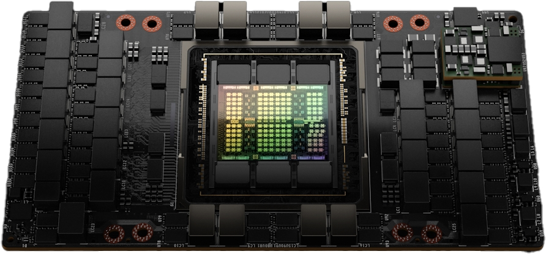
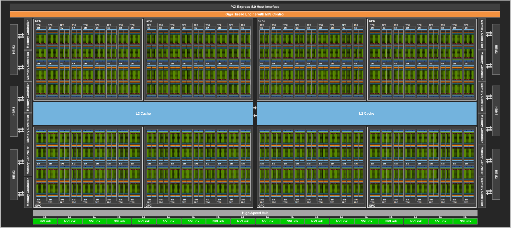
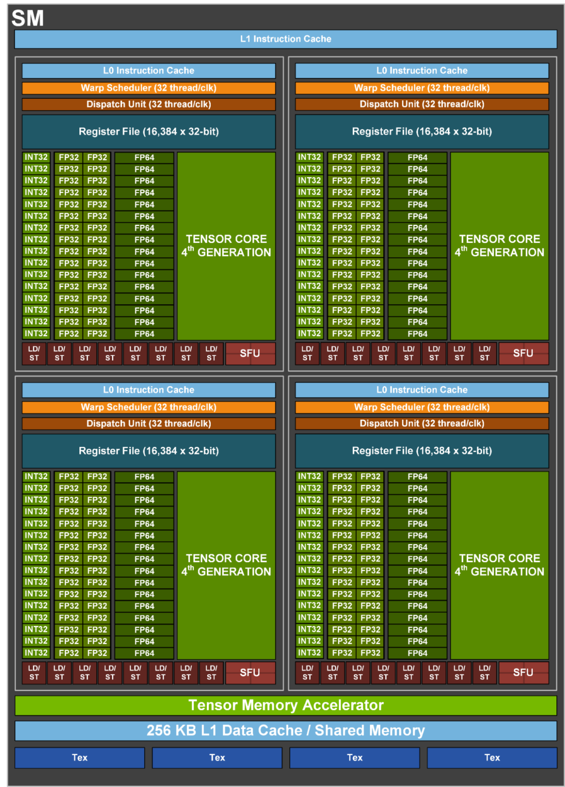
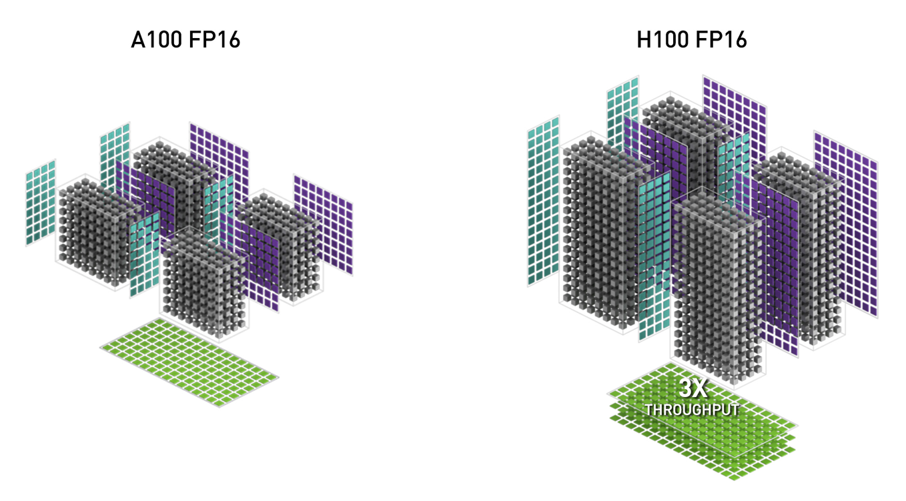
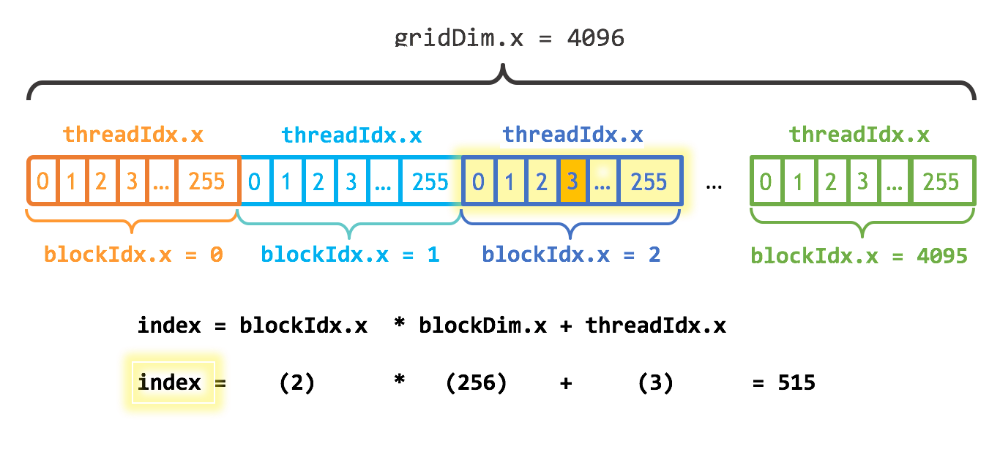
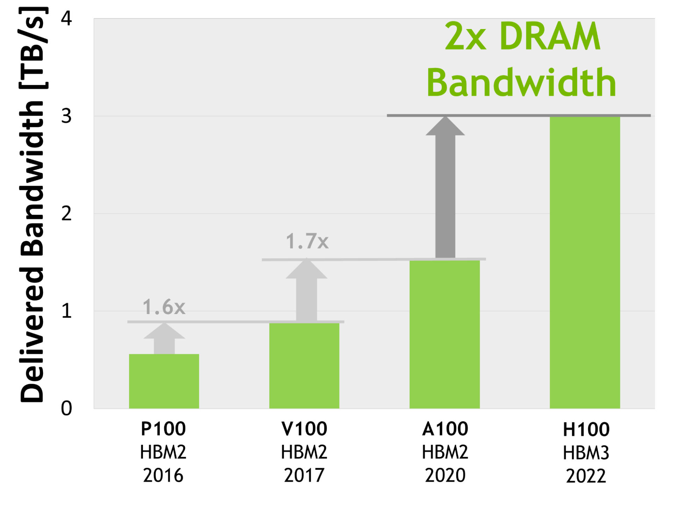

# 一文看懂 GPU：把它想成一支货车车队

很多人第一次看 GPU 参数，容易被这些词绕晕：

```text
SM
CUDA Core
Tensor Core
算力 / TFLOPS
显存容量
显存带宽
功耗 / TDP
Compute Capability
FP16 / BF16 / TF32 / FP8
```

这些词看起来像一堆硬件黑话，但它们其实都在描述同一件事：

> GPU 怎么把海量数据搬进来、分给很多计算单元、并行算完，再把结果搬出去。

如果用一个生活里的类比，可以把 GPU 想成一支专门跑大批量运输的**货车车队**。

数据就是货物，计算就是运输和加工，GPU 的核心能力就是：

```text
车多 = SM / CUDA Core / Tensor Core 多
仓库路宽 = 显存带宽高，数据从 HBM 到计算单元更快
园区高速宽 = PCIe / NVLink 通信带宽高，多卡之间传数据更快
马力大 = 算力高，也就是 TFLOPS / PFLOPS 高
派车快 = SM 调度、Warp 调度、软件栈配合好
专线车效率高 = Tensor Core 对矩阵计算加速强
油耗和散热 = 功耗/TDP 与散热能力，决定能不能长时间满载跑
```

这个类比不能替代硬件手册，但非常适合入门。

---

## 一、CPU 像灵活小车，GPU 像大型车队

CPU 很强，但它更像几辆特别灵活的小车。

它擅长处理复杂路线：

```text
系统调度
业务逻辑
条件判断
网络请求
数据库操作
```

这些任务路线复杂、分支很多，需要反应快、单车能力强。

而 GPU 面对的任务通常不一样。AI 训练和推理里最重的部分，经常是大量规则相似的矩阵计算：

```text
Y = XW：线性层，把输入 X 乘以权重 W
Q × K^T：Attention 里计算 token 之间的相关性
Conv / 卷积：图像、语音等任务里常见的局部特征计算
MLP：多层感知机，大模型里常见的前馈网络
Attention：注意力机制，让模型判断哪些信息更重要
```

这就像仓库里堆着海量货物，路线相对固定，关键是能不能同时派出很多车。

所以可以先这样记：

```text
CPU：少量强核心，适合复杂控制
GPU：大量并行单元，适合批量计算
```



> 图源：NVIDIA Technical Blog，H100 SXM5 模块示意图。本文统一用图片里的 H100 / Hopper 架构做例子。

---

## 二、将GPU 比喻物流园区，SM 比喻一个个车队编组

NVIDIA GPU 里，一个特别关键的概念叫 **SM**：

```text
SM = Streaming Multiprocessor
```

SM 不等于 CUDA Core，也不等于 Tensor Core。

更准确地说：

```text
GPU 里面有很多个 SM
每个 SM 里面又有 CUDA Core、Tensor Core、调度器、寄存器、Shared Memory 等组件
```

用货车类比：

```text
GPU = 整个物流园区
SM = 一个个车队编组
CUDA Core = 普通货车
Tensor Core = 专门跑矩阵乘法的重载专线车
显存 = 大仓库
显存带宽 = 仓库到车队的内部道路宽度
PCIe / NVLink = GPU 园区之间的高速路
```



> 图源：NVIDIA Technical Blog，H100 完整 GPU block diagram。可以把图里的许多 SM 理解成很多个并行车队。



> 图源：NVIDIA Technical Blog，H100 SM 结构图。不同架构的 SM 内部结构不完全一样，但“SM 里包含调度、通用计算、矩阵加速、缓存/共享内存”等理解方式是相通的。

以图片里的完整 H100 结构图为例：

```text
Compute Capability: 9.0
Architecture: Hopper
SM count: 144
```

其中 Compute Capability 是 CUDA 识别 GPU 架构版本的编号；这里的 9.0 对应 Hopper 架构。SM count 表示这张完整 GPU 结构里有 144 个 SM。

如果只是做概念换算，8 个同型号 GPU 就是：

```text
144 SM × 8 = 1152 个 SM
```

这就是多卡机器的基础计算规模：有多少个 SM 可以同时参与计算。

---

## 三、CUDA Core：普通货车，什么活都能干

CUDA Core 可以理解成 SM 里的通用计算单元。

它像普通货车，很多类型的活都能干：

```text
加减乘除
普通 FP32/INT 计算
激活函数
索引操作
数据 reshape
自定义 CUDA kernel
```

CUDA Core 的特点是**通用**。

但通用不等于所有场景都最快。AI 里最重的矩阵乘法，如果只靠普通 CUDA Core，就像用普通货车搬超大宗货物，能搬，但效率不是最高。

以图片里的完整 H100 结构图为例：

```text
每个 SM 有 128 个 CUDA Core
完整结构图里有 144 个 SM
```

所以按完整结构图口径，CUDA Core 数量是：

```text
144 × 128 = 18432
```

如果是 8 个同型号 GPU，合计：

```text
18432 × 8 = 147456 个 CUDA Core
```

---

## 四、Tensor Core：矩阵乘法的重载专线车

Tensor Core 是为了矩阵乘加设计的专用计算单元。

最典型的形式是：

```text
D = A × B + C
```

大模型里大量计算都能转成这种矩阵乘法或类似形式：

```text
Linear：线性层，本质上就是矩阵乘法
Attention：注意力机制，判断哪些 token 更值得关注
MLP：多层感知机，对特征做进一步加工
Conv / 卷积：用小窗口扫描数据、提取局部特征
QK^T：Attention 里的矩阵乘法，用来计算相关性
```

所以可以把 Tensor Core 理解成物流系统里的**重载专线车**：

```text
普通货车：什么都能拉
专线重载车：只适合特定货物和路线，但吞吐极高
```



> 图源：NVIDIA Technical Blog，A100 与 H100 FP16 Tensor Core 对比，用来说明不同架构里的 Tensor Core，结构和吞吐能力会不一样。

以图片里的完整 H100 结构图为例，Tensor Core 数量是：

```text
每个 SM 有 4 个 Tensor Core
完整结构图里有 144 个 SM
```

按完整结构图口径：

```text
144 × 4 = 576 个 Tensor Core
```

如果是 8 个同型号 GPU：

```text
576 × 8 = 4608 个 Tensor Core
```

这里有个很重要的点：

> Tensor Core 数量不是判断强弱的唯一指标。

A100 开始有 TF32、BF16；H100 又进一步引入 FP8 和 Transformer Engine。所以新一代 Tensor Core 数量看起来不一定更多，但单个 Tensor Core 更强，支持的数据类型更多，整体吞吐反而高很多。这就是 GPU 架构版本重要的原因。

---

## 五、算力：这支车队一秒能干多少活

看 GPU 参数时，经常会看到：

```text
TFLOPS
PFLOPS
TOPS
FP32 / TF32 / FP16 / BF16 / FP8
```

这说的就是**算力**。

FLOPS 的意思是：

```text
Floating Point Operations Per Second
每秒能做多少次浮点运算
```

单位可以这样记：

```text
1 TFLOPS = 每秒 1 万亿次浮点运算
1 PFLOPS = 1000 TFLOPS
```

如果继续用货车类比：

```text
CUDA Core / Tensor Core = 有多少车、车是什么类型
算力 = 这些车一秒能完成多少运输任务
```

但 GPU 的算力不能只看一个数字，因为不同数据类型的速度差很多。

可以粗略理解成：

```text
FP32：精度高，但吞吐没那么夸张
TF32：面向 AI 的折中格式，兼顾范围和速度
FP16 / BF16：AI 训练和推理常用，吞吐更高
FP8：H100 这一代重点引入，吞吐更高，但需要软件和模型配合
INT8：常见于推理场景，通常用 TOPS 表示
```

NVIDIA 官方 Hopper 文章给出的 H100 峰值算力大致可以这样看：

| 指标 | H100 SXM5 | H100 PCIe | 怎么理解 |
|---|---:|---:|---|
| Peak FP32 | 60 TFLOPS | 48 TFLOPS | 普通单精度浮点算力 |
| Peak TF32 Tensor Core | 500 / 1000 TFLOPS | 400 / 800 TFLOPS | AI 矩阵计算常用 |
| Peak FP16 Tensor Core | 1000 / 2000 TFLOPS | 800 / 1600 TFLOPS | AI 训练/推理常用 |
| Peak BF16 Tensor Core | 1000 / 2000 TFLOPS | 800 / 1600 TFLOPS | 大模型训练常用 |
| Peak FP8 Tensor Core | 2000 / 4000 TFLOPS | 1600 / 3200 TFLOPS | H100 Transformer Engine 重点能力 |

表里的两个数字，比如：

```text
2000 / 4000 TFLOPS
```

一般可以理解成：

```text
前面：密集计算峰值
后面：开启结构化稀疏后的有效峰值
```

所以 H100 SXM5 的 FP8 Tensor Core 峰值可以写成：

```text
2000 TFLOPS = 2 PFLOPS
4000 TFLOPS = 4 PFLOPS，结构化稀疏场景
```

这里一定要注意：

> 峰值算力不是实际训练速度。

实际训练一个大模型时，还会受到很多因素影响：

```text
模型结构
batch size
算子实现
显存带宽
GPU 间通信
是否用到 Tensor Core
是否支持 FP8 / BF16 / TF32
是否能利用结构化稀疏
```

所以“这张卡有多少 TFLOPS”，更像是在说这支车队的理论最高运力；真正跑起来快不快，还要看路宽不宽、货物有没有准备好、车队之间会不会堵。

---

## 六、线程、Block、Grid：货物怎么分派给车队

CUDA 程序不是直接说“让第 3 个 CUDA Core 去干活”。

它会把任务组织成层级：

```text
Thread  ->  Block  ->  Grid
线程       线程块     整个任务网格
```

其中一个非常重要的单位是 **Warp**：

```text
1 个 Warp 通常是 32 个线程
```

可以粗略理解成：

```text
Thread：一个搬运工
Warp：一组同时行动的搬运工
Block：一支任务小队
Grid：整个任务
SM：执行这些小队的车队编组
```



> 图源：NVIDIA Technical Blog，CUDA grid、block、thread 索引示意图。

CUDA 的调度大致是：

```text
一个 kernel 启动一个 Grid
Grid 被拆成很多 Block
Block 被调度到不同 SM 上执行
SM 内部再调度 Warp
Warp 去使用 CUDA Core / Tensor Core / Load Store 单元等硬件资源
```

所以，当我们说“把 GPU 喂饱”，本质上是在说：

```text
要有足够多的任务
要让足够多的 SM 忙起来
要让 Tensor Core / CUDA Core 有活干
不要让它们一直等数据
```

---

## 七、显存和显存带宽：仓库和道路宽度

GPU 不是只有计算核心。

很多时候，性能瓶颈不在“车不够”，而在“货进不来”。

显存可以理解成 GPU 旁边的大仓库：

```text
模型参数
激活值
梯度
KV Cache
中间 tensor
```

这些都要放在显存里。

显存带宽就是仓库和车队之间的道路宽度。

道路越宽，数据进出越快；道路太窄，再多车也会堵在仓库门口。



> 图源：NVIDIA Technical Blog，H100 HBM3 带宽对比图。不同代 GPU 的显存带宽差距，会直接影响大模型训练/推理的数据供给能力。

这也是为什么 AI GPU 常用 HBM，而不是普通 DDR。

因为 AI 计算很容易出现这种情况：

```text
计算单元很强
但数据搬运跟不上
```

这时候核心数量再多，也可能只是“车队在等货”。

---

## 八、多卡训练：车队之间还要修高速路

单个 GPU 主要看：

```text
SM 数量
CUDA Core / Tensor Core
算力
显存容量
显存带宽
```

多卡训练还要看通信。

因为训练大模型时，GPU 之间经常要同步数据：

```text
梯度 AllReduce
参数 AllGather
激活传递
KV Cache 或 MoE dispatch
```

这时候，GPU 和 GPU 之间的路就很重要：

```text
PCIe
NVLink
NVSwitch
InfiniBand / RoCE
```

如果还是货车类比：

```text
单卡算力 = 每个物流园区内部车队有多强
多卡通信 = 物流园区之间高速路有多宽
```

如果机器是 PCIe 版本，单张 GPU 的计算能力仍然很强，但多卡通信通常不如 SXM / NVLink 形态顺畅。做多卡训练时，如果 batch size、通信算法、拓扑没有处理好，就会出现：

```text
单卡很忙
多卡一同步就慢
```

所以 AI 集群不是“GPU 越多越快”这么简单，还要看拓扑和通信库，比如 NCCL 怎么选路。

---

## 九、看 GPU 参数时，最容易踩的几个坑

到这里，GPU 的主要参数基本串起来了。

但实际看机器、买机器、排查训练速度时，还有几个特别容易混的点。

### 1. 显存占用高，不等于 GPU 很忙

显存占用只是说明：

```text
仓库里放了很多货
```

但 GPU 利用率低，说明：

```text
车队当前没怎么跑起来
```

所以排查性能时，要同时看：

```text
显存占用
GPU 利用率
显存带宽利用率
功耗
温度
PCIe / NVLink 通信
```

显存被占满，可能只是模型或缓存放在里面；真正忙不忙，还要看计算和带宽有没有跑起来。

### 2. 显存容量和显存带宽不是一回事

前面已经讲过：容量管“放不放得下”，带宽管“搬得快不快”。

大模型推理时，显存容量影响模型、KV Cache、batch size 能不能放进去；显存带宽影响数据能不能及时送到计算单元。买卡或排障时，不要只看多少 GB。

### 3. CUDA Core 多，不代表 AI 一定快

AI 训练和推理里，很多核心计算是矩阵乘法。

如果框架和算子能用上 Tensor Core，速度会非常不一样。

所以看 AI GPU，不只看 CUDA Core 数量，还要看：

```text
Tensor Core 是哪一代、支持哪些数据类型
支持哪些精度：TF32 / FP16 / BF16 / FP8 / INT8
实际框架有没有用上这些能力
```

### 4. PCIe、NVLink、NVSwitch 不是显存带宽

显存带宽是 GPU 内部从 HBM 取数据的速度；PCIe / NVLink / NVSwitch 是 GPU 对外通信的速度。

单卡任务更看算力、显存容量、显存带宽；多卡训练更看 GPU 之间的通信。

### 5. L2 Cache 也很重要，但不用一开始就死磕

除了显存，GPU 里面还有缓存。

可以粗略理解成：

```text
Register：计算单元手里正在用的数据
L1 / Shared Memory：SM 旁边的小仓库
L2 Cache：整个 GPU 共享的中转仓
HBM 显存：大仓库
```

缓存的意义是减少反复访问 HBM。

这里先记住一句话：

> 数据如果能在 L2、L1 / Shared Memory 这些更近的“中转仓”里复用，就能减少访问 HBM 大仓库的次数，GPU 也更容易保持忙碌。

### 6. 真实速度还受软件栈影响

同一张 GPU，不同软件环境跑出来可能差很多。

常见影响因素包括：

```text
CUDA 版本
驱动版本
cuDNN / NCCL
PyTorch / TensorFlow 版本
算子是否优化
是否启用 mixed precision
是否启用 FlashAttention / Transformer Engine 等优化
```

所以 GPU 不是插上就自动满血，软件栈也很关键。

### 7. 功耗不是算力，但会影响持续性能

GPU 功耗可以理解成这支车队满载干活时的“油耗”和“发热”。

常见有两个指标：

```text
Power Draw：当前功耗，现在正在消耗多少电
Power Limit / TDP：功耗上限，设计上最多允许跑到多少瓦
```

功耗高，不一定等于性能一定高；但高性能 GPU 满载时，通常需要更高供电和更强散热。

如果供电或散热压不住，就可能出现：

```text
温度升高
频率下降
功耗被限制
GPU 利用率上不去
训练速度不稳定
```

用货车类比就是：

```text
马力大，需要更多油，也会更热
散热不好，就不能一直满油门跑
```

所以排查性能时，不只看 GPU 利用率，也要看功耗、温度和频率。

### 8. 整机形态也会影响性能

同一代 GPU，也可能有不同形态：

```text
PCIe
SXM
NVL
整机 HGX / DGX
```

它们的供电、散热、互联方式可能不同，最终影响：

```text
持续频率
显存带宽
多卡通信
功耗上限
散热压力
```

所以看 GPU，不能只看芯片名字，还要看整机形态。

---

## 十、最后用一张表记住

| GPU 概念 | 货车类比 | 真实含义 |
|---|---|---|
| GPU | 物流园区 | 大规模并行计算设备 |
| SM | 车队编组 | GPU 的主要执行/调度单元 |
| CUDA Core | 普通货车 | 通用计算单元 |
| Tensor Core | 矩阵乘法重载专线车 | 专门加速矩阵乘加 |
| 算力 | 每秒运力 | GPU 每秒能完成多少计算，常见单位是 TFLOPS / PFLOPS |
| 功耗 / TDP | 油耗和散热压力 | GPU 满载时需要多少供电和散热能力 |
| L2 Cache | 园区中转仓 | GPU 内部共享缓存，减少频繁访问显存 |
| 显存 | 仓库 | 存模型参数、中间结果、KV Cache |
| 显存带宽 | 仓库道路宽度 | 数据进出 GPU 的速度 |
| PCIe / NVLink | 园区之间高速路 | GPU 间通信链路 |
| Compute Capability | 车辆/道路标准版本 | CUDA 识别的架构能力版本 |

一句话总结：

> GPU 强，不是因为它像 CPU 一样什么都精通，而是因为它能把海量相似任务拆开，让许多 SM、CUDA Core、Tensor Core 同时开工。

而大模型训练/推理要跑得快，本质就是让这支车队进入理想状态：

```text
货源充足
道路够宽
调度顺畅
普通车不闲着
专线重载车也吃满
```

车队不怕货多。

怕的是没货、堵路、调度乱。

理解了这一点，再看 GPU 参数，就不会只盯着“核心数量”了。

---

## 图片与资料来源

1. H100 GPU 模块图：<https://developer-blogs.nvidia.com/wp-content/uploads/2022/03/SXM5-White-4-NEW-FINAL.jpg>
2. H100 完整 GPU block diagram：<https://developer-blogs.nvidia.com/wp-content/uploads/2022/03/Full-H100-GPU-with-144-SMs.png>
3. H100 SM 结构图：<https://developer-blogs.nvidia.com/wp-content/uploads/2022/03/H100-Streaming-Multiprocessor-SM-1104x1536.png>
4. A100 与 H100 FP16 Tensor Core 对比图：<https://developer-blogs.nvidia.com/wp-content/uploads/2022/03/A100-FP16-vs-H100-FP16.png>
5. HBM 带宽对比图：<https://developer-blogs.nvidia.com/wp-content/uploads/2022/03/Worlds-First-HBM3-GPU-Memory-Architecture-2x-Delivered-Bandwidth.png>
6. CUDA grid/block/thread 示意图：<https://developer-blogs.nvidia.com/wp-content/uploads/2017/01/Even-easier-intro-to-CUDA-image.png>

参考页面：

- NVIDIA Hopper Architecture In-Depth：<https://developer.nvidia.com/blog/nvidia-hopper-architecture-in-depth/>
- An Even Easier Introduction to CUDA：<https://developer.nvidia.com/blog/even-easier-introduction-cuda/>
- CUDA Programming Guide：<https://docs.nvidia.com/cuda/cuda-c-programming-guide/index.html>
- NVIDIA CUDA GPU Compute Capability：<https://developer.nvidia.com/cuda-gpus>
