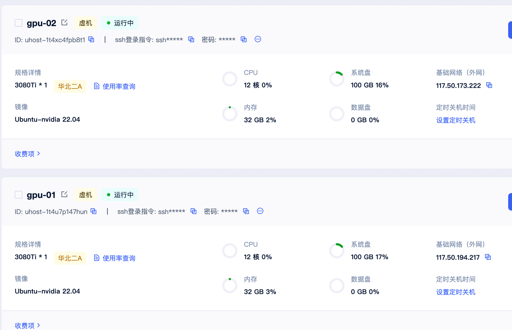

# 用两台 RTX 3080 Ti 学习 Kubernetes GPU 调度

为了学习 Kubernetes 如何调度 GPU 资源，我在优云智算租了两台 GPU 虚拟机。两台机器各有一块 NVIDIA GeForce RTX 3080 Ti，其中一台作为 control-plane，另一台作为 worker。这篇笔记从集群搭建写到 GPU Pod 调度，过程中遇到的镜像下载和 GPU 识别问题也记了下来。



*图：优云智算上的两台实验用 GPU 虚拟机 gpu-01 与 gpu-02。*

| 角色 | SSH 地址 | 主机名 | 内网 IP | CPU / 内存 | GPU | Kubernetes | 状态 |
| --- | --- | --- | --- | --- | --- | --- | --- |
| control-plane（兼工作节点） | `ubuntu@117.50.194.217` | `10-60-50-9` | `10.60.50.9` | 12 vCPU / 31 GiB | RTX 3080 Ti × 1，12,288 MiB | v1.36.2 | `Ready` |
| worker | `ubuntu@117.50.173.222` | `10-60-8-241` | `10.60.8.241` | 12 vCPU / 31 GiB | RTX 3080 Ti × 1，12,288 MiB | v1.36.2 | `Ready` |

两台机器的软硬件配置基本一致：Ubuntu 22.04.4 LTS、Linux 5.15.0-113-generic、containerd 2.2.1、NVIDIA 驱动 570.153.02、NVIDIA Container Toolkit 1.19.1。每个节点都向 Kubernetes 上报了 1 块 GPU。

> 环境主要用于学习，control-plane 也运行普通工作负载。控制平面只有一个实例，不具备高可用能力；没有安装 Dashboard 和 Ingress。

## 1. 部署结果

| 项目 | 配置 |
| --- | --- |
| 操作系统 | Ubuntu 22.04.4 LTS，Linux 5.15.0-113-generic |
| 节点 | 2 台，每台 12 vCPU / 31 GiB |
| GPU | 每节点 1 块 NVIDIA GeForce RTX 3080 Ti，单卡 12,288 MiB |
| NVIDIA 驱动 | 570.153.02 |
| Kubernetes | v1.36.2 |
| containerd | 2.2.1 |
| NVIDIA Container Toolkit | 1.19.1 |
| Flannel | v0.28.7 |
| NVIDIA Device Plugin | v0.17.1 |
| Pod 网段 | `10.244.0.0/16` |
| Service 网段 | kubeadm 默认值 `10.96.0.0/12` |
| 节点状态 | 控制平面 `Ready`，worker `Ready` |
| Kubernetes GPU 资源 | 每节点 capacity `1`、allocatable `1`，集群共 2 块 GPU |

系统 Pod 全部处于 `Running`。两台机器都运行过 CUDA vector-add，测试日志为 `Test PASSED`。

## 2. 登录与基础检查

```bash
ssh ubuntu@117.50.194.217
sudo -n true
lsb_release -a
uname -r
lscpu
free -h
swapon --show
nvidia-smi
```

两台机器的 swap 均未启用。其他环境若开启了 swap，执行：

```bash
sudo swapoff -a
```

并从 `/etc/fstab` 中移除或注释 swap 挂载项，防止重启后重新启用。

## 3. 配置内核模块和网络参数

加载 Kubernetes/containerd 所需模块：

```bash
sudo modprobe overlay
sudo modprobe br_netfilter
```

将模块写入启动配置：

```bash
printf '%s\n' overlay br_netfilter | sudo tee /etc/modules-load.d/k8s.conf
```

配置转发和桥接流量过滤：

```bash
printf '%s\n' \
  'net.bridge.bridge-nf-call-iptables = 1' \
  'net.bridge.bridge-nf-call-ip6tables = 1' \
  'net.ipv4.ip_forward = 1' \
  | sudo tee /etc/sysctl.d/k8s.conf

sudo sysctl --system
```

应用后检查参数：

```text
net.ipv4.ip_forward = 1
net.bridge.bridge-nf-call-iptables = 1
```

## 4. 安装并配置 containerd

```bash
sudo apt-get update
sudo apt-get install -y containerd
sudo mkdir -p /etc/containerd/conf.d
containerd config default | sudo tee /etc/containerd/config.toml >/dev/null
```

主配置需要导入 `conf.d` 下的配置：

```toml
version = 3
imports = ["/etc/containerd/conf.d/*.toml"]
```

containerd 2.x 使用 systemd cgroup：

```toml
[plugins.'io.containerd.cri.v1.runtime'.containerd.runtimes.runc.options]
  SystemdCgroup = true
```

若默认配置为 `false`，修改为 `true` 后启动服务：

```bash
sudo systemctl enable --now containerd
sudo systemctl restart containerd
sudo systemctl is-active containerd
sudo ctr plugins ls | grep cri
```

检查输出中，CRI 的 images、runtime 和 gRPC 插件都应为 `ok`。

## 5. 安装 kubeadm、kubelet 和 kubectl

安装基础工具并加入 Kubernetes v1.36 官方软件源：

```bash
sudo apt-get update
sudo apt-get install -y apt-transport-https ca-certificates curl gpg
sudo mkdir -p -m 755 /etc/apt/keyrings

curl -fsSL https://pkgs.k8s.io/core:/stable:/v1.36/deb/Release.key \
  | sudo gpg --dearmor -o /etc/apt/keyrings/kubernetes-apt-keyring.gpg

echo 'deb [signed-by=/etc/apt/keyrings/kubernetes-apt-keyring.gpg] https://pkgs.k8s.io/core:/stable:/v1.36/deb/ /' \
  | sudo tee /etc/apt/sources.list.d/kubernetes.list

sudo apt-get update
sudo apt-get install -y kubelet kubeadm kubectl
sudo apt-mark hold kubelet kubeadm kubectl
sudo systemctl enable --now kubelet
```

安装后，`kubeadm`、`kubelet`、`kubectl` 都是 v1.36.2，并通过 hold 防止被 apt 自动升级。

## 6. 安装 NVIDIA Container Toolkit

加入 NVIDIA 官方软件源：

```bash
curl -fsSL https://nvidia.github.io/libnvidia-container/gpgkey \
  | sudo gpg --dearmor -o /usr/share/keyrings/nvidia-container-toolkit-keyring.gpg

curl -sL https://nvidia.github.io/libnvidia-container/stable/deb/nvidia-container-toolkit.list \
  | sed 's#deb https://#deb [signed-by=/usr/share/keyrings/nvidia-container-toolkit-keyring.gpg] https://#' \
  | sudo tee /etc/apt/sources.list.d/nvidia-container-toolkit.list

sudo apt-get update
sudo apt-get install -y nvidia-container-toolkit
```

将 NVIDIA runtime 注册到 containerd，并设为默认 runtime：

```bash
sudo nvidia-ctk runtime configure --runtime=containerd --set-as-default
sudo systemctl restart containerd
sudo systemctl restart kubelet
```

检查 containerd 配置：

```text
default_runtime_name = 'nvidia'
BinaryName = '/usr/bin/nvidia-container-runtime'
```

> 故障记录：只注册 NVIDIA runtime、未设为默认 runtime 时，Device Plugin 无法识别 GPU，日志出现 `Incompatible strategy detected auto` 和 `No devices found`。使用 `--set-as-default` 重新配置后恢复正常。

## 7. 修正 containerd 的 pause 镜像

两台服务器访问 `registry.k8s.io` 后端的 `*.docker.pkg.dev` 超时。containerd 2.2.1 默认使用 `registry.k8s.io/pause:3.10.1`，改用阿里云上的同版本镜像，并写入 drop-in 配置：

```bash
sudo ctr -n k8s.io images pull registry.aliyuncs.com/google_containers/pause:3.10.1

printf '%s\n' \
  'version = 3' \
  '' \
  '[plugins."io.containerd.cri.v1.images".pinned_images]' \
  '  sandbox = "registry.aliyuncs.com/google_containers/pause:3.10.1"' \
  | sudo tee /etc/containerd/conf.d/10-sandbox-image.toml >/dev/null

sudo systemctl restart containerd
sudo containerd config dump | grep -A 2 pinned_images
```

检查生效值：

```text
sandbox = 'registry.aliyuncs.com/google_containers/pause:3.10.1'
```

## 8. 拉取镜像并初始化控制平面

由于官方镜像后端一直超时，控制面镜像改从阿里云 `google_containers` 拉取，Kubernetes 版本仍是 v1.36.2：

```bash
sudo kubeadm config images pull \
  --kubernetes-version v1.36.2 \
  --image-repository registry.aliyuncs.com/google_containers \
  --cri-socket unix:///run/containerd/containerd.sock
```

初始化集群：

```bash
sudo kubeadm init \
  --kubernetes-version v1.36.2 \
  --image-repository registry.aliyuncs.com/google_containers \
  --pod-network-cidr=10.244.0.0/16 \
  --cri-socket unix:///run/containerd/containerd.sock
```

API Server 监听节点内网地址 `10.60.50.9:6443`。为 `ubuntu` 用户配置 kubeconfig：

```bash
mkdir -p /home/ubuntu/.kube
sudo cp -f /etc/kubernetes/admin.conf /home/ubuntu/.kube/config
sudo chown ubuntu:ubuntu /home/ubuntu/.kube/config
chmod 600 /home/ubuntu/.kube/config
kubectl cluster-info
```

root 用户需要单独配置 kubeconfig，否则 kubectl 会尝试连接 `http://localhost:8080`：

```bash
sudo mkdir -p /root/.kube
sudo cp -f /etc/kubernetes/admin.conf /root/.kube/config
sudo chown root:root /root/.kube/config
sudo chmod 600 /root/.kube/config
sudo env HOME=/root kubectl get node
```

在 root 环境执行 `kubectl get node`，节点状态为 `Ready`。

同时为 root 用户配置 kubectl Bash 命令补全：

```bash
sudo apt-get install -y bash-completion
grep -qxF 'source <(kubectl completion bash)' ~/.bashrc \
  || echo 'source <(kubectl completion bash)' >> ~/.bashrc
source ~/.bashrc
```

新登录的 root Shell 会自动加载补全；已经打开的终端执行一次 `source ~/.bashrc` 即可。

## 9. 安装 Flannel

使用 Flannel 官方 YAML 安装：

```bash
kubectl apply -f https://github.com/flannel-io/flannel/releases/latest/download/kube-flannel.yml
```

服务器无法从 GHCR 拉取 Flannel 镜像。清单使用 Flannel v0.28.7 和 CNI Plugin v1.9.1-flannel2，保持版本不变，仅替换镜像地址：

```bash
kubectl -n kube-flannel set image daemonset/kube-flannel-ds \
  install-cni-plugin=ghcr.nju.edu.cn/flannel-io/flannel-cni-plugin:v1.9.1-flannel2 \
  install-cni=ghcr.nju.edu.cn/flannel-io/flannel:v0.28.7 \
  kube-flannel=ghcr.nju.edu.cn/flannel-io/flannel:v0.28.7

kubectl -n kube-flannel rollout status daemonset/kube-flannel-ds --timeout=5m
```

移除 control-plane 的 `NoSchedule` 污点，使其可以运行普通 Pod：

```bash
kubectl taint nodes --all node-role.kubernetes.io/control-plane-
kubectl wait --for=condition=Ready node --all --timeout=2m
```

## 10. 安装 NVIDIA Device Plugin

使用 NVIDIA 官方静态清单 v0.17.1：

```bash
kubectl apply -f https://raw.githubusercontent.com/NVIDIA/k8s-device-plugin/v0.17.1/deployments/static/nvidia-device-plugin.yml
kubectl -n kube-system rollout status daemonset/nvidia-device-plugin-daemonset --timeout=5m
```

查看插件日志和节点上报的 GPU 数量：

```bash
kubectl -n kube-system logs daemonset/nvidia-device-plugin-daemonset --tail=35
kubectl get node 10-60-50-9 \
  -o jsonpath='{.status.capacity.nvidia\.com/gpu}{"/"}{.status.allocatable.nvidia\.com/gpu}{"\n"}'
```

插件注册后的日志和 GPU 数量：

```text
Starting GRPC server for 'nvidia.com/gpu'
Registered device plugin for 'nvidia.com/gpu' with Kubelet
1/1
```

## 11. CUDA 端到端测试

创建 NVIDIA CUDA vector-add 测试 Pod，申请 1 块 GPU：

```bash
kubectl run gpu-vector-add \
  --restart=Never \
  --image=nvcr.io/nvidia/k8s/cuda-sample:vectoradd-cuda12.5.0 \
  --overrides='{"apiVersion":"v1","spec":{"containers":[{"name":"gpu-vector-add","image":"nvcr.io/nvidia/k8s/cuda-sample:vectoradd-cuda12.5.0","resources":{"limits":{"nvidia.com/gpu":1}}}]}}'

kubectl wait --for=jsonpath='{.status.phase}'=Succeeded pod/gpu-vector-add --timeout=10m
kubectl logs gpu-vector-add
```

Pod 日志：

```text
[Vector addition of 50000 elements]
Copy input data from the host memory to the CUDA device
CUDA kernel launch with 196 blocks of 256 threads
Copy output data from the CUDA device to the host memory
Test PASSED
Done
```

日志返回 `Test PASSED`，Pod 内的 CUDA 程序可以正常使用 GPU。

## 12. 创建 GPU Pod

创建文件 `manifests/gpu-test-deployment.yaml`：

```yaml
apiVersion: apps/v1
kind: Deployment
metadata:
  name: gpu-test
  namespace: default
  labels:
    app: gpu-test
spec:
  replicas: 1
  selector:
    matchLabels:
      app: gpu-test
  template:
    metadata:
      labels:
        app: gpu-test
    spec:
      containers:
        - name: gpu-test
          image: nvcr.io/nvidia/k8s/cuda-sample:vectoradd-cuda12.5.0
          imagePullPolicy: IfNotPresent
          command:
            - /bin/sh
            - -c
          args:
            - nvidia-smi; while true; do sleep 3600; done
          resources:
            limits:
              nvidia.com/gpu: 1
```

使用 `kubectl apply` 创建 Deployment：

```bash
kubectl apply -f manifests/gpu-test-deployment.yaml
kubectl rollout status deployment/gpu-test --timeout=5m
```

Deployment 和容器都命名为 `gpu-test`。Pod 名称包含 ReplicaSet 哈希和随机后缀，例如 `gpu-test-xxxxxxxxxx-xxxxx`。容器启动时执行一次 `nvidia-smi`，随后进入休眠循环并保持 `Running`。容器退出或节点重启后，Deployment 会重新创建副本。

执行 `kubectl apply` 后，Deployment 状态为 `1/1`，Pod 被调度到 `10-60-50-9`，GPU limit 为 `1`。容器日志中的 `nvidia-smi` 识别到 NVIDIA GeForce RTX 3080 Ti。之前临时创建的 `gpu-keepalive` Deployment 已删除。

检查 Deployment、Pod 和 GPU 日志：

```bash
kubectl get deployment gpu-test
kubectl get pods -l app=gpu-test -o wide
kubectl logs deployment/gpu-test
```

将副本数缩容到 0，释放占用的 GPU：

```bash
kubectl scale deployment/gpu-test --replicas=0
```

恢复为 1 个副本：

```bash
kubectl scale deployment/gpu-test --replicas=1
```

使用同一个 YAML 删除资源：

```bash
kubectl delete -f manifests/gpu-test-deployment.yaml
```

## 13. 添加 GPU worker 节点

新增机器：

```text
公网 SSH：117.50.173.222
主机名：10-60-8-241
内网地址：10.60.8.241
系统：Ubuntu 22.04.4 LTS
GPU：NVIDIA GeForce RTX 3080 Ti
```

检查 worker 到 API Server 的内网连通性：

```bash
curl -k https://10.60.50.9:6443/livez
```

返回 HTTP 200，worker 可以通过内网访问 API Server。接着重复第 3～7 节的配置：加载内核模块、设置转发参数、安装 containerd 和 NVIDIA Container Toolkit、修改 pause 镜像，并安装与控制平面相同版本的 kubeadm、kubelet、kubectl。

添加 apt 软件源前检查 `/etc/apt/sources.list.d` 是否存在；目录不存在时执行：

```bash
sudo mkdir -p /etc/apt/sources.list.d
```

Kubernetes 组件必须和控制平面保持同一版本：

```bash
sudo apt-get install -y \
  kubelet=1.36.2-2.1 \
  kubeadm=1.36.2-2.1 \
  kubectl=1.36.2-2.1

sudo apt-mark hold kubelet kubeadm kubectl
sudo systemctl enable kubelet
```

预拉取 Pod sandbox 镜像：

```bash
sudo ctr -n k8s.io images pull \
  registry.aliyuncs.com/google_containers/pause:3.10.1
```

在控制平面生成有效期为两小时的 join 命令：

```bash
sudo kubeadm token create --ttl 2h --print-join-command
```

在 worker 上执行 join 命令，并指定 containerd CRI socket。token 为临时凭据，文中使用占位符：

```bash
sudo kubeadm join 10.60.50.9:6443 \
  --token '<临时 token>' \
  --discovery-token-ca-cert-hash 'sha256:<CA 公钥哈希>' \
  --cri-socket unix:///run/containerd/containerd.sock
```

在控制平面等待节点变为 `Ready`，并添加 worker 角色标签：

```bash
kubectl wait --for=condition=Ready node/10-60-8-241 --timeout=10m
kubectl label node 10-60-8-241 node-role.kubernetes.io/worker= --overwrite
kubectl get nodes -o wide
```

Flannel、kube-proxy 和 NVIDIA Device Plugin 都以 DaemonSet 运行。worker 加入后，每个 DaemonSet 都有两个 Ready Pod。

检查 worker 上报的 GPU 资源：

```bash
kubectl get node 10-60-8-241 \
  -o jsonpath='{.status.capacity.nvidia\.com/gpu}{"/"}{.status.allocatable.nvidia\.com/gpu}{"\n"}'
```

输出为 `1/1`。再将 CUDA vector-add 测试 Pod 定向调度到 `10-60-8-241`，测试日志：

```text
[Vector addition of 50000 elements]
CUDA kernel launch with 196 blocks of 256 threads
Test PASSED
Done
```

测试结束后删除该 Pod。

## 下一篇

本篇完成了 GPU 节点准备和整卡调度实验。下一篇继续拆解 Device Plugin 的资源注册与分配过程，并介绍如何在当前两节点环境中使用预装驱动和 Toolkit 的方式迁移到 GPU Operator：

- [NVIDIA Device Plugin 与 GPU Operator：Kubernetes 如何管理 GPU](NVIDIA%20Device%20Plugin%20与%20GPU%20Operator：Kubernetes%20如何管理%20GPU.md)

## 14. 官方参考资料

- Kubernetes kubeadm 安装：<https://kubernetes.io/docs/setup/production-environment/tools/kubeadm/install-kubeadm/>
- Kubernetes 容器运行时：<https://kubernetes.io/docs/setup/production-environment/container-runtimes/>
- kubeadm 创建集群：<https://kubernetes.io/docs/setup/production-environment/tools/kubeadm/create-cluster-kubeadm/>
- Flannel：<https://github.com/flannel-io/flannel>
- NVIDIA Container Toolkit：<https://docs.nvidia.com/datacenter/cloud-native/container-toolkit/latest/install-guide.html>
- NVIDIA Kubernetes Device Plugin：<https://github.com/NVIDIA/k8s-device-plugin>
